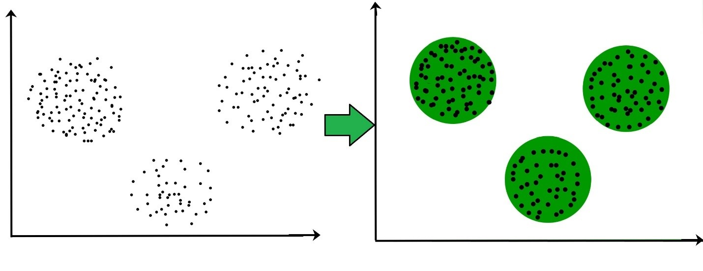

```{r setup, include=FALSE}
knitr::opts_chunk$set(echo = TRUE)
```

## **What is clustering?**

Clustering is the task of dividing the unlabeled data or data points into different clusters such that similar data points fall in the same cluster than those which differ from the others based on a metric like Euclidean distance, Cosine similarity, Manhattan distance, etc.

For Example, In the graph given below, we can clearly see that there are 3 circular clusters forming based on distance.




## **Type of Clustering Algorithm**

Since the task of clustering is subjective, the means that can be used for achieving this goal are plenty. Every methodology follows a different set of rules for defining the ‘similarity’ among data points.
Some of the popular clustering algorithms are:

1. Centroid-based Clustering (Partitioning methods)
2. Density-based Clustering (Model-based methods)
3. Connectivity-based Clustering (Hierarchical clustering)
4. Distribution-based Clustering


You can also embed plots, for example:

```{r pressure, echo=FALSE}
plot(pressure)
```

Note that the `echo = FALSE` parameter was added to the code chunk to prevent printing of the R code that generated the plot.
