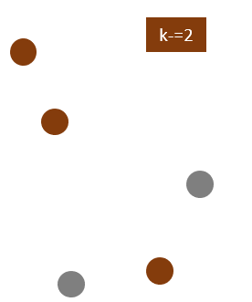
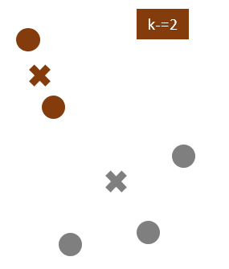

```{r setup, include=FALSE}
knitr::opts_chunk$set(echo = TRUE)
```

## **What is clustering?**

Clustering is a method of segregating unlabeled data or data points into different groups/clusters such that similar data points fall in the same cluster than those which differ from the others. The similarity measures are calculated using distance based metrics like Euclidean distance, Cosine similarity, Manhattan distance, etc.

For Example, In the graph given below, we can clearly see that the data points can be grouped into 3 clusters


<br>

## **Type of Clustering Algorithm**

Some of the popular clustering algorithms are:

1. Centroid-based Clustering (Partitioning methods)
2. Density-based Clustering (Model-based methods)
3. Connectivity-based Clustering (Hierarchical clustering)
4. Distribution-based Clustering

### 1.Centroid-based Clustering (Partitioning methods)

Partitioning methods group data points on the basis of their closeness. The similarity measure chosen for these algorithms are Euclidean distance, Manhattan Distance or Minkowski Distance.

The primary drawback for these algorithms is we need to pre define the number of clusters before allocating the data points to a group.

One of the popular centroid based clustering technique is K means Clustering.
<br>

#### **K Means Clustering**

K means is an iterative clustering algorithm that works in these 5 steps:   

1. Specify the desired number of clusters K: Let us choose k=2 for these 5 data points in 2-D space.

    

2. Randomly assign each data point to a cluster: Let’s assign three points in cluster 1, shown using orange color, and two points in cluster 2, shown using grey color.

    

3. Compute cluster centroids:  The centroid of data points in the orange cluster is shown using the orange cross, and those in the grey cluster using a grey cross.

    

4. Assigns each observation to their closest centroid, based on the Euclidean distance between the object and the centroid 

    

5. Re-computing the centroids for both clusters.

    


We will repeat the 4th and 5th steps until no further switching of data points between two clusters for two successive repeats.
<br>

[**K-Means Clustering in R**]{.underline}

**Step 1: Load packages**

First, we’ll load below packages that contain several useful functions regarding k-means clustering in R.


```{r, message=FALSE}
library(cluster) #Contain cluster function
library(dplyr) #Data manipulation
library(ggplot2) #Plotting function
library(readr) #Read and write excel/csv files
library(factoextra) #Extract and Visualize the Results of Multivariate Data Analyses
```

**Step 2: Load Data**

We have used the “Mall_Customer” dataset in R for this case study.

```{r, message=FALSE}
#Loading the data
df <- read_csv("data/Mall_Customers.csv")

#Structure of the data
str(df)
```

dataset consists of 200 customers data with their age, annual income and Spending score    


```{r}

#Rename the columns
df <- df %>% 
  rename("Annual_Income"= `Annual Income (k$)`, "Spending_score"= `Spending Score (1-100)`)

#remove rows with missing values
df <- na.omit(df)

#scale each variable to have a mean of 0 and sd of 1
df1 <- df %>% 
  mutate(across(where(is.numeric), scale))

#view first six rows of dataset
head(df1)

```
<br>

We have separated the CustomerID and Genre from the dataset. The reason for removing these variables from the cluster dataset as Kmeans can handle only numerical variables.    
To create cluster with categorical or ordinal variable we can use k-Medoid clustering
<br>

```{r}
df1 <- df1[,4:5]

```

**Step 3: Find the Optimal Number of Clusters**

To perform k-means clustering in R we can use the built-in kmeans() function, which uses the following syntax:

     
     kmeans(data, centers, iter.max, nstart)
     where:
     - data: Name of the dataset.
     - centers: The number of clusters, denoted k.
     - iter.max (optional): The maximum number of iterations allowed. Default value is 10.
     - nstart (optional): The number of initial configurations. Default value is 1.


  
- Centers is the k of K Means.  centers = 5 would results in 5 clusters being created. We need to **predefine the k** before the cluster process starts.   
- iter.max is the number of times the algorithm will repeat the cluster assignment and moving of centroids.
- nstart is the number of times the initial starting points are re-sampled. 
In the code, it looks for the initial starting points that have the lowest within sum of squares (withinss).
That means it tries “nstart” samples, does the cluster assignment for each data point “nstart” times, and picks the centers that have the lowest distance from the data points to the centroids.  With 20 or 25 random starts, you'll generally find the overall best solution unless your sample size is really big


To find the best number of clusters/centroids there are two popular methods as shown below.

[**A. Elbow Method:**]{.underline}

It has two parts as explained below-

- WSS: The Within Sum of Squares (WSS) is the sum of distance between the centroids and every other data points within a cluster. Small WSS indicates that every data point is close to its nearest centroids.

- Elbow rule/method: Here we plot out the WSS score against the number of K. Because with the number of K increasing, the wss will always decrease; however, the magnitude of decrease between each k will be diminishing, and the plot will be a curve which looks like an arm that curled up. In this way, we can find out which point falls on the elbow.

```{r}
set.seed(1)
wss<- NULL

#Feeding different centroid/cluster and record WSS

for (i in 1:10){
  fit = kmeans(df1,centers = i,nstart=25)
  wss = c(wss, fit$tot.withinss)
}

#Visualize the plot
plot(1:10, wss, type = "o", xlab='Number of clusters(k)')

```

Based on the above plot at k=5 we can see an “elbow” where the sum of squares begins to “bend” or level off so the ideal number of clusters should be 5.


The above process to compute the “Elbow method” has been wrapped up in a single function (fviz_nbclust):

```{r}
fviz_nbclust(df1, kmeans, method = "wss",nstart=25)
```


[**B. Silhouette Method:**]{.underline}

The silhouette coefficient or silhouette score is a measure of how similar a data point is within-cluster (intra-cluster) compared to other clusters (inter-cluster).     
The Silhouette Coefficient is calculated using the mean *intra-cluster distance (a)* and the *mean nearest-cluster distance (b)* for each sample. The Silhouette Coefficient for a sample is *(b - a) / max(a, b)*

A high average silhouette width indicates a good clustering. The average silhouette method computes the average silhouette of observations for different values of k. The optimal number of clusters k is the one that maximizes the average silhouette over a range of possible values for k.

**Points to Remember While Calculating Silhouette Coefficient:**

The value of the silhouette coefficient is between [-1, 1].
A score of 1 denotes the best, meaning that the data points are very compact within the cluster to which it belongs and far away from the other clusters.
The worst value is -1. Values near 0 denote overlapping clusters.

In this demonstration, we are going to see how silhouette method is used.

```{r}

silhouette_score <- function(k){
  km <- kmeans(df1, centers = k,nstart = 25)
  ss <- silhouette(km$cluster, dist(df1))
  mean(ss[, 3])
}
k <- 2:10

avg_sil <- sapply(k, silhouette_score)
plot(k, type='b', avg_sil, xlab='Number of clusters', ylab='Average Silhouette Scores', frame=FALSE)
```

The above method of calculating silhouette score using silhouette() and plotting the results states that optimal number of clusters as 5.

Similar to the elbow method, this process to compute the “average silhoutte method” has been wrapped up in a single function (fviz_nbclust):

```{r}
fviz_nbclust(df1, kmeans, method='silhouette',nstart=25)
```

The optimal number of clusters is 5.


**Step 4: Perform K-Means Clustering with Optimal K**

Lastly, we can perform k-means clustering on the dataset using the optimal value for k of 5:

```{r}

#make this example reproducible
set.seed(1)

#perform k-means clustering with k = 3 clusters
fit <- kmeans(df1, 5, nstart=25)
#view results
fit
```

We can visualize the clusters on a scatterplot that displays the first two principal components on the axes using the fivz_cluster() function:

```{r}
#plot results of final k-means model

fviz_cluster(fit, data = df1)
```


**Step 5: Exporting the data by adding generated clusters**

```{r}
#Adding the clusters in the main data

df_cluster <- df %>% mutate(cluster=fit$cluster)

#Creating Summary of created clusters based on existing variables

df_summary <- df_cluster %>% 
  group_by(cluster) %>% 
  summarise(avg_age=mean(Age),avg_annual_income=mean(Annual_Income),avg_spending_score=mean(Spending_score))

print(df_summary)
```

We can create a group of potential customers to target based on their age, average annual income and average spending score.
