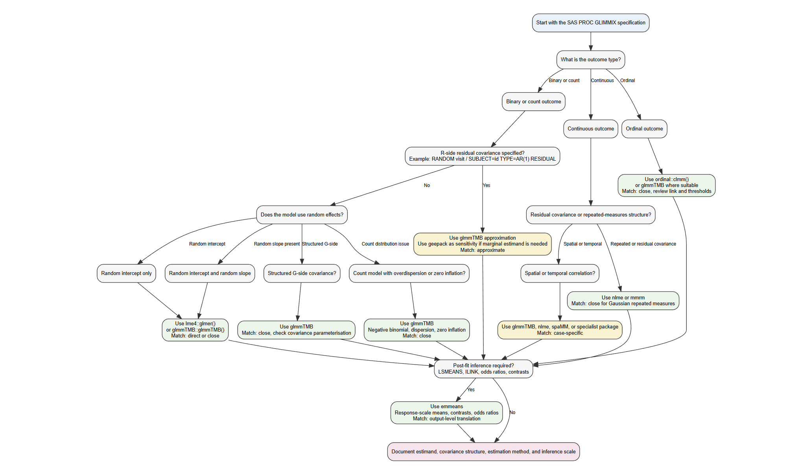

# Introduction

## Background

`PROC GLIMMIX` is used in clinical research for generalised linear mixed models, repeated-measures models, non-Gaussian outcomes, random effects, and covariance structures. It supports binary, count, ordinal, and continuous outcomes within one modelling framework.

When moving analyses from SAS to R, the main issue is not just whether the same statistical method exists in R. The main issue is whether the same `PROC GLIMMIX` specification can be translated into an R model with the same outcome distribution, link function, random-effects structure, covariance structure, estimation target, and post-fit inference.

Some `PROC GLIMMIX` models have direct R counterparts. Others require approximation because R packages may not support the same residual covariance structure, likelihood approximation, denominator degrees of freedom method, or `LSMEANS / ILINK` workflow.

## Purpose of the Article

This article provides a structured guide for translating common SAS `PROC GLIMMIX` model specifications into R.

The aim is to identify the most suitable R package for each `PROC GLIMMIX` scenario, assess whether the translation is direct or approximate, and document where differences in estimates, standard errors, covariance parameters, or post-fit summaries should be expected.

## Scope: Translating `PROC GLIMMIX` Models to R

This article focuses on `PROC GLIMMIX` scenarios where the SAS model includes one or more of the following features:

-   non-Gaussian outcomes
-   random intercepts or random slopes
-   G-side covariance structures
-   R-side residual covariance structures
-   repeated-measures structures
-   overdispersion or zero inflation
-   ordinal response models
-   spatial or temporal correlation structures
-   `LSMEANS`, `ILINK`, odds ratios, and post-fit contrasts

The article does not treat R packages as interchangeable replacements for SAS. Instead, each R implementation is selected according to the `PROC GLIMMIX` model structure, the estimand, and the output required for interpretation.

## Comparisons of Languages

| PROC GLIMMIX Scenario | Supported in R | Closest R Package | Results Match | Notes |
|---------------|---------------|---------------|---------------|---------------|
| Binary GLMM with random intercept | Yes | `lme4`, `glmmTMB` | Close | Direct GLMM implementation available in both environments |
| Binary GLMM with random intercept and slope | Yes | `lme4`, `glmmTMB` | Close | Optimisation and covariance parameterisation may differ |
| Count GLMM with random effects | Yes | `glmmTMB`, `lme4` | Close | Poisson and negative binomial mixed models are supported |
| Overdispersed count GLMM | Yes | `glmmTMB` | Close | Preferred R route for flexible count dispersion |
| Ordinal GLMM | Yes | `ordinal`, `glmmTMB` | Close | Package choice depends on link function and random-effects needs |
| GLIMMIX with structured G-side covariance | Partial | `glmmTMB`, `nlme` | Approximate to expected | Match depends on outcome type and covariance form |
| GLIMMIX with R-side covariance for binary or count outcomes | Partial | `glmmTMB`, `geepack` | Approximate | Direct residual covariance support is limited for non-Gaussian GLMMs |
| GLIMMIX with continuous repeated outcomes | Yes | `nlme`, `mmrm` | Close | Strong R support for Gaussian repeated-measures covariance |
| GLIMMIX post-fit marginal means and contrasts | Yes | `emmeans` | Close | Used for LS-means, response-scale estimates, contrasts, and odds ratios |
| GLIMMIX used for population-level summaries | Partial | `emmeans`, `geepack` | Approximate | `emmeans` summarises GLMM predictions; `geepack` targets a marginal estimand |

## Libraries or Extensions Needed

```{r}
#| eval: false
#| label: libraries

library(lme4)
library(glmmTMB)
library(nlme)
library(mmrm)
library(geepack)
library(emmeans)
library(ordinal)
```

The packages above cover the main R translation routes used in this article. `lme4` is used for standard GLMMs, `glmmTMB` for flexible non-Gaussian mixed models, `nlme` and `mmrm` for continuous repeated-measures models, `geepack` for marginal sensitivity analyses, `emmeans` for post-fit inference, and `ordinal` for cumulative link mixed models.

# Data Sources for the Analysis

## Simulated Data Generation

Synthetic datasets for all scenarios are stored in the GitHub repository:

<https://github.com/Franosei/Camis-data-simulation/tree/main/scenario_data>

Each scenario folder contains:

- `generate_data.R`: reproducible R data-generation code.
- `generate_data.sas`: SAS code to import the R-generated CSV or create a SAS-native replicate.
- `*.csv`: generated synthetic data for R or SAS analysis.

The commands below are provided for reproducibility. They are not evaluated when this article is rendered because the scenario-generation scripts are stored in the external simulation repository rather than in the CAMIS article directory.

Run all R generators from the repository root:

```{bash}
*| eval: false;

Rscript scenario_data/generate_all_scenarios.R
```

Run one R scenario:

```{bash}
*| eval: false;

Rscript scenario_data/scenario_01_random_intercept/generate_data.R
```

Run all SAS scenario programmes from the repository root:

```{sas}
*| eval: false;

%include "scenario_data/generate_all_scenarios.sas";
```

By default, the SAS programmes import the R-generated CSV files. This gives row-level consistency across R and SAS analyses.

To simulate a SAS-native replicate for one scenario:

```{sas}
*| eval: false;

%let scenario_dir=scenario_data/scenario_01_random_intercept;
%let mode=SIMULATE_IN_SAS;
%include "scenario_data/scenario_01_random_intercept/generate_data.sas";
```

SAS-native simulation uses the same design, seeds, distributions, coefficients, column names, and row counts as the R scripts. Row values may differ because R and SAS use different random-number engines.

## Data Preparation Checks Before Model Fitting

Before fitting each model, the analysis data should be prepared consistently in R and SAS. This step is essential because small differences in filtering, factor coding, visit ordering, or derived variables can lead to apparent software differences that are not caused by the modelling procedure itself.

For each scenario, the following checks should be completed before comparing model outputs:

-   Apply the same analysis filters in both languages, including `PARAMCD`, population flags, analysis flags, and baseline exclusions.

-   Confirm that the same response variable, treatment variable, subject or site identifier, visit variable, and covariates are used.

-   Align categorical reference levels for treatment, sex, race, visit, and any other class variables.

-   Confirm that binary outcomes use the same event definition in SAS and R.

-   Confirm that ordinal outcomes use the same category ordering before comparing cumulative-logit estimates.

-   Create derived variables consistently, including centred or scaled covariates, visit factors, and log-offset terms.

-   Sort repeated-measures data by subject or site and visit before fitting models with correlation or covariance structures.

-   Verify that the number of observations, number of subjects or sites, and maximum records per cluster match across R and SAS.

These checks help ensure that any remaining differences are attributable to software implementation, estimation method, covariance parameterisation, or post-fit inference rather than inconsistencies in the analysis dataset.

# Statistical Method

## Decision Framework

The decision framework starts from the SAS `PROC GLIMMIX` specification and identifies the closest R implementation. The selection is based on outcome type, random-effects structure, covariance structure, distribution, and post-fit inference needs.

### How to Read a `PROC GLIMMIX` Specification

Read the SAS model in this order:

1.  Identify the response distribution and link function from the `MODEL` statement.
2.  Identify the clustering variable from `SUBJECT=`.
3.  Check whether the model uses random intercepts, random slopes, or structured G-side covariance.
4.  Check whether the `RESIDUAL` option is used, since this indicates R-side covariance.
5.  Check whether the analysis requires `LSMEANS`, `ILINK`, odds ratios, or contrasts.
6.  Select the R package based on the model feature being translated.

### Decision Tree for Selecting the R Implementation

{fig-align="center"}

### Decision Mapping

| PROC GLIMMIX Feature | Outcome Type | SAS Specification Pattern | Closest R Implementation | Match Level | Review Level |
|------------|------------|------------|------------|------------|------------|
| Random intercept only | Binary or count | `random intercept / subject=id` | `lme4::glmer()` or `glmmTMB::glmmTMB()` | Direct | Standard |
| Random intercept and random slope | Binary or count | `random intercept time / subject=id type=un` | `lme4::glmer()` or `glmmTMB::glmmTMB()` | Direct or close | Standard |
| Structured G-side covariance | Binary, count, or continuous | `random ... / subject=id type=un` or other G-side structure | `glmmTMB`, `nlme` | Close or approximate | Statistical |
| R-side covariance | Binary or count | `random visit / subject=id type=ar(1) residual` | `glmmTMB` approximation; `geepack` sensitivity | Approximate | SME |
| R-side covariance | Continuous | `random visit / subject=id type=ar(1) residual` | `nlme::lme()` or `mmrm` | Close | Standard |
| Count GLMM | Count | `dist=poisson` or `dist=negbin` | `glmmTMB` or `lme4` | Direct or close | Standard |
| Overdispersed count GLMM | Count | Poisson model with overdispersion or scale adjustment | `glmmTMB` | Close | Statistical |
| Ordinal GLMM | Ordinal | Cumulative or multinomial ordinal response model | `ordinal::clmm()` or `glmmTMB` | Close | SME |
| Spatial or temporal correlation | Any | Spatial, temporal, or irregular correlation structure | `glmmTMB`, `nlme`, `spaMM`, or specialist package | Case-specific | SME |
| Post-fit marginal means | Any | `lsmeans ... / ilink` | `emmeans::emmeans(..., type = "response")` | Output-level match | Output review |
| Contrasts and odds ratios | Binary or ordinal | `lsmeans ... / diff oddsratio` or `estimate ... / exp` | `emmeans::contrast()` and `emmeans::pairs()` | Output-level match | Output review |
| Population-level summaries from GLIMMIX | Binary or count | GLIMMIX model with response-scale marginal summaries | `emmeans`; `geepack` as estimand sensitivity | Approximate | SME |

## Equivalence Criteria for Comparing R and SAS Outputs

The comparison between R and SAS should be interpreted using a hierarchy of equivalence criteria. Exact numerical agreement is not always expected, especially when the software uses different likelihood approximations, covariance parameterisations, denominator degrees of freedom, or post-fit calculation methods.

For each scenario, equivalence is assessed using the following criteria:

-   **Model specification:** the same response variable, covariates, treatment groups, reference levels, distribution, link function, clustering variable, and random-effects or covariance structure are used where supported.

-   **Analysis population:** the same records are included after applying population flags, analysis flags, parameter filters, visit restrictions, and baseline exclusions.

-   **Fixed-effect estimates:** treatment effects and key covariate effects have the same direction, similar magnitude, and comparable standard errors.

-   **Covariance parameters:** random-effect variances, standard deviations, correlations, and residual variance estimates are comparable when the same structure is available in both languages.

-   **Post-fit estimands:** LS-means, response-scale estimates, odds ratios, rate ratios, treatment differences, and contrasts are compared on the same interpretation scale.

-   **Clinical or statistical conclusion:** the overall interpretation remains consistent, even where fit statistics, p-values, or confidence intervals differ slightly.

AIC, BIC, denominator degrees of freedom, and p-values are treated as secondary comparison criteria unless they are central to the analysis objective. Differences in these quantities should be interpreted in the context of the estimation method and software-specific implementation.

# Scenario 1: Binary GLMM with Random Intercept

## Objective

This scenario translates a SAS `PROC GLIMMIX` binary random-intercept model into R. The outcome is 30-day readmission, coded as `AVAL`, with site-level clustering through `SITEID`.

The model estimates the effect of treatment arm, age, sex, race, comorbidity index, and prior admissions on the odds of readmission. The SAS model uses `PROC GLIMMIX` with a random intercept for site. The R implementation uses `lme4::glmer()` with the same binary logit model and random-intercept structure.

## R

```{r}
#| eval: false
#| message: false
#| warning: false

library(lme4)

scenario_01 <- read.csv(
  "https://raw.githubusercontent.com/Franosei/Camis-data-simulation/main/scenario_data/scenario_01_random_intercept/scenario_01_random_intercept.csv"
)

scenario_01 <- subset(
  scenario_01,
  PARAMCD == "READM30D" &
    ITTFL == "Y" &
    SAFFL == "Y" &
    ANL01FL == "Y"
)

scenario_01$SITEID <- factor(scenario_01$SITEID)
scenario_01$ARMCD <- relevel(
  factor(scenario_01$ARMCD),
  ref = "STDCARE"
)
scenario_01$SEX <- factor(scenario_01$SEX)
scenario_01$RACE <- factor(scenario_01$RACE)

fit_r <- glmer(
  AVAL ~
    ARMCD +
    AGE +
    SEX +
    RACE +
    COMORBIDX +
    PRIORADM +
    (1 | SITEID),
  data = scenario_01,
  family = binomial(link = "logit"),
  control = glmerControl(optimizer = "bobyqa")
)

summary(fit_r)

exp(fixef(fit_r))
```

## SAS

```{sas}
*| eval: false;

filename scenario temp;

proc http
    url="https://raw.githubusercontent.com/Franosei/Camis-data-simulation/main/scenario_data/scenario_01_random_intercept/scenario_01_random_intercept.csv"
    method="GET"
    out=scenario;
run;

proc import datafile=scenario
    out=scenario_01
    dbms=csv
    replace;
    guessingrows=max;
run;

proc glimmix data=scenario_01 method=laplace;
    where PARAMCD = "READM30D"
        and ITTFL = "Y"
        and SAFFL = "Y"
        and ANL01FL = "Y";

    class SITEID ARMCD(ref="STDCARE") SEX RACE;

    model AVAL(event="1") =
        ARMCD
        AGE
        SEX
        RACE
        COMORBIDX
        PRIORADM
        / dist=binary
          link=logit
          solution
          oddsratio;

    random intercept / subject=SITEID;
run;
```

## Results Comparison

| Quantity                            | R `lme4::glmer()` | SAS `PROC GLIMMIX` |
|---------------------------------|------------------:|-------------------:|
| Number of observations              |               624 |                624 |
| Number of sites                     |                24 |                 24 |
| Maximum observations per site       |                34 |                 34 |
| -2 Log Likelihood                   |            747.20 |             747.18 |
| AIC                                 |            767.20 |             767.18 |
| BIC                                 |            811.50 |             778.96 |
| Random-intercept variance           |            0.5462 |             0.5463 |
| Random-intercept standard deviation |            0.7391 |             0.7391 |

| Effect | R Estimate | R Standard Error | R p-value | SAS Estimate | SAS Standard Error | SAS p-value |
|-----------|----------:|----------:|----------:|----------:|----------:|----------:|
| Intercept | -3.1353 | 0.6392 | \<0.0001 | -2.4179 | 0.5865 | 0.0004 |
| Treatment: care management vs standard care | -0.2968 | 0.1897 | 0.1177 | -0.2968 | 0.1902 | 0.1191 |
| Age | 0.0261 | 0.0081 | 0.0014 | 0.0261 | 0.0082 | 0.0015 |
| Sex: male vs female | 0.2542 | 0.1856 | 0.1708 | 0.2542 | 0.1860 | 0.1723 |
| Race: Black or African American vs Asian | 0.1248 | 0.3498 | 0.7212 | 0.1248 | 0.3499 | 0.7212 |
| Race: Other vs Asian | 0.4404 | 0.4316 | 0.3076 | 0.4403 | 0.4317 | 0.3079 |
| Race: White vs Asian | 0.4636 | 0.3038 | 0.1270 | 0.4636 | 0.3045 | 0.1284 |
| Comorbidity index | 0.2853 | 0.0811 | 0.0004 | 0.2854 | 0.0812 | 0.0005 |
| Prior admissions | 0.2632 | 0.1281 | 0.0399 | 0.2632 | 0.1283 | 0.0406 |

| Effect | R Odds Ratio | R 95% CI | SAS Odds Ratio | SAS 95% CI |
|---------------|--------------:|--------------:|--------------:|--------------:|
| Treatment: care management vs standard care | 0.743 | 0.512, 1.078 | 0.743 | 0.512, 1.080 |
| Age | 1.026 | 1.010, 1.043 | 1.026 | 1.010, 1.043 |
| Sex: male vs female | 1.289 | 0.896, 1.855 | 1.289 | 0.894, 1.858 |
| Race: Black or African American vs Asian | 1.133 | 0.571, 2.249 | 1.133 | 0.570, 2.252 |
| Race: Other vs Asian | 1.553 | 0.667, 3.619 | 1.553 | 0.666, 3.622 |
| Race: White vs Asian | 1.590 | 0.876, 2.884 | 1.590 | 0.876, 2.884 |
| Comorbidity index | 1.330 | 1.135, 1.559 | 1.330 | 1.134, 1.560 |
| Prior admissions | 1.301 | 1.012, 1.672 | 1.301 | 1.011, 1.674 |

# Scenario 2: Binary GLMM with Random Intercept and Slope

## Objective

This scenario translates a SAS `PROC GLIMMIX` binary random-intercept and random-slope model into R. The outcome is asthma control, coded as `AVAL`, with repeated observations clustered within `USUBJID`.

The model estimates the effect of treatment arm, scaled time, scaled age, sex, race, baseline severity, and scaled adherence on the odds of asthma control. The SAS model uses `PROC GLIMMIX` with independent subject-level random intercept and random slope terms. The R implementation uses `lme4::glmer()` with the matching `||` random-effects structure.

## R

```{r}
#| eval: false
#| message: false
#| warning: false

library(lme4)

scenario_02 <- read.csv(
  "https://raw.githubusercontent.com/Franosei/Camis-data-simulation/main/scenario_data/scenario_02_random_intercept_slope/scenario_02_random_intercept_slope.csv"
)

scenario_02 <- subset(
  scenario_02,
  PARAMCD == "ASTCTRL" &
    ITTFL == "Y" &
    SAFFL == "Y" &
    ANL01FL == "Y"
)

scenario_02$USUBJID <- factor(scenario_02$USUBJID)

scenario_02$ARMCD <- relevel(
  factor(scenario_02$ARMCD),
  ref = "CTRLTHX"
)

scenario_02$SEX <- factor(scenario_02$SEX)
scenario_02$RACE <- factor(scenario_02$RACE)

scenario_02$TIMEYEAR_C <- as.numeric(
  scale(scenario_02$TIMEYEAR, center = TRUE, scale = TRUE)
)

scenario_02$AGE_C <- as.numeric(
  scale(scenario_02$AGE, center = TRUE, scale = TRUE)
)

scenario_02$ADHERE_C <- as.numeric(
  scale(scenario_02$ADHERE, center = TRUE, scale = TRUE)
)

fit_r <- glmer(
  AVAL ~
    ARMCD +
    TIMEYEAR_C +
    AGE_C +
    SEX +
    RACE +
    BSEVRITY +
    ADHERE_C +
    (1 + TIMEYEAR_C || USUBJID),
  data = scenario_02,
  family = binomial(link = "logit"),
  control = glmerControl(
    optimizer = "bobyqa",
    optCtrl = list(maxfun = 100000)
  )
)

summary(fit_r)

or_ci_r <- exp(
  cbind(
    Odds_Ratio = fixef(fit_r),
    confint(fit_r, parm = names(fixef(fit_r)), method = "Wald")
  )
)

or_ci_r
```

## SAS

```{{sas}}
{filename scenario temp;}

proc http
    url="https://raw.githubusercontent.com/Franosei/Camis-data-simulation/main/scenario_data/scenario_02_random_intercept_slope/scenario_02_random_intercept_slope.csv"
    method="GET"
    out=scenario;
run;

proc import datafile=scenario
    out=scenario_02
    dbms=csv
    replace;
    guessingrows=max;
run;

proc means data=scenario_02 noprint;
    where PARAMCD = "ASTCTRL"
        and ITTFL = "Y"
        and SAFFL = "Y"
        and ANL01FL = "Y";

    var TIMEYEAR AGE ADHERE;

    output out=scales
        mean=mean_TIMEYEAR mean_AGE mean_ADHERE
        std=sd_TIMEYEAR sd_AGE sd_ADHERE;
run;

data scenario_02_scaled;
    if _n_ = 1 then set scales;
    set scenario_02;

    where PARAMCD = "ASTCTRL"
        and ITTFL = "Y"
        and SAFFL = "Y"
        and ANL01FL = "Y";

    TIMEYEAR_C = (TIMEYEAR - mean_TIMEYEAR) / sd_TIMEYEAR;
    AGE_C = (AGE - mean_AGE) / sd_AGE;
    ADHERE_C = (ADHERE - mean_ADHERE) / sd_ADHERE;
run;

proc glimmix data=scenario_02_scaled method=laplace;
    class USUBJID ARMCD(ref="CTRLTHX") SEX RACE;

    model AVAL(event="1") =
        ARMCD
        TIMEYEAR_C
        AGE_C
        SEX
        RACE
        BSEVRITY
        ADHERE_C
        / dist=binary
          link=logit
          solution
          oddsratio;

    random intercept TIMEYEAR_C / subject=USUBJID type=vc;
run;
```

## Results Comparison

| Quantity | R `lme4::glmer()` | SAS `PROC GLIMMIX` |
|----|---:|---:|
| Number of observations | 1400 | 1400 |
| Number of subjects | 280 | 280 |
| Maximum observations per subject | 5 | 5 |
| -2 Log Likelihood | 1670.30 | 1670.25 |
| AIC | 1694.30 | 1694.25 |
| BIC | 1757.20 | 1737.87 |
| Random-intercept variance | 0.6950 | 0.6949 |
| Random-slope variance for `TIMEYEAR_C` | 0.0113 | 0.0113 |
| Random-intercept standard deviation | 0.8337 | 0.8336 |
| Random-slope standard deviation for `TIMEYEAR_C` | 0.1060 | 0.1062 |

| Effect | R Estimate | R Standard Error | R p-value | SAS Estimate | SAS Standard Error | SAS p-value |
|-----------|----------:|----------:|----------:|----------:|----------:|----------:|
| Treatment: standard care vs control therapy | -1.1041 | 0.1888 | \<0.0001 | -1.1042 | 0.1888 | \<0.0001 |
| Scaled time | 0.5591 | 0.0671 | \<0.0001 | 0.5591 | 0.0671 | \<0.0001 |
| Scaled age | 0.1601 | 0.0809 | 0.0477 | 0.1601 | 0.0809 | 0.0480 |
| Baseline severity | -0.2875 | 0.1051 | 0.0062 | -0.2875 | 0.1051 | 0.0063 |
| Scaled adherence | 0.0803 | 0.0687 | 0.2421 | 0.0804 | 0.0687 | 0.2422 |

| Effect | R Odds Ratio | R 95% CI | SAS Odds Ratio | SAS 95% CI |
|---------------|--------------:|--------------:|--------------:|--------------:|
| Treatment: standard care vs control therapy | 0.331 | 0.229, 0.480 | 0.331 | 0.229, 0.480 |
| Scaled time | 1.749 | 1.533, 1.995 | 1.749 | 1.533, 1.996 |
| Scaled age | 1.174 | 1.002, 1.375 | 1.174 | 1.001, 1.376 |
| Baseline severity | 0.750 | 0.611, 0.922 | 0.750 | 0.610, 0.922 |
| Scaled adherence | 1.084 | 0.947, 1.240 | 1.084 | 0.947, 1.240 |

# Scenario 3: Continuous Repeated-Measures GLIMMIX Model

## Objective

This scenario translates a SAS `PROC GLIMMIX` Gaussian repeated-measures model into R. The outcome is systolic blood pressure, coded as `AVAL`, with repeated visits clustered within `USUBJID`.

The SAS model uses a Gaussian identity-link model with AR(1) R-side covariance. The R implementation uses `nlme::gls()` with the same fixed-effect structure and AR(1) correlation. Post-fit visit-specific treatment means and treatment differences are estimated using `emmeans`.

## R

```{r}
#| eval: false
#| message: false
#| warning: false

library(nlme)
library(emmeans)

scenario_03 <- read.csv(
  "https://raw.githubusercontent.com/Franosei/Camis-data-simulation/main/scenario_data/scenario_03_continuous_repeated_measures/scenario_03_continuous_repeated_measures.csv"
)

scenario_03 <- subset(
  scenario_03,
  PARAMCD == "SYSBP" &
    ITTFL == "Y" &
    SAFFL == "Y" &
    ANL01FL == "Y"
)

scenario_03$USUBJID <- factor(scenario_03$USUBJID)

scenario_03$ARMCD <- relevel(
  factor(scenario_03$ARMCD),
  ref = "STDTHER"
)

scenario_03$SEX <- relevel(
  factor(scenario_03$SEX),
  ref = "F"
)

scenario_03$RACE <- relevel(
  factor(scenario_03$RACE),
  ref = "WHITE"
)

scenario_03$AVISITN_F <- relevel(
  factor(scenario_03$AVISITN),
  ref = "1"
)

scenario_03 <- scenario_03[order(
  scenario_03$USUBJID,
  scenario_03$AVISITN
), ]

fit_r <- nlme::gls(
  AVAL ~
    ARMCD *
    AVISITN_F +
    BPBASE +
    AGE +
    SEX +
    RACE,
  data = scenario_03,
  method = "REML",
  correlation = nlme::corAR1(
    form = ~ AVISITN | USUBJID
  )
)

summary(fit_r)

anova(fit_r)

emm_r <- emmeans::emmeans(
  fit_r,
  ~ ARMCD | AVISITN_F
)

emm_r

pairs(
  emm_r,
  reverse = TRUE,
  adjust = "none"
)
```

## SAS

```{sas}
*| eval: false;

filename scenario temp;

proc http
    url="https://raw.githubusercontent.com/Franosei/Camis-data-simulation/main/scenario_data/scenario_03_continuous_repeated_measures/scenario_03_continuous_repeated_measures.csv"
    method="GET"
    out=scenario;
run;

proc import datafile=scenario
    out=scenario_03_raw
    dbms=csv
    replace;
    guessingrows=max;
run;

data scenario_03;
    set scenario_03_raw;

    where PARAMCD = "SYSBP"
        and ITTFL = "Y"
        and SAFFL = "Y"
        and ANL01FL = "Y";

    AVISITN_F = strip(put(AVISITN, best.));
run;

proc sort data=scenario_03;
    by USUBJID AVISITN;
run;

proc glimmix data=scenario_03 method=rspl;
    class
        USUBJID
        ARMCD(ref="STDTHER")
        AVISITN_F(ref="1")
        SEX(ref="F")
        RACE(ref="WHITE");

    model AVAL =
        ARMCD
        AVISITN_F
        ARMCD*AVISITN_F
        BPBASE
        AGE
        SEX
        RACE
        / dist=normal
          link=identity
          solution
          ddfm=kr;

    random _residual_ /
        subject=USUBJID
        type=ar(1);

    lsmeans ARMCD*AVISITN_F /
        diff
        cl;
run;
```

## Results Comparison

| Quantity                         | R `nlme::gls()` | SAS `PROC GLIMMIX` |
|----------------------------------|----------------:|-------------------:|
| Number of observations           |            1100 |               1100 |
| Number of subjects               |             220 |                220 |
| Maximum observations per subject |               5 |                  5 |
| Correlation structure            |           AR(1) |       AR(1) R-side |
| AR(1) correlation                |          0.8333 |             0.8333 |
| Residual variance                |           89.23 |              89.23 |
| Residual standard error          |          9.4459 |             9.4459 |
| -2 Restricted Log Likelihood     |         6993.53 |            6993.53 |
| AIC                              |         7029.53 |            6997.53 |
| BIC                              |         7119.32 |            7004.32 |

| Effect | R Estimate | R Standard Error | R p-value | SAS Estimate | SAS Standard Error | SAS p-value |
|-----------|----------:|----------:|----------:|----------:|----------:|----------:|
| Intercept | 72.7999 | 8.1235 | \<0.0001 | 72.7999 | 8.1162 | \<0.0001 |
| Treatment: medication intensification vs standard therapy | -2.7768 | 1.2935 | 0.0320 | -2.7768 | 1.2934 | 0.0325 |
| Visit 2 vs visit 1 | -1.6078 | 0.5087 | 0.0016 | -1.6078 | 0.5100 | 0.0017 |
| Visit 3 vs visit 1 | -2.7217 | 0.6887 | 0.0001 | -2.7217 | 0.6905 | \<0.0001 |
| Visit 4 vs visit 1 | -3.0974 | 0.8087 | 0.0001 | -3.0974 | 0.8109 | 0.0001 |
| Visit 5 vs visit 1 | -4.0296 | 0.8965 | \<0.0001 | -4.0296 | 0.8989 | \<0.0001 |
| Baseline systolic blood pressure | 0.4527 | 0.0473 | \<0.0001 | 0.4527 | 0.0473 | \<0.0001 |
| Age | 0.0784 | 0.0577 | 0.1747 | 0.0784 | 0.0577 | 0.1754 |
| Sex: male vs female | 1.1063 | 1.1167 | 0.3221 | 1.1063 | 1.1157 | 0.3225 |
| Race: Asian vs White | -1.9717 | 1.7489 | 0.2598 | -1.9717 | 1.7473 | 0.2604 |
| Race: Black or African American vs White | 1.7630 | 1.4532 | 0.2253 | 1.7630 | 1.4519 | 0.2259 |
| Race: Other vs White | 0.7157 | 2.0951 | 0.7327 | 0.7157 | 2.0932 | 0.7327 |
| Treatment × Visit 2 | -0.1046 | 0.7363 | 0.8871 | -0.1046 | 0.7382 | 0.8874 |
| Treatment × Visit 3 | 0.1189 | 0.9969 | 0.9051 | 0.1189 | 0.9995 | 0.9054 |
| Treatment × Visit 4 | -0.7445 | 1.1706 | 0.5249 | -0.7445 | 1.1737 | 0.5260 |
| Treatment × Visit 5 | -2.2704 | 1.2977 | 0.0805 | -2.2704 | 1.3011 | 0.0813 |

| Visit | R STDTHER Mean | R MEDINT Mean | R Difference | SAS STDTHER Mean | SAS MEDINT Mean | SAS Difference |
|-----------|----------:|----------:|----------:|----------:|----------:|----------:|
| 1 | 146.20 | 143.43 | -2.78 | 146.20 | 143.43 | -2.78 |
| 2 | 144.59 | 141.71 | -2.88 | 144.59 | 141.71 | -2.88 |
| 3 | 143.48 | 140.82 | -2.66 | 143.48 | 140.82 | -2.66 |
| 4 | 143.11 | 139.58 | -3.52 | 143.11 | 139.58 | -3.52 |
| 5 | 142.17 | 137.13 | -5.05 | 142.17 | 137.13 | -5.05 |

# Scenario 4: GLIMMIX with Structured G-side Covariance

## Objective

This scenario translates a SAS `PROC GLIMMIX` Gaussian mixed model with structured G-side covariance into R. The outcome is functional score, coded as `AVAL`, with repeated observations clustered within `USUBJID`.

The SAS model uses a random intercept and random slope for `WKSCALED` with an unstructured G-side covariance matrix. The R implementation uses `glmmTMB` with the same fixed-effect structure and correlated subject-level random effects.

## R

```{r}
#| eval: false
#| message: false
#| warning: false

library(glmmTMB)
library(emmeans)

scenario_04 <- read.csv(
  "https://raw.githubusercontent.com/Franosei/Camis-data-simulation/main/scenario_data/scenario_04_structured_g_side_covariance/scenario_04_structured_g_side_covariance.csv",
  stringsAsFactors = FALSE
)

scenario_04 <- subset(
  scenario_04,
  PARAMCD == "FNCSCORE" &
    ITTFL == "Y" &
    SAFFL == "Y" &
    ANL01FL == "Y"
)

scenario_04$USUBJID <- factor(scenario_04$USUBJID)

scenario_04$ARMCD <- relevel(
  factor(scenario_04$ARMCD),
  ref = "STDREHAB"
)

scenario_04$SEX <- relevel(
  factor(scenario_04$SEX),
  ref = "F"
)

scenario_04$RACE <- relevel(
  factor(scenario_04$RACE),
  ref = "WHITE"
)

scenario_04 <- scenario_04[order(
  scenario_04$USUBJID,
  scenario_04$WKSCALED
), ]

fit_r <- glmmTMB::glmmTMB(
  AVAL ~
    ARMCD *
    WKSCALED +
    BSCORE +
    AGE +
    SEX +
    RACE +
    SESNMINC +
    (1 + WKSCALED | USUBJID),
  data = scenario_04,
  family = gaussian(link = "identity"),
  REML = TRUE
)

summary(fit_r)

emmeans_r <- emmeans::emmeans(
  fit_r,
  ~ ARMCD | WKSCALED,
  at = list(
    WKSCALED = c(0, 0.5, 1, 2, 3)
  )
)

emmeans_r

pairs(
  emmeans_r,
  reverse = TRUE,
  adjust = "none"
)
```

## SAS

```{sas}
*| eval: false;

filename scenario temp;

proc http
    url="https://raw.githubusercontent.com/Franosei/Camis-data-simulation/main/scenario_data/scenario_04_structured_g_side_covariance/scenario_04_structured_g_side_covariance.csv"
    method="GET"
    out=scenario;
run;

proc import datafile=scenario
    out=scenario_04_raw
    dbms=csv
    replace;
    guessingrows=max;
run;

data scenario_04;
    set scenario_04_raw;

    where PARAMCD = "FNCSCORE"
        and ITTFL = "Y"
        and SAFFL = "Y"
        and ANL01FL = "Y";
run;

proc sort data=scenario_04;
    by USUBJID WKSCALED;
run;

proc glimmix data=scenario_04 method=rspl;
    class
        USUBJID
        ARMCD(ref="STDREHAB")
        SEX(ref="F")
        RACE(ref="WHITE");

    model AVAL =
        ARMCD
        WKSCALED
        ARMCD*WKSCALED
        BSCORE
        AGE
        SEX
        RACE
        SESNMINC
        / dist=normal
          link=identity
          solution
          ddfm=kr;

    random intercept WKSCALED /
        subject=USUBJID
        type=un;

    lsmeans ARMCD /
        at WKSCALED = 0 0.5 1 2 3
        diff
        cl;
run;
```

## Results Comparison

| Quantity                             | R `glmmTMB` | SAS `PROC GLIMMIX` |
|--------------------------------------|------------:|-------------------:|
| Number of observations               |         900 |                900 |
| Number of subjects                   |         180 |                180 |
| Maximum observations per subject     |           5 |                  5 |
| -2 Restricted Log Likelihood         |     5465.30 |            5465.32 |
| AIC                                  |     5495.30 |            5473.32 |
| BIC                                  |     5567.40 |            5486.09 |
| Random-intercept variance            |     25.1260 |            25.1265 |
| Random-slope variance for `WKSCALED` |      0.7230 |             0.7230 |
| Intercept-slope covariance           |      1.3870 |             1.3873 |
| Residual variance                    |     15.3270 |            15.3266 |
| Random-intercept standard deviation  |      5.0126 |             5.0126 |
| Random-slope standard deviation      |      0.8503 |             0.8503 |

| Effect | R Estimate | R Standard Error | R p-value | SAS Estimate | SAS Standard Error | SAS p-value |
|-----------|----------:|----------:|----------:|----------:|----------:|----------:|
| Intercept | 18.1898 | 3.0917 | \<0.0001 | 18.1898 | 3.0851 | \<0.0001 |
| Enhanced rehab vs standard rehab | 4.3586 | 0.8814 | \<0.0001 | 4.3586 | 0.8816 | \<0.0001 |
| Week scaled | 2.1110 | 0.1922 | \<0.0001 | 2.1110 | 0.1922 | \<0.0001 |
| Enhanced rehab × week scaled | 0.7222 | 0.2738 | 0.0084 | 0.7222 | 0.2738 | 0.0091 |
| Baseline functional score | 0.6406 | 0.0476 | \<0.0001 | 0.6406 | 0.0477 | \<0.0001 |
| Age | -0.0109 | 0.0334 | 0.7443 | -0.0109 | 0.0335 | 0.7455 |
| Sex: male vs female | 1.1906 | 0.8409 | 0.1568 | 1.1906 | 0.8444 | 0.1603 |
| Race: Asian vs White | -1.2703 | 1.4500 | 0.3810 | -1.2703 | 1.4563 | 0.3843 |
| Race: Black or African American vs White | 0.5763 | 1.0535 | 0.5844 | 0.5763 | 1.0575 | 0.5864 |
| Race: Other vs White | -2.5217 | 1.5359 | 0.1006 | -2.5217 | 1.5377 | 0.1029 |
| Session minutes centred | 0.4093 | 0.2170 | 0.0593 | 0.4093 | 0.2176 | 0.0604 |

| WKSCALED | R STDREHAB Mean | R ENHREHAB Mean | R Difference | SAS Difference |
|----------|----------------:|----------------:|-------------:|---------------:|
| 0.0      |            46.9 |            51.2 |         4.36 |           4.36 |
| 0.5      |            47.9 |            52.7 |         4.72 |           4.72 |
| 1.0      |            49.0 |            54.1 |         5.08 |           5.08 |
| 2.0      |            51.1 |            56.9 |         5.80 |           5.80 |
| 3.0      |            53.2 |            59.7 |         6.53 |           6.53 |

# Scenario 5: Binary GLIMMIX with R-side Covariance

## Objective

This scenario translates a SAS `PROC GLIMMIX` binary repeated-measures model with R-side AR(1) covariance into R. The outcome is diabetes control, coded as `AVAL`, with repeated post-baseline visits clustered within `USUBJID`.

The SAS model uses `RANDOM ... / RESIDUAL TYPE=AR(1)`. The R `glmmTMB` model gives a conditional AR(1) approximation. The `geepack` model is used as a marginal sensitivity analysis.

## SAS

```{sas}
*| eval: false;

filename scenario temp;

proc http
    url="https://raw.githubusercontent.com/Franosei/Camis-data-simulation/main/scenario_data/scenario_05_binary_r_side_covariance/scenario_05_binary_r_side_covariance.csv"
    method="GET"
    out=scenario;
run;

proc import datafile=scenario
    out=scenario_05_raw
    dbms=csv
    replace;
    guessingrows=max;
run;

data scenario_05;
    set scenario_05_raw;

    where PARAMCD = "DMCTRL"
        and ITTFL = "Y"
        and SAFFL = "Y"
        and ANL01FL = "Y"
        and BASEFL ne "Y";

    AVISITN_F = strip(put(AVISITN, best.));
run;

proc sort data=scenario_05;
    by USUBJID AVISITN;
run;

proc glimmix data=scenario_05 method=rspl;
    class
        USUBJID
        ARMCD(ref="STDCARE")
        AVISITN_F(ref="2")
        SEX(ref="F")
        RACE(ref="WHITE");

    model AVAL(event="1") =
        ARMCD
        AVISITN_F
        ARMCD*AVISITN_F
        HBA1CBL
        MEDCNT
        AGE
        SEX
        RACE
        / dist=binary
          link=logit
          solution
          oddsratio;

    random AVISITN_F /
        subject=USUBJID
        type=ar(1)
        residual;

    lsmeans ARMCD*AVISITN_F /
        ilink
        diff
        oddsratio
        cl;
run;
```

## R Approximation using `glmmTMB`

```{r}
#| eval: false
#| message: false
#| warning: false

library(glmmTMB)
library(emmeans)

scenario_05 <- read.csv(
  "https://raw.githubusercontent.com/Franosei/Camis-data-simulation/main/scenario_data/scenario_05_binary_r_side_covariance/scenario_05_binary_r_side_covariance.csv",
  stringsAsFactors = FALSE
)

scenario_05 <- subset(
  scenario_05,
  PARAMCD == "DMCTRL" &
    ITTFL == "Y" &
    SAFFL == "Y" &
    ANL01FL == "Y" &
    BASEFL != "Y"
)

scenario_05$USUBJID <- factor(scenario_05$USUBJID)

scenario_05$ARMCD <- relevel(
  factor(scenario_05$ARMCD),
  ref = "STDCARE"
)

scenario_05$SEX <- relevel(
  factor(scenario_05$SEX),
  ref = "F"
)

scenario_05$RACE <- relevel(
  factor(scenario_05$RACE),
  ref = "WHITE"
)

scenario_05$AVISITN_F <- factor(
  scenario_05$AVISITN,
  levels = sort(unique(scenario_05$AVISITN))
)

scenario_05$AVISITN_F <- relevel(
  scenario_05$AVISITN_F,
  ref = "2"
)

scenario_05 <- scenario_05[order(
  scenario_05$USUBJID,
  scenario_05$AVISITN
), ]

fit_glmmtmb <- glmmTMB::glmmTMB(
  AVAL ~
    ARMCD *
    AVISITN_F +
    HBA1CBL +
    MEDCNT +
    AGE +
    SEX +
    RACE +
    ar1(AVISITN_F + 0 | USUBJID),
  data = scenario_05,
  family = binomial(link = "logit")
)

summary(fit_glmmtmb)

emm_glmmtmb <- emmeans::emmeans(
  fit_glmmtmb,
  ~ ARMCD | AVISITN_F,
  type = "response"
)

emm_glmmtmb

pairs(
  emm_glmmtmb,
  reverse = TRUE,
  adjust = "none",
  type = "response"
)
```

## R Sensitivity Analysis using `geepack`

```{r}
#| eval: false
#| message: false
#| warning: false

library(geepack)
library(emmeans)

scenario_05 <- read.csv(
  "https://raw.githubusercontent.com/Franosei/Camis-data-simulation/main/scenario_data/scenario_05_binary_r_side_covariance/scenario_05_binary_r_side_covariance.csv",
  stringsAsFactors = FALSE
)

scenario_05 <- subset(
  scenario_05,
  PARAMCD == "DMCTRL" &
    ITTFL == "Y" &
    SAFFL == "Y" &
    ANL01FL == "Y" &
    BASEFL != "Y"
)

scenario_05$USUBJID <- factor(scenario_05$USUBJID)

scenario_05$ARMCD <- relevel(
  factor(scenario_05$ARMCD),
  ref = "STDCARE"
)

scenario_05$SEX <- relevel(
  factor(scenario_05$SEX),
  ref = "F"
)

scenario_05$RACE <- relevel(
  factor(scenario_05$RACE),
  ref = "WHITE"
)

scenario_05$AVISITN_F <- relevel(
  factor(scenario_05$AVISITN),
  ref = "2"
)

scenario_05 <- scenario_05[order(
  scenario_05$USUBJID,
  scenario_05$AVISITN
), ]

fit_gee <- geepack::geeglm(
  AVAL ~
    ARMCD *
    AVISITN_F +
    HBA1CBL +
    MEDCNT +
    AGE +
    SEX +
    RACE,
  data = scenario_05,
  id = USUBJID,
  waves = AVISITN,
  family = binomial(link = "logit"),
  corstr = "ar1"
)

summary(fit_gee)

emm_gee <- emmeans::emmeans(
  fit_gee,
  ~ ARMCD | AVISITN_F,
  type = "response"
)

emm_gee

pairs(
  emm_gee,
  reverse = TRUE,
  adjust = "none",
  type = "response"
)
```

## Results Comparison

| Quantity | SAS `PROC GLIMMIX` | R `glmmTMB` | R `geepack` |
|------------------|-----------------:|-----------------:|-----------------:|
| Number of observations | 1300 | 1300 | 1300 |
| Number of subjects | 260 | 260 | 260 |
| Maximum observations per subject | 5 | 5 | 5 |
| Estimation target | R-side pseudo-likelihood GLIMMIX | Conditional GLMM approximation | Marginal GEE |
| Correlation structure | AR(1) residual | AR(1) latent effect | AR(1) working correlation |
| AR(1) correlation | 0.0683 | 0.9500 | 0.0806 |
| Residual or scale estimate | 1.0086 | — | 0.9950 |
| -2 Res Log Pseudo-Likelihood | 5765.40 | — | — |
| -2 Log Likelihood | — | 1584.30 | — |
| AIC | — | 1622.30 | — |
| BIC | — | 1720.50 | — |

| Effect | SAS Estimate | R `glmmTMB` Estimate | R `geepack` Estimate |
|----|---:|---:|---:|
| Diabetes programme vs standard care | 0.1023 | 0.1031 | 0.1036 |
| Visit 3 vs visit 2 | 0.1793 | 0.1905 | 0.1801 |
| Visit 4 vs visit 2 | -0.1892 | -0.1989 | -0.1884 |
| Visit 5 vs visit 2 | 0.0367 | 0.0390 | 0.0373 |
| Visit 6 vs visit 2 | 0.5569 | 0.5887 | 0.5565 |
| Diabetes programme × visit 3 | 0.4831 | 0.5121 | 0.4811 |
| Diabetes programme × visit 4 | 1.1321 | 1.2000 | 1.1310 |
| Diabetes programme × visit 5 | 0.9396 | 0.9994 | 0.9384 |
| Diabetes programme × visit 6 | 0.9255 | 0.9902 | 0.9263 |
| Baseline HbA1c | -0.6582 | -0.7015 | -0.6593 |
| Medication count | -0.0859 | -0.0891 | -0.0829 |
| Age | 0.0008 | 0.0010 | 0.0007 |

| Visit | SAS STDCARE Prob. | SAS DIABPROG Prob. | R `glmmTMB` STDCARE Prob. | R `glmmTMB` DIABPROG Prob. | R `geepack` STDCARE Prob. | R `geepack` DIABPROG Prob. |
|-----------|----------:|----------:|----------:|----------:|----------:|----------:|
| 2 | 0.3080 | 0.3303 | 0.298 | 0.320 | 0.307 | 0.330 |
| 3 | 0.3475 | 0.4888 | 0.339 | 0.487 | 0.347 | 0.488 |
| 4 | 0.2692 | 0.5587 | 0.258 | 0.562 | 0.269 | 0.558 |
| 5 | 0.3159 | 0.5669 | 0.306 | 0.571 | 0.315 | 0.566 |
| 6 | 0.4372 | 0.6847 | 0.433 | 0.695 | 0.436 | 0.684 |

| Visit | SAS Odds Ratio | R `glmmTMB` Odds Ratio | R `geepack` Odds Ratio |
|-------|---------------:|-----------------------:|-----------------------:|
| 2     |          1.108 |                   1.11 |                   1.11 |
| 3     |          1.796 |                   1.85 |                   1.79 |
| 4     |          3.436 |                   3.68 |                   3.44 |
| 5     |          2.835 |                   3.01 |                   2.84 |
| 6     |          2.795 |                   2.98 |                   2.80 |

The `glmmTMB` model gave the same effect direction and a close treatment pattern, but its AR(1) term is a latent conditional approximation rather than the same SAS R-side residual covariance. For this scenario, `geepack` is the better sensitivity check for the repeated-measures marginal pattern, while `glmmTMB` is the conditional GLMM approximation.

# Scenario 6: Timepoint-Specific Responder Rates from a Binary GLIMMIX Model

## Objective

This scenario translates a SAS `PROC GLIMMIX` binary random-intercept model for timepoint-specific responder rates into R. The outcome is `AVAL`, where `1` indicates responder status. Repeated visits are clustered within `USUBJID`.

The SAS model uses `PROC GLIMMIX` with a binary logit model, treatment-by-visit interaction, and subject-level random intercept. The R implementation uses `glmmTMB` with the same conditional GLMM structure. `geepack` is used as a marginal sensitivity analysis.

## SAS

```{sas}
*| eval: false;

filename scenario temp;

proc http
    url="https://raw.githubusercontent.com/Franosei/Camis-data-simulation/main/scenario_data/scenario_06_timepoint_responder_rates/scenario_06_timepoint_responder_rates.csv"
    method="GET"
    out=scenario;
run;

proc import datafile=scenario
    out=scenario_06_raw
    dbms=csv
    replace;
    guessingrows=max;
run;

data scenario_06;
    set scenario_06_raw;

    where PARAMCD = "RESPONDER"
        and ITTFL = "Y"
        and SAFFL = "Y"
        and ANL01FL = "Y";

    AVISITN_F = strip(put(AVISITN, best.));
run;

proc sort data=scenario_06;
    by USUBJID AVISITN;
run;

proc glimmix data=scenario_06 method=laplace;
    class
        USUBJID
        ARMCD(ref="PLACEBO")
        AVISITN_F(ref="1")
        SEX(ref="F")
        RACE(ref="WHITE");

    model AVAL(event="1") =
        ARMCD
        AVISITN_F
        ARMCD*AVISITN_F
        BSEV
        AGE
        SEX
        RACE
        / dist=binary
          link=logit
          solution
          oddsratio;

    random intercept /
        subject=USUBJID;

    lsmeans ARMCD*AVISITN_F /
        ilink
        diff
        oddsratio
        cl;
run;
```

## R Implementation using `glmmTMB`

```{r}
#| eval: false
#| message: false
#| warning: false

library(glmmTMB)
library(emmeans)

scenario_06 <- read.csv(
  "https://raw.githubusercontent.com/Franosei/Camis-data-simulation/main/scenario_data/scenario_06_timepoint_responder_rates/scenario_06_timepoint_responder_rates.csv",
  stringsAsFactors = FALSE
)

scenario_06 <- subset(
  scenario_06,
  PARAMCD == "RESPONDER" &
    ITTFL == "Y" &
    SAFFL == "Y" &
    ANL01FL == "Y"
)

scenario_06$USUBJID <- factor(scenario_06$USUBJID)

scenario_06$ARMCD <- relevel(
  factor(scenario_06$ARMCD),
  ref = "PLACEBO"
)

scenario_06$SEX <- relevel(
  factor(scenario_06$SEX),
  ref = "F"
)

scenario_06$RACE <- relevel(
  factor(scenario_06$RACE),
  ref = "WHITE"
)

scenario_06$AVISITN_F <- relevel(
  factor(scenario_06$AVISITN),
  ref = "1"
)

scenario_06 <- scenario_06[order(
  scenario_06$USUBJID,
  scenario_06$AVISITN
), ]

fit_glmmtmb <- glmmTMB::glmmTMB(
  AVAL ~
    ARMCD *
    AVISITN_F +
    BSEV +
    AGE +
    SEX +
    RACE +
    (1 | USUBJID),
  data = scenario_06,
  family = binomial(link = "logit")
)

summary(fit_glmmtmb)
```

## Post-fit Inference using `emmeans`

```{r}
#| eval: false
#| message: false
#| warning: false

emm_glmmtmb <- emmeans::emmeans(
  fit_glmmtmb,
  ~ ARMCD * AVISITN_F,
  type = "response"
)

emm_glmmtmb

emm_by_visit <- emmeans::emmeans(
  fit_glmmtmb,
  ~ ARMCD | AVISITN_F,
  type = "response"
)

emm_by_visit

pairs(
  emm_by_visit,
  reverse = TRUE,
  adjust = "none",
  type = "response"
)
```

## R Sensitivity Analysis using `geepack`

```{r}
#| eval: false
#| message: false
#| warning: false

library(geepack)
library(emmeans)

scenario_06 <- read.csv(
  "https://raw.githubusercontent.com/Franosei/Camis-data-simulation/main/scenario_data/scenario_06_timepoint_responder_rates/scenario_06_timepoint_responder_rates.csv",
  stringsAsFactors = FALSE
)

scenario_06 <- subset(
  scenario_06,
  PARAMCD == "RESPONDER" &
    ITTFL == "Y" &
    SAFFL == "Y" &
    ANL01FL == "Y"
)

scenario_06$USUBJID <- factor(scenario_06$USUBJID)

scenario_06$ARMCD <- relevel(
  factor(scenario_06$ARMCD),
  ref = "PLACEBO"
)

scenario_06$SEX <- relevel(
  factor(scenario_06$SEX),
  ref = "F"
)

scenario_06$RACE <- relevel(
  factor(scenario_06$RACE),
  ref = "WHITE"
)

scenario_06$AVISITN_F <- relevel(
  factor(scenario_06$AVISITN),
  ref = "1"
)

scenario_06 <- scenario_06[order(
  scenario_06$USUBJID,
  scenario_06$AVISITN
), ]

fit_gee <- geepack::geeglm(
  AVAL ~
    ARMCD *
    AVISITN_F +
    BSEV +
    AGE +
    SEX +
    RACE,
  data = scenario_06,
  id = USUBJID,
  waves = AVISITN,
  family = binomial(link = "logit"),
  corstr = "exchangeable"
)

summary(fit_gee)

emm_gee <- emmeans::emmeans(
  fit_gee,
  ~ ARMCD | AVISITN_F,
  type = "response"
)

emm_gee

pairs(
  emm_gee,
  reverse = TRUE,
  adjust = "none",
  type = "response"
)
```

## Results Comparison

| Quantity | SAS `PROC GLIMMIX` | R `glmmTMB` | R `geepack` |
|------------------|-----------------:|-----------------:|-----------------:|
| Number of observations | 1708 | 1708 | 1708 |
| Number of subjects | 427 | 427 | 427 |
| Maximum observations per subject | 4 | 4 | 4 |
| Model target | Conditional GLMM | Conditional GLMM | Marginal GEE |
| Correlation structure | Random intercept | Random intercept | Exchangeable |
| Random-intercept variance | 0.1593 | 0.1590 | — |
| Random-intercept standard deviation | 0.3991 | 0.3990 | — |
| GEE working correlation | — | — | 0.0417 |
| -2 Log Likelihood | 1843.76 | 1844.00 | — |
| AIC | 1873.76 | 1874.00 | — |
| BIC | 1934.61 | 1955.00 | — |

| Effect              | SAS Estimate | R `glmmTMB` Estimate | R `geepack` Estimate |
|------------------|-----------------:|-----------------:|-----------------:|
| Active vs placebo   |       1.4099 |               1.4099 |               1.3594 |
| Visit 2 vs visit 1  |       0.2161 |               0.2157 |               0.2089 |
| Visit 3 vs visit 1  |       0.3287 |               0.3287 |               0.3182 |
| Visit 4 vs visit 1  |       0.5825 |               0.5859 |               0.5664 |
| Active × visit 2    |       0.4702 |               0.4717 |               0.4548 |
| Active × visit 3    |       0.8979 |               0.8986 |               0.8711 |
| Active × visit 4    |       2.5496 |               2.5279 |               2.4860 |
| Baseline severity   |      -0.2903 |              -0.2913 |              -0.2826 |
| Age                 |       0.0023 |               0.0022 |               0.0022 |
| Sex: male vs female |       0.1804 |               0.1839 |               0.1808 |

| Visit | SAS Placebo Prob. | SAS Active Prob. | R `glmmTMB` Placebo Prob. | R `glmmTMB` Active Prob. | R `geepack` Placebo Prob. | R `geepack` Active Prob. |
|-----------|----------:|----------:|----------:|----------:|----------:|----------:|
| 1 | 0.2656 | 0.5969 | 0.266 | 0.597 | 0.273 | 0.593 |
| 2 | 0.3098 | 0.7463 | 0.310 | 0.746 | 0.316 | 0.739 |
| 3 | 0.3343 | 0.8347 | 0.334 | 0.835 | 0.340 | 0.827 |
| 4 | 0.3930 | 0.9714 | 0.394 | 0.971 | 0.398 | 0.969 |

| Visit | SAS Odds Ratio | R `glmmTMB` Odds Ratio | R `geepack` Odds Ratio |
|-------|---------------:|-----------------------:|-----------------------:|
| 1     |          4.095 |                   4.10 |                   3.90 |
| 2     |          6.554 |                   6.60 |                   6.10 |
| 3     |         10.052 |                  10.10 |                   9.30 |
| 4     |         52.429 |                  51.30 |                  46.80 |

The `geepack` model gave the same treatment pattern but smaller marginal odds ratios. This is expected because GEE targets a population-level estimand, while `PROC GLIMMIX` and `glmmTMB` target a conditional mixed-model estimand.

# Scenario 7: Overdispersed Count GLIMMIX

## Objective

This scenario translates a SAS `PROC GLIMMIX` negative binomial count model into R. The outcome is urgent-care contact count, coded as `AVAL`, with exposure adjustment through `EXPDUR` and site-level clustering through `SITEID`.

The SAS model uses `DIST=NEGBIN`, log link, exposure offset, and a random intercept for site. The R implementation uses `glmmTMB` with `nbinom2`, the same offset, and the same site-level random-intercept structure. The SAS output used 850 observations, 30 sites, a negative binomial log-link model, and Laplace maximum likelihood estimation.

## R

```{r}
#| eval: false
#| message: false
#| warning: false

library(glmmTMB)
library(emmeans)

scenario_07 <- read.csv(
  "https://raw.githubusercontent.com/Franosei/Camis-data-simulation/main/scenario_data/scenario_07_overdispersed_count/scenario_07_overdispersed_count.csv",
  stringsAsFactors = FALSE
)

scenario_07 <- subset(
  scenario_07,
  PARAMCD == "URGCONT" &
    ITTFL == "Y" &
    SAFFL == "Y" &
    ANL01FL == "Y"
)

scenario_07$SITEID <- factor(scenario_07$SITEID)

scenario_07$ARMCD <- relevel(
  factor(scenario_07$ARMCD),
  ref = "CAREPLAN"
)

scenario_07$SEX <- relevel(
  factor(scenario_07$SEX),
  ref = "F"
)

scenario_07$RACE <- relevel(
  factor(scenario_07$RACE),
  ref = "WHITE"
)

fit_r <- glmmTMB::glmmTMB(
  AVAL ~
    ARMCD +
    DSSEV +
    AGE +
    SEX +
    RACE +
    offset(log(EXPDUR)) +
    (1 | SITEID),
  data = scenario_07,
  family = nbinom2(link = "log")
)

summary(fit_r)

exp(fixef(fit_r)$cond)

emm_r <- emmeans::emmeans(
  fit_r,
  ~ ARMCD,
  type = "response"
)

emm_r

pairs(
  emm_r,
  reverse = TRUE,
  adjust = "none",
  type = "response"
)
```

## SAS

```{sas}
*| eval: false;

filename scenario temp;

proc http
    url="https://raw.githubusercontent.com/Franosei/Camis-data-simulation/main/scenario_data/scenario_07_overdispersed_count/scenario_07_overdispersed_count.csv"
    method="GET"
    out=scenario;
run;

proc import datafile=scenario
    out=scenario_07_raw
    dbms=csv
    replace;
    guessingrows=max;
run;

data scenario_07;
    set scenario_07_raw;

    where PARAMCD = "URGCONT"
        and ITTFL = "Y"
        and SAFFL = "Y"
        and ANL01FL = "Y";

    LOGEXPDUR = log(EXPDUR);
run;

proc freq data=scenario_07;
    tables ARMCD;
run;

proc glimmix data=scenario_07 method=laplace;
    class
        SITEID
        ARMCD(ref="CAREPLAN")
        SEX(ref="F")
        RACE(ref="WHITE");

    model AVAL =
        ARMCD
        DSSEV
        AGE
        SEX
        RACE
        / dist=negbin
          link=log
          offset=LOGEXPDUR
          solution;

    random intercept /
        subject=SITEID;

    lsmeans ARMCD /
        ilink
        diff
        cl;
run;
```

## Results Comparison

| Quantity                            | SAS `PROC GLIMMIX` |       R `glmmTMB` |
|---------------------------------|-------------------:|------------------:|
| Number of observations              |                850 |               850 |
| Number of sites                     |                 30 |                30 |
| Maximum observations per site       |                 38 |                38 |
| Distribution                        |  Negative binomial | Negative binomial |
| Link function                       |                Log |               Log |
| Offset                              |        `LOGEXPDUR` |     `log(EXPDUR)` |
| Random-intercept variance           |             0.1238 |            0.1240 |
| Random-intercept standard deviation |             0.3519 |            0.3520 |
| Dispersion or scale estimate        |             0.7055 |              1.42 |
| -2 Log Likelihood                   |            3539.84 |           3540.00 |
| AIC                                 |            3559.84 |           3560.00 |
| BIC                                 |            3573.85 |           3607.00 |

| Effect | SAS Estimate | SAS Standard Error | SAS p-value | R Estimate | R Standard Error | R p-value |
|-----------|----------:|----------:|----------:|----------:|----------:|----------:|
| Intercept | -5.4817 | 0.2188 | \<0.0001 | -5.4817 | 0.2188 | \<0.0001 |
| No plan vs care plan | 0.2091 | 0.0781 | 0.0076 | 0.2091 | 0.0781 | 0.0074 |
| Disease severity | 0.4262 | 0.0424 | \<0.0001 | 0.4262 | 0.0424 | \<0.0001 |
| Age | 0.0128 | 0.0027 | \<0.0001 | 0.0128 | 0.0027 | \<0.0001 |
| Sex: male vs female | 0.1048 | 0.0756 | 0.1659 | 0.1048 | 0.0756 | 0.1655 |
| Race: Asian vs White | 0.0945 | 0.1220 | 0.4391 | 0.0945 | 0.1220 | 0.4386 |
| Race: Black or African American vs White | -0.0319 | 0.0960 | 0.7397 | -0.0319 | 0.0960 | 0.7398 |
| Race: Other vs White | -0.0502 | 0.1322 | 0.7040 | -0.0502 | 0.1322 | 0.7042 |

| Effect               | SAS Rate Ratio | R Rate Ratio |
|----------------------|---------------:|-------------:|
| No plan vs care plan |          1.233 |        1.233 |
| Disease severity     |          1.531 |        1.531 |
| Age                  |          1.013 |        1.013 |
| Sex: male vs female  |          1.111 |        1.111 |

| ARMCD    | SAS Mean Rate | R Estimated Response |
|----------|--------------:|---------------------:|
| CAREPLAN |        0.0241 |                 2.19 |
| NOPLAN   |        0.0297 |                 2.70 |

| Contrast           | SAS Estimate | R Ratio | R p-value |
|--------------------|-------------:|--------:|----------:|
| NOPLAN vs CAREPLAN |       0.2091 |    1.23 |    0.0074 |

The `LSMEANS / ILINK` scale differs because the offset is handled through the model reference scale. The treatment contrast is the main comparable post-fit result, with a no-plan to care-plan rate ratio of about `1.23`.

# Scenario 8: Ordinal GLIMMIX

## Objective

This scenario translates a SAS `PROC GLIMMIX` cumulative logit mixed model into R. The outcome is global health status, coded as ordered `AVAL` levels `1` to `5`, with repeated post-baseline visits clustered within `USUBJID`.

The SAS model uses `DIST=MULTINOMIAL`, `LINK=CUMLOGIT`, Laplace estimation, and a subject-level random intercept. The R implementation uses `ordinal::clmm()` with the same fixed-effect structure and random intercept. The SAS model used 960 observations, 320 subjects, and 3 post-baseline visits.

## R

```{r}
#| eval: false
#| message: false
#| warning: false

library(ordinal)
library(emmeans)

scenario_09 <- read.csv(
  "https://raw.githubusercontent.com/Franosei/Camis-data-simulation/main/scenario_data/scenario_09_ordinal_outcome/scenario_09_ordinal_outcome.csv",
  stringsAsFactors = FALSE
)

scenario_09 <- subset(
  scenario_09,
  PARAMCD == "GLBHLTH" &
    ITTFL == "Y" &
    SAFFL == "Y" &
    ANL01FL == "Y" &
    BASEFL != "Y"
)

scenario_09$USUBJID <- factor(scenario_09$USUBJID)

scenario_09$ARMCD <- relevel(
  factor(scenario_09$ARMCD),
  ref = "STDCARE"
)

scenario_09$SEX <- relevel(
  factor(scenario_09$SEX),
  ref = "F"
)

scenario_09$RACE <- relevel(
  factor(scenario_09$RACE),
  ref = "WHITE"
)

scenario_09$AVISITN_F <- relevel(
  factor(scenario_09$AVISITN),
  ref = "2"
)

scenario_09$AVAL_ORD <- ordered(
  scenario_09$AVAL,
  levels = c(1, 2, 3, 4, 5)
)

scenario_09 <- scenario_09[order(
  scenario_09$USUBJID,
  scenario_09$AVISITN
), ]

fit_r <- ordinal::clmm(
  AVAL_ORD ~
    ARMCD *
    AVISITN_F +
    BSEVRITY +
    AGE +
    SEX +
    RACE +
    (1 | USUBJID),
  data = scenario_09,
  link = "logit",
  threshold = "flexible",
  Hess = TRUE,
  nAGQ = 1
)

summary(fit_r)

logLik(fit_r)
AIC(fit_r)
VarCorr(fit_r)
```

```{r}
#| eval: false
#| message: false
#| warning: false

coef_r <- coef(summary(fit_r))

threshold_r <- coef_r[
  grepl("\\|", rownames(coef_r)),
  ,
  drop = FALSE
]

fixed_r <- coef_r[
  !grepl("\\|", rownames(coef_r)),
  ,
  drop = FALSE
]

fixed_r_sas_scale <- fixed_r

fixed_r_sas_scale[, "Estimate"] <- -fixed_r_sas_scale[, "Estimate"]
fixed_r_sas_scale[, "z value"] <- -fixed_r_sas_scale[, "z value"]

fixed_r_sas_scale

odds_ratio_r_sas_scale <- data.frame(
  Effect = rownames(fixed_r_sas_scale),
  Odds_Ratio = exp(fixed_r_sas_scale[, "Estimate"]),
  Lower_95_CI = exp(
    fixed_r_sas_scale[, "Estimate"] -
      1.96 * fixed_r_sas_scale[, "Std. Error"]
  ),
  Upper_95_CI = exp(
    fixed_r_sas_scale[, "Estimate"] +
      1.96 * fixed_r_sas_scale[, "Std. Error"]
  ),
  row.names = NULL
)

odds_ratio_r_sas_scale
```

```{r}
#| eval: false
#| message: false
#| warning: false

emm_prob_r <- emmeans::emmeans(
  fit_r,
  ~ ARMCD * AVAL_ORD | AVISITN_F,
  mode = "prob"
)

emm_prob_r

pairs(
  emm_prob_r,
  by = c("AVISITN_F", "AVAL_ORD"),
  reverse = TRUE,
  adjust = "none"
)
```

## SAS

```{sas}
*| eval: false;

filename scenario temp;

proc http
    url="https://raw.githubusercontent.com/Franosei/Camis-data-simulation/main/scenario_data/scenario_09_ordinal_outcome/scenario_09_ordinal_outcome.csv"
    method="GET"
    out=scenario;
run;

proc import datafile=scenario
    out=scenario_09_raw
    dbms=csv
    replace;
    guessingrows=max;
run;

data scenario_09;
    set scenario_09_raw;

    where PARAMCD = "GLBHLTH"
        and ITTFL = "Y"
        and SAFFL = "Y"
        and ANL01FL = "Y"
        and BASEFL ne "Y";

    AVISITN_F = strip(put(AVISITN, best.));
run;

proc sort data=scenario_09;
    by USUBJID AVISITN;
run;

proc glimmix data=scenario_09 method=laplace;
    class
        USUBJID
        ARMCD(ref="STDCARE")
        AVISITN_F(ref="2")
        SEX(ref="F")
        RACE(ref="WHITE");

    model AVAL(order=internal) =
        ARMCD
        AVISITN_F
        ARMCD*AVISITN_F
        BSEVRITY
        AGE
        SEX
        RACE
        / dist=multinomial
          link=cumlogit
          solution
          oddsratio;

    random intercept /
        subject=USUBJID;
run;
```

## Results Comparison

| Quantity | SAS `PROC GLIMMIX` | R `ordinal::clmm()` |
|----|---:|---:|
| Number of observations | 960 | 960 |
| Number of subjects | 320 | 320 |
| Maximum observations per subject | 3 | 3 |
| Distribution | Multinomial ordered | Cumulative link mixed model |
| Link function | Cumulative logit | Logit |
| Likelihood approximation | Laplace | Laplace |
| Random-intercept variance | 0.4262 | 0.4260 |
| Random-intercept standard deviation | 0.6530 | 0.6530 |
| -2 Log Likelihood | 2879.57 | 2879.56 |
| AIC | 2911.57 | 2911.57 |
| BIC | 2971.86 | — |

| Effect | SAS Estimate | R Estimate on SAS Scale | R Standard Error | R p-value |
|---------------|--------------:|--------------:|--------------:|--------------:|
| Active vs standard care | -0.7657 | -0.7658 | 0.2333 | 0.0010 |
| Visit 3 vs visit 2 | -0.3786 | -0.3786 | 0.2371 | 0.1103 |
| Visit 4 vs visit 2 | -0.7012 | -0.7013 | 0.2413 | 0.0037 |
| Active × visit 3 | -0.0780 | -0.0779 | 0.3006 | 0.7954 |
| Active × visit 4 | -0.3712 | -0.3711 | 0.3027 | 0.2201 |
| Baseline severity | 0.4312 | 0.4312 | 0.0819 | \<0.0001 |
| Age | 0.0093 | 0.0093 | 0.0049 | 0.0564 |
| Sex: male vs female | -0.1505 | -0.1506 | 0.1410 | 0.2855 |
| Race: Asian vs White | -0.1813 | -0.1812 | 0.2088 | 0.3853 |
| Race: Black or African American vs White | 0.1029 | 0.1029 | 0.1761 | 0.5589 |
| Race: Other vs White | 0.0546 | 0.0548 | 0.2578 | 0.8318 |

| Effect | SAS Odds Ratio | R Odds Ratio on SAS Scale | R 95% CI |
|------------------|-----------------:|-----------------:|-----------------:|
| Active vs standard care | 0.400 | 0.465 | 0.294, 0.735 |
| Visit 3 vs visit 2 | 0.659 | 0.685 | 0.430, 1.090 |
| Visit 4 vs visit 2 | 0.412 | 0.496 | 0.309, 0.796 |
| Baseline severity | 1.539 | 1.539 | 1.311, 1.807 |
| Age | 1.009 | 1.009 | 1.000, 1.019 |
| Sex: male vs female | 0.860 | 0.860 | 0.653, 1.134 |
| Race: Asian vs White | 0.834 | 0.834 | 0.554, 1.256 |
| Race: Black or African American vs White | 1.108 | 1.108 | 0.785, 1.565 |
| Race: Other vs White | 1.056 | 1.056 | 0.637, 1.751 |

| Visit | Category | STDCARE Probability | ACTIVE Probability | ACTIVE minus STDCARE |
|---------------|--------------:|--------------:|--------------:|--------------:|
| 2     |        1 |               0.469 |              0.292 |               -0.177 |
| 2     |        2 |               0.257 |              0.260 |                0.004 |
| 2     |        3 |               0.155 |              0.223 |                0.068 |
| 2     |        4 |               0.078 |              0.141 |                0.063 |
| 2     |        5 |               0.041 |              0.084 |                0.043 |
| 3     |        1 |               0.377 |              0.207 |               -0.170 |
| 3     |        2 |               0.267 |              0.232 |               -0.036 |
| 3     |        3 |               0.191 |              0.247 |                0.056 |
| 3     |        4 |               0.106 |              0.187 |                0.081 |
| 3     |        5 |               0.059 |              0.127 |                0.068 |
| 4     |        1 |               0.305 |              0.124 |               -0.181 |
| 4     |        2 |               0.263 |              0.174 |               -0.089 |
| 4     |        3 |               0.218 |              0.244 |                0.026 |
| 4     |        4 |               0.135 |              0.247 |                0.112 |
| 4     |        5 |               0.079 |              0.212 |                0.132 |

The likelihood, AIC, random-intercept variance, and fixed-effect estimates were aligned after reversing the R coefficient signs to match the SAS cumulative-logit direction. The active arm shifted probability away from lower `AVAL` categories and towards higher `AVAL` categories. This is consistent with the SAS cumulative-logit odds ratios and the R category probability estimates.

# Scenario 9: Spatial or Temporal Correlation in a GLIMMIX Model

## Objective

This scenario translates a SAS `PROC GLIMMIX` Gaussian repeated-measures model with temporal AR(1) residual covariance into R. The outcome is response rate, coded as `AVAL`, with repeated monthly observations clustered within `SITEID`.

The SAS model uses `DIST=NORMAL`, identity link, Kenward-Roger inference, and an R-side AR(1) covariance structure by site. The R implementation uses `nlme::gls()` with the same fixed-effect structure and AR(1) correlation by `SITEID`. The SAS model used 480 observations, 20 sites, and 24 observations per site.

## R

```{r}
#| eval: false
#| message: false
#| warning: false

library(nlme)
library(emmeans)

scenario_10 <- read.csv(
  "https://raw.githubusercontent.com/Franosei/Camis-data-simulation/main/scenario_data/scenario_10_temporal_correlation/scenario_10_temporal_correlation.csv",
  stringsAsFactors = FALSE
)

scenario_10 <- subset(
  scenario_10,
  PARAMCD == "RESPRATE"
)

scenario_10$SITEID <- factor(scenario_10$SITEID)

scenario_10$ARMCD <- relevel(
  factor(scenario_10$ARMCD),
  ref = "CTRL"
)

scenario_10$URBNCTY <- relevel(
  factor(scenario_10$URBNCTY),
  ref = "Suburban"
)

scenario_10 <- scenario_10[order(
  scenario_10$SITEID,
  scenario_10$VISITNUM
), ]

fit_r <- nlme::gls(
  AVAL ~
    ARMCD +
    INTV_ACTV +
    CALMON +
    TEMP +
    HUMID +
    PM25 +
    URBNCTY +
    LATITUDE +
    LONGITUD,
  data = scenario_10,
  method = "REML",
  correlation = nlme::corAR1(
    form = ~ VISITNUM | SITEID
  ),
  na.action = na.omit
)

summary(fit_r)

anova(fit_r)

intervals(fit_r)

emm_r <- emmeans::emmeans(
  fit_r,
  ~ ARMCD
)

emm_r

pairs(
  emm_r,
  reverse = TRUE,
  adjust = "none"
)
```

## SAS

```{sas}
*| eval: false;

filename scenario temp;

proc http
    url="https://raw.githubusercontent.com/Franosei/Camis-data-simulation/main/scenario_data/scenario_10_temporal_correlation/scenario_10_temporal_correlation.csv"
    method="GET"
    out=scenario;
run;

proc import datafile=scenario
    out=scenario_10_raw
    dbms=csv
    replace;
    guessingrows=max;
run;

data scenario_10;
    set scenario_10_raw;

    where PARAMCD = "RESPRATE";
run;

proc sort data=scenario_10;
    by SITEID VISITNUM;
run;

proc freq data=scenario_10;
    tables ARMCD URBNCTY;
run;

proc glimmix data=scenario_10 method=rspl;
    class
        SITEID
        ARMCD(ref="CTRL")
        URBNCTY(ref="Suburban");

    model AVAL =
        ARMCD
        INTV_ACTV
        CALMON
        TEMP
        HUMID
        PM25
        URBNCTY
        LATITUDE
        LONGITUD
        / dist=normal
          link=identity
          solution
          ddfm=kr;

    random _residual_ /
        subject=SITEID
        type=ar(1);

    lsmeans ARMCD /
        diff
        cl;
run;
```

## Results Comparison

| Quantity                      | SAS `PROC GLIMMIX` | R `nlme::gls()` |
|-------------------------------|-------------------:|----------------:|
| Number of observations        |                480 |             480 |
| Number of sites               |                 20 |              20 |
| Maximum observations per site |                 24 |              24 |
| Distribution                  |           Gaussian |        Gaussian |
| Link function                 |           Identity |        Identity |
| Correlation structure         |       AR(1) R-side |  AR(1) residual |
| AR(1) correlation             |             0.7790 |          0.7790 |
| Residual variance             |            10.3767 |         10.3684 |
| Residual standard error       |             3.2213 |          3.2200 |
| -2 Restricted Log Likelihood  |            2056.90 |         2056.00 |
| AIC                           |            2060.90 |         2081.00 |
| BIC                           |            2062.89 |         2131.00 |

| Effect | SAS Estimate | SAS Standard Error | SAS p-value | R Estimate | R Standard Error | R p-value |
|-----------|----------:|----------:|----------:|----------:|----------:|----------:|
| Intercept | 22.3664 | 240.72 | 0.9265 | 22.3664 | 243.30 | 0.9270 |
| Intervention arm vs control | -0.1178 | 0.8123 | 0.8853 | -0.1178 | 0.8000 | 0.8860 |
| Intervention active | -0.9608 | 0.6451 | 0.1382 | -0.9608 | 0.6000 | 0.1330 |
| Calendar month | 0.0145 | 0.0441 | 0.7423 | 0.0145 | 0.0000 | 0.7400 |
| Temperature | -0.1046 | 0.0161 | \<0.0001 | -0.1046 | 0.0000 | \<0.0001 |
| Humidity | 0.0124 | 0.0096 | 0.1982 | 0.0124 | 0.0000 | 0.1950 |
| PM2.5 | 0.6925 | 0.0596 | \<0.0001 | 0.6925 | 0.1000 | \<0.0001 |
| Urban vs suburban | -0.0536 | 0.7707 | 0.9449 | -0.0536 | 0.8000 | 0.9450 |
| Latitude | 1.5599 | 3.4837 | 0.6570 | 1.5598 | 3.5000 | 0.6580 |
| Longitude | 0.9015 | 2.4749 | 0.7178 | 0.9015 | 2.5000 | 0.7190 |

| ARMCD | SAS LS Mean | SAS Standard Error | R Estimated Mean | R Standard Error |
|-------|------------:|-------------------:|-----------------:|-----------------:|
| CTRL  |     25.2799 |             0.5899 |          25.1000 |           0.6520 |
| INTV  |     25.1621 |             0.5154 |          25.0000 |           0.5000 |

| Contrast | SAS Estimate | SAS Standard Error | SAS p-value | R Estimate | R Standard Error | R p-value |
|-----------|----------:|----------:|----------:|----------:|----------:|----------:|
| INTV vs CTRL | -0.1178 | 0.8123 | 0.8853 | -0.1178 | 0.8190 | 0.8860 |

AIC and BIC differ because R and SAS count covariance and likelihood parameters in different ways. PM2.5 and temperature were the main temporal/environmental predictors; the treatment-arm contrast was close to zero.

# Scenario 10: Post-fit Inference, Marginal Means, and Contrasts

## Objective

This scenario translates SAS `PROC GLIMMIX` post-fit inference into R. The outcome is binary responder status, coded as `AVAL`, with repeated post-baseline visits clustered within `USUBJID`.

The main focus is not only the fitted GLMM, but also response-scale marginal means, treatment-by-visit contrasts, odds ratios, and overall treatment contrasts.

## SAS: `LSMEANS`, `ILINK`, Contrasts, and Odds Ratios

```{sas}
*| eval: false;

filename scenario temp;

proc http
    url="https://raw.githubusercontent.com/Franosei/Camis-data-simulation/main/scenario_data/scenario_11_postfit_inference/scenario_11_postfit_inference.csv"
    method="GET"
    out=scenario;
run;

proc import datafile=scenario
    out=scenario_11_raw
    dbms=csv
    replace;
    guessingrows=max;
run;

data scenario_11;
    set scenario_11_raw;

    where PARAMCD = "RESP"
        and ITTFL = "Y"
        and SAFFL = "Y"
        and ANL01FL = "Y"
        and BASEFL ne "Y";

    AVISITN_F = strip(put(AVISITN, best.));
run;

proc freq data=scenario_11;
    tables ARMCD AVISITN_F SEX RACE;
run;

/* Dynamically identify the non-TRT arm as the reference arm */
proc sql noprint;
    select distinct ARMCD
        into :arm_ref trimmed
    from scenario_11
    where ARMCD ne "TRT";
quit;

%put &=arm_ref;

proc sort data=scenario_11;
    by USUBJID AVISITN;
run;

proc glimmix data=scenario_11 method=laplace;
    class
        USUBJID
        ARMCD(ref="&arm_ref")
        AVISITN_F(ref="2")
        SEX(ref="F")
        RACE(ref="WHITE");

    model AVAL(event="1") =
        ARMCD
        AVISITN_F
        ARMCD*AVISITN_F
        BSEV
        AGE
        SEX
        RACE
        / dist=binary
          link=logit
          solution
          oddsratio;

    random intercept /
        subject=USUBJID;

    /* Marginal responder probabilities by treatment and visit */
    lsmeans ARMCD*AVISITN_F /
        ilink
        diff
        oddsratio
        cl;

    /* Overall marginal responder probabilities by treatment */
    lsmeans ARMCD /
        ilink
        diff
        oddsratio
        cl;
run;
```

## R: `emmeans` Implementation

```{r}
#| eval: false
#| message: false
#| warning: false

library(lme4)
library(emmeans)

scenario_11 <- read.csv(
  "https://raw.githubusercontent.com/Franosei/Camis-data-simulation/main/scenario_data/scenario_11_postfit_inference/scenario_11_postfit_inference.csv",
  stringsAsFactors = FALSE
)

scenario_11 <- subset(
  scenario_11,
  PARAMCD == "RESP" &
    ITTFL == "Y" &
    SAFFL == "Y" &
    ANL01FL == "Y" &
    BASEFL != "Y"
)

sort(unique(scenario_11$ARMCD))
sort(unique(scenario_11$AVISITN))
sort(unique(scenario_11$SEX))
sort(unique(scenario_11$RACE))

scenario_11$USUBJID <- factor(scenario_11$USUBJID)

arm_ref <- setdiff(sort(unique(scenario_11$ARMCD)), "TRT")[1]

scenario_11$ARMCD <- relevel(
  factor(scenario_11$ARMCD),
  ref = arm_ref
)

scenario_11$SEX <- relevel(
  factor(scenario_11$SEX),
  ref = "F"
)

scenario_11$RACE <- relevel(
  factor(scenario_11$RACE),
  ref = "WHITE"
)

scenario_11$AVISITN_F <- relevel(
  factor(scenario_11$AVISITN),
  ref = "2"
)

scenario_11 <- scenario_11[order(
  scenario_11$USUBJID,
  scenario_11$AVISITN
), ]

fit_r <- lme4::glmer(
  AVAL ~
    ARMCD *
    AVISITN_F +
    BSEV +
    AGE +
    SEX +
    RACE +
    (1 | USUBJID),
  data = scenario_11,
  family = binomial(link = "logit"),
  control = lme4::glmerControl(
    optimizer = "bobyqa",
    optCtrl = list(maxfun = 100000)
  )
)

summary(fit_r)

exp(fixef(fit_r))
```

```{r}
#| eval: false
#| message: false
#| warning: false

emm_visit_r <- emmeans::emmeans(
  fit_r,
  ~ ARMCD * AVISITN_F,
  type = "response"
)

emm_visit_r

emm_arm_by_visit_r <- emmeans::emmeans(
  fit_r,
  ~ ARMCD | AVISITN_F,
  type = "response"
)

emm_arm_by_visit_r

pairs_arm_by_visit_r <- pairs(
  emm_arm_by_visit_r,
  reverse = TRUE,
  adjust = "none",
  type = "response"
)

pairs_arm_by_visit_r
```

```{r}
#| eval: false
#| message: false
#| warning: false

emm_arm_r <- emmeans::emmeans(
  fit_r,
  ~ ARMCD,
  type = "response"
)

emm_arm_r

pairs(
  emm_arm_r,
  reverse = TRUE,
  adjust = "none",
  type = "response"
)
```

```{r}
#| eval: false
#| message: false
#| warning: false

emm_linear_r <- emmeans::emmeans(
  fit_r,
  ~ ARMCD | AVISITN_F
)

visit_contrasts_r <- pairs(
  emm_linear_r,
  reverse = TRUE,
  adjust = "none"
)

visit_contrasts_r

avg_trt_vs_ref_r <- emmeans::contrast(
  visit_contrasts_r,
  method = "eff",
  by = NULL
)

avg_trt_vs_ref_r

summary(
  avg_trt_vs_ref_r,
  infer = TRUE
)
```

## Results Comparison

| Quantity                            | SAS `PROC GLIMMIX` | R `lme4::glmer()` |
|---------------------------------|-------------------:|------------------:|
| Number of observations              |                720 |               720 |
| Number of subjects                  |                240 |               240 |
| Maximum observations per subject    |                  3 |                 3 |
| Response distribution               |             Binary |            Binary |
| Link function                       |              Logit |             Logit |
| Likelihood approximation            |            Laplace |           Laplace |
| Random-intercept variance           |             0.1609 |            0.1610 |
| Random-intercept standard deviation |             0.4011 |            0.4010 |
| -2 Log Likelihood                   |             805.11 |            805.00 |
| AIC                                 |             831.11 |            831.00 |
| BIC                                 |             876.36 |            891.00 |

| Effect | SAS Estimate | SAS Standard Error | SAS p-value | R Estimate | R Standard Error | R p-value |
|-----------|----------:|----------:|----------:|----------:|----------:|----------:|
| Intercept | -1.3481 | 0.5484 | 0.0147 | -1.3466 | 0.5480 | 0.0140 |
| TRT vs PBO | 1.8200 | 0.3294 | \<0.0001 | 1.8183 | 0.3290 | \<0.0001 |
| Visit 3 vs visit 2 | 0.6873 | 0.3314 | 0.0386 | 0.6862 | 0.3311 | 0.0380 |
| Visit 4 vs visit 2 | 0.5008 | 0.3370 | 0.1379 | 0.4999 | 0.3366 | 0.1380 |
| TRT × visit 3 | -0.4016 | 0.4257 | 0.3460 | -0.3997 | 0.4255 | 0.3470 |
| TRT × visit 4 | 1.0401 | 0.4578 | 0.0235 | 1.0417 | 0.4575 | 0.0230 |
| Baseline severity | -0.3016 | 0.1190 | 0.0116 | -0.3017 | 0.1190 | 0.0110 |
| Age | 0.0077 | 0.0070 | 0.2708 | 0.0077 | 0.0070 | 0.2700 |
| Sex: male vs female | 0.0763 | 0.1843 | 0.6789 | 0.0762 | 0.1842 | 0.6790 |
| Race: Asian vs White | 0.4761 | 0.2893 | 0.1005 | 0.4765 | 0.2891 | 0.0990 |
| Race: Black or African American vs White | 0.2340 | 0.2350 | 0.3199 | 0.2341 | 0.2349 | 0.3190 |
| Race: Other vs White | 0.1314 | 0.3216 | 0.6831 | 0.1311 | 0.3215 | 0.6830 |

| Effect                                   | SAS Odds Ratio | R Odds Ratio |
|------------------------------------------|---------------:|-------------:|
| TRT vs PBO                               |          6.172 |        6.161 |
| Visit 3 vs visit 2                       |          1.988 |        1.986 |
| Visit 4 vs visit 2                       |          1.650 |        1.649 |
| Baseline severity                        |          0.740 |        0.740 |
| Age                                      |          1.008 |        1.008 |
| Sex: male vs female                      |          1.079 |        1.079 |
| Race: Asian vs White                     |          1.610 |        1.610 |
| Race: Black or African American vs White |          1.264 |        1.264 |
| Race: Other vs White                     |          1.140 |        1.140 |

| Visit | SAS PBO Prob. | SAS TRT Prob. | R PBO Prob. | R TRT Prob. |
|-------|--------------:|--------------:|------------:|------------:|
| 2     |        0.1583 |        0.5372 |       0.158 |       0.537 |
| 3     |        0.2722 |        0.6070 |       0.272 |       0.607 |
| 4     |        0.2368 |        0.8442 |       0.237 |       0.844 |

| Visit | SAS TRT vs PBO Odds Ratio | R TRT vs PBO Odds Ratio |
|-------|--------------------------:|------------------------:|
| 2     |                     6.172 |                    6.16 |
| 3     |                     4.131 |                    4.13 |
| 4     |                    17.463 |                   17.46 |

| Overall ARMCD | SAS Probability | R Probability |
|---------------|----------------:|--------------:|
| PBO           |          0.2184 |         0.219 |
| TRT           |          0.6809 |         0.681 |

| Overall Contrast | SAS Estimate | SAS Odds Ratio | R Estimate | R Odds Ratio |
|------------------|-------------:|---------------:|-----------:|-------------:|
| TRT vs PBO       |       2.0328 |          7.636 |     2.0328 |         7.63 |

`emmeans` reproduces the main `LSMEANS / ILINK` workflow: visit-specific responder probabilities, treatment differences by visit, odds ratios, and the overall treatment contrast.

# Comparison of Languages

## Summary of Scenario-Level Translation Results

Across the scenarios, R provides direct or close implementations for many common `PROC GLIMMIX` use cases, especially standard binary GLMMs, count GLMMs, Gaussian repeated-measures models, ordinal mixed models, and post-fit marginal means. The closest agreement is observed when the same distribution, link function, random-effects structure, reference levels, and post-fit estimand are available in both languages.

Approximate translation is required when the SAS model uses features that are not directly reproduced in the selected R package, especially non-Gaussian models with R-side residual covariance. In these cases, the R result should be interpreted as a close implementation or sensitivity analysis rather than an exact replacement.

## Summary of Package Recommendations

`lme4` is suitable for standard GLMMs with binary or count outcomes and simple random-effects structures. `glmmTMB` is preferred for flexible non-Gaussian mixed models, including negative binomial models, zero-inflation, and more complex random-effects structures. `nlme` and `mmrm` are more appropriate for Gaussian repeated-measures models with residual covariance structures.

`geepack` should be used when the target estimand is marginal or population-average. It is useful as a sensitivity analysis when a direct R equivalent to a SAS R-side covariance model is not available. `emmeans` should be used for LS-means, response-scale estimates, contrasts, odds ratios, and rate ratios.

# Special Considerations

## When Direct Equivalence Should Not Be Claimed

Direct equivalence should not be claimed when the R implementation changes the estimand, covariance structure, or parameterisation of the SAS model. This is most relevant when:

-   SAS uses R-side covariance for binary or count outcomes.

-   R uses GEE as a marginal sensitivity analysis for a conditional GLIMMIX model.

-   Ordinal cumulative-logit models use different sign conventions.

-   Negative binomial or overdispersion parameters are reported on different scales.

-   Offset-adjusted response-scale means differ, even when rate ratios agree.

-   AIC, BIC, degrees of freedom, or p-values differ because of software-specific implementation choices.

In these cases, the translation should be described as close, approximate, or sensitivity-based.

## Common Sources of Differences Between SAS and R

Differences between SAS and R outputs may arise from likelihood approximation, optimiser behaviour, covariance parameterisation, denominator degrees of freedom, contrast coding, reference levels, event-level definitions, ordinal response direction, offset handling, and parameter counting in AIC or BIC.

For this reason, agreement should be judged primarily using model specification, fixed-effect estimates, covariance estimates where comparable, post-fit estimands, and the final statistical interpretation.

## Troubleshooting and Edge Cases

If estimates have opposite signs, check reference levels, event coding, and ordinal category direction. If estimates agree but p-values differ, check the inference method and degrees-of-freedom approach. If AIC or BIC differs despite similar likelihoods, check how each software counts model parameters.

If covariance estimates differ, confirm whether the same G-side or R-side structure is being fitted. If LS-means or response-scale summaries differ, check the averaging scheme, offset handling, and whether results are compared on the link scale or response scale. If the R model fails to converge, review scaling, sparse categories, random-effects complexity, and optimiser settings.

# Conclusion

This article shows that many `PROC GLIMMIX` analyses can be translated into R with direct or close agreement when the model structure and estimand are carefully aligned. Standard GLMMs, Gaussian repeated-measures models, ordinal mixed models, count models, and post-fit contrasts can usually be reproduced or closely approximated using established R packages.

The main limitations arise when SAS uses modelling features that are not implemented in the same way in R, particularly R-side covariance structures for non-Gaussian outcomes. In such cases, the R model should be presented as an approximation or sensitivity analysis rather than an exact replacement. Clear documentation of the model specification, data preparation, estimation method, and post-fit estimand is essential for defensible cross-software comparison.

# Reference

1.  Bates, D., Mächler, M., Bolker, B., & Walker, S. (2015). Fitting Linear Mixed-Effects Models Using lme4. *Journal of Statistical Software*, *67*(1), 1–48. https://doi.org/10.18637/jss.v067.i01
2.  Brooks, et al., (2007). "glmmTMB Balances Speed and Flexibility Among Packages for Zero-inflated Generalized Linear Mixed Modeling", The R Journal
3.  Højsgaard, S. ., Halekoh, U., & Yan, J. (2005). The R Package geepack for Generalized Estimating Equations. Journal of Statistical Software, 15(2), 1–11. <https://doi.org/10.18637/jss.v015.i02>
4.  SAS Institute Inc. (2026). The GLIMMIX procedure. SAS Institute Inc.
5.  Sabanés Bové, D., et al., (2026). mmrm: Mixed models for repeated measures (Version 0.3.17) \[R package\]. <https://CRAN.R-project.org/package=mmrm>\
    <https://doi.org/10.32614/CRAN.package.mmrm>
