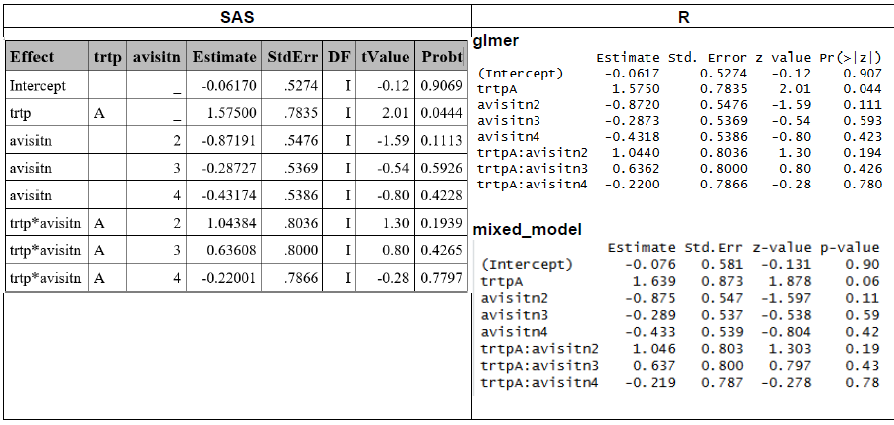
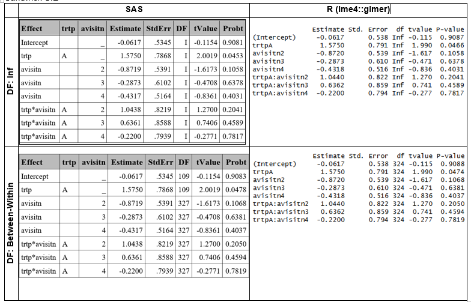
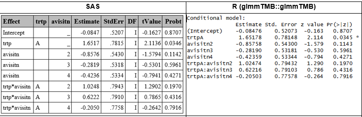
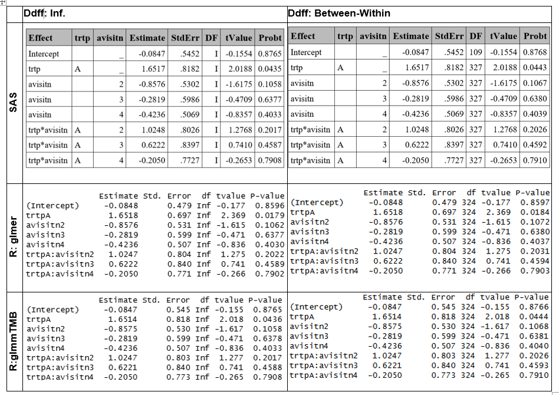
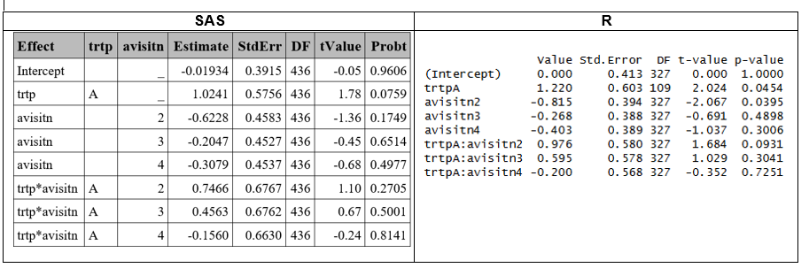
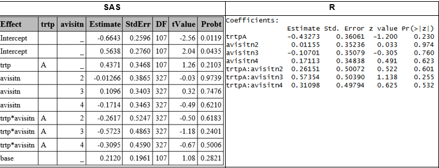

# SUMMARY

Differences between SAS and R, (and even between different functions/procedures within same software) can lead to different results. These differences do not imply that one tool is more reliable than another but rather reflect variations in default settings and computational methods.

The following section summarizes the comparisons conducted using the dataset from ["Gee Model for Binary Data"](https://documentation.sas.com/doc/en/statug/15.2/statug_code_genmex5.htm) in the SAS/STAT Sample Program Library [1]. Each subsection corresponds to a different GLMM estimation method: **Gaussian–Hermite Quadrature (GHQ), Laplace approximation, or Penalized Quasi‑Likelihood (PQL)**, and outlines the specific options and functions required to obtain consistent or comparable results across software platforms.

In general, different R functions were able to reproduce SAS GLMM results (using either GHQ or the Laplace approximation) when applying naïve or sandwich standard errors and assuming infinite degrees of freedom (ddff). However, only approximate agreement was achieved when comparing estimates based on the Between‑Within ddf. When using PQL, additional discrepancies emerged due to differences in the underlying estimation methods across software (i.e., PQL in R versus RSPL in SAS).

### Gauss-Hermite Quadrature (GHQ) approximation

| S.E. | Ddff | SAS | R | Match? |
|-------------|-------------|-----------------|-----------------|-------------|
| Naive | Inf | GLIMMIX with ddff=none | lme4::glmer | Yes |
| Naive | Inf | GLIMMIX with ddff=none | GLMMadaptive::mixed_model | Aprox. |
| Naive | BW | GLIMMIX with ddff=BW (default) | lme4::glmer & parameters::dof_betwithin [1] | Aprox ^(1)^ |
| Sandwich | Inf | GLIMMIX with empirical option & ddff=none | lme4::glmer & merDeriv::sandwich | Aprox ^(2)^ |
| Sandwich | BW | GLIMMIX with empirical option & ddff=BW(default) | lme4::glmer, merDeriv::sandwich & parameters::dof_betwithin [1] | Aprox ^(1)^ |

BW: Between-Within, Inf: Infinite.

(1) In R, the function `parameters::dof_betwithin` uses a heuristic implementation of the between‑within method and therefore does not reproduce the exact results reported in Li and Redden (2015); instead, it yields values that are similar but not identical. In contrast, SAS computes the exact between‑within degrees of freedom.

(2) As `glmer`does not provide cluster-level scores, the `sandwich` function cannot compute clustered robust estimatator, so it does not correspond to SAS's emprical covariance [2].

### Laplace approximation

| S.E. | Ddff | SAS | R | Match? |
|-------------|-------------|-----------------|-----------------|-------------|
| Naive | Inf | GLIMMIX with ddff=none | lme4::glmer | Aprox. ^(2)^ |
| Naive | Inf | GLIMMIX with ddff=none | glmmTMB::glmmTMB | Yes |
| Naive | BW | GLIMMIX with ddff=BW (default) | lglmmTMB::glmmTMB & parameters::dof_betwithin \[1\] | Aprox. ^(1)^ |
| Sandwich | Inf | GLIMMIX with empirical option & ddff=none | glmmTMB::glmmTMB & clubSandwich::vcovHC | Yes |
| Sandwich | BW | GLIMMIX with empirical option & ddff=BW(default) | lme4::glmer, merDeriv::sandwich & parameters::dof_betwithin \[1\] | Aprox ^(1)^ |

BW: Between-Within, Inf: Infinite.

(1): In R, the function `parameters::dof_betwithin` uses a heuristic implementation of the between‑within method and therefore does not reproduce the exact results reported in Li and Redden (2015); instead, it yields values that are similar but not identical. In contrast, SAS computes the exact between‑within degrees of freedom.

(2): Although `lme4::glmer` produced estimates consistent with SAS when using GHQ, it exhibited convergence issues that were not present in either SAS or `glmmTMB::glmmTMB`. After adjusting the optimization settings (see R section), only approximate agreement with the SAS results was achieved.

### PQL

| S.E. | Ddff | SAS | R | Match? |
|-------------|-------------|-----------------|-----------------|-------------|
| Naive | Residual | GLIMMIX with method=RSPL & ddfm=residual | MASS::glmmPQL | Aprox. ^(1)^ |

(1): Results differ because of the different computation methods (PQL vs. RSPL)

# GHQ

In this section, SAS and R results obtained under the GHQ approach are compared, after adjusting the necessary settings or applying additional functions to ensure alignment across software (See summary table above and respective R and SAS sections).

### Model Based SE and Infinite ddff

Similar results in the estimate were obtained in SAS and R (using `lme4::glmer`), and approximated results were obtained with mixed_model (See R section for difference details between R functions).

```{r}
#| echo: false
#| fig-align: center
#| out-width: 50%

```


### Sandwich SE

Sandwich standard errors were computed using the `EMPIRICAL` option in SAS and the `merDeriv::sandwich` function in R (See corresponding SAS and R sections for details). This approach yielded comparable,though not identical results. The slight discrepancies arise because the base `sandwich` method cannot compute a fully cluster‑robust estimator for `glmer` models, and therefore does not reproduce the exact empirical covariance structure used by SAS [2].

Between-Within ddff were obtained in R using `parameters::dof_betwithin` function, which computes an approximation, instead of the exact dff as in SAS.

```{r}
#| echo: false
#| fig-align: center
#| out-width: 50%

```

# Laplace

### Model Based SE and Infinite ddff

Results obtained with SAS and `glmmTMB::glmmTMB` matched, with minor differences in the latest decimal, attributable to different rounding between software.

```{r}
#| echo: false
#| fig-align: center
#| out-width: 50%

```

### Sandwich SE

Sandwich SE were obtained using `clubSandwich::vovHC` R function, obtainng similar SE to SAS. However, there are differences in the between-within ddff, because the R function is based on a heuristic.

```{r}
#| echo: false
#| fig-align: center
#| out-width: 50%

```

# PQL

The PQL approach uses linear approximations instead of likelihood, making it less accurate for binary outcomes compared to the GHQ or Laplace methods described above. In SAS, this is implemented by default using the Residual Pseudo-Likelihood method (method=RSPL), which is a refinement of PQL which incorporates residual adjustments to better approximate the marginal likelihood, in the GLIMMIX procedure. In R the PQL computation can be obtained using the glmmPQL function form the MASS package.

```{r}
#| echo: false
#| fig-align: center
#| out-width: 50%

```

Results differ because of the different computation methods (PQL vs. RSPL) across software. Since glmmPQL is widely recognized as less reliable for binary outcomes, more robust approaches such as Laplace or GHQ are generally preferred. Consequently, further investigation using glmmPQL is not pursued.

# OUTCOME WITH MORE THAN 2 CATEGORIES

### Ordinal variables

A GLMM with ordinal outcome is fit in SAS using PROC CLIMMIX and function `ordinal::clmm,` (See corresponding SAS and R section for details), obtaining some differences in the results, because `clmm` applies different optimization algorithms (Newton, BFGS, NR methods) and its own parameterization of random effects [2].

```{r}
#| echo: false
#| fig-align: center
#| out-width: 50%

```

### Nominal variables

GLMM with nominal outcome is created with GLIMMIX (See corresponding SAS section), However, no R functions equivalent to SAS's GLIMMIX procedure have been identified for handling multinomial distributions in a frequentist framwork.

# REFERENCES

[1] [SAS Institute Inc.. SAS Help Center. The GEE procedure.](https://documentation.sas.com/doc/en/statug/15.2/statug_gee_examples01.htm)

[2] Conceptual explanations were assisted using Microsoft Copilot (M365 Copilot, GPT‑5‑based model).

[3] [Li, P., & Redden, D. T. (2015). Comparing denominator degrees of freedom approximations for the generalized linear mixed model in analyzing binary outcome in small sample cluster-randomized trials. BMC Medical Research Methodology, 15, 38.](https://bmcmedresmethodol.biomedcentral.com/articles/10.1186/s12874-015-0026-x)

[4] [U.S. Food and Drug Administration. (2023). Adjusting for Covariates in Randomized Clinical Trials for Drugs and Biological Products: Guidance for Industry. Center for Drug Evaluation and Research (CDER), Center for Biologics Evaluation and Research (CBER). ](https://www.fda.gov/regulatory-information/search-fda-guidance-documents/adjusting-covariates-randomized-clinical-trials-drugs-and-biological-products)

[5] [Documentation of package parameters. dof_betwithin](https://search.r-project.org/CRAN/refmans/parameters/html/p_value_betwithin.html)

[6] Brooks, M. E., et al. (2025). glmmTMB: Generalized Linear Mixed Models using Template Model Builder (Version 1.1.12) \[R package manual\]. The Comprehensive R Archive Network (CRAN). <https://cran.r-project.org/web/packages/glmmTMB/glmmTMB.pdf>

[7] [Ordinal: Regression Models for Ordinal Data.](https://cran.r-project.org/web/packages/ordinal/index.html)

[8] [SAS/STAT® 13.1 User’s Guide The GLIMMIX Procedure](https://support.sas.com/documentation/onlinedoc/stat/131/glimmix.pdf)

[9] [Touloumis A. (2015). "R Package multgee: A Generalized Estimating Equations Solver for Multinomial Responses." Journal of Statistical Software.](https://www.jstatsoft.org/article/view/v064i08)
