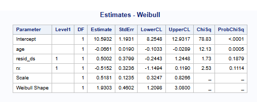
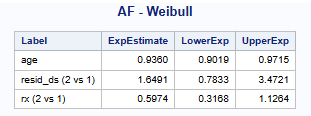
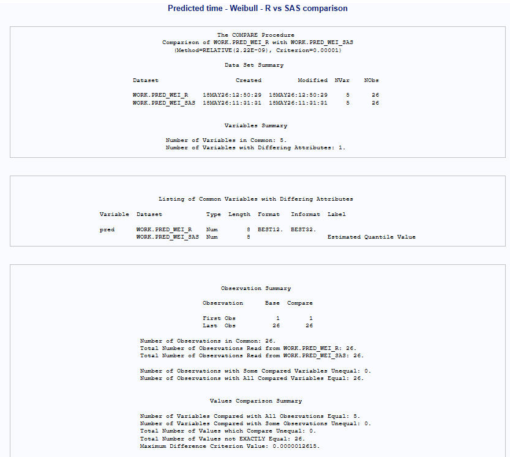
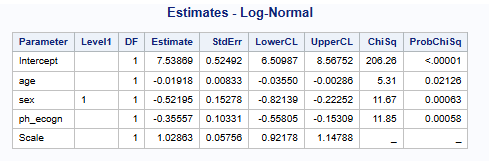
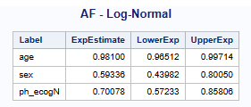
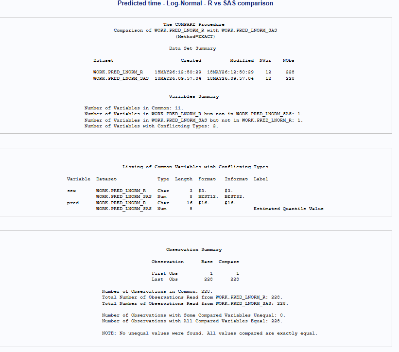
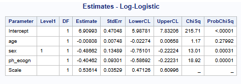
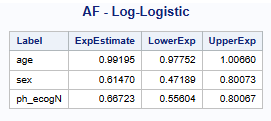
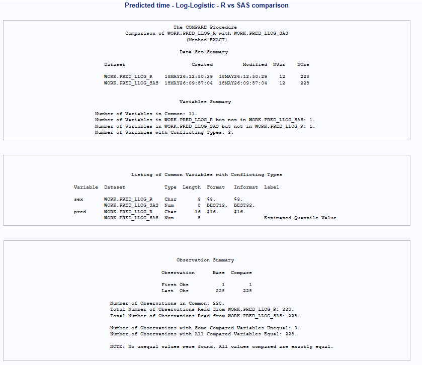

# Introduction

### Summary

The Accelerated Failure Time (AFT) model is implemented in R using the `survival::survreg` function and in SAS using `PROC LIFEREG`, with the choice of distribution specified as appropriate for the analysis (see R and SAS sections for further model details).

In the table 1, the distributions available in R and SAS are listed together with its keywords.

**Table 1.** Distributions Available in R and SAS for AFT Models

| Distribution | R           | SAS         |
|--------------|-------------|-------------|
| Weibull      | weibull\*   | weibull\*   |
| Exponential  | exponential | exponential |
| gaussian     | gaussian    | normal      |
| Logistic     | logistic    | logistic    |
| Log-normal   | lognormal   | lnormal     |
| Log-Logistic | loglogistic | llogistic   |
| Gamma        | NA          | gamma       |

| NA: Not applicable.
| \**By default.*

To obtain the acceleration factors, the model coefficients are transformed using the exponential function. In R, this is done by applying the exponential transformation directly to the estimated coefficients. In SAS, acceleration factors can be derived using the `ESTIMATE` statement or by applying the same transformation to the parameter estimates in a data step.

The following sections explore the three most commonly used distributions: Log-Normal, Log-Logistic and Weibull (by default) through examples.

Predicted survival times in R are obtained using the `predict` function. In these examples, the predicted survival times for each subject are exported to a CSV file and then imported into SAS for comparison. In SAS, equivalent predictions can be generated and stored in an output dataset using the `OUTPUT OUT=` statement. Table 2 summarized the key differences found between R and SAS:

**Table 2.** Key differences between R and SAS

+-----------------------------+-----------------+-----------------------------------+
| Item                        | SAS             | R                                 |
+=============================+=================+===================================+
| Class variables             | class statement | should be defined as factor       |
+-----------------------------+-----------------+-----------------------------------+
| Class variables - reference | Last            | First                             |
+-----------------------------+-----------------+-----------------------------------+
| Predicted values            | Median          | Using Predict function:           |
|                             |                 |                                   |
|                             |                 | Log-Normal, Log-Logisitic: Median |
|                             |                 |                                   |
|                             |                 | Weibull: Mean\*                   |
+-----------------------------+-----------------+-----------------------------------+
| Scale Parameter             | scale           | Log(scale)                        |
+-----------------------------+-----------------+-----------------------------------+

\**The resulting parameterization of the distributions is sometimes (e.g. gaussian) identical to the usual form found in statistics textbooks, but other times (e.g. Weibull) it is not \[3\].*

### R Packages

```{r}
#install.packages("survival")
#install.packages("stats")

library(survival)
library(stats)
```

# AFT using Weibull Distribution (Default)

This example uses ovarian dataset from the R `survival` package \[1\] (see SAS section for further details about the content).

The variables RX (treatment group) and RESID_DS (residual disease status) are converted to factors in R. The reference levels are defined in reverse order to ensure consistency with SAS, where the first level is used as the reference category, while R by default uses the last level. In SAS, categorical variables are defined in the `class` statement.

Based on the `survival` package documentation \[1\]: "*The predicted response is identical to the linear predictor for fits to the untransformed distributions, i.e., the extreme-value, logistic and Gaussian. For transformed distributions such as the Weibull, for which log(y) is from an extreme value distribution, the linear predictor is on the transformed scale and the response is the inverse transform, e.g. exp(ηi) for the Weibull*".

Therefore, for the Weibull AFT model, differences in predicted survival times between R and SAS are due to different default definitions. SAS (`PROC LIFEREG`) returns the median survival time (exp(Xβ)), while in R (`survreg`) the default prediction for Weibull corresponds to the response on the original scale, which may differ from the median due to the model parameterisation. This results in a constant offset across predictions. When the median is explicitly requested in R using `type = "quantile", p = 0.5`, the predictions align with those from SAS (using a comparison tolerance of 0.00001).

Similar results are obtained between R and SAS. SAS reports the scale parameter directly (0.518051..., rounded to 0.5181), whereas R reports its logarithm. In this example, log(0.518051) = −0.6577, which matches the value displayed in R. Variables RX and RESID_DS are removed from the comparison because had different attributes.

### R

```{r}
#Transform variables RX (treatment group1) and RESID_DS (residual disease present) #to factor.
ovarian$rx<-factor(ovarian$rx, levels=c('2', '1')) 
ovarian$resid_ds<-factor(ovarian$resid.ds, levels=c('2', '1')) 

# Fit an AFT model using Weibull distribution
model_aft <- survival::survreg(
  survival::Surv(futime, fustat) ~ age + resid_ds + rx,
  data = ovarian,
  dist="weibull"
)

#Get confident limit
cl<-confint(model_aft)

# Compute acceleration factor (exponentiated coefficients)
af <- exp(cbind(Estimate = coef(model_aft),
                confint(model_aft)))

#Print results
print(summary(model_aft))
print(round(cl,4))
print(round(af, 4))

#Predicted time
pred_wei<-ovarian
pred_wei$pred <- stats::predict(model_aft,
                         newdata = ovarian,
                         type = "quantile",
                         p = 0.5)

#Export predicted time to compare in SAS
#write.csv(pred_wei, "pred_wei_R.csv", row.names = FALSE)

```

### SAS

``` sas
 *------ Data preparation-----------------------------------------;
 data lung1;
 set lung;
 if ph_ecog NE 'NA' then ph_ecogn=input(ph_ecog, 1.);
run;
 
 *------ Run the model, using estimate to compute the AF ---------;
proc lifereg data=ovarian;
  class rx resid_ds;
  model futime*fustat(0)=age resid_ds rx/dist=weibull ;
  
  estimate  'age'  					          age 1    /exp cl;
  estimate  'resid_ds (2 vs 1)'  resid_ds 1 -1 /exp cl;
  estimate  'rx (2 vs 1)'              rx 1 -1 /exp cl;
  
  ods output ParameterEstimates=Est_wei Estimates = af_wei;
  output out=pred_weibull_SAS predicted=pred; 
 run;
 
*----Print estimates---------------------------------------------;
proc print data= Estimates_wei  noobs;
  where df > 0;
  title 'Estimates - Weibull';
run;

*----Print AF----------------------------------------------------;
proc print data= af_wei  noobs;
  var label expestimate  lowerexp upperexp;
  title 'AF - Weibull';
run;
```

```{r}
#| eval: true
#| echo: false
#| fig-align: center
#| out-width: 75%

```

```{r}
#| eval: true
#| echo: false
#| fig-align: center
#| out-width: 75%

```

``` sas
 *---Predicted time, R vs SAS Comparison ---------;
 proc compare base=pred_wei_R(drop=rx resid_ds) 
      compare=pred_wei_SAS(drop=_prob_ rx resid_ds) criterion=0.00001 ; 
      title 'Predicted time - Weibull - R vs SAS comparison'; 
run;
```

```{r}
#| eval: true
#| echo: false
#| fig-align: center
#| out-width: 75%

```

# AFT using Log-Normal Distribution

In this example, the `lung` dataset from R survival package is used (see SAS section for further details about the content).. The variable sex is transformed to factor and the order of the levers is reverse to match with SAS. In SAS, the variable PH_ECOG is transformed to numeric to be analysed as a continuous variables.

### R

In R, the syntax is similar to the previous example, with the distribution specified as `"lognormal"`. For the log-normal model, the `predict` function returns the median survival time by default, so there is no need to explicitly request quantiles, unlike in the Weibull example.

```{r}
# Transform sex to factor, and reverse the order of the levels}
lung$sex<-factor(lung$sex, levels=c('2', '1')) 

# Fit an AFT model using lognormal distribution
model_aft <- survival::survreg(
  survival::Surv(time, status) ~ age + sex + ph.ecog,
  data = lung,
  dist = "lognormal"
)

#Get confident limit
cl<-confint(model_aft)

# Compute acceleration factor (exponentiated coefficients)
af <- exp(cbind(Estimate = coef(model_aft),
                confint(model_aft)))

#Print results
print(summary(model_aft))
print(round(cl,5))
print(round(af, 5))


#Predicted time
pred_lnorm<-lung
pred_lnorm$pred <- pred_lnorm$pred <- stats::predict(model_aft,newdata = lung)


#Export predicted time to compare in SAS
#write.csv(pred_lnorm, "pred_lnorm_R.csv", row.names = FALSE)

```

### SAS

In SAS, the AF is computed using the `estimates` statement. Results are displayed with 5 decimal places to align with the results displayed in R.

``` sas
*------ Data preparation-ph.ecog also changed to ph_ecog in sas----------;
 data lung1;
 set lung;
 if ph_ecog NE 'NA' then ph_ecogn=input(ph_ecog, 1.);
run;

 *------ Run the model, using estimate to compute the AF ---------;
 proc lifereg data=lung1;
  class sex;
  model time*status(1)=age sex ph_ecogN/dist=lnormal;
  
  estimate  'age'  		     age 1    /exp cl;
  estimate  'sex'           sex  1 -1 /exp cl;
  estimate  'ph_ecogN' ph_ecogN 1 -1 /exp cl;
  
  ods output ParameterEstimates=Est_lnorm Estimates = af_lnorm;
  output out=pred_lnormal_SAS predicted=pred; 
 run;
 
*----Print estimates---------------------------------------------;
proc print data= Est_lnorm  noobs;
  where df > 0;
  title 'Estimates - Log-Normal';
  format estimate stderr lowercl uppercl  8.5 probchisq pvalue7.;
run;

*----Print AF----------------------------------------------------;
proc print data= af_lnorm  noobs;
  var label expestimate  lowerexp upperexp;
  title 'AF - Log-Normal';
run;


```

```{r}
#| eval: true
#| echo: false
#| fig-align: center
#| out-width: 75%

```

```{r}
#| eval: true
#| echo: false
#| fig-align: center
#| out-width: 75%

```

``` sas
proc compare base=pred_lnorm_R compare=pred_lnorm_SAS(drop=_prob_);
   title 'Predicted time - Log-Normal - R vs SAS comparison';
run;

```

```{r}
#| eval: true
#| echo: false
#| fig-align: center
#| out-width: 75%

```

# AFT using Log-Logistic Distribution

In this example, the same `lung` dataset as in the log-normal model is used. The syntax is the same as in previous example, only the distribution is changed.

### R

```{R}
# Transform sex to factor, and reverse the order of the levels}
lung$sex<-factor(lung$sex, levels=c('2', '1')) 

# Fit an AFT model using lognormal distribution
model_aft <- survival::survreg(
  survival::Surv(time, status) ~ age + sex + ph.ecog,
  data = lung,
  dist = "loglogistic"
)


#Get confident limit
cl<-confint(model_aft)

# Compute acceleration factor (exponentiated coefficients)
af <- exp(cbind(Estimate = coef(model_aft),
                confint(model_aft)))

#Print results
print(summary(model_aft))
print(round(cl,5))
print(round(af, 5))

#Predicted time
pred_llog<-lung
pred_llog$pred <- stats::predict(model_aft, newdata = lung)


#Export predicted time to compare in SAS
#write.csv(pred_llog, "pred_llog_R.csv", row.names = FALSE)

```

### SAS

``` sas
 *------ Data preparation-----------------------------------------;
 data lung1;
 set lung;
 if ph_ecog NE 'NA' then ph_ecogn=input(ph_ecog, 1.);
run;

 *------ Run the model, using estimate to compute the AF ---------;
 proc lifereg data=lung1;
  class sex;
  model time*status(1)=age sex ph_ecogN/dist=llogistic;
  
  estimate  'age'  		     age 1    /exp cl;
  estimate  'sex'           sex  1 -1 /exp cl;
  estimate  ' ph_ecogN' ph_ecogN 1 -1 /exp cl;
  
  ods output ParameterEstimates=Est_llog Estimates = af_llog;
  output out=pred_llog_SAS predicted=pred; 
 run;
 
*----Print estimates---------------------------------------------;
proc print data= Est_llog  noobs;
  where df > 0;
  title 'Estimates - Log-Logistic';
  format estimate stderr lowercl uppercl  8.5 probchisq pvalue7.;
run;

*----Print AF----------------------------------------------------;
proc print data= af_llog  noobs;
  var label expestimate  lowerexp upperexp;
  title 'AF - Log-Logistic';
  format  expestimate  lowerexp upperexp 8.5;
run;
 

```

```{r}
#| eval: true
#| echo: false
#| fig-align: center
#| out-width: 75%

```

```{r}
#| eval: true
#| echo: false
#| fig-align: center
#| out-width: 75%

```

``` sas
proc compare base=pred_llog_R compare=pred_llog_SAS(drop=_prob_);
   title 'Predicted time - Log-Logistic - R vs SAS comparison';
run;

```

```{r}
#| eval: true
#| echo: false
#| fig-align: center
#| out-width: 75%

```

# Conclusions

Overall, consistent results were obtained between R and SAS for Weibull, log-normal, and log-logistic AFT models when reference levels for categorical variables were aligned and predictions were defined consistently.

Differences observed for the Weibull model were due to default prediction definitions (mean in R vs median in SAS) and were resolved by matching the prediction type, resulting in full agreement across software.

# References

\[1\] [Therneau TM. A Package for Survival Analysis in R (survival vignette).](https://cran.r-project.org/web/packages/survival/vignettes/survival.pdf "Therneau TM. A Package for Survival Analysis in R (survival vignette). Available from: https://cran.r-project.org/web/packages/survival/vignettes/survival.pdf")

\[2\] [SAS Institute Inc. SAS/STAT® User’s Guide: The LIFEREG Procedure.](https://documentation.sas.com/doc/en/pgmsascdc/v_074/statug/statug_lifereg_syntax01.htm){.uri}

\[3\] Therneau TM. survival: Survival Analysis. R package documentation for survreg functions. Available from CRAN; accessed via R help (e.g.: *help(survreg)*).
