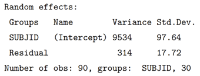

## Fitting Random Effects Models in R

In a classical regression model, coefficients in the model are fixed across all observations and observations are assumed to be independent. Mixed effects models introduce random coefficients to the model, called random effects, which vary randomly between different groups of observations. The introduction of random effects leads to observations within a group being correlated.

### Setting up the model

The **lme4** package is one of several packages that can be used to implement random effects models.

As an example, suppose that we want the intercept in the model to vary randomly between participants, in other words, a random constant is included in the model which is different for each participant. This is achieved by adding (1 | USUBJID) to the model formula.

`lme4::lmer(AVAL ~ TRTP + ... + (1 | USUBJID))`

Within the output of the summary function the estimated variance of the random effect(s) can be found, along with the estimated fixed effect coefficients.

```{r} 
#| echo: false 
#| fig-align: center 
#| out-width: 50% 

```

To allow the coefficient of TRTP to also vary randomly by participant, use(1 + TRTP | USUBJID), or equivalently just (TRTP | USUBJID). Under this notation, the random intercept and random coefficient of TRTP are correlated. To assume that they are not correlated, use (1 | USUBJID) + (0 + TRTP | USUBJID) or equivalently (TRTP || USUBJID). Further details of the notation can be found in [Fitting Linear Mixed-Effects Models Using lme4](https://www.jstatsoft.org/index.php/jss/article/view/v067i01/946).

### Inference on a single coefficient

The lme4 package does not calculate degrees of freedom or p values, but these can be calculated using the lmerTest package. Degrees of freedom and p-values for fixed effects can be found in the summary output after loading the lmerTest package, summary(model, ddf="Kenward-Roger"). Either the Satterthwaite (ddf="Satterthwaite") or Kenward-Roger (ddf="Kenward-Roger") method can be used for calculating degrees of freedom.
For confidence intervals, the confint function will calculate confidence intervals using the Wald (method = “Wald”) or profile likelihood (method = “profile”) methods. The Wald method uses the normal distribution (infinite degrees of freedom) rather than the t-distribution. Confidence intervals using the t-distribution can either be calculated manually or by constructing a contrast (see below).

### Inference on a contrast

The lmerTest::contest1D  function can be used to calculate and test a contrast, for example contest1D(model, c(0, 1, 0, 0, 1, 0), ddf = "Kenward-Roger"). An alternative is to use the emmeans package, which can also calculate estimates marginal means (least square means). Confidence intervals  for contrasts constructed using emmeans can be calculated via the confint function.

