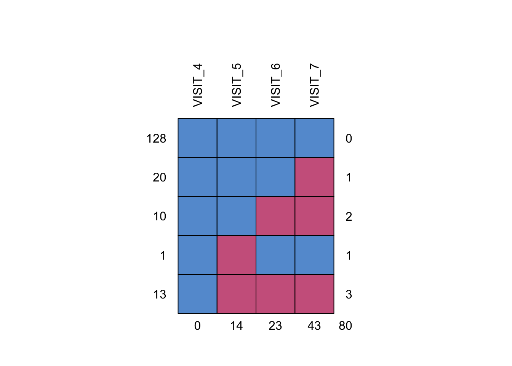
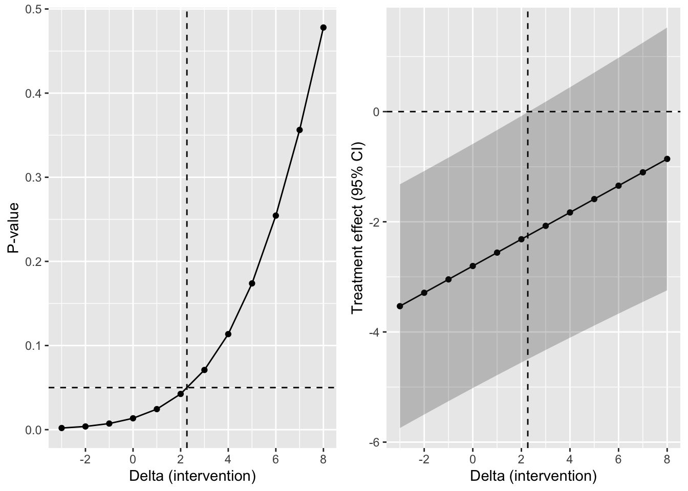
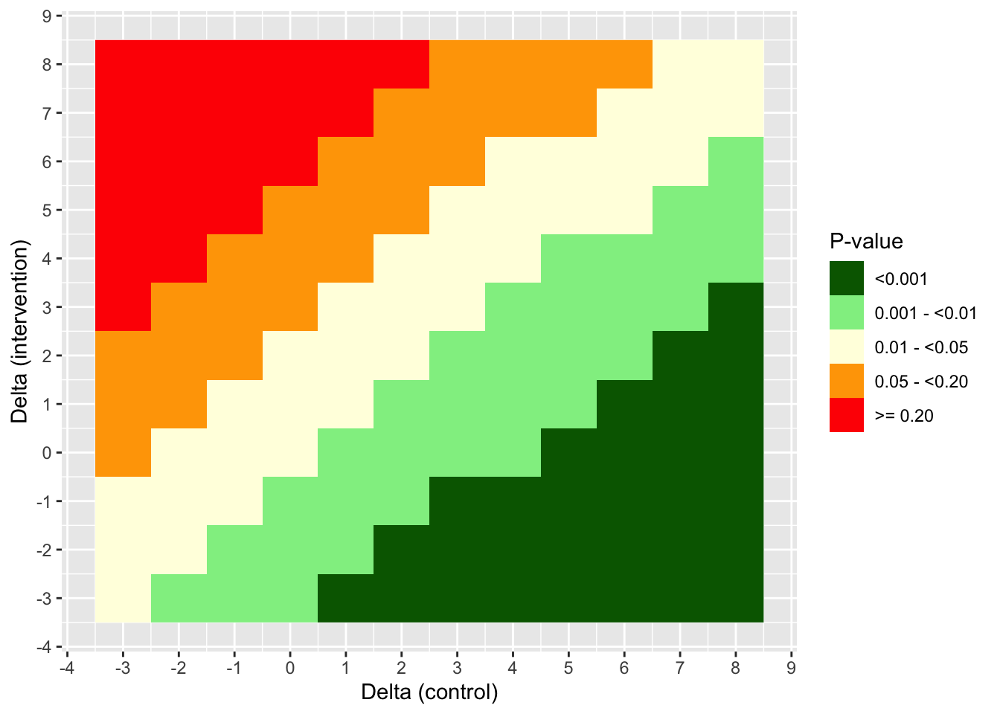
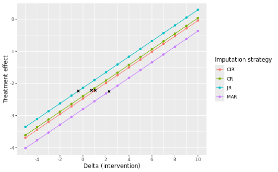

# Delta Adjustment / Tipping Point

## Setup

### General libraries


::: {.cell}

```{.r .cell-code}
library(mice)
library(dplyr)
library(tidyr)
library(gt)
library(labelled)
library(purrr)
library(ggplot2)
library(gridExtra)
```
:::


### Methodology specific libraries


::: {.cell}

```{.r .cell-code}
library(emmeans)
library(mmrm)
library(rstan)
library(rbmi)
```
:::


### Random seed


::: {.cell}

```{.r .cell-code}
set.seed(12345)
```
:::


## Reference-based multiple imputation (rbmi)

### Methodology introduction

The concept of delta adjustment and tipping point analysis builds on the framework of reference-based multiple imputation (rbmi) as seen on its respective [CAMIS webpage](../R/rbmi_continuous_joint.html). The use of the `rbmi` package in R ([Gower-Page et al. 2022](https://joss.theoj.org/papers/10.21105/joss.04251)) for the following standard and reference-based multiple imputation approaches are introduced there:

-   Missing At Random (MAR)

-   Jump to Reference (JR)

-   Copy Reference (CR)

-   Copy Increment from Reference (CIR)

Please make sure to familiarize yourself with these functionalities of the `rbmi` package before checking this tutorial.

The outline of this page generally follows the [rbmi advanced functionality vignette](https://cran.r-project.org/web/packages/rbmi/vignettes/advanced.html#sensitivity-analyses-delta-adjustments-and-tipping-point-analyses).

### Data

The same publicly available [dataset](https://r-packages.io/datasets/antidepressant_data) from an antidepressant clinical trial that was used to illustrate `rbmi` is again used for this tutorial. This dataset is also used in the [`rbmi` quickstart vignette](https://cran.r-project.org/web/packages/rbmi/vignettes/quickstart.html).

The relevant endpoint for the antidepressant trial was assessed using the Hamilton 17-item depression rating scale (HAMD17), which was measured at baseline and subsequently at weeks 1, 2, 3, 4 and 6 (visits 4-7). Study drug discontinuation occurred in 24% (20/84) of subjects in the active drug group, compared to 26% (23/88) of subjects in the placebo group. Importantly, all data after study drug discontinuation are missing and there is a single intermittent missing observation.


::: {.cell}

```{.r .cell-code}
data("antidepressant_data")

dat <- antidepressant_data %>%
  dplyr::select(PATIENT, GENDER, THERAPY, RELDAYS, VISIT, BASVAL, HAMDTL17, CHANGE) %>%
  dplyr::mutate(THERAPY = factor(THERAPY, levels = c("PLACEBO", "DRUG"))) %>%
  remove_labels()

gt(head(dat, n=10))
```

::: {.cell-output-display}

```{=html}
<div id="nspzxzkxbv" style="padding-left:0px;padding-right:0px;padding-top:10px;padding-bottom:10px;overflow-x:auto;overflow-y:auto;width:auto;height:auto;">
<style>#nspzxzkxbv table {
  font-family: system-ui, 'Segoe UI', Roboto, Helvetica, Arial, sans-serif, 'Apple Color Emoji', 'Segoe UI Emoji', 'Segoe UI Symbol', 'Noto Color Emoji';
  -webkit-font-smoothing: antialiased;
  -moz-osx-font-smoothing: grayscale;
}

#nspzxzkxbv thead, #nspzxzkxbv tbody, #nspzxzkxbv tfoot, #nspzxzkxbv tr, #nspzxzkxbv td, #nspzxzkxbv th {
  border-style: none;
}

#nspzxzkxbv p {
  margin: 0;
  padding: 0;
}

#nspzxzkxbv .gt_table {
  display: table;
  border-collapse: collapse;
  line-height: normal;
  margin-left: auto;
  margin-right: auto;
  color: #333333;
  font-size: 16px;
  font-weight: normal;
  font-style: normal;
  background-color: #FFFFFF;
  width: auto;
  border-top-style: solid;
  border-top-width: 2px;
  border-top-color: #A8A8A8;
  border-right-style: none;
  border-right-width: 2px;
  border-right-color: #D3D3D3;
  border-bottom-style: solid;
  border-bottom-width: 2px;
  border-bottom-color: #A8A8A8;
  border-left-style: none;
  border-left-width: 2px;
  border-left-color: #D3D3D3;
}

#nspzxzkxbv .gt_caption {
  padding-top: 4px;
  padding-bottom: 4px;
}

#nspzxzkxbv .gt_title {
  color: #333333;
  font-size: 125%;
  font-weight: initial;
  padding-top: 4px;
  padding-bottom: 4px;
  padding-left: 5px;
  padding-right: 5px;
  border-bottom-color: #FFFFFF;
  border-bottom-width: 0;
}

#nspzxzkxbv .gt_subtitle {
  color: #333333;
  font-size: 85%;
  font-weight: initial;
  padding-top: 3px;
  padding-bottom: 5px;
  padding-left: 5px;
  padding-right: 5px;
  border-top-color: #FFFFFF;
  border-top-width: 0;
}

#nspzxzkxbv .gt_heading {
  background-color: #FFFFFF;
  text-align: center;
  border-bottom-color: #FFFFFF;
  border-left-style: none;
  border-left-width: 1px;
  border-left-color: #D3D3D3;
  border-right-style: none;
  border-right-width: 1px;
  border-right-color: #D3D3D3;
}

#nspzxzkxbv .gt_bottom_border {
  border-bottom-style: solid;
  border-bottom-width: 2px;
  border-bottom-color: #D3D3D3;
}

#nspzxzkxbv .gt_col_headings {
  border-top-style: solid;
  border-top-width: 2px;
  border-top-color: #D3D3D3;
  border-bottom-style: solid;
  border-bottom-width: 2px;
  border-bottom-color: #D3D3D3;
  border-left-style: none;
  border-left-width: 1px;
  border-left-color: #D3D3D3;
  border-right-style: none;
  border-right-width: 1px;
  border-right-color: #D3D3D3;
}

#nspzxzkxbv .gt_col_heading {
  color: #333333;
  background-color: #FFFFFF;
  font-size: 100%;
  font-weight: normal;
  text-transform: inherit;
  border-left-style: none;
  border-left-width: 1px;
  border-left-color: #D3D3D3;
  border-right-style: none;
  border-right-width: 1px;
  border-right-color: #D3D3D3;
  vertical-align: bottom;
  padding-top: 5px;
  padding-bottom: 6px;
  padding-left: 5px;
  padding-right: 5px;
  overflow-x: hidden;
}

#nspzxzkxbv .gt_column_spanner_outer {
  color: #333333;
  background-color: #FFFFFF;
  font-size: 100%;
  font-weight: normal;
  text-transform: inherit;
  padding-top: 0;
  padding-bottom: 0;
  padding-left: 4px;
  padding-right: 4px;
}

#nspzxzkxbv .gt_column_spanner_outer:first-child {
  padding-left: 0;
}

#nspzxzkxbv .gt_column_spanner_outer:last-child {
  padding-right: 0;
}

#nspzxzkxbv .gt_column_spanner {
  border-bottom-style: solid;
  border-bottom-width: 2px;
  border-bottom-color: #D3D3D3;
  vertical-align: bottom;
  padding-top: 5px;
  padding-bottom: 5px;
  overflow-x: hidden;
  display: inline-block;
  width: 100%;
}

#nspzxzkxbv .gt_spanner_row {
  border-bottom-style: hidden;
}

#nspzxzkxbv .gt_group_heading {
  padding-top: 8px;
  padding-bottom: 8px;
  padding-left: 5px;
  padding-right: 5px;
  color: #333333;
  background-color: #FFFFFF;
  font-size: 100%;
  font-weight: initial;
  text-transform: inherit;
  border-top-style: solid;
  border-top-width: 2px;
  border-top-color: #D3D3D3;
  border-bottom-style: solid;
  border-bottom-width: 2px;
  border-bottom-color: #D3D3D3;
  border-left-style: none;
  border-left-width: 1px;
  border-left-color: #D3D3D3;
  border-right-style: none;
  border-right-width: 1px;
  border-right-color: #D3D3D3;
  vertical-align: middle;
  text-align: left;
}

#nspzxzkxbv .gt_empty_group_heading {
  padding: 0.5px;
  color: #333333;
  background-color: #FFFFFF;
  font-size: 100%;
  font-weight: initial;
  border-top-style: solid;
  border-top-width: 2px;
  border-top-color: #D3D3D3;
  border-bottom-style: solid;
  border-bottom-width: 2px;
  border-bottom-color: #D3D3D3;
  vertical-align: middle;
}

#nspzxzkxbv .gt_from_md > :first-child {
  margin-top: 0;
}

#nspzxzkxbv .gt_from_md > :last-child {
  margin-bottom: 0;
}

#nspzxzkxbv .gt_row {
  padding-top: 8px;
  padding-bottom: 8px;
  padding-left: 5px;
  padding-right: 5px;
  margin: 10px;
  border-top-style: solid;
  border-top-width: 1px;
  border-top-color: #D3D3D3;
  border-left-style: none;
  border-left-width: 1px;
  border-left-color: #D3D3D3;
  border-right-style: none;
  border-right-width: 1px;
  border-right-color: #D3D3D3;
  vertical-align: middle;
  overflow-x: hidden;
}

#nspzxzkxbv .gt_stub {
  color: #333333;
  background-color: #FFFFFF;
  font-size: 100%;
  font-weight: initial;
  text-transform: inherit;
  border-right-style: solid;
  border-right-width: 2px;
  border-right-color: #D3D3D3;
  padding-left: 5px;
  padding-right: 5px;
}

#nspzxzkxbv .gt_stub_row_group {
  color: #333333;
  background-color: #FFFFFF;
  font-size: 100%;
  font-weight: initial;
  text-transform: inherit;
  border-right-style: solid;
  border-right-width: 2px;
  border-right-color: #D3D3D3;
  padding-left: 5px;
  padding-right: 5px;
  vertical-align: top;
}

#nspzxzkxbv .gt_row_group_first td {
  border-top-width: 2px;
}

#nspzxzkxbv .gt_row_group_first th {
  border-top-width: 2px;
}

#nspzxzkxbv .gt_summary_row {
  color: #333333;
  background-color: #FFFFFF;
  text-transform: inherit;
  padding-top: 8px;
  padding-bottom: 8px;
  padding-left: 5px;
  padding-right: 5px;
}

#nspzxzkxbv .gt_first_summary_row {
  border-top-style: solid;
  border-top-color: #D3D3D3;
}

#nspzxzkxbv .gt_first_summary_row.thick {
  border-top-width: 2px;
}

#nspzxzkxbv .gt_last_summary_row {
  padding-top: 8px;
  padding-bottom: 8px;
  padding-left: 5px;
  padding-right: 5px;
  border-bottom-style: solid;
  border-bottom-width: 2px;
  border-bottom-color: #D3D3D3;
}

#nspzxzkxbv .gt_grand_summary_row {
  color: #333333;
  background-color: #FFFFFF;
  text-transform: inherit;
  padding-top: 8px;
  padding-bottom: 8px;
  padding-left: 5px;
  padding-right: 5px;
}

#nspzxzkxbv .gt_first_grand_summary_row {
  padding-top: 8px;
  padding-bottom: 8px;
  padding-left: 5px;
  padding-right: 5px;
  border-top-style: double;
  border-top-width: 6px;
  border-top-color: #D3D3D3;
}

#nspzxzkxbv .gt_last_grand_summary_row_top {
  padding-top: 8px;
  padding-bottom: 8px;
  padding-left: 5px;
  padding-right: 5px;
  border-bottom-style: double;
  border-bottom-width: 6px;
  border-bottom-color: #D3D3D3;
}

#nspzxzkxbv .gt_striped {
  background-color: rgba(128, 128, 128, 0.05);
}

#nspzxzkxbv .gt_table_body {
  border-top-style: solid;
  border-top-width: 2px;
  border-top-color: #D3D3D3;
  border-bottom-style: solid;
  border-bottom-width: 2px;
  border-bottom-color: #D3D3D3;
}

#nspzxzkxbv .gt_footnotes {
  color: #333333;
  background-color: #FFFFFF;
  border-bottom-style: none;
  border-bottom-width: 2px;
  border-bottom-color: #D3D3D3;
  border-left-style: none;
  border-left-width: 2px;
  border-left-color: #D3D3D3;
  border-right-style: none;
  border-right-width: 2px;
  border-right-color: #D3D3D3;
}

#nspzxzkxbv .gt_footnote {
  margin: 0px;
  font-size: 90%;
  padding-top: 4px;
  padding-bottom: 4px;
  padding-left: 5px;
  padding-right: 5px;
}

#nspzxzkxbv .gt_sourcenotes {
  color: #333333;
  background-color: #FFFFFF;
  border-bottom-style: none;
  border-bottom-width: 2px;
  border-bottom-color: #D3D3D3;
  border-left-style: none;
  border-left-width: 2px;
  border-left-color: #D3D3D3;
  border-right-style: none;
  border-right-width: 2px;
  border-right-color: #D3D3D3;
}

#nspzxzkxbv .gt_sourcenote {
  font-size: 90%;
  padding-top: 4px;
  padding-bottom: 4px;
  padding-left: 5px;
  padding-right: 5px;
}

#nspzxzkxbv .gt_left {
  text-align: left;
}

#nspzxzkxbv .gt_center {
  text-align: center;
}

#nspzxzkxbv .gt_right {
  text-align: right;
  font-variant-numeric: tabular-nums;
}

#nspzxzkxbv .gt_font_normal {
  font-weight: normal;
}

#nspzxzkxbv .gt_font_bold {
  font-weight: bold;
}

#nspzxzkxbv .gt_font_italic {
  font-style: italic;
}

#nspzxzkxbv .gt_super {
  font-size: 65%;
}

#nspzxzkxbv .gt_footnote_marks {
  font-size: 75%;
  vertical-align: 0.4em;
  position: initial;
}

#nspzxzkxbv .gt_asterisk {
  font-size: 100%;
  vertical-align: 0;
}

#nspzxzkxbv .gt_indent_1 {
  text-indent: 5px;
}

#nspzxzkxbv .gt_indent_2 {
  text-indent: 10px;
}

#nspzxzkxbv .gt_indent_3 {
  text-indent: 15px;
}

#nspzxzkxbv .gt_indent_4 {
  text-indent: 20px;
}

#nspzxzkxbv .gt_indent_5 {
  text-indent: 25px;
}

#nspzxzkxbv .katex-display {
  display: inline-flex !important;
  margin-bottom: 0.75em !important;
}

#nspzxzkxbv div.Reactable > div.rt-table > div.rt-thead > div.rt-tr.rt-tr-group-header > div.rt-th-group:after {
  height: 0px !important;
}
</style>
<table class="gt_table" data-quarto-disable-processing="false" data-quarto-bootstrap="false">
  <thead>
    <tr class="gt_col_headings">
      <th class="gt_col_heading gt_columns_bottom_border gt_center" rowspan="1" colspan="1" scope="col" id="PATIENT">PATIENT</th>
      <th class="gt_col_heading gt_columns_bottom_border gt_left" rowspan="1" colspan="1" scope="col" id="GENDER">GENDER</th>
      <th class="gt_col_heading gt_columns_bottom_border gt_center" rowspan="1" colspan="1" scope="col" id="THERAPY">THERAPY</th>
      <th class="gt_col_heading gt_columns_bottom_border gt_right" rowspan="1" colspan="1" scope="col" id="RELDAYS">RELDAYS</th>
      <th class="gt_col_heading gt_columns_bottom_border gt_center" rowspan="1" colspan="1" scope="col" id="VISIT">VISIT</th>
      <th class="gt_col_heading gt_columns_bottom_border gt_right" rowspan="1" colspan="1" scope="col" id="BASVAL">BASVAL</th>
      <th class="gt_col_heading gt_columns_bottom_border gt_right" rowspan="1" colspan="1" scope="col" id="HAMDTL17">HAMDTL17</th>
      <th class="gt_col_heading gt_columns_bottom_border gt_right" rowspan="1" colspan="1" scope="col" id="CHANGE">CHANGE</th>
    </tr>
  </thead>
  <tbody class="gt_table_body">
    <tr><td headers="PATIENT" class="gt_row gt_center">1503</td>
<td headers="GENDER" class="gt_row gt_left">F</td>
<td headers="THERAPY" class="gt_row gt_center">DRUG</td>
<td headers="RELDAYS" class="gt_row gt_right">7</td>
<td headers="VISIT" class="gt_row gt_center">4</td>
<td headers="BASVAL" class="gt_row gt_right">32</td>
<td headers="HAMDTL17" class="gt_row gt_right">21</td>
<td headers="CHANGE" class="gt_row gt_right">-11</td></tr>
    <tr><td headers="PATIENT" class="gt_row gt_center">1503</td>
<td headers="GENDER" class="gt_row gt_left">F</td>
<td headers="THERAPY" class="gt_row gt_center">DRUG</td>
<td headers="RELDAYS" class="gt_row gt_right">14</td>
<td headers="VISIT" class="gt_row gt_center">5</td>
<td headers="BASVAL" class="gt_row gt_right">32</td>
<td headers="HAMDTL17" class="gt_row gt_right">20</td>
<td headers="CHANGE" class="gt_row gt_right">-12</td></tr>
    <tr><td headers="PATIENT" class="gt_row gt_center">1503</td>
<td headers="GENDER" class="gt_row gt_left">F</td>
<td headers="THERAPY" class="gt_row gt_center">DRUG</td>
<td headers="RELDAYS" class="gt_row gt_right">28</td>
<td headers="VISIT" class="gt_row gt_center">6</td>
<td headers="BASVAL" class="gt_row gt_right">32</td>
<td headers="HAMDTL17" class="gt_row gt_right">19</td>
<td headers="CHANGE" class="gt_row gt_right">-13</td></tr>
    <tr><td headers="PATIENT" class="gt_row gt_center">1503</td>
<td headers="GENDER" class="gt_row gt_left">F</td>
<td headers="THERAPY" class="gt_row gt_center">DRUG</td>
<td headers="RELDAYS" class="gt_row gt_right">42</td>
<td headers="VISIT" class="gt_row gt_center">7</td>
<td headers="BASVAL" class="gt_row gt_right">32</td>
<td headers="HAMDTL17" class="gt_row gt_right">17</td>
<td headers="CHANGE" class="gt_row gt_right">-15</td></tr>
    <tr><td headers="PATIENT" class="gt_row gt_center">1507</td>
<td headers="GENDER" class="gt_row gt_left">F</td>
<td headers="THERAPY" class="gt_row gt_center">PLACEBO</td>
<td headers="RELDAYS" class="gt_row gt_right">7</td>
<td headers="VISIT" class="gt_row gt_center">4</td>
<td headers="BASVAL" class="gt_row gt_right">14</td>
<td headers="HAMDTL17" class="gt_row gt_right">11</td>
<td headers="CHANGE" class="gt_row gt_right">-3</td></tr>
    <tr><td headers="PATIENT" class="gt_row gt_center">1507</td>
<td headers="GENDER" class="gt_row gt_left">F</td>
<td headers="THERAPY" class="gt_row gt_center">PLACEBO</td>
<td headers="RELDAYS" class="gt_row gt_right">15</td>
<td headers="VISIT" class="gt_row gt_center">5</td>
<td headers="BASVAL" class="gt_row gt_right">14</td>
<td headers="HAMDTL17" class="gt_row gt_right">14</td>
<td headers="CHANGE" class="gt_row gt_right">0</td></tr>
    <tr><td headers="PATIENT" class="gt_row gt_center">1507</td>
<td headers="GENDER" class="gt_row gt_left">F</td>
<td headers="THERAPY" class="gt_row gt_center">PLACEBO</td>
<td headers="RELDAYS" class="gt_row gt_right">29</td>
<td headers="VISIT" class="gt_row gt_center">6</td>
<td headers="BASVAL" class="gt_row gt_right">14</td>
<td headers="HAMDTL17" class="gt_row gt_right">9</td>
<td headers="CHANGE" class="gt_row gt_right">-5</td></tr>
    <tr><td headers="PATIENT" class="gt_row gt_center">1507</td>
<td headers="GENDER" class="gt_row gt_left">F</td>
<td headers="THERAPY" class="gt_row gt_center">PLACEBO</td>
<td headers="RELDAYS" class="gt_row gt_right">42</td>
<td headers="VISIT" class="gt_row gt_center">7</td>
<td headers="BASVAL" class="gt_row gt_right">14</td>
<td headers="HAMDTL17" class="gt_row gt_right">5</td>
<td headers="CHANGE" class="gt_row gt_right">-9</td></tr>
    <tr><td headers="PATIENT" class="gt_row gt_center">1509</td>
<td headers="GENDER" class="gt_row gt_left">F</td>
<td headers="THERAPY" class="gt_row gt_center">DRUG</td>
<td headers="RELDAYS" class="gt_row gt_right">7</td>
<td headers="VISIT" class="gt_row gt_center">4</td>
<td headers="BASVAL" class="gt_row gt_right">21</td>
<td headers="HAMDTL17" class="gt_row gt_right">20</td>
<td headers="CHANGE" class="gt_row gt_right">-1</td></tr>
    <tr><td headers="PATIENT" class="gt_row gt_center">1509</td>
<td headers="GENDER" class="gt_row gt_left">F</td>
<td headers="THERAPY" class="gt_row gt_center">DRUG</td>
<td headers="RELDAYS" class="gt_row gt_right">14</td>
<td headers="VISIT" class="gt_row gt_center">5</td>
<td headers="BASVAL" class="gt_row gt_right">21</td>
<td headers="HAMDTL17" class="gt_row gt_right">18</td>
<td headers="CHANGE" class="gt_row gt_right">-3</td></tr>
  </tbody>
  
  
</table>
</div>
```

:::
:::


The number of patients per visit and treatment group are:


::: {.cell}

```{.r .cell-code}
dat %>%
  group_by(VISIT, THERAPY) %>%
  dplyr::summarise(N = n())
```

::: {.cell-output .cell-output-stderr}

```
`summarise()` has grouped output by 'VISIT'. You can override using the
`.groups` argument.
```


:::

::: {.cell-output .cell-output-stdout}

```
# A tibble: 8 × 3
# Groups:   VISIT [4]
  VISIT THERAPY     N
  <fct> <fct>   <int>
1 4     PLACEBO    88
2 4     DRUG       84
3 5     PLACEBO    81
4 5     DRUG       77
5 6     PLACEBO    76
6 6     DRUG       73
7 7     PLACEBO    65
8 7     DRUG       64
```


:::
:::


The mean change from baseline of the HAMD17 endpoint per visit and treatment group using only the complete cases are:


::: {.cell}

```{.r .cell-code}
dat %>%
  group_by(VISIT, THERAPY) %>%
  dplyr::summarise(N = n(),
                   MEAN = mean(CHANGE))
```

::: {.cell-output .cell-output-stderr}

```
`summarise()` has grouped output by 'VISIT'. You can override using the
`.groups` argument.
```


:::

::: {.cell-output .cell-output-stdout}

```
# A tibble: 8 × 4
# Groups:   VISIT [4]
  VISIT THERAPY     N  MEAN
  <fct> <fct>   <int> <dbl>
1 4     PLACEBO    88 -1.51
2 4     DRUG       84 -1.82
3 5     PLACEBO    81 -2.70
4 5     DRUG       77 -4.71
5 6     PLACEBO    76 -4.07
6 6     DRUG       73 -6.79
7 7     PLACEBO    65 -5.14
8 7     DRUG       64 -8.34
```


:::
:::


The missingness pattern is:


::: {.cell}

```{.r .cell-code}
dat_wide = dat %>%
  dplyr::select(PATIENT, VISIT, CHANGE) %>%
  pivot_wider(id_cols = PATIENT,
              names_from = VISIT,
              names_prefix = "VISIT_",
              values_from = CHANGE)

dat_wide %>%
  dplyr::select(starts_with("VISIT_")) %>%
  md.pattern(plot=TRUE, rotate.names = TRUE)
```

::: {.cell-output-display}
{width=672}
:::

::: {.cell-output .cell-output-stdout}

```
    VISIT_4 VISIT_5 VISIT_6 VISIT_7   
128       1       1       1       1  0
20        1       1       1       0  1
10        1       1       0       0  2
1         1       0       1       1  1
13        1       0       0       0  3
          0      14      23      43 80
```


:::
:::


There is a single patient with an intermittent missing observation at visit 5, which is patient 3618. Special considerations need to be taken when applying delta adjustments to intermittent missing observations like this one (more on this later).


::: {.cell}

```{.r .cell-code}
dat_expand <- expand_locf(
  dat,
  PATIENT = levels(dat$PATIENT),
  VISIT = levels(dat$VISIT),
  vars = c("BASVAL", "THERAPY", "GENDER"),
  group = c("PATIENT"),
  order = c("PATIENT", "VISIT")
)

gt(dat_expand %>% dplyr::filter(PATIENT == "3618"))
```

::: {.cell-output-display}

```{=html}
<div id="kfgjqhgfal" style="padding-left:0px;padding-right:0px;padding-top:10px;padding-bottom:10px;overflow-x:auto;overflow-y:auto;width:auto;height:auto;">
<style>#kfgjqhgfal table {
  font-family: system-ui, 'Segoe UI', Roboto, Helvetica, Arial, sans-serif, 'Apple Color Emoji', 'Segoe UI Emoji', 'Segoe UI Symbol', 'Noto Color Emoji';
  -webkit-font-smoothing: antialiased;
  -moz-osx-font-smoothing: grayscale;
}

#kfgjqhgfal thead, #kfgjqhgfal tbody, #kfgjqhgfal tfoot, #kfgjqhgfal tr, #kfgjqhgfal td, #kfgjqhgfal th {
  border-style: none;
}

#kfgjqhgfal p {
  margin: 0;
  padding: 0;
}

#kfgjqhgfal .gt_table {
  display: table;
  border-collapse: collapse;
  line-height: normal;
  margin-left: auto;
  margin-right: auto;
  color: #333333;
  font-size: 16px;
  font-weight: normal;
  font-style: normal;
  background-color: #FFFFFF;
  width: auto;
  border-top-style: solid;
  border-top-width: 2px;
  border-top-color: #A8A8A8;
  border-right-style: none;
  border-right-width: 2px;
  border-right-color: #D3D3D3;
  border-bottom-style: solid;
  border-bottom-width: 2px;
  border-bottom-color: #A8A8A8;
  border-left-style: none;
  border-left-width: 2px;
  border-left-color: #D3D3D3;
}

#kfgjqhgfal .gt_caption {
  padding-top: 4px;
  padding-bottom: 4px;
}

#kfgjqhgfal .gt_title {
  color: #333333;
  font-size: 125%;
  font-weight: initial;
  padding-top: 4px;
  padding-bottom: 4px;
  padding-left: 5px;
  padding-right: 5px;
  border-bottom-color: #FFFFFF;
  border-bottom-width: 0;
}

#kfgjqhgfal .gt_subtitle {
  color: #333333;
  font-size: 85%;
  font-weight: initial;
  padding-top: 3px;
  padding-bottom: 5px;
  padding-left: 5px;
  padding-right: 5px;
  border-top-color: #FFFFFF;
  border-top-width: 0;
}

#kfgjqhgfal .gt_heading {
  background-color: #FFFFFF;
  text-align: center;
  border-bottom-color: #FFFFFF;
  border-left-style: none;
  border-left-width: 1px;
  border-left-color: #D3D3D3;
  border-right-style: none;
  border-right-width: 1px;
  border-right-color: #D3D3D3;
}

#kfgjqhgfal .gt_bottom_border {
  border-bottom-style: solid;
  border-bottom-width: 2px;
  border-bottom-color: #D3D3D3;
}

#kfgjqhgfal .gt_col_headings {
  border-top-style: solid;
  border-top-width: 2px;
  border-top-color: #D3D3D3;
  border-bottom-style: solid;
  border-bottom-width: 2px;
  border-bottom-color: #D3D3D3;
  border-left-style: none;
  border-left-width: 1px;
  border-left-color: #D3D3D3;
  border-right-style: none;
  border-right-width: 1px;
  border-right-color: #D3D3D3;
}

#kfgjqhgfal .gt_col_heading {
  color: #333333;
  background-color: #FFFFFF;
  font-size: 100%;
  font-weight: normal;
  text-transform: inherit;
  border-left-style: none;
  border-left-width: 1px;
  border-left-color: #D3D3D3;
  border-right-style: none;
  border-right-width: 1px;
  border-right-color: #D3D3D3;
  vertical-align: bottom;
  padding-top: 5px;
  padding-bottom: 6px;
  padding-left: 5px;
  padding-right: 5px;
  overflow-x: hidden;
}

#kfgjqhgfal .gt_column_spanner_outer {
  color: #333333;
  background-color: #FFFFFF;
  font-size: 100%;
  font-weight: normal;
  text-transform: inherit;
  padding-top: 0;
  padding-bottom: 0;
  padding-left: 4px;
  padding-right: 4px;
}

#kfgjqhgfal .gt_column_spanner_outer:first-child {
  padding-left: 0;
}

#kfgjqhgfal .gt_column_spanner_outer:last-child {
  padding-right: 0;
}

#kfgjqhgfal .gt_column_spanner {
  border-bottom-style: solid;
  border-bottom-width: 2px;
  border-bottom-color: #D3D3D3;
  vertical-align: bottom;
  padding-top: 5px;
  padding-bottom: 5px;
  overflow-x: hidden;
  display: inline-block;
  width: 100%;
}

#kfgjqhgfal .gt_spanner_row {
  border-bottom-style: hidden;
}

#kfgjqhgfal .gt_group_heading {
  padding-top: 8px;
  padding-bottom: 8px;
  padding-left: 5px;
  padding-right: 5px;
  color: #333333;
  background-color: #FFFFFF;
  font-size: 100%;
  font-weight: initial;
  text-transform: inherit;
  border-top-style: solid;
  border-top-width: 2px;
  border-top-color: #D3D3D3;
  border-bottom-style: solid;
  border-bottom-width: 2px;
  border-bottom-color: #D3D3D3;
  border-left-style: none;
  border-left-width: 1px;
  border-left-color: #D3D3D3;
  border-right-style: none;
  border-right-width: 1px;
  border-right-color: #D3D3D3;
  vertical-align: middle;
  text-align: left;
}

#kfgjqhgfal .gt_empty_group_heading {
  padding: 0.5px;
  color: #333333;
  background-color: #FFFFFF;
  font-size: 100%;
  font-weight: initial;
  border-top-style: solid;
  border-top-width: 2px;
  border-top-color: #D3D3D3;
  border-bottom-style: solid;
  border-bottom-width: 2px;
  border-bottom-color: #D3D3D3;
  vertical-align: middle;
}

#kfgjqhgfal .gt_from_md > :first-child {
  margin-top: 0;
}

#kfgjqhgfal .gt_from_md > :last-child {
  margin-bottom: 0;
}

#kfgjqhgfal .gt_row {
  padding-top: 8px;
  padding-bottom: 8px;
  padding-left: 5px;
  padding-right: 5px;
  margin: 10px;
  border-top-style: solid;
  border-top-width: 1px;
  border-top-color: #D3D3D3;
  border-left-style: none;
  border-left-width: 1px;
  border-left-color: #D3D3D3;
  border-right-style: none;
  border-right-width: 1px;
  border-right-color: #D3D3D3;
  vertical-align: middle;
  overflow-x: hidden;
}

#kfgjqhgfal .gt_stub {
  color: #333333;
  background-color: #FFFFFF;
  font-size: 100%;
  font-weight: initial;
  text-transform: inherit;
  border-right-style: solid;
  border-right-width: 2px;
  border-right-color: #D3D3D3;
  padding-left: 5px;
  padding-right: 5px;
}

#kfgjqhgfal .gt_stub_row_group {
  color: #333333;
  background-color: #FFFFFF;
  font-size: 100%;
  font-weight: initial;
  text-transform: inherit;
  border-right-style: solid;
  border-right-width: 2px;
  border-right-color: #D3D3D3;
  padding-left: 5px;
  padding-right: 5px;
  vertical-align: top;
}

#kfgjqhgfal .gt_row_group_first td {
  border-top-width: 2px;
}

#kfgjqhgfal .gt_row_group_first th {
  border-top-width: 2px;
}

#kfgjqhgfal .gt_summary_row {
  color: #333333;
  background-color: #FFFFFF;
  text-transform: inherit;
  padding-top: 8px;
  padding-bottom: 8px;
  padding-left: 5px;
  padding-right: 5px;
}

#kfgjqhgfal .gt_first_summary_row {
  border-top-style: solid;
  border-top-color: #D3D3D3;
}

#kfgjqhgfal .gt_first_summary_row.thick {
  border-top-width: 2px;
}

#kfgjqhgfal .gt_last_summary_row {
  padding-top: 8px;
  padding-bottom: 8px;
  padding-left: 5px;
  padding-right: 5px;
  border-bottom-style: solid;
  border-bottom-width: 2px;
  border-bottom-color: #D3D3D3;
}

#kfgjqhgfal .gt_grand_summary_row {
  color: #333333;
  background-color: #FFFFFF;
  text-transform: inherit;
  padding-top: 8px;
  padding-bottom: 8px;
  padding-left: 5px;
  padding-right: 5px;
}

#kfgjqhgfal .gt_first_grand_summary_row {
  padding-top: 8px;
  padding-bottom: 8px;
  padding-left: 5px;
  padding-right: 5px;
  border-top-style: double;
  border-top-width: 6px;
  border-top-color: #D3D3D3;
}

#kfgjqhgfal .gt_last_grand_summary_row_top {
  padding-top: 8px;
  padding-bottom: 8px;
  padding-left: 5px;
  padding-right: 5px;
  border-bottom-style: double;
  border-bottom-width: 6px;
  border-bottom-color: #D3D3D3;
}

#kfgjqhgfal .gt_striped {
  background-color: rgba(128, 128, 128, 0.05);
}

#kfgjqhgfal .gt_table_body {
  border-top-style: solid;
  border-top-width: 2px;
  border-top-color: #D3D3D3;
  border-bottom-style: solid;
  border-bottom-width: 2px;
  border-bottom-color: #D3D3D3;
}

#kfgjqhgfal .gt_footnotes {
  color: #333333;
  background-color: #FFFFFF;
  border-bottom-style: none;
  border-bottom-width: 2px;
  border-bottom-color: #D3D3D3;
  border-left-style: none;
  border-left-width: 2px;
  border-left-color: #D3D3D3;
  border-right-style: none;
  border-right-width: 2px;
  border-right-color: #D3D3D3;
}

#kfgjqhgfal .gt_footnote {
  margin: 0px;
  font-size: 90%;
  padding-top: 4px;
  padding-bottom: 4px;
  padding-left: 5px;
  padding-right: 5px;
}

#kfgjqhgfal .gt_sourcenotes {
  color: #333333;
  background-color: #FFFFFF;
  border-bottom-style: none;
  border-bottom-width: 2px;
  border-bottom-color: #D3D3D3;
  border-left-style: none;
  border-left-width: 2px;
  border-left-color: #D3D3D3;
  border-right-style: none;
  border-right-width: 2px;
  border-right-color: #D3D3D3;
}

#kfgjqhgfal .gt_sourcenote {
  font-size: 90%;
  padding-top: 4px;
  padding-bottom: 4px;
  padding-left: 5px;
  padding-right: 5px;
}

#kfgjqhgfal .gt_left {
  text-align: left;
}

#kfgjqhgfal .gt_center {
  text-align: center;
}

#kfgjqhgfal .gt_right {
  text-align: right;
  font-variant-numeric: tabular-nums;
}

#kfgjqhgfal .gt_font_normal {
  font-weight: normal;
}

#kfgjqhgfal .gt_font_bold {
  font-weight: bold;
}

#kfgjqhgfal .gt_font_italic {
  font-style: italic;
}

#kfgjqhgfal .gt_super {
  font-size: 65%;
}

#kfgjqhgfal .gt_footnote_marks {
  font-size: 75%;
  vertical-align: 0.4em;
  position: initial;
}

#kfgjqhgfal .gt_asterisk {
  font-size: 100%;
  vertical-align: 0;
}

#kfgjqhgfal .gt_indent_1 {
  text-indent: 5px;
}

#kfgjqhgfal .gt_indent_2 {
  text-indent: 10px;
}

#kfgjqhgfal .gt_indent_3 {
  text-indent: 15px;
}

#kfgjqhgfal .gt_indent_4 {
  text-indent: 20px;
}

#kfgjqhgfal .gt_indent_5 {
  text-indent: 25px;
}

#kfgjqhgfal .katex-display {
  display: inline-flex !important;
  margin-bottom: 0.75em !important;
}

#kfgjqhgfal div.Reactable > div.rt-table > div.rt-thead > div.rt-tr.rt-tr-group-header > div.rt-th-group:after {
  height: 0px !important;
}
</style>
<table class="gt_table" data-quarto-disable-processing="false" data-quarto-bootstrap="false">
  <thead>
    <tr class="gt_col_headings">
      <th class="gt_col_heading gt_columns_bottom_border gt_center" rowspan="1" colspan="1" scope="col" id="PATIENT">PATIENT</th>
      <th class="gt_col_heading gt_columns_bottom_border gt_left" rowspan="1" colspan="1" scope="col" id="GENDER">GENDER</th>
      <th class="gt_col_heading gt_columns_bottom_border gt_center" rowspan="1" colspan="1" scope="col" id="THERAPY">THERAPY</th>
      <th class="gt_col_heading gt_columns_bottom_border gt_right" rowspan="1" colspan="1" scope="col" id="RELDAYS">RELDAYS</th>
      <th class="gt_col_heading gt_columns_bottom_border gt_center" rowspan="1" colspan="1" scope="col" id="VISIT">VISIT</th>
      <th class="gt_col_heading gt_columns_bottom_border gt_right" rowspan="1" colspan="1" scope="col" id="BASVAL">BASVAL</th>
      <th class="gt_col_heading gt_columns_bottom_border gt_right" rowspan="1" colspan="1" scope="col" id="HAMDTL17">HAMDTL17</th>
      <th class="gt_col_heading gt_columns_bottom_border gt_right" rowspan="1" colspan="1" scope="col" id="CHANGE">CHANGE</th>
    </tr>
  </thead>
  <tbody class="gt_table_body">
    <tr><td headers="PATIENT" class="gt_row gt_center">3618</td>
<td headers="GENDER" class="gt_row gt_left">M</td>
<td headers="THERAPY" class="gt_row gt_center">DRUG</td>
<td headers="RELDAYS" class="gt_row gt_right">8</td>
<td headers="VISIT" class="gt_row gt_center">4</td>
<td headers="BASVAL" class="gt_row gt_right">8</td>
<td headers="HAMDTL17" class="gt_row gt_right">15</td>
<td headers="CHANGE" class="gt_row gt_right">7</td></tr>
    <tr><td headers="PATIENT" class="gt_row gt_center">3618</td>
<td headers="GENDER" class="gt_row gt_left">M</td>
<td headers="THERAPY" class="gt_row gt_center">DRUG</td>
<td headers="RELDAYS" class="gt_row gt_right">NA</td>
<td headers="VISIT" class="gt_row gt_center">5</td>
<td headers="BASVAL" class="gt_row gt_right">8</td>
<td headers="HAMDTL17" class="gt_row gt_right">NA</td>
<td headers="CHANGE" class="gt_row gt_right">NA</td></tr>
    <tr><td headers="PATIENT" class="gt_row gt_center">3618</td>
<td headers="GENDER" class="gt_row gt_left">M</td>
<td headers="THERAPY" class="gt_row gt_center">DRUG</td>
<td headers="RELDAYS" class="gt_row gt_right">28</td>
<td headers="VISIT" class="gt_row gt_center">6</td>
<td headers="BASVAL" class="gt_row gt_right">8</td>
<td headers="HAMDTL17" class="gt_row gt_right">14</td>
<td headers="CHANGE" class="gt_row gt_right">6</td></tr>
    <tr><td headers="PATIENT" class="gt_row gt_center">3618</td>
<td headers="GENDER" class="gt_row gt_left">M</td>
<td headers="THERAPY" class="gt_row gt_center">DRUG</td>
<td headers="RELDAYS" class="gt_row gt_right">42</td>
<td headers="VISIT" class="gt_row gt_center">7</td>
<td headers="BASVAL" class="gt_row gt_right">8</td>
<td headers="HAMDTL17" class="gt_row gt_right">10</td>
<td headers="CHANGE" class="gt_row gt_right">2</td></tr>
  </tbody>
  
  
</table>
</div>
```

:::
:::


### Preparation

This tutorial will focus on delta adjustment and tipping point analysis. We assume the user used the `rbmi` package to create an imputation object called `imputeObj` (see [CAMIS webpage](../R/rbmi_continuous_joint.html)).


## Delta adjustment and tipping point analysis

### Methodology introduction

When analyses for endpoints are performed under MAR or MNAR assumptions for missing data, it is important to perform sensitivity analyses to assess the impact of deviations from these assumptions. Tipping point analysis (or delta adjustment method) is an example of a sensitivity analysis that can be used to assess the robustness of a clinical trial when its result is based on imputed missing data.

Generally, tipping point analysis explores the influence of missingness on the overall conclusion of the treatment difference by shifting imputed missing values in the treatment group towards the reference group until the result becomes non-significant. The tipping point is the minimum shift needed to make the result non-significant. If the minimum shift needed to make the result non-significant is implausible, then greater confidence in the primary results can be inferred.

Tipping point analysis generally happens by adjusting imputing values by so-called delta values. The observed tipping point is the minimum delta needed to make the result non-significant. Mostly a range of delta values is explored and only imputed values from the active treatment group are adjusted by the delta value. However, delta adjustments in the control group is possible as well. Naturally, the range of acceptable values for delta should be agreed a priori, before taking this approach.

For an extensive discussion on delta adjustment methods, we refer to [Cro et al. 2020](https://pubmed.ncbi.nlm.nih.gov/32419182/).

## Simple delta adjustments

### Generate delta's

In the `rbmi` package, the `delta` argument of the `analyse()` function allows users to adjust the imputed datasets prior to the analysis stage. This `delta` argument requires a data frame created by `delta_template()`, which creates an additional column called `delta` that specifies the delta values to be added.

By default, `delta_template()` will set `delta` to 0 for all observations.


::: {.cell}

```{.r .cell-code}
dat_delta_0 <- delta_template(imputations = imputeObj)

gt(dat_delta_0 %>% dplyr::filter(PATIENT %in% c("1513", "1514")) %>% head(8))
```

::: {.cell-output-display}

```{=html}
<div id="ygvnzqpjsz" style="padding-left:0px;padding-right:0px;padding-top:10px;padding-bottom:10px;overflow-x:auto;overflow-y:auto;width:auto;height:auto;">
<style>#ygvnzqpjsz table {
  font-family: system-ui, 'Segoe UI', Roboto, Helvetica, Arial, sans-serif, 'Apple Color Emoji', 'Segoe UI Emoji', 'Segoe UI Symbol', 'Noto Color Emoji';
  -webkit-font-smoothing: antialiased;
  -moz-osx-font-smoothing: grayscale;
}

#ygvnzqpjsz thead, #ygvnzqpjsz tbody, #ygvnzqpjsz tfoot, #ygvnzqpjsz tr, #ygvnzqpjsz td, #ygvnzqpjsz th {
  border-style: none;
}

#ygvnzqpjsz p {
  margin: 0;
  padding: 0;
}

#ygvnzqpjsz .gt_table {
  display: table;
  border-collapse: collapse;
  line-height: normal;
  margin-left: auto;
  margin-right: auto;
  color: #333333;
  font-size: 16px;
  font-weight: normal;
  font-style: normal;
  background-color: #FFFFFF;
  width: auto;
  border-top-style: solid;
  border-top-width: 2px;
  border-top-color: #A8A8A8;
  border-right-style: none;
  border-right-width: 2px;
  border-right-color: #D3D3D3;
  border-bottom-style: solid;
  border-bottom-width: 2px;
  border-bottom-color: #A8A8A8;
  border-left-style: none;
  border-left-width: 2px;
  border-left-color: #D3D3D3;
}

#ygvnzqpjsz .gt_caption {
  padding-top: 4px;
  padding-bottom: 4px;
}

#ygvnzqpjsz .gt_title {
  color: #333333;
  font-size: 125%;
  font-weight: initial;
  padding-top: 4px;
  padding-bottom: 4px;
  padding-left: 5px;
  padding-right: 5px;
  border-bottom-color: #FFFFFF;
  border-bottom-width: 0;
}

#ygvnzqpjsz .gt_subtitle {
  color: #333333;
  font-size: 85%;
  font-weight: initial;
  padding-top: 3px;
  padding-bottom: 5px;
  padding-left: 5px;
  padding-right: 5px;
  border-top-color: #FFFFFF;
  border-top-width: 0;
}

#ygvnzqpjsz .gt_heading {
  background-color: #FFFFFF;
  text-align: center;
  border-bottom-color: #FFFFFF;
  border-left-style: none;
  border-left-width: 1px;
  border-left-color: #D3D3D3;
  border-right-style: none;
  border-right-width: 1px;
  border-right-color: #D3D3D3;
}

#ygvnzqpjsz .gt_bottom_border {
  border-bottom-style: solid;
  border-bottom-width: 2px;
  border-bottom-color: #D3D3D3;
}

#ygvnzqpjsz .gt_col_headings {
  border-top-style: solid;
  border-top-width: 2px;
  border-top-color: #D3D3D3;
  border-bottom-style: solid;
  border-bottom-width: 2px;
  border-bottom-color: #D3D3D3;
  border-left-style: none;
  border-left-width: 1px;
  border-left-color: #D3D3D3;
  border-right-style: none;
  border-right-width: 1px;
  border-right-color: #D3D3D3;
}

#ygvnzqpjsz .gt_col_heading {
  color: #333333;
  background-color: #FFFFFF;
  font-size: 100%;
  font-weight: normal;
  text-transform: inherit;
  border-left-style: none;
  border-left-width: 1px;
  border-left-color: #D3D3D3;
  border-right-style: none;
  border-right-width: 1px;
  border-right-color: #D3D3D3;
  vertical-align: bottom;
  padding-top: 5px;
  padding-bottom: 6px;
  padding-left: 5px;
  padding-right: 5px;
  overflow-x: hidden;
}

#ygvnzqpjsz .gt_column_spanner_outer {
  color: #333333;
  background-color: #FFFFFF;
  font-size: 100%;
  font-weight: normal;
  text-transform: inherit;
  padding-top: 0;
  padding-bottom: 0;
  padding-left: 4px;
  padding-right: 4px;
}

#ygvnzqpjsz .gt_column_spanner_outer:first-child {
  padding-left: 0;
}

#ygvnzqpjsz .gt_column_spanner_outer:last-child {
  padding-right: 0;
}

#ygvnzqpjsz .gt_column_spanner {
  border-bottom-style: solid;
  border-bottom-width: 2px;
  border-bottom-color: #D3D3D3;
  vertical-align: bottom;
  padding-top: 5px;
  padding-bottom: 5px;
  overflow-x: hidden;
  display: inline-block;
  width: 100%;
}

#ygvnzqpjsz .gt_spanner_row {
  border-bottom-style: hidden;
}

#ygvnzqpjsz .gt_group_heading {
  padding-top: 8px;
  padding-bottom: 8px;
  padding-left: 5px;
  padding-right: 5px;
  color: #333333;
  background-color: #FFFFFF;
  font-size: 100%;
  font-weight: initial;
  text-transform: inherit;
  border-top-style: solid;
  border-top-width: 2px;
  border-top-color: #D3D3D3;
  border-bottom-style: solid;
  border-bottom-width: 2px;
  border-bottom-color: #D3D3D3;
  border-left-style: none;
  border-left-width: 1px;
  border-left-color: #D3D3D3;
  border-right-style: none;
  border-right-width: 1px;
  border-right-color: #D3D3D3;
  vertical-align: middle;
  text-align: left;
}

#ygvnzqpjsz .gt_empty_group_heading {
  padding: 0.5px;
  color: #333333;
  background-color: #FFFFFF;
  font-size: 100%;
  font-weight: initial;
  border-top-style: solid;
  border-top-width: 2px;
  border-top-color: #D3D3D3;
  border-bottom-style: solid;
  border-bottom-width: 2px;
  border-bottom-color: #D3D3D3;
  vertical-align: middle;
}

#ygvnzqpjsz .gt_from_md > :first-child {
  margin-top: 0;
}

#ygvnzqpjsz .gt_from_md > :last-child {
  margin-bottom: 0;
}

#ygvnzqpjsz .gt_row {
  padding-top: 8px;
  padding-bottom: 8px;
  padding-left: 5px;
  padding-right: 5px;
  margin: 10px;
  border-top-style: solid;
  border-top-width: 1px;
  border-top-color: #D3D3D3;
  border-left-style: none;
  border-left-width: 1px;
  border-left-color: #D3D3D3;
  border-right-style: none;
  border-right-width: 1px;
  border-right-color: #D3D3D3;
  vertical-align: middle;
  overflow-x: hidden;
}

#ygvnzqpjsz .gt_stub {
  color: #333333;
  background-color: #FFFFFF;
  font-size: 100%;
  font-weight: initial;
  text-transform: inherit;
  border-right-style: solid;
  border-right-width: 2px;
  border-right-color: #D3D3D3;
  padding-left: 5px;
  padding-right: 5px;
}

#ygvnzqpjsz .gt_stub_row_group {
  color: #333333;
  background-color: #FFFFFF;
  font-size: 100%;
  font-weight: initial;
  text-transform: inherit;
  border-right-style: solid;
  border-right-width: 2px;
  border-right-color: #D3D3D3;
  padding-left: 5px;
  padding-right: 5px;
  vertical-align: top;
}

#ygvnzqpjsz .gt_row_group_first td {
  border-top-width: 2px;
}

#ygvnzqpjsz .gt_row_group_first th {
  border-top-width: 2px;
}

#ygvnzqpjsz .gt_summary_row {
  color: #333333;
  background-color: #FFFFFF;
  text-transform: inherit;
  padding-top: 8px;
  padding-bottom: 8px;
  padding-left: 5px;
  padding-right: 5px;
}

#ygvnzqpjsz .gt_first_summary_row {
  border-top-style: solid;
  border-top-color: #D3D3D3;
}

#ygvnzqpjsz .gt_first_summary_row.thick {
  border-top-width: 2px;
}

#ygvnzqpjsz .gt_last_summary_row {
  padding-top: 8px;
  padding-bottom: 8px;
  padding-left: 5px;
  padding-right: 5px;
  border-bottom-style: solid;
  border-bottom-width: 2px;
  border-bottom-color: #D3D3D3;
}

#ygvnzqpjsz .gt_grand_summary_row {
  color: #333333;
  background-color: #FFFFFF;
  text-transform: inherit;
  padding-top: 8px;
  padding-bottom: 8px;
  padding-left: 5px;
  padding-right: 5px;
}

#ygvnzqpjsz .gt_first_grand_summary_row {
  padding-top: 8px;
  padding-bottom: 8px;
  padding-left: 5px;
  padding-right: 5px;
  border-top-style: double;
  border-top-width: 6px;
  border-top-color: #D3D3D3;
}

#ygvnzqpjsz .gt_last_grand_summary_row_top {
  padding-top: 8px;
  padding-bottom: 8px;
  padding-left: 5px;
  padding-right: 5px;
  border-bottom-style: double;
  border-bottom-width: 6px;
  border-bottom-color: #D3D3D3;
}

#ygvnzqpjsz .gt_striped {
  background-color: rgba(128, 128, 128, 0.05);
}

#ygvnzqpjsz .gt_table_body {
  border-top-style: solid;
  border-top-width: 2px;
  border-top-color: #D3D3D3;
  border-bottom-style: solid;
  border-bottom-width: 2px;
  border-bottom-color: #D3D3D3;
}

#ygvnzqpjsz .gt_footnotes {
  color: #333333;
  background-color: #FFFFFF;
  border-bottom-style: none;
  border-bottom-width: 2px;
  border-bottom-color: #D3D3D3;
  border-left-style: none;
  border-left-width: 2px;
  border-left-color: #D3D3D3;
  border-right-style: none;
  border-right-width: 2px;
  border-right-color: #D3D3D3;
}

#ygvnzqpjsz .gt_footnote {
  margin: 0px;
  font-size: 90%;
  padding-top: 4px;
  padding-bottom: 4px;
  padding-left: 5px;
  padding-right: 5px;
}

#ygvnzqpjsz .gt_sourcenotes {
  color: #333333;
  background-color: #FFFFFF;
  border-bottom-style: none;
  border-bottom-width: 2px;
  border-bottom-color: #D3D3D3;
  border-left-style: none;
  border-left-width: 2px;
  border-left-color: #D3D3D3;
  border-right-style: none;
  border-right-width: 2px;
  border-right-color: #D3D3D3;
}

#ygvnzqpjsz .gt_sourcenote {
  font-size: 90%;
  padding-top: 4px;
  padding-bottom: 4px;
  padding-left: 5px;
  padding-right: 5px;
}

#ygvnzqpjsz .gt_left {
  text-align: left;
}

#ygvnzqpjsz .gt_center {
  text-align: center;
}

#ygvnzqpjsz .gt_right {
  text-align: right;
  font-variant-numeric: tabular-nums;
}

#ygvnzqpjsz .gt_font_normal {
  font-weight: normal;
}

#ygvnzqpjsz .gt_font_bold {
  font-weight: bold;
}

#ygvnzqpjsz .gt_font_italic {
  font-style: italic;
}

#ygvnzqpjsz .gt_super {
  font-size: 65%;
}

#ygvnzqpjsz .gt_footnote_marks {
  font-size: 75%;
  vertical-align: 0.4em;
  position: initial;
}

#ygvnzqpjsz .gt_asterisk {
  font-size: 100%;
  vertical-align: 0;
}

#ygvnzqpjsz .gt_indent_1 {
  text-indent: 5px;
}

#ygvnzqpjsz .gt_indent_2 {
  text-indent: 10px;
}

#ygvnzqpjsz .gt_indent_3 {
  text-indent: 15px;
}

#ygvnzqpjsz .gt_indent_4 {
  text-indent: 20px;
}

#ygvnzqpjsz .gt_indent_5 {
  text-indent: 25px;
}

#ygvnzqpjsz .katex-display {
  display: inline-flex !important;
  margin-bottom: 0.75em !important;
}

#ygvnzqpjsz div.Reactable > div.rt-table > div.rt-thead > div.rt-tr.rt-tr-group-header > div.rt-th-group:after {
  height: 0px !important;
}
</style>
<table class="gt_table" data-quarto-disable-processing="false" data-quarto-bootstrap="false">
  <thead>
    <tr class="gt_col_headings">
      <th class="gt_col_heading gt_columns_bottom_border gt_center" rowspan="1" colspan="1" scope="col" id="PATIENT">PATIENT</th>
      <th class="gt_col_heading gt_columns_bottom_border gt_center" rowspan="1" colspan="1" scope="col" id="VISIT">VISIT</th>
      <th class="gt_col_heading gt_columns_bottom_border gt_center" rowspan="1" colspan="1" scope="col" id="THERAPY">THERAPY</th>
      <th class="gt_col_heading gt_columns_bottom_border gt_center" rowspan="1" colspan="1" scope="col" id="is_mar">is_mar</th>
      <th class="gt_col_heading gt_columns_bottom_border gt_center" rowspan="1" colspan="1" scope="col" id="is_missing">is_missing</th>
      <th class="gt_col_heading gt_columns_bottom_border gt_center" rowspan="1" colspan="1" scope="col" id="is_post_ice">is_post_ice</th>
      <th class="gt_col_heading gt_columns_bottom_border gt_left" rowspan="1" colspan="1" scope="col" id="strategy">strategy</th>
      <th class="gt_col_heading gt_columns_bottom_border gt_right" rowspan="1" colspan="1" scope="col" id="delta">delta</th>
    </tr>
  </thead>
  <tbody class="gt_table_body">
    <tr><td headers="PATIENT" class="gt_row gt_center">1513</td>
<td headers="VISIT" class="gt_row gt_center">4</td>
<td headers="THERAPY" class="gt_row gt_center">DRUG</td>
<td headers="is_mar" class="gt_row gt_center">TRUE</td>
<td headers="is_missing" class="gt_row gt_center">FALSE</td>
<td headers="is_post_ice" class="gt_row gt_center">FALSE</td>
<td headers="strategy" class="gt_row gt_left">NA</td>
<td headers="delta" class="gt_row gt_right">0</td></tr>
    <tr><td headers="PATIENT" class="gt_row gt_center">1513</td>
<td headers="VISIT" class="gt_row gt_center">5</td>
<td headers="THERAPY" class="gt_row gt_center">DRUG</td>
<td headers="is_mar" class="gt_row gt_center">TRUE</td>
<td headers="is_missing" class="gt_row gt_center">TRUE</td>
<td headers="is_post_ice" class="gt_row gt_center">TRUE</td>
<td headers="strategy" class="gt_row gt_left">MAR</td>
<td headers="delta" class="gt_row gt_right">0</td></tr>
    <tr><td headers="PATIENT" class="gt_row gt_center">1513</td>
<td headers="VISIT" class="gt_row gt_center">6</td>
<td headers="THERAPY" class="gt_row gt_center">DRUG</td>
<td headers="is_mar" class="gt_row gt_center">TRUE</td>
<td headers="is_missing" class="gt_row gt_center">TRUE</td>
<td headers="is_post_ice" class="gt_row gt_center">TRUE</td>
<td headers="strategy" class="gt_row gt_left">MAR</td>
<td headers="delta" class="gt_row gt_right">0</td></tr>
    <tr><td headers="PATIENT" class="gt_row gt_center">1513</td>
<td headers="VISIT" class="gt_row gt_center">7</td>
<td headers="THERAPY" class="gt_row gt_center">DRUG</td>
<td headers="is_mar" class="gt_row gt_center">TRUE</td>
<td headers="is_missing" class="gt_row gt_center">TRUE</td>
<td headers="is_post_ice" class="gt_row gt_center">TRUE</td>
<td headers="strategy" class="gt_row gt_left">MAR</td>
<td headers="delta" class="gt_row gt_right">0</td></tr>
    <tr><td headers="PATIENT" class="gt_row gt_center">1514</td>
<td headers="VISIT" class="gt_row gt_center">4</td>
<td headers="THERAPY" class="gt_row gt_center">PLACEBO</td>
<td headers="is_mar" class="gt_row gt_center">TRUE</td>
<td headers="is_missing" class="gt_row gt_center">FALSE</td>
<td headers="is_post_ice" class="gt_row gt_center">FALSE</td>
<td headers="strategy" class="gt_row gt_left">NA</td>
<td headers="delta" class="gt_row gt_right">0</td></tr>
    <tr><td headers="PATIENT" class="gt_row gt_center">1514</td>
<td headers="VISIT" class="gt_row gt_center">5</td>
<td headers="THERAPY" class="gt_row gt_center">PLACEBO</td>
<td headers="is_mar" class="gt_row gt_center">TRUE</td>
<td headers="is_missing" class="gt_row gt_center">TRUE</td>
<td headers="is_post_ice" class="gt_row gt_center">TRUE</td>
<td headers="strategy" class="gt_row gt_left">MAR</td>
<td headers="delta" class="gt_row gt_right">0</td></tr>
    <tr><td headers="PATIENT" class="gt_row gt_center">1514</td>
<td headers="VISIT" class="gt_row gt_center">6</td>
<td headers="THERAPY" class="gt_row gt_center">PLACEBO</td>
<td headers="is_mar" class="gt_row gt_center">TRUE</td>
<td headers="is_missing" class="gt_row gt_center">TRUE</td>
<td headers="is_post_ice" class="gt_row gt_center">TRUE</td>
<td headers="strategy" class="gt_row gt_left">MAR</td>
<td headers="delta" class="gt_row gt_right">0</td></tr>
    <tr><td headers="PATIENT" class="gt_row gt_center">1514</td>
<td headers="VISIT" class="gt_row gt_center">7</td>
<td headers="THERAPY" class="gt_row gt_center">PLACEBO</td>
<td headers="is_mar" class="gt_row gt_center">TRUE</td>
<td headers="is_missing" class="gt_row gt_center">TRUE</td>
<td headers="is_post_ice" class="gt_row gt_center">TRUE</td>
<td headers="strategy" class="gt_row gt_left">MAR</td>
<td headers="delta" class="gt_row gt_right">0</td></tr>
  </tbody>
  
  
</table>
</div>
```

:::
:::


You can add the delta values to the outcome variable (CHANGE) of one of the imputed datasets by using the `apply_delta()` function. Of course, nothing is changed here as delta = 0.


::: {.cell}

```{.r .cell-code}
imputed_dfs = extract_imputed_dfs(imputeObj)
MI_10 = imputed_dfs[[10]]
MI_10$PATIENT2 = MI_10$PATIENT
MI_10$PATIENT = dat_expand$PATIENT
```
:::

::: {.cell}

```{.r .cell-code}
gt(MI_10 %>% dplyr::filter(PATIENT %in% c("1513", "1514")) %>% head(8))
```

::: {.cell-output-display}

```{=html}
<div id="qtpqxwroiu" style="padding-left:0px;padding-right:0px;padding-top:10px;padding-bottom:10px;overflow-x:auto;overflow-y:auto;width:auto;height:auto;">
<style>#qtpqxwroiu table {
  font-family: system-ui, 'Segoe UI', Roboto, Helvetica, Arial, sans-serif, 'Apple Color Emoji', 'Segoe UI Emoji', 'Segoe UI Symbol', 'Noto Color Emoji';
  -webkit-font-smoothing: antialiased;
  -moz-osx-font-smoothing: grayscale;
}

#qtpqxwroiu thead, #qtpqxwroiu tbody, #qtpqxwroiu tfoot, #qtpqxwroiu tr, #qtpqxwroiu td, #qtpqxwroiu th {
  border-style: none;
}

#qtpqxwroiu p {
  margin: 0;
  padding: 0;
}

#qtpqxwroiu .gt_table {
  display: table;
  border-collapse: collapse;
  line-height: normal;
  margin-left: auto;
  margin-right: auto;
  color: #333333;
  font-size: 16px;
  font-weight: normal;
  font-style: normal;
  background-color: #FFFFFF;
  width: auto;
  border-top-style: solid;
  border-top-width: 2px;
  border-top-color: #A8A8A8;
  border-right-style: none;
  border-right-width: 2px;
  border-right-color: #D3D3D3;
  border-bottom-style: solid;
  border-bottom-width: 2px;
  border-bottom-color: #A8A8A8;
  border-left-style: none;
  border-left-width: 2px;
  border-left-color: #D3D3D3;
}

#qtpqxwroiu .gt_caption {
  padding-top: 4px;
  padding-bottom: 4px;
}

#qtpqxwroiu .gt_title {
  color: #333333;
  font-size: 125%;
  font-weight: initial;
  padding-top: 4px;
  padding-bottom: 4px;
  padding-left: 5px;
  padding-right: 5px;
  border-bottom-color: #FFFFFF;
  border-bottom-width: 0;
}

#qtpqxwroiu .gt_subtitle {
  color: #333333;
  font-size: 85%;
  font-weight: initial;
  padding-top: 3px;
  padding-bottom: 5px;
  padding-left: 5px;
  padding-right: 5px;
  border-top-color: #FFFFFF;
  border-top-width: 0;
}

#qtpqxwroiu .gt_heading {
  background-color: #FFFFFF;
  text-align: center;
  border-bottom-color: #FFFFFF;
  border-left-style: none;
  border-left-width: 1px;
  border-left-color: #D3D3D3;
  border-right-style: none;
  border-right-width: 1px;
  border-right-color: #D3D3D3;
}

#qtpqxwroiu .gt_bottom_border {
  border-bottom-style: solid;
  border-bottom-width: 2px;
  border-bottom-color: #D3D3D3;
}

#qtpqxwroiu .gt_col_headings {
  border-top-style: solid;
  border-top-width: 2px;
  border-top-color: #D3D3D3;
  border-bottom-style: solid;
  border-bottom-width: 2px;
  border-bottom-color: #D3D3D3;
  border-left-style: none;
  border-left-width: 1px;
  border-left-color: #D3D3D3;
  border-right-style: none;
  border-right-width: 1px;
  border-right-color: #D3D3D3;
}

#qtpqxwroiu .gt_col_heading {
  color: #333333;
  background-color: #FFFFFF;
  font-size: 100%;
  font-weight: normal;
  text-transform: inherit;
  border-left-style: none;
  border-left-width: 1px;
  border-left-color: #D3D3D3;
  border-right-style: none;
  border-right-width: 1px;
  border-right-color: #D3D3D3;
  vertical-align: bottom;
  padding-top: 5px;
  padding-bottom: 6px;
  padding-left: 5px;
  padding-right: 5px;
  overflow-x: hidden;
}

#qtpqxwroiu .gt_column_spanner_outer {
  color: #333333;
  background-color: #FFFFFF;
  font-size: 100%;
  font-weight: normal;
  text-transform: inherit;
  padding-top: 0;
  padding-bottom: 0;
  padding-left: 4px;
  padding-right: 4px;
}

#qtpqxwroiu .gt_column_spanner_outer:first-child {
  padding-left: 0;
}

#qtpqxwroiu .gt_column_spanner_outer:last-child {
  padding-right: 0;
}

#qtpqxwroiu .gt_column_spanner {
  border-bottom-style: solid;
  border-bottom-width: 2px;
  border-bottom-color: #D3D3D3;
  vertical-align: bottom;
  padding-top: 5px;
  padding-bottom: 5px;
  overflow-x: hidden;
  display: inline-block;
  width: 100%;
}

#qtpqxwroiu .gt_spanner_row {
  border-bottom-style: hidden;
}

#qtpqxwroiu .gt_group_heading {
  padding-top: 8px;
  padding-bottom: 8px;
  padding-left: 5px;
  padding-right: 5px;
  color: #333333;
  background-color: #FFFFFF;
  font-size: 100%;
  font-weight: initial;
  text-transform: inherit;
  border-top-style: solid;
  border-top-width: 2px;
  border-top-color: #D3D3D3;
  border-bottom-style: solid;
  border-bottom-width: 2px;
  border-bottom-color: #D3D3D3;
  border-left-style: none;
  border-left-width: 1px;
  border-left-color: #D3D3D3;
  border-right-style: none;
  border-right-width: 1px;
  border-right-color: #D3D3D3;
  vertical-align: middle;
  text-align: left;
}

#qtpqxwroiu .gt_empty_group_heading {
  padding: 0.5px;
  color: #333333;
  background-color: #FFFFFF;
  font-size: 100%;
  font-weight: initial;
  border-top-style: solid;
  border-top-width: 2px;
  border-top-color: #D3D3D3;
  border-bottom-style: solid;
  border-bottom-width: 2px;
  border-bottom-color: #D3D3D3;
  vertical-align: middle;
}

#qtpqxwroiu .gt_from_md > :first-child {
  margin-top: 0;
}

#qtpqxwroiu .gt_from_md > :last-child {
  margin-bottom: 0;
}

#qtpqxwroiu .gt_row {
  padding-top: 8px;
  padding-bottom: 8px;
  padding-left: 5px;
  padding-right: 5px;
  margin: 10px;
  border-top-style: solid;
  border-top-width: 1px;
  border-top-color: #D3D3D3;
  border-left-style: none;
  border-left-width: 1px;
  border-left-color: #D3D3D3;
  border-right-style: none;
  border-right-width: 1px;
  border-right-color: #D3D3D3;
  vertical-align: middle;
  overflow-x: hidden;
}

#qtpqxwroiu .gt_stub {
  color: #333333;
  background-color: #FFFFFF;
  font-size: 100%;
  font-weight: initial;
  text-transform: inherit;
  border-right-style: solid;
  border-right-width: 2px;
  border-right-color: #D3D3D3;
  padding-left: 5px;
  padding-right: 5px;
}

#qtpqxwroiu .gt_stub_row_group {
  color: #333333;
  background-color: #FFFFFF;
  font-size: 100%;
  font-weight: initial;
  text-transform: inherit;
  border-right-style: solid;
  border-right-width: 2px;
  border-right-color: #D3D3D3;
  padding-left: 5px;
  padding-right: 5px;
  vertical-align: top;
}

#qtpqxwroiu .gt_row_group_first td {
  border-top-width: 2px;
}

#qtpqxwroiu .gt_row_group_first th {
  border-top-width: 2px;
}

#qtpqxwroiu .gt_summary_row {
  color: #333333;
  background-color: #FFFFFF;
  text-transform: inherit;
  padding-top: 8px;
  padding-bottom: 8px;
  padding-left: 5px;
  padding-right: 5px;
}

#qtpqxwroiu .gt_first_summary_row {
  border-top-style: solid;
  border-top-color: #D3D3D3;
}

#qtpqxwroiu .gt_first_summary_row.thick {
  border-top-width: 2px;
}

#qtpqxwroiu .gt_last_summary_row {
  padding-top: 8px;
  padding-bottom: 8px;
  padding-left: 5px;
  padding-right: 5px;
  border-bottom-style: solid;
  border-bottom-width: 2px;
  border-bottom-color: #D3D3D3;
}

#qtpqxwroiu .gt_grand_summary_row {
  color: #333333;
  background-color: #FFFFFF;
  text-transform: inherit;
  padding-top: 8px;
  padding-bottom: 8px;
  padding-left: 5px;
  padding-right: 5px;
}

#qtpqxwroiu .gt_first_grand_summary_row {
  padding-top: 8px;
  padding-bottom: 8px;
  padding-left: 5px;
  padding-right: 5px;
  border-top-style: double;
  border-top-width: 6px;
  border-top-color: #D3D3D3;
}

#qtpqxwroiu .gt_last_grand_summary_row_top {
  padding-top: 8px;
  padding-bottom: 8px;
  padding-left: 5px;
  padding-right: 5px;
  border-bottom-style: double;
  border-bottom-width: 6px;
  border-bottom-color: #D3D3D3;
}

#qtpqxwroiu .gt_striped {
  background-color: rgba(128, 128, 128, 0.05);
}

#qtpqxwroiu .gt_table_body {
  border-top-style: solid;
  border-top-width: 2px;
  border-top-color: #D3D3D3;
  border-bottom-style: solid;
  border-bottom-width: 2px;
  border-bottom-color: #D3D3D3;
}

#qtpqxwroiu .gt_footnotes {
  color: #333333;
  background-color: #FFFFFF;
  border-bottom-style: none;
  border-bottom-width: 2px;
  border-bottom-color: #D3D3D3;
  border-left-style: none;
  border-left-width: 2px;
  border-left-color: #D3D3D3;
  border-right-style: none;
  border-right-width: 2px;
  border-right-color: #D3D3D3;
}

#qtpqxwroiu .gt_footnote {
  margin: 0px;
  font-size: 90%;
  padding-top: 4px;
  padding-bottom: 4px;
  padding-left: 5px;
  padding-right: 5px;
}

#qtpqxwroiu .gt_sourcenotes {
  color: #333333;
  background-color: #FFFFFF;
  border-bottom-style: none;
  border-bottom-width: 2px;
  border-bottom-color: #D3D3D3;
  border-left-style: none;
  border-left-width: 2px;
  border-left-color: #D3D3D3;
  border-right-style: none;
  border-right-width: 2px;
  border-right-color: #D3D3D3;
}

#qtpqxwroiu .gt_sourcenote {
  font-size: 90%;
  padding-top: 4px;
  padding-bottom: 4px;
  padding-left: 5px;
  padding-right: 5px;
}

#qtpqxwroiu .gt_left {
  text-align: left;
}

#qtpqxwroiu .gt_center {
  text-align: center;
}

#qtpqxwroiu .gt_right {
  text-align: right;
  font-variant-numeric: tabular-nums;
}

#qtpqxwroiu .gt_font_normal {
  font-weight: normal;
}

#qtpqxwroiu .gt_font_bold {
  font-weight: bold;
}

#qtpqxwroiu .gt_font_italic {
  font-style: italic;
}

#qtpqxwroiu .gt_super {
  font-size: 65%;
}

#qtpqxwroiu .gt_footnote_marks {
  font-size: 75%;
  vertical-align: 0.4em;
  position: initial;
}

#qtpqxwroiu .gt_asterisk {
  font-size: 100%;
  vertical-align: 0;
}

#qtpqxwroiu .gt_indent_1 {
  text-indent: 5px;
}

#qtpqxwroiu .gt_indent_2 {
  text-indent: 10px;
}

#qtpqxwroiu .gt_indent_3 {
  text-indent: 15px;
}

#qtpqxwroiu .gt_indent_4 {
  text-indent: 20px;
}

#qtpqxwroiu .gt_indent_5 {
  text-indent: 25px;
}

#qtpqxwroiu .katex-display {
  display: inline-flex !important;
  margin-bottom: 0.75em !important;
}

#qtpqxwroiu div.Reactable > div.rt-table > div.rt-thead > div.rt-tr.rt-tr-group-header > div.rt-th-group:after {
  height: 0px !important;
}
</style>
<table class="gt_table" data-quarto-disable-processing="false" data-quarto-bootstrap="false">
  <thead>
    <tr class="gt_col_headings">
      <th class="gt_col_heading gt_columns_bottom_border gt_center" rowspan="1" colspan="1" scope="col" id="PATIENT">PATIENT</th>
      <th class="gt_col_heading gt_columns_bottom_border gt_center" rowspan="1" colspan="1" scope="col" id="GENDER">GENDER</th>
      <th class="gt_col_heading gt_columns_bottom_border gt_center" rowspan="1" colspan="1" scope="col" id="THERAPY">THERAPY</th>
      <th class="gt_col_heading gt_columns_bottom_border gt_right" rowspan="1" colspan="1" scope="col" id="RELDAYS">RELDAYS</th>
      <th class="gt_col_heading gt_columns_bottom_border gt_center" rowspan="1" colspan="1" scope="col" id="VISIT">VISIT</th>
      <th class="gt_col_heading gt_columns_bottom_border gt_right" rowspan="1" colspan="1" scope="col" id="BASVAL">BASVAL</th>
      <th class="gt_col_heading gt_columns_bottom_border gt_right" rowspan="1" colspan="1" scope="col" id="HAMDTL17">HAMDTL17</th>
      <th class="gt_col_heading gt_columns_bottom_border gt_right" rowspan="1" colspan="1" scope="col" id="CHANGE">CHANGE</th>
      <th class="gt_col_heading gt_columns_bottom_border gt_left" rowspan="1" colspan="1" scope="col" id="PATIENT2">PATIENT2</th>
    </tr>
  </thead>
  <tbody class="gt_table_body">
    <tr><td headers="PATIENT" class="gt_row gt_center">1513</td>
<td headers="GENDER" class="gt_row gt_center">M</td>
<td headers="THERAPY" class="gt_row gt_center">DRUG</td>
<td headers="RELDAYS" class="gt_row gt_right">7</td>
<td headers="VISIT" class="gt_row gt_center">4</td>
<td headers="BASVAL" class="gt_row gt_right">19</td>
<td headers="HAMDTL17" class="gt_row gt_right">24</td>
<td headers="CHANGE" class="gt_row gt_right">5.000000</td>
<td headers="PATIENT2" class="gt_row gt_left">new_pt_5</td></tr>
    <tr><td headers="PATIENT" class="gt_row gt_center">1513</td>
<td headers="GENDER" class="gt_row gt_center">M</td>
<td headers="THERAPY" class="gt_row gt_center">DRUG</td>
<td headers="RELDAYS" class="gt_row gt_right">NA</td>
<td headers="VISIT" class="gt_row gt_center">5</td>
<td headers="BASVAL" class="gt_row gt_right">19</td>
<td headers="HAMDTL17" class="gt_row gt_right">NA</td>
<td headers="CHANGE" class="gt_row gt_right">-1.901762</td>
<td headers="PATIENT2" class="gt_row gt_left">new_pt_5</td></tr>
    <tr><td headers="PATIENT" class="gt_row gt_center">1513</td>
<td headers="GENDER" class="gt_row gt_center">M</td>
<td headers="THERAPY" class="gt_row gt_center">DRUG</td>
<td headers="RELDAYS" class="gt_row gt_right">NA</td>
<td headers="VISIT" class="gt_row gt_center">6</td>
<td headers="BASVAL" class="gt_row gt_right">19</td>
<td headers="HAMDTL17" class="gt_row gt_right">NA</td>
<td headers="CHANGE" class="gt_row gt_right">-5.903109</td>
<td headers="PATIENT2" class="gt_row gt_left">new_pt_5</td></tr>
    <tr><td headers="PATIENT" class="gt_row gt_center">1513</td>
<td headers="GENDER" class="gt_row gt_center">M</td>
<td headers="THERAPY" class="gt_row gt_center">DRUG</td>
<td headers="RELDAYS" class="gt_row gt_right">NA</td>
<td headers="VISIT" class="gt_row gt_center">7</td>
<td headers="BASVAL" class="gt_row gt_right">19</td>
<td headers="HAMDTL17" class="gt_row gt_right">NA</td>
<td headers="CHANGE" class="gt_row gt_right">-1.996427</td>
<td headers="PATIENT2" class="gt_row gt_left">new_pt_5</td></tr>
    <tr><td headers="PATIENT" class="gt_row gt_center">1514</td>
<td headers="GENDER" class="gt_row gt_center">F</td>
<td headers="THERAPY" class="gt_row gt_center">PLACEBO</td>
<td headers="RELDAYS" class="gt_row gt_right">7</td>
<td headers="VISIT" class="gt_row gt_center">4</td>
<td headers="BASVAL" class="gt_row gt_right">21</td>
<td headers="HAMDTL17" class="gt_row gt_right">23</td>
<td headers="CHANGE" class="gt_row gt_right">2.000000</td>
<td headers="PATIENT2" class="gt_row gt_left">new_pt_6</td></tr>
    <tr><td headers="PATIENT" class="gt_row gt_center">1514</td>
<td headers="GENDER" class="gt_row gt_center">F</td>
<td headers="THERAPY" class="gt_row gt_center">PLACEBO</td>
<td headers="RELDAYS" class="gt_row gt_right">NA</td>
<td headers="VISIT" class="gt_row gt_center">5</td>
<td headers="BASVAL" class="gt_row gt_right">21</td>
<td headers="HAMDTL17" class="gt_row gt_right">NA</td>
<td headers="CHANGE" class="gt_row gt_right">4.444457</td>
<td headers="PATIENT2" class="gt_row gt_left">new_pt_6</td></tr>
    <tr><td headers="PATIENT" class="gt_row gt_center">1514</td>
<td headers="GENDER" class="gt_row gt_center">F</td>
<td headers="THERAPY" class="gt_row gt_center">PLACEBO</td>
<td headers="RELDAYS" class="gt_row gt_right">NA</td>
<td headers="VISIT" class="gt_row gt_center">6</td>
<td headers="BASVAL" class="gt_row gt_right">21</td>
<td headers="HAMDTL17" class="gt_row gt_right">NA</td>
<td headers="CHANGE" class="gt_row gt_right">1.231729</td>
<td headers="PATIENT2" class="gt_row gt_left">new_pt_6</td></tr>
    <tr><td headers="PATIENT" class="gt_row gt_center">1514</td>
<td headers="GENDER" class="gt_row gt_center">F</td>
<td headers="THERAPY" class="gt_row gt_center">PLACEBO</td>
<td headers="RELDAYS" class="gt_row gt_right">NA</td>
<td headers="VISIT" class="gt_row gt_center">7</td>
<td headers="BASVAL" class="gt_row gt_right">21</td>
<td headers="HAMDTL17" class="gt_row gt_right">NA</td>
<td headers="CHANGE" class="gt_row gt_right">5.348181</td>
<td headers="PATIENT2" class="gt_row gt_left">new_pt_6</td></tr>
  </tbody>
  
  
</table>
</div>
```

:::

```{.r .cell-code}
rbmi:::apply_delta(MI_10, delta = dat_delta_0, group = c("PATIENT", "VISIT", "THERAPY"), outcome = "CHANGE") %>%
  dplyr::filter(PATIENT %in% c("1513", "1514")) %>%
  head(8) %>%
  gt()
```

::: {.cell-output-display}

```{=html}
<div id="mkyhtamuhq" style="padding-left:0px;padding-right:0px;padding-top:10px;padding-bottom:10px;overflow-x:auto;overflow-y:auto;width:auto;height:auto;">
<style>#mkyhtamuhq table {
  font-family: system-ui, 'Segoe UI', Roboto, Helvetica, Arial, sans-serif, 'Apple Color Emoji', 'Segoe UI Emoji', 'Segoe UI Symbol', 'Noto Color Emoji';
  -webkit-font-smoothing: antialiased;
  -moz-osx-font-smoothing: grayscale;
}

#mkyhtamuhq thead, #mkyhtamuhq tbody, #mkyhtamuhq tfoot, #mkyhtamuhq tr, #mkyhtamuhq td, #mkyhtamuhq th {
  border-style: none;
}

#mkyhtamuhq p {
  margin: 0;
  padding: 0;
}

#mkyhtamuhq .gt_table {
  display: table;
  border-collapse: collapse;
  line-height: normal;
  margin-left: auto;
  margin-right: auto;
  color: #333333;
  font-size: 16px;
  font-weight: normal;
  font-style: normal;
  background-color: #FFFFFF;
  width: auto;
  border-top-style: solid;
  border-top-width: 2px;
  border-top-color: #A8A8A8;
  border-right-style: none;
  border-right-width: 2px;
  border-right-color: #D3D3D3;
  border-bottom-style: solid;
  border-bottom-width: 2px;
  border-bottom-color: #A8A8A8;
  border-left-style: none;
  border-left-width: 2px;
  border-left-color: #D3D3D3;
}

#mkyhtamuhq .gt_caption {
  padding-top: 4px;
  padding-bottom: 4px;
}

#mkyhtamuhq .gt_title {
  color: #333333;
  font-size: 125%;
  font-weight: initial;
  padding-top: 4px;
  padding-bottom: 4px;
  padding-left: 5px;
  padding-right: 5px;
  border-bottom-color: #FFFFFF;
  border-bottom-width: 0;
}

#mkyhtamuhq .gt_subtitle {
  color: #333333;
  font-size: 85%;
  font-weight: initial;
  padding-top: 3px;
  padding-bottom: 5px;
  padding-left: 5px;
  padding-right: 5px;
  border-top-color: #FFFFFF;
  border-top-width: 0;
}

#mkyhtamuhq .gt_heading {
  background-color: #FFFFFF;
  text-align: center;
  border-bottom-color: #FFFFFF;
  border-left-style: none;
  border-left-width: 1px;
  border-left-color: #D3D3D3;
  border-right-style: none;
  border-right-width: 1px;
  border-right-color: #D3D3D3;
}

#mkyhtamuhq .gt_bottom_border {
  border-bottom-style: solid;
  border-bottom-width: 2px;
  border-bottom-color: #D3D3D3;
}

#mkyhtamuhq .gt_col_headings {
  border-top-style: solid;
  border-top-width: 2px;
  border-top-color: #D3D3D3;
  border-bottom-style: solid;
  border-bottom-width: 2px;
  border-bottom-color: #D3D3D3;
  border-left-style: none;
  border-left-width: 1px;
  border-left-color: #D3D3D3;
  border-right-style: none;
  border-right-width: 1px;
  border-right-color: #D3D3D3;
}

#mkyhtamuhq .gt_col_heading {
  color: #333333;
  background-color: #FFFFFF;
  font-size: 100%;
  font-weight: normal;
  text-transform: inherit;
  border-left-style: none;
  border-left-width: 1px;
  border-left-color: #D3D3D3;
  border-right-style: none;
  border-right-width: 1px;
  border-right-color: #D3D3D3;
  vertical-align: bottom;
  padding-top: 5px;
  padding-bottom: 6px;
  padding-left: 5px;
  padding-right: 5px;
  overflow-x: hidden;
}

#mkyhtamuhq .gt_column_spanner_outer {
  color: #333333;
  background-color: #FFFFFF;
  font-size: 100%;
  font-weight: normal;
  text-transform: inherit;
  padding-top: 0;
  padding-bottom: 0;
  padding-left: 4px;
  padding-right: 4px;
}

#mkyhtamuhq .gt_column_spanner_outer:first-child {
  padding-left: 0;
}

#mkyhtamuhq .gt_column_spanner_outer:last-child {
  padding-right: 0;
}

#mkyhtamuhq .gt_column_spanner {
  border-bottom-style: solid;
  border-bottom-width: 2px;
  border-bottom-color: #D3D3D3;
  vertical-align: bottom;
  padding-top: 5px;
  padding-bottom: 5px;
  overflow-x: hidden;
  display: inline-block;
  width: 100%;
}

#mkyhtamuhq .gt_spanner_row {
  border-bottom-style: hidden;
}

#mkyhtamuhq .gt_group_heading {
  padding-top: 8px;
  padding-bottom: 8px;
  padding-left: 5px;
  padding-right: 5px;
  color: #333333;
  background-color: #FFFFFF;
  font-size: 100%;
  font-weight: initial;
  text-transform: inherit;
  border-top-style: solid;
  border-top-width: 2px;
  border-top-color: #D3D3D3;
  border-bottom-style: solid;
  border-bottom-width: 2px;
  border-bottom-color: #D3D3D3;
  border-left-style: none;
  border-left-width: 1px;
  border-left-color: #D3D3D3;
  border-right-style: none;
  border-right-width: 1px;
  border-right-color: #D3D3D3;
  vertical-align: middle;
  text-align: left;
}

#mkyhtamuhq .gt_empty_group_heading {
  padding: 0.5px;
  color: #333333;
  background-color: #FFFFFF;
  font-size: 100%;
  font-weight: initial;
  border-top-style: solid;
  border-top-width: 2px;
  border-top-color: #D3D3D3;
  border-bottom-style: solid;
  border-bottom-width: 2px;
  border-bottom-color: #D3D3D3;
  vertical-align: middle;
}

#mkyhtamuhq .gt_from_md > :first-child {
  margin-top: 0;
}

#mkyhtamuhq .gt_from_md > :last-child {
  margin-bottom: 0;
}

#mkyhtamuhq .gt_row {
  padding-top: 8px;
  padding-bottom: 8px;
  padding-left: 5px;
  padding-right: 5px;
  margin: 10px;
  border-top-style: solid;
  border-top-width: 1px;
  border-top-color: #D3D3D3;
  border-left-style: none;
  border-left-width: 1px;
  border-left-color: #D3D3D3;
  border-right-style: none;
  border-right-width: 1px;
  border-right-color: #D3D3D3;
  vertical-align: middle;
  overflow-x: hidden;
}

#mkyhtamuhq .gt_stub {
  color: #333333;
  background-color: #FFFFFF;
  font-size: 100%;
  font-weight: initial;
  text-transform: inherit;
  border-right-style: solid;
  border-right-width: 2px;
  border-right-color: #D3D3D3;
  padding-left: 5px;
  padding-right: 5px;
}

#mkyhtamuhq .gt_stub_row_group {
  color: #333333;
  background-color: #FFFFFF;
  font-size: 100%;
  font-weight: initial;
  text-transform: inherit;
  border-right-style: solid;
  border-right-width: 2px;
  border-right-color: #D3D3D3;
  padding-left: 5px;
  padding-right: 5px;
  vertical-align: top;
}

#mkyhtamuhq .gt_row_group_first td {
  border-top-width: 2px;
}

#mkyhtamuhq .gt_row_group_first th {
  border-top-width: 2px;
}

#mkyhtamuhq .gt_summary_row {
  color: #333333;
  background-color: #FFFFFF;
  text-transform: inherit;
  padding-top: 8px;
  padding-bottom: 8px;
  padding-left: 5px;
  padding-right: 5px;
}

#mkyhtamuhq .gt_first_summary_row {
  border-top-style: solid;
  border-top-color: #D3D3D3;
}

#mkyhtamuhq .gt_first_summary_row.thick {
  border-top-width: 2px;
}

#mkyhtamuhq .gt_last_summary_row {
  padding-top: 8px;
  padding-bottom: 8px;
  padding-left: 5px;
  padding-right: 5px;
  border-bottom-style: solid;
  border-bottom-width: 2px;
  border-bottom-color: #D3D3D3;
}

#mkyhtamuhq .gt_grand_summary_row {
  color: #333333;
  background-color: #FFFFFF;
  text-transform: inherit;
  padding-top: 8px;
  padding-bottom: 8px;
  padding-left: 5px;
  padding-right: 5px;
}

#mkyhtamuhq .gt_first_grand_summary_row {
  padding-top: 8px;
  padding-bottom: 8px;
  padding-left: 5px;
  padding-right: 5px;
  border-top-style: double;
  border-top-width: 6px;
  border-top-color: #D3D3D3;
}

#mkyhtamuhq .gt_last_grand_summary_row_top {
  padding-top: 8px;
  padding-bottom: 8px;
  padding-left: 5px;
  padding-right: 5px;
  border-bottom-style: double;
  border-bottom-width: 6px;
  border-bottom-color: #D3D3D3;
}

#mkyhtamuhq .gt_striped {
  background-color: rgba(128, 128, 128, 0.05);
}

#mkyhtamuhq .gt_table_body {
  border-top-style: solid;
  border-top-width: 2px;
  border-top-color: #D3D3D3;
  border-bottom-style: solid;
  border-bottom-width: 2px;
  border-bottom-color: #D3D3D3;
}

#mkyhtamuhq .gt_footnotes {
  color: #333333;
  background-color: #FFFFFF;
  border-bottom-style: none;
  border-bottom-width: 2px;
  border-bottom-color: #D3D3D3;
  border-left-style: none;
  border-left-width: 2px;
  border-left-color: #D3D3D3;
  border-right-style: none;
  border-right-width: 2px;
  border-right-color: #D3D3D3;
}

#mkyhtamuhq .gt_footnote {
  margin: 0px;
  font-size: 90%;
  padding-top: 4px;
  padding-bottom: 4px;
  padding-left: 5px;
  padding-right: 5px;
}

#mkyhtamuhq .gt_sourcenotes {
  color: #333333;
  background-color: #FFFFFF;
  border-bottom-style: none;
  border-bottom-width: 2px;
  border-bottom-color: #D3D3D3;
  border-left-style: none;
  border-left-width: 2px;
  border-left-color: #D3D3D3;
  border-right-style: none;
  border-right-width: 2px;
  border-right-color: #D3D3D3;
}

#mkyhtamuhq .gt_sourcenote {
  font-size: 90%;
  padding-top: 4px;
  padding-bottom: 4px;
  padding-left: 5px;
  padding-right: 5px;
}

#mkyhtamuhq .gt_left {
  text-align: left;
}

#mkyhtamuhq .gt_center {
  text-align: center;
}

#mkyhtamuhq .gt_right {
  text-align: right;
  font-variant-numeric: tabular-nums;
}

#mkyhtamuhq .gt_font_normal {
  font-weight: normal;
}

#mkyhtamuhq .gt_font_bold {
  font-weight: bold;
}

#mkyhtamuhq .gt_font_italic {
  font-style: italic;
}

#mkyhtamuhq .gt_super {
  font-size: 65%;
}

#mkyhtamuhq .gt_footnote_marks {
  font-size: 75%;
  vertical-align: 0.4em;
  position: initial;
}

#mkyhtamuhq .gt_asterisk {
  font-size: 100%;
  vertical-align: 0;
}

#mkyhtamuhq .gt_indent_1 {
  text-indent: 5px;
}

#mkyhtamuhq .gt_indent_2 {
  text-indent: 10px;
}

#mkyhtamuhq .gt_indent_3 {
  text-indent: 15px;
}

#mkyhtamuhq .gt_indent_4 {
  text-indent: 20px;
}

#mkyhtamuhq .gt_indent_5 {
  text-indent: 25px;
}

#mkyhtamuhq .katex-display {
  display: inline-flex !important;
  margin-bottom: 0.75em !important;
}

#mkyhtamuhq div.Reactable > div.rt-table > div.rt-thead > div.rt-tr.rt-tr-group-header > div.rt-th-group:after {
  height: 0px !important;
}
</style>
<table class="gt_table" data-quarto-disable-processing="false" data-quarto-bootstrap="false">
  <thead>
    <tr class="gt_col_headings">
      <th class="gt_col_heading gt_columns_bottom_border gt_center" rowspan="1" colspan="1" scope="col" id="PATIENT">PATIENT</th>
      <th class="gt_col_heading gt_columns_bottom_border gt_center" rowspan="1" colspan="1" scope="col" id="GENDER">GENDER</th>
      <th class="gt_col_heading gt_columns_bottom_border gt_center" rowspan="1" colspan="1" scope="col" id="THERAPY">THERAPY</th>
      <th class="gt_col_heading gt_columns_bottom_border gt_right" rowspan="1" colspan="1" scope="col" id="RELDAYS">RELDAYS</th>
      <th class="gt_col_heading gt_columns_bottom_border gt_center" rowspan="1" colspan="1" scope="col" id="VISIT">VISIT</th>
      <th class="gt_col_heading gt_columns_bottom_border gt_right" rowspan="1" colspan="1" scope="col" id="BASVAL">BASVAL</th>
      <th class="gt_col_heading gt_columns_bottom_border gt_right" rowspan="1" colspan="1" scope="col" id="HAMDTL17">HAMDTL17</th>
      <th class="gt_col_heading gt_columns_bottom_border gt_right" rowspan="1" colspan="1" scope="col" id="CHANGE">CHANGE</th>
      <th class="gt_col_heading gt_columns_bottom_border gt_left" rowspan="1" colspan="1" scope="col" id="PATIENT2">PATIENT2</th>
    </tr>
  </thead>
  <tbody class="gt_table_body">
    <tr><td headers="PATIENT" class="gt_row gt_center">1513</td>
<td headers="GENDER" class="gt_row gt_center">M</td>
<td headers="THERAPY" class="gt_row gt_center">DRUG</td>
<td headers="RELDAYS" class="gt_row gt_right">7</td>
<td headers="VISIT" class="gt_row gt_center">4</td>
<td headers="BASVAL" class="gt_row gt_right">19</td>
<td headers="HAMDTL17" class="gt_row gt_right">24</td>
<td headers="CHANGE" class="gt_row gt_right">5.000000</td>
<td headers="PATIENT2" class="gt_row gt_left">new_pt_5</td></tr>
    <tr><td headers="PATIENT" class="gt_row gt_center">1513</td>
<td headers="GENDER" class="gt_row gt_center">M</td>
<td headers="THERAPY" class="gt_row gt_center">DRUG</td>
<td headers="RELDAYS" class="gt_row gt_right">NA</td>
<td headers="VISIT" class="gt_row gt_center">5</td>
<td headers="BASVAL" class="gt_row gt_right">19</td>
<td headers="HAMDTL17" class="gt_row gt_right">NA</td>
<td headers="CHANGE" class="gt_row gt_right">-1.901762</td>
<td headers="PATIENT2" class="gt_row gt_left">new_pt_5</td></tr>
    <tr><td headers="PATIENT" class="gt_row gt_center">1513</td>
<td headers="GENDER" class="gt_row gt_center">M</td>
<td headers="THERAPY" class="gt_row gt_center">DRUG</td>
<td headers="RELDAYS" class="gt_row gt_right">NA</td>
<td headers="VISIT" class="gt_row gt_center">6</td>
<td headers="BASVAL" class="gt_row gt_right">19</td>
<td headers="HAMDTL17" class="gt_row gt_right">NA</td>
<td headers="CHANGE" class="gt_row gt_right">-5.903109</td>
<td headers="PATIENT2" class="gt_row gt_left">new_pt_5</td></tr>
    <tr><td headers="PATIENT" class="gt_row gt_center">1513</td>
<td headers="GENDER" class="gt_row gt_center">M</td>
<td headers="THERAPY" class="gt_row gt_center">DRUG</td>
<td headers="RELDAYS" class="gt_row gt_right">NA</td>
<td headers="VISIT" class="gt_row gt_center">7</td>
<td headers="BASVAL" class="gt_row gt_right">19</td>
<td headers="HAMDTL17" class="gt_row gt_right">NA</td>
<td headers="CHANGE" class="gt_row gt_right">-1.996427</td>
<td headers="PATIENT2" class="gt_row gt_left">new_pt_5</td></tr>
    <tr><td headers="PATIENT" class="gt_row gt_center">1514</td>
<td headers="GENDER" class="gt_row gt_center">F</td>
<td headers="THERAPY" class="gt_row gt_center">PLACEBO</td>
<td headers="RELDAYS" class="gt_row gt_right">7</td>
<td headers="VISIT" class="gt_row gt_center">4</td>
<td headers="BASVAL" class="gt_row gt_right">21</td>
<td headers="HAMDTL17" class="gt_row gt_right">23</td>
<td headers="CHANGE" class="gt_row gt_right">2.000000</td>
<td headers="PATIENT2" class="gt_row gt_left">new_pt_6</td></tr>
    <tr><td headers="PATIENT" class="gt_row gt_center">1514</td>
<td headers="GENDER" class="gt_row gt_center">F</td>
<td headers="THERAPY" class="gt_row gt_center">PLACEBO</td>
<td headers="RELDAYS" class="gt_row gt_right">NA</td>
<td headers="VISIT" class="gt_row gt_center">5</td>
<td headers="BASVAL" class="gt_row gt_right">21</td>
<td headers="HAMDTL17" class="gt_row gt_right">NA</td>
<td headers="CHANGE" class="gt_row gt_right">4.444457</td>
<td headers="PATIENT2" class="gt_row gt_left">new_pt_6</td></tr>
    <tr><td headers="PATIENT" class="gt_row gt_center">1514</td>
<td headers="GENDER" class="gt_row gt_center">F</td>
<td headers="THERAPY" class="gt_row gt_center">PLACEBO</td>
<td headers="RELDAYS" class="gt_row gt_right">NA</td>
<td headers="VISIT" class="gt_row gt_center">6</td>
<td headers="BASVAL" class="gt_row gt_right">21</td>
<td headers="HAMDTL17" class="gt_row gt_right">NA</td>
<td headers="CHANGE" class="gt_row gt_right">1.231729</td>
<td headers="PATIENT2" class="gt_row gt_left">new_pt_6</td></tr>
    <tr><td headers="PATIENT" class="gt_row gt_center">1514</td>
<td headers="GENDER" class="gt_row gt_center">F</td>
<td headers="THERAPY" class="gt_row gt_center">PLACEBO</td>
<td headers="RELDAYS" class="gt_row gt_right">NA</td>
<td headers="VISIT" class="gt_row gt_center">7</td>
<td headers="BASVAL" class="gt_row gt_right">21</td>
<td headers="HAMDTL17" class="gt_row gt_right">NA</td>
<td headers="CHANGE" class="gt_row gt_right">5.348181</td>
<td headers="PATIENT2" class="gt_row gt_left">new_pt_6</td></tr>
  </tbody>
  
  
</table>
</div>
```

:::
:::


You may have noticed that the `is_missing` and `is_post_ice` columns of the delta data frame lend themselves perfectly to adjust the delta values, as the boolean variables `TRUE` and `FALSE` are regarded as 1 and 0 by R. If you want to set delta to 5 for all missing values, you can do so by multiplying the `is_missing` column by 5. In our case, this addition assumes a "worsening" of the imputed outcome variable, CHANGE, which is measured on the HAMD17 scale.


::: {.cell}

```{.r .cell-code}
dat_delta_5_v1 <- delta_template(imputations = imputeObj) %>%
    mutate(delta = is_missing * 5)

gt(dat_delta_5_v1 %>% dplyr::filter(PATIENT %in% c("1513", "1514")) %>% head(8))
```

::: {.cell-output-display}

```{=html}
<div id="sagmodhylz" style="padding-left:0px;padding-right:0px;padding-top:10px;padding-bottom:10px;overflow-x:auto;overflow-y:auto;width:auto;height:auto;">
<style>#sagmodhylz table {
  font-family: system-ui, 'Segoe UI', Roboto, Helvetica, Arial, sans-serif, 'Apple Color Emoji', 'Segoe UI Emoji', 'Segoe UI Symbol', 'Noto Color Emoji';
  -webkit-font-smoothing: antialiased;
  -moz-osx-font-smoothing: grayscale;
}

#sagmodhylz thead, #sagmodhylz tbody, #sagmodhylz tfoot, #sagmodhylz tr, #sagmodhylz td, #sagmodhylz th {
  border-style: none;
}

#sagmodhylz p {
  margin: 0;
  padding: 0;
}

#sagmodhylz .gt_table {
  display: table;
  border-collapse: collapse;
  line-height: normal;
  margin-left: auto;
  margin-right: auto;
  color: #333333;
  font-size: 16px;
  font-weight: normal;
  font-style: normal;
  background-color: #FFFFFF;
  width: auto;
  border-top-style: solid;
  border-top-width: 2px;
  border-top-color: #A8A8A8;
  border-right-style: none;
  border-right-width: 2px;
  border-right-color: #D3D3D3;
  border-bottom-style: solid;
  border-bottom-width: 2px;
  border-bottom-color: #A8A8A8;
  border-left-style: none;
  border-left-width: 2px;
  border-left-color: #D3D3D3;
}

#sagmodhylz .gt_caption {
  padding-top: 4px;
  padding-bottom: 4px;
}

#sagmodhylz .gt_title {
  color: #333333;
  font-size: 125%;
  font-weight: initial;
  padding-top: 4px;
  padding-bottom: 4px;
  padding-left: 5px;
  padding-right: 5px;
  border-bottom-color: #FFFFFF;
  border-bottom-width: 0;
}

#sagmodhylz .gt_subtitle {
  color: #333333;
  font-size: 85%;
  font-weight: initial;
  padding-top: 3px;
  padding-bottom: 5px;
  padding-left: 5px;
  padding-right: 5px;
  border-top-color: #FFFFFF;
  border-top-width: 0;
}

#sagmodhylz .gt_heading {
  background-color: #FFFFFF;
  text-align: center;
  border-bottom-color: #FFFFFF;
  border-left-style: none;
  border-left-width: 1px;
  border-left-color: #D3D3D3;
  border-right-style: none;
  border-right-width: 1px;
  border-right-color: #D3D3D3;
}

#sagmodhylz .gt_bottom_border {
  border-bottom-style: solid;
  border-bottom-width: 2px;
  border-bottom-color: #D3D3D3;
}

#sagmodhylz .gt_col_headings {
  border-top-style: solid;
  border-top-width: 2px;
  border-top-color: #D3D3D3;
  border-bottom-style: solid;
  border-bottom-width: 2px;
  border-bottom-color: #D3D3D3;
  border-left-style: none;
  border-left-width: 1px;
  border-left-color: #D3D3D3;
  border-right-style: none;
  border-right-width: 1px;
  border-right-color: #D3D3D3;
}

#sagmodhylz .gt_col_heading {
  color: #333333;
  background-color: #FFFFFF;
  font-size: 100%;
  font-weight: normal;
  text-transform: inherit;
  border-left-style: none;
  border-left-width: 1px;
  border-left-color: #D3D3D3;
  border-right-style: none;
  border-right-width: 1px;
  border-right-color: #D3D3D3;
  vertical-align: bottom;
  padding-top: 5px;
  padding-bottom: 6px;
  padding-left: 5px;
  padding-right: 5px;
  overflow-x: hidden;
}

#sagmodhylz .gt_column_spanner_outer {
  color: #333333;
  background-color: #FFFFFF;
  font-size: 100%;
  font-weight: normal;
  text-transform: inherit;
  padding-top: 0;
  padding-bottom: 0;
  padding-left: 4px;
  padding-right: 4px;
}

#sagmodhylz .gt_column_spanner_outer:first-child {
  padding-left: 0;
}

#sagmodhylz .gt_column_spanner_outer:last-child {
  padding-right: 0;
}

#sagmodhylz .gt_column_spanner {
  border-bottom-style: solid;
  border-bottom-width: 2px;
  border-bottom-color: #D3D3D3;
  vertical-align: bottom;
  padding-top: 5px;
  padding-bottom: 5px;
  overflow-x: hidden;
  display: inline-block;
  width: 100%;
}

#sagmodhylz .gt_spanner_row {
  border-bottom-style: hidden;
}

#sagmodhylz .gt_group_heading {
  padding-top: 8px;
  padding-bottom: 8px;
  padding-left: 5px;
  padding-right: 5px;
  color: #333333;
  background-color: #FFFFFF;
  font-size: 100%;
  font-weight: initial;
  text-transform: inherit;
  border-top-style: solid;
  border-top-width: 2px;
  border-top-color: #D3D3D3;
  border-bottom-style: solid;
  border-bottom-width: 2px;
  border-bottom-color: #D3D3D3;
  border-left-style: none;
  border-left-width: 1px;
  border-left-color: #D3D3D3;
  border-right-style: none;
  border-right-width: 1px;
  border-right-color: #D3D3D3;
  vertical-align: middle;
  text-align: left;
}

#sagmodhylz .gt_empty_group_heading {
  padding: 0.5px;
  color: #333333;
  background-color: #FFFFFF;
  font-size: 100%;
  font-weight: initial;
  border-top-style: solid;
  border-top-width: 2px;
  border-top-color: #D3D3D3;
  border-bottom-style: solid;
  border-bottom-width: 2px;
  border-bottom-color: #D3D3D3;
  vertical-align: middle;
}

#sagmodhylz .gt_from_md > :first-child {
  margin-top: 0;
}

#sagmodhylz .gt_from_md > :last-child {
  margin-bottom: 0;
}

#sagmodhylz .gt_row {
  padding-top: 8px;
  padding-bottom: 8px;
  padding-left: 5px;
  padding-right: 5px;
  margin: 10px;
  border-top-style: solid;
  border-top-width: 1px;
  border-top-color: #D3D3D3;
  border-left-style: none;
  border-left-width: 1px;
  border-left-color: #D3D3D3;
  border-right-style: none;
  border-right-width: 1px;
  border-right-color: #D3D3D3;
  vertical-align: middle;
  overflow-x: hidden;
}

#sagmodhylz .gt_stub {
  color: #333333;
  background-color: #FFFFFF;
  font-size: 100%;
  font-weight: initial;
  text-transform: inherit;
  border-right-style: solid;
  border-right-width: 2px;
  border-right-color: #D3D3D3;
  padding-left: 5px;
  padding-right: 5px;
}

#sagmodhylz .gt_stub_row_group {
  color: #333333;
  background-color: #FFFFFF;
  font-size: 100%;
  font-weight: initial;
  text-transform: inherit;
  border-right-style: solid;
  border-right-width: 2px;
  border-right-color: #D3D3D3;
  padding-left: 5px;
  padding-right: 5px;
  vertical-align: top;
}

#sagmodhylz .gt_row_group_first td {
  border-top-width: 2px;
}

#sagmodhylz .gt_row_group_first th {
  border-top-width: 2px;
}

#sagmodhylz .gt_summary_row {
  color: #333333;
  background-color: #FFFFFF;
  text-transform: inherit;
  padding-top: 8px;
  padding-bottom: 8px;
  padding-left: 5px;
  padding-right: 5px;
}

#sagmodhylz .gt_first_summary_row {
  border-top-style: solid;
  border-top-color: #D3D3D3;
}

#sagmodhylz .gt_first_summary_row.thick {
  border-top-width: 2px;
}

#sagmodhylz .gt_last_summary_row {
  padding-top: 8px;
  padding-bottom: 8px;
  padding-left: 5px;
  padding-right: 5px;
  border-bottom-style: solid;
  border-bottom-width: 2px;
  border-bottom-color: #D3D3D3;
}

#sagmodhylz .gt_grand_summary_row {
  color: #333333;
  background-color: #FFFFFF;
  text-transform: inherit;
  padding-top: 8px;
  padding-bottom: 8px;
  padding-left: 5px;
  padding-right: 5px;
}

#sagmodhylz .gt_first_grand_summary_row {
  padding-top: 8px;
  padding-bottom: 8px;
  padding-left: 5px;
  padding-right: 5px;
  border-top-style: double;
  border-top-width: 6px;
  border-top-color: #D3D3D3;
}

#sagmodhylz .gt_last_grand_summary_row_top {
  padding-top: 8px;
  padding-bottom: 8px;
  padding-left: 5px;
  padding-right: 5px;
  border-bottom-style: double;
  border-bottom-width: 6px;
  border-bottom-color: #D3D3D3;
}

#sagmodhylz .gt_striped {
  background-color: rgba(128, 128, 128, 0.05);
}

#sagmodhylz .gt_table_body {
  border-top-style: solid;
  border-top-width: 2px;
  border-top-color: #D3D3D3;
  border-bottom-style: solid;
  border-bottom-width: 2px;
  border-bottom-color: #D3D3D3;
}

#sagmodhylz .gt_footnotes {
  color: #333333;
  background-color: #FFFFFF;
  border-bottom-style: none;
  border-bottom-width: 2px;
  border-bottom-color: #D3D3D3;
  border-left-style: none;
  border-left-width: 2px;
  border-left-color: #D3D3D3;
  border-right-style: none;
  border-right-width: 2px;
  border-right-color: #D3D3D3;
}

#sagmodhylz .gt_footnote {
  margin: 0px;
  font-size: 90%;
  padding-top: 4px;
  padding-bottom: 4px;
  padding-left: 5px;
  padding-right: 5px;
}

#sagmodhylz .gt_sourcenotes {
  color: #333333;
  background-color: #FFFFFF;
  border-bottom-style: none;
  border-bottom-width: 2px;
  border-bottom-color: #D3D3D3;
  border-left-style: none;
  border-left-width: 2px;
  border-left-color: #D3D3D3;
  border-right-style: none;
  border-right-width: 2px;
  border-right-color: #D3D3D3;
}

#sagmodhylz .gt_sourcenote {
  font-size: 90%;
  padding-top: 4px;
  padding-bottom: 4px;
  padding-left: 5px;
  padding-right: 5px;
}

#sagmodhylz .gt_left {
  text-align: left;
}

#sagmodhylz .gt_center {
  text-align: center;
}

#sagmodhylz .gt_right {
  text-align: right;
  font-variant-numeric: tabular-nums;
}

#sagmodhylz .gt_font_normal {
  font-weight: normal;
}

#sagmodhylz .gt_font_bold {
  font-weight: bold;
}

#sagmodhylz .gt_font_italic {
  font-style: italic;
}

#sagmodhylz .gt_super {
  font-size: 65%;
}

#sagmodhylz .gt_footnote_marks {
  font-size: 75%;
  vertical-align: 0.4em;
  position: initial;
}

#sagmodhylz .gt_asterisk {
  font-size: 100%;
  vertical-align: 0;
}

#sagmodhylz .gt_indent_1 {
  text-indent: 5px;
}

#sagmodhylz .gt_indent_2 {
  text-indent: 10px;
}

#sagmodhylz .gt_indent_3 {
  text-indent: 15px;
}

#sagmodhylz .gt_indent_4 {
  text-indent: 20px;
}

#sagmodhylz .gt_indent_5 {
  text-indent: 25px;
}

#sagmodhylz .katex-display {
  display: inline-flex !important;
  margin-bottom: 0.75em !important;
}

#sagmodhylz div.Reactable > div.rt-table > div.rt-thead > div.rt-tr.rt-tr-group-header > div.rt-th-group:after {
  height: 0px !important;
}
</style>
<table class="gt_table" data-quarto-disable-processing="false" data-quarto-bootstrap="false">
  <thead>
    <tr class="gt_col_headings">
      <th class="gt_col_heading gt_columns_bottom_border gt_center" rowspan="1" colspan="1" scope="col" id="PATIENT">PATIENT</th>
      <th class="gt_col_heading gt_columns_bottom_border gt_center" rowspan="1" colspan="1" scope="col" id="VISIT">VISIT</th>
      <th class="gt_col_heading gt_columns_bottom_border gt_center" rowspan="1" colspan="1" scope="col" id="THERAPY">THERAPY</th>
      <th class="gt_col_heading gt_columns_bottom_border gt_center" rowspan="1" colspan="1" scope="col" id="is_mar">is_mar</th>
      <th class="gt_col_heading gt_columns_bottom_border gt_center" rowspan="1" colspan="1" scope="col" id="is_missing">is_missing</th>
      <th class="gt_col_heading gt_columns_bottom_border gt_center" rowspan="1" colspan="1" scope="col" id="is_post_ice">is_post_ice</th>
      <th class="gt_col_heading gt_columns_bottom_border gt_left" rowspan="1" colspan="1" scope="col" id="strategy">strategy</th>
      <th class="gt_col_heading gt_columns_bottom_border gt_right" rowspan="1" colspan="1" scope="col" id="delta">delta</th>
    </tr>
  </thead>
  <tbody class="gt_table_body">
    <tr><td headers="PATIENT" class="gt_row gt_center">1513</td>
<td headers="VISIT" class="gt_row gt_center">4</td>
<td headers="THERAPY" class="gt_row gt_center">DRUG</td>
<td headers="is_mar" class="gt_row gt_center">TRUE</td>
<td headers="is_missing" class="gt_row gt_center">FALSE</td>
<td headers="is_post_ice" class="gt_row gt_center">FALSE</td>
<td headers="strategy" class="gt_row gt_left">NA</td>
<td headers="delta" class="gt_row gt_right">0</td></tr>
    <tr><td headers="PATIENT" class="gt_row gt_center">1513</td>
<td headers="VISIT" class="gt_row gt_center">5</td>
<td headers="THERAPY" class="gt_row gt_center">DRUG</td>
<td headers="is_mar" class="gt_row gt_center">TRUE</td>
<td headers="is_missing" class="gt_row gt_center">TRUE</td>
<td headers="is_post_ice" class="gt_row gt_center">TRUE</td>
<td headers="strategy" class="gt_row gt_left">MAR</td>
<td headers="delta" class="gt_row gt_right">5</td></tr>
    <tr><td headers="PATIENT" class="gt_row gt_center">1513</td>
<td headers="VISIT" class="gt_row gt_center">6</td>
<td headers="THERAPY" class="gt_row gt_center">DRUG</td>
<td headers="is_mar" class="gt_row gt_center">TRUE</td>
<td headers="is_missing" class="gt_row gt_center">TRUE</td>
<td headers="is_post_ice" class="gt_row gt_center">TRUE</td>
<td headers="strategy" class="gt_row gt_left">MAR</td>
<td headers="delta" class="gt_row gt_right">5</td></tr>
    <tr><td headers="PATIENT" class="gt_row gt_center">1513</td>
<td headers="VISIT" class="gt_row gt_center">7</td>
<td headers="THERAPY" class="gt_row gt_center">DRUG</td>
<td headers="is_mar" class="gt_row gt_center">TRUE</td>
<td headers="is_missing" class="gt_row gt_center">TRUE</td>
<td headers="is_post_ice" class="gt_row gt_center">TRUE</td>
<td headers="strategy" class="gt_row gt_left">MAR</td>
<td headers="delta" class="gt_row gt_right">5</td></tr>
    <tr><td headers="PATIENT" class="gt_row gt_center">1514</td>
<td headers="VISIT" class="gt_row gt_center">4</td>
<td headers="THERAPY" class="gt_row gt_center">PLACEBO</td>
<td headers="is_mar" class="gt_row gt_center">TRUE</td>
<td headers="is_missing" class="gt_row gt_center">FALSE</td>
<td headers="is_post_ice" class="gt_row gt_center">FALSE</td>
<td headers="strategy" class="gt_row gt_left">NA</td>
<td headers="delta" class="gt_row gt_right">0</td></tr>
    <tr><td headers="PATIENT" class="gt_row gt_center">1514</td>
<td headers="VISIT" class="gt_row gt_center">5</td>
<td headers="THERAPY" class="gt_row gt_center">PLACEBO</td>
<td headers="is_mar" class="gt_row gt_center">TRUE</td>
<td headers="is_missing" class="gt_row gt_center">TRUE</td>
<td headers="is_post_ice" class="gt_row gt_center">TRUE</td>
<td headers="strategy" class="gt_row gt_left">MAR</td>
<td headers="delta" class="gt_row gt_right">5</td></tr>
    <tr><td headers="PATIENT" class="gt_row gt_center">1514</td>
<td headers="VISIT" class="gt_row gt_center">6</td>
<td headers="THERAPY" class="gt_row gt_center">PLACEBO</td>
<td headers="is_mar" class="gt_row gt_center">TRUE</td>
<td headers="is_missing" class="gt_row gt_center">TRUE</td>
<td headers="is_post_ice" class="gt_row gt_center">TRUE</td>
<td headers="strategy" class="gt_row gt_left">MAR</td>
<td headers="delta" class="gt_row gt_right">5</td></tr>
    <tr><td headers="PATIENT" class="gt_row gt_center">1514</td>
<td headers="VISIT" class="gt_row gt_center">7</td>
<td headers="THERAPY" class="gt_row gt_center">PLACEBO</td>
<td headers="is_mar" class="gt_row gt_center">TRUE</td>
<td headers="is_missing" class="gt_row gt_center">TRUE</td>
<td headers="is_post_ice" class="gt_row gt_center">TRUE</td>
<td headers="strategy" class="gt_row gt_left">MAR</td>
<td headers="delta" class="gt_row gt_right">5</td></tr>
  </tbody>
  
  
</table>
</div>
```

:::
:::

::: {.cell}

```{.r .cell-code}
gt(MI_10 %>% dplyr::filter(PATIENT %in% c("1513", "1514")) %>% head(8))
```

::: {.cell-output-display}

```{=html}
<div id="dsfootarqi" style="padding-left:0px;padding-right:0px;padding-top:10px;padding-bottom:10px;overflow-x:auto;overflow-y:auto;width:auto;height:auto;">
<style>#dsfootarqi table {
  font-family: system-ui, 'Segoe UI', Roboto, Helvetica, Arial, sans-serif, 'Apple Color Emoji', 'Segoe UI Emoji', 'Segoe UI Symbol', 'Noto Color Emoji';
  -webkit-font-smoothing: antialiased;
  -moz-osx-font-smoothing: grayscale;
}

#dsfootarqi thead, #dsfootarqi tbody, #dsfootarqi tfoot, #dsfootarqi tr, #dsfootarqi td, #dsfootarqi th {
  border-style: none;
}

#dsfootarqi p {
  margin: 0;
  padding: 0;
}

#dsfootarqi .gt_table {
  display: table;
  border-collapse: collapse;
  line-height: normal;
  margin-left: auto;
  margin-right: auto;
  color: #333333;
  font-size: 16px;
  font-weight: normal;
  font-style: normal;
  background-color: #FFFFFF;
  width: auto;
  border-top-style: solid;
  border-top-width: 2px;
  border-top-color: #A8A8A8;
  border-right-style: none;
  border-right-width: 2px;
  border-right-color: #D3D3D3;
  border-bottom-style: solid;
  border-bottom-width: 2px;
  border-bottom-color: #A8A8A8;
  border-left-style: none;
  border-left-width: 2px;
  border-left-color: #D3D3D3;
}

#dsfootarqi .gt_caption {
  padding-top: 4px;
  padding-bottom: 4px;
}

#dsfootarqi .gt_title {
  color: #333333;
  font-size: 125%;
  font-weight: initial;
  padding-top: 4px;
  padding-bottom: 4px;
  padding-left: 5px;
  padding-right: 5px;
  border-bottom-color: #FFFFFF;
  border-bottom-width: 0;
}

#dsfootarqi .gt_subtitle {
  color: #333333;
  font-size: 85%;
  font-weight: initial;
  padding-top: 3px;
  padding-bottom: 5px;
  padding-left: 5px;
  padding-right: 5px;
  border-top-color: #FFFFFF;
  border-top-width: 0;
}

#dsfootarqi .gt_heading {
  background-color: #FFFFFF;
  text-align: center;
  border-bottom-color: #FFFFFF;
  border-left-style: none;
  border-left-width: 1px;
  border-left-color: #D3D3D3;
  border-right-style: none;
  border-right-width: 1px;
  border-right-color: #D3D3D3;
}

#dsfootarqi .gt_bottom_border {
  border-bottom-style: solid;
  border-bottom-width: 2px;
  border-bottom-color: #D3D3D3;
}

#dsfootarqi .gt_col_headings {
  border-top-style: solid;
  border-top-width: 2px;
  border-top-color: #D3D3D3;
  border-bottom-style: solid;
  border-bottom-width: 2px;
  border-bottom-color: #D3D3D3;
  border-left-style: none;
  border-left-width: 1px;
  border-left-color: #D3D3D3;
  border-right-style: none;
  border-right-width: 1px;
  border-right-color: #D3D3D3;
}

#dsfootarqi .gt_col_heading {
  color: #333333;
  background-color: #FFFFFF;
  font-size: 100%;
  font-weight: normal;
  text-transform: inherit;
  border-left-style: none;
  border-left-width: 1px;
  border-left-color: #D3D3D3;
  border-right-style: none;
  border-right-width: 1px;
  border-right-color: #D3D3D3;
  vertical-align: bottom;
  padding-top: 5px;
  padding-bottom: 6px;
  padding-left: 5px;
  padding-right: 5px;
  overflow-x: hidden;
}

#dsfootarqi .gt_column_spanner_outer {
  color: #333333;
  background-color: #FFFFFF;
  font-size: 100%;
  font-weight: normal;
  text-transform: inherit;
  padding-top: 0;
  padding-bottom: 0;
  padding-left: 4px;
  padding-right: 4px;
}

#dsfootarqi .gt_column_spanner_outer:first-child {
  padding-left: 0;
}

#dsfootarqi .gt_column_spanner_outer:last-child {
  padding-right: 0;
}

#dsfootarqi .gt_column_spanner {
  border-bottom-style: solid;
  border-bottom-width: 2px;
  border-bottom-color: #D3D3D3;
  vertical-align: bottom;
  padding-top: 5px;
  padding-bottom: 5px;
  overflow-x: hidden;
  display: inline-block;
  width: 100%;
}

#dsfootarqi .gt_spanner_row {
  border-bottom-style: hidden;
}

#dsfootarqi .gt_group_heading {
  padding-top: 8px;
  padding-bottom: 8px;
  padding-left: 5px;
  padding-right: 5px;
  color: #333333;
  background-color: #FFFFFF;
  font-size: 100%;
  font-weight: initial;
  text-transform: inherit;
  border-top-style: solid;
  border-top-width: 2px;
  border-top-color: #D3D3D3;
  border-bottom-style: solid;
  border-bottom-width: 2px;
  border-bottom-color: #D3D3D3;
  border-left-style: none;
  border-left-width: 1px;
  border-left-color: #D3D3D3;
  border-right-style: none;
  border-right-width: 1px;
  border-right-color: #D3D3D3;
  vertical-align: middle;
  text-align: left;
}

#dsfootarqi .gt_empty_group_heading {
  padding: 0.5px;
  color: #333333;
  background-color: #FFFFFF;
  font-size: 100%;
  font-weight: initial;
  border-top-style: solid;
  border-top-width: 2px;
  border-top-color: #D3D3D3;
  border-bottom-style: solid;
  border-bottom-width: 2px;
  border-bottom-color: #D3D3D3;
  vertical-align: middle;
}

#dsfootarqi .gt_from_md > :first-child {
  margin-top: 0;
}

#dsfootarqi .gt_from_md > :last-child {
  margin-bottom: 0;
}

#dsfootarqi .gt_row {
  padding-top: 8px;
  padding-bottom: 8px;
  padding-left: 5px;
  padding-right: 5px;
  margin: 10px;
  border-top-style: solid;
  border-top-width: 1px;
  border-top-color: #D3D3D3;
  border-left-style: none;
  border-left-width: 1px;
  border-left-color: #D3D3D3;
  border-right-style: none;
  border-right-width: 1px;
  border-right-color: #D3D3D3;
  vertical-align: middle;
  overflow-x: hidden;
}

#dsfootarqi .gt_stub {
  color: #333333;
  background-color: #FFFFFF;
  font-size: 100%;
  font-weight: initial;
  text-transform: inherit;
  border-right-style: solid;
  border-right-width: 2px;
  border-right-color: #D3D3D3;
  padding-left: 5px;
  padding-right: 5px;
}

#dsfootarqi .gt_stub_row_group {
  color: #333333;
  background-color: #FFFFFF;
  font-size: 100%;
  font-weight: initial;
  text-transform: inherit;
  border-right-style: solid;
  border-right-width: 2px;
  border-right-color: #D3D3D3;
  padding-left: 5px;
  padding-right: 5px;
  vertical-align: top;
}

#dsfootarqi .gt_row_group_first td {
  border-top-width: 2px;
}

#dsfootarqi .gt_row_group_first th {
  border-top-width: 2px;
}

#dsfootarqi .gt_summary_row {
  color: #333333;
  background-color: #FFFFFF;
  text-transform: inherit;
  padding-top: 8px;
  padding-bottom: 8px;
  padding-left: 5px;
  padding-right: 5px;
}

#dsfootarqi .gt_first_summary_row {
  border-top-style: solid;
  border-top-color: #D3D3D3;
}

#dsfootarqi .gt_first_summary_row.thick {
  border-top-width: 2px;
}

#dsfootarqi .gt_last_summary_row {
  padding-top: 8px;
  padding-bottom: 8px;
  padding-left: 5px;
  padding-right: 5px;
  border-bottom-style: solid;
  border-bottom-width: 2px;
  border-bottom-color: #D3D3D3;
}

#dsfootarqi .gt_grand_summary_row {
  color: #333333;
  background-color: #FFFFFF;
  text-transform: inherit;
  padding-top: 8px;
  padding-bottom: 8px;
  padding-left: 5px;
  padding-right: 5px;
}

#dsfootarqi .gt_first_grand_summary_row {
  padding-top: 8px;
  padding-bottom: 8px;
  padding-left: 5px;
  padding-right: 5px;
  border-top-style: double;
  border-top-width: 6px;
  border-top-color: #D3D3D3;
}

#dsfootarqi .gt_last_grand_summary_row_top {
  padding-top: 8px;
  padding-bottom: 8px;
  padding-left: 5px;
  padding-right: 5px;
  border-bottom-style: double;
  border-bottom-width: 6px;
  border-bottom-color: #D3D3D3;
}

#dsfootarqi .gt_striped {
  background-color: rgba(128, 128, 128, 0.05);
}

#dsfootarqi .gt_table_body {
  border-top-style: solid;
  border-top-width: 2px;
  border-top-color: #D3D3D3;
  border-bottom-style: solid;
  border-bottom-width: 2px;
  border-bottom-color: #D3D3D3;
}

#dsfootarqi .gt_footnotes {
  color: #333333;
  background-color: #FFFFFF;
  border-bottom-style: none;
  border-bottom-width: 2px;
  border-bottom-color: #D3D3D3;
  border-left-style: none;
  border-left-width: 2px;
  border-left-color: #D3D3D3;
  border-right-style: none;
  border-right-width: 2px;
  border-right-color: #D3D3D3;
}

#dsfootarqi .gt_footnote {
  margin: 0px;
  font-size: 90%;
  padding-top: 4px;
  padding-bottom: 4px;
  padding-left: 5px;
  padding-right: 5px;
}

#dsfootarqi .gt_sourcenotes {
  color: #333333;
  background-color: #FFFFFF;
  border-bottom-style: none;
  border-bottom-width: 2px;
  border-bottom-color: #D3D3D3;
  border-left-style: none;
  border-left-width: 2px;
  border-left-color: #D3D3D3;
  border-right-style: none;
  border-right-width: 2px;
  border-right-color: #D3D3D3;
}

#dsfootarqi .gt_sourcenote {
  font-size: 90%;
  padding-top: 4px;
  padding-bottom: 4px;
  padding-left: 5px;
  padding-right: 5px;
}

#dsfootarqi .gt_left {
  text-align: left;
}

#dsfootarqi .gt_center {
  text-align: center;
}

#dsfootarqi .gt_right {
  text-align: right;
  font-variant-numeric: tabular-nums;
}

#dsfootarqi .gt_font_normal {
  font-weight: normal;
}

#dsfootarqi .gt_font_bold {
  font-weight: bold;
}

#dsfootarqi .gt_font_italic {
  font-style: italic;
}

#dsfootarqi .gt_super {
  font-size: 65%;
}

#dsfootarqi .gt_footnote_marks {
  font-size: 75%;
  vertical-align: 0.4em;
  position: initial;
}

#dsfootarqi .gt_asterisk {
  font-size: 100%;
  vertical-align: 0;
}

#dsfootarqi .gt_indent_1 {
  text-indent: 5px;
}

#dsfootarqi .gt_indent_2 {
  text-indent: 10px;
}

#dsfootarqi .gt_indent_3 {
  text-indent: 15px;
}

#dsfootarqi .gt_indent_4 {
  text-indent: 20px;
}

#dsfootarqi .gt_indent_5 {
  text-indent: 25px;
}

#dsfootarqi .katex-display {
  display: inline-flex !important;
  margin-bottom: 0.75em !important;
}

#dsfootarqi div.Reactable > div.rt-table > div.rt-thead > div.rt-tr.rt-tr-group-header > div.rt-th-group:after {
  height: 0px !important;
}
</style>
<table class="gt_table" data-quarto-disable-processing="false" data-quarto-bootstrap="false">
  <thead>
    <tr class="gt_col_headings">
      <th class="gt_col_heading gt_columns_bottom_border gt_center" rowspan="1" colspan="1" scope="col" id="PATIENT">PATIENT</th>
      <th class="gt_col_heading gt_columns_bottom_border gt_center" rowspan="1" colspan="1" scope="col" id="GENDER">GENDER</th>
      <th class="gt_col_heading gt_columns_bottom_border gt_center" rowspan="1" colspan="1" scope="col" id="THERAPY">THERAPY</th>
      <th class="gt_col_heading gt_columns_bottom_border gt_right" rowspan="1" colspan="1" scope="col" id="RELDAYS">RELDAYS</th>
      <th class="gt_col_heading gt_columns_bottom_border gt_center" rowspan="1" colspan="1" scope="col" id="VISIT">VISIT</th>
      <th class="gt_col_heading gt_columns_bottom_border gt_right" rowspan="1" colspan="1" scope="col" id="BASVAL">BASVAL</th>
      <th class="gt_col_heading gt_columns_bottom_border gt_right" rowspan="1" colspan="1" scope="col" id="HAMDTL17">HAMDTL17</th>
      <th class="gt_col_heading gt_columns_bottom_border gt_right" rowspan="1" colspan="1" scope="col" id="CHANGE">CHANGE</th>
      <th class="gt_col_heading gt_columns_bottom_border gt_left" rowspan="1" colspan="1" scope="col" id="PATIENT2">PATIENT2</th>
    </tr>
  </thead>
  <tbody class="gt_table_body">
    <tr><td headers="PATIENT" class="gt_row gt_center">1513</td>
<td headers="GENDER" class="gt_row gt_center">M</td>
<td headers="THERAPY" class="gt_row gt_center">DRUG</td>
<td headers="RELDAYS" class="gt_row gt_right">7</td>
<td headers="VISIT" class="gt_row gt_center">4</td>
<td headers="BASVAL" class="gt_row gt_right">19</td>
<td headers="HAMDTL17" class="gt_row gt_right">24</td>
<td headers="CHANGE" class="gt_row gt_right">5.000000</td>
<td headers="PATIENT2" class="gt_row gt_left">new_pt_5</td></tr>
    <tr><td headers="PATIENT" class="gt_row gt_center">1513</td>
<td headers="GENDER" class="gt_row gt_center">M</td>
<td headers="THERAPY" class="gt_row gt_center">DRUG</td>
<td headers="RELDAYS" class="gt_row gt_right">NA</td>
<td headers="VISIT" class="gt_row gt_center">5</td>
<td headers="BASVAL" class="gt_row gt_right">19</td>
<td headers="HAMDTL17" class="gt_row gt_right">NA</td>
<td headers="CHANGE" class="gt_row gt_right">-1.901762</td>
<td headers="PATIENT2" class="gt_row gt_left">new_pt_5</td></tr>
    <tr><td headers="PATIENT" class="gt_row gt_center">1513</td>
<td headers="GENDER" class="gt_row gt_center">M</td>
<td headers="THERAPY" class="gt_row gt_center">DRUG</td>
<td headers="RELDAYS" class="gt_row gt_right">NA</td>
<td headers="VISIT" class="gt_row gt_center">6</td>
<td headers="BASVAL" class="gt_row gt_right">19</td>
<td headers="HAMDTL17" class="gt_row gt_right">NA</td>
<td headers="CHANGE" class="gt_row gt_right">-5.903109</td>
<td headers="PATIENT2" class="gt_row gt_left">new_pt_5</td></tr>
    <tr><td headers="PATIENT" class="gt_row gt_center">1513</td>
<td headers="GENDER" class="gt_row gt_center">M</td>
<td headers="THERAPY" class="gt_row gt_center">DRUG</td>
<td headers="RELDAYS" class="gt_row gt_right">NA</td>
<td headers="VISIT" class="gt_row gt_center">7</td>
<td headers="BASVAL" class="gt_row gt_right">19</td>
<td headers="HAMDTL17" class="gt_row gt_right">NA</td>
<td headers="CHANGE" class="gt_row gt_right">-1.996427</td>
<td headers="PATIENT2" class="gt_row gt_left">new_pt_5</td></tr>
    <tr><td headers="PATIENT" class="gt_row gt_center">1514</td>
<td headers="GENDER" class="gt_row gt_center">F</td>
<td headers="THERAPY" class="gt_row gt_center">PLACEBO</td>
<td headers="RELDAYS" class="gt_row gt_right">7</td>
<td headers="VISIT" class="gt_row gt_center">4</td>
<td headers="BASVAL" class="gt_row gt_right">21</td>
<td headers="HAMDTL17" class="gt_row gt_right">23</td>
<td headers="CHANGE" class="gt_row gt_right">2.000000</td>
<td headers="PATIENT2" class="gt_row gt_left">new_pt_6</td></tr>
    <tr><td headers="PATIENT" class="gt_row gt_center">1514</td>
<td headers="GENDER" class="gt_row gt_center">F</td>
<td headers="THERAPY" class="gt_row gt_center">PLACEBO</td>
<td headers="RELDAYS" class="gt_row gt_right">NA</td>
<td headers="VISIT" class="gt_row gt_center">5</td>
<td headers="BASVAL" class="gt_row gt_right">21</td>
<td headers="HAMDTL17" class="gt_row gt_right">NA</td>
<td headers="CHANGE" class="gt_row gt_right">4.444457</td>
<td headers="PATIENT2" class="gt_row gt_left">new_pt_6</td></tr>
    <tr><td headers="PATIENT" class="gt_row gt_center">1514</td>
<td headers="GENDER" class="gt_row gt_center">F</td>
<td headers="THERAPY" class="gt_row gt_center">PLACEBO</td>
<td headers="RELDAYS" class="gt_row gt_right">NA</td>
<td headers="VISIT" class="gt_row gt_center">6</td>
<td headers="BASVAL" class="gt_row gt_right">21</td>
<td headers="HAMDTL17" class="gt_row gt_right">NA</td>
<td headers="CHANGE" class="gt_row gt_right">1.231729</td>
<td headers="PATIENT2" class="gt_row gt_left">new_pt_6</td></tr>
    <tr><td headers="PATIENT" class="gt_row gt_center">1514</td>
<td headers="GENDER" class="gt_row gt_center">F</td>
<td headers="THERAPY" class="gt_row gt_center">PLACEBO</td>
<td headers="RELDAYS" class="gt_row gt_right">NA</td>
<td headers="VISIT" class="gt_row gt_center">7</td>
<td headers="BASVAL" class="gt_row gt_right">21</td>
<td headers="HAMDTL17" class="gt_row gt_right">NA</td>
<td headers="CHANGE" class="gt_row gt_right">5.348181</td>
<td headers="PATIENT2" class="gt_row gt_left">new_pt_6</td></tr>
  </tbody>
  
  
</table>
</div>
```

:::

```{.r .cell-code}
rbmi:::apply_delta(MI_10, delta = dat_delta_5_v1, group = c("PATIENT", "VISIT", "THERAPY"), outcome = "CHANGE") %>%
  dplyr::filter(PATIENT %in% c("1513", "1514")) %>%
  head(8) %>%
  gt()
```

::: {.cell-output-display}

```{=html}
<div id="bzwxlwgkqf" style="padding-left:0px;padding-right:0px;padding-top:10px;padding-bottom:10px;overflow-x:auto;overflow-y:auto;width:auto;height:auto;">
<style>#bzwxlwgkqf table {
  font-family: system-ui, 'Segoe UI', Roboto, Helvetica, Arial, sans-serif, 'Apple Color Emoji', 'Segoe UI Emoji', 'Segoe UI Symbol', 'Noto Color Emoji';
  -webkit-font-smoothing: antialiased;
  -moz-osx-font-smoothing: grayscale;
}

#bzwxlwgkqf thead, #bzwxlwgkqf tbody, #bzwxlwgkqf tfoot, #bzwxlwgkqf tr, #bzwxlwgkqf td, #bzwxlwgkqf th {
  border-style: none;
}

#bzwxlwgkqf p {
  margin: 0;
  padding: 0;
}

#bzwxlwgkqf .gt_table {
  display: table;
  border-collapse: collapse;
  line-height: normal;
  margin-left: auto;
  margin-right: auto;
  color: #333333;
  font-size: 16px;
  font-weight: normal;
  font-style: normal;
  background-color: #FFFFFF;
  width: auto;
  border-top-style: solid;
  border-top-width: 2px;
  border-top-color: #A8A8A8;
  border-right-style: none;
  border-right-width: 2px;
  border-right-color: #D3D3D3;
  border-bottom-style: solid;
  border-bottom-width: 2px;
  border-bottom-color: #A8A8A8;
  border-left-style: none;
  border-left-width: 2px;
  border-left-color: #D3D3D3;
}

#bzwxlwgkqf .gt_caption {
  padding-top: 4px;
  padding-bottom: 4px;
}

#bzwxlwgkqf .gt_title {
  color: #333333;
  font-size: 125%;
  font-weight: initial;
  padding-top: 4px;
  padding-bottom: 4px;
  padding-left: 5px;
  padding-right: 5px;
  border-bottom-color: #FFFFFF;
  border-bottom-width: 0;
}

#bzwxlwgkqf .gt_subtitle {
  color: #333333;
  font-size: 85%;
  font-weight: initial;
  padding-top: 3px;
  padding-bottom: 5px;
  padding-left: 5px;
  padding-right: 5px;
  border-top-color: #FFFFFF;
  border-top-width: 0;
}

#bzwxlwgkqf .gt_heading {
  background-color: #FFFFFF;
  text-align: center;
  border-bottom-color: #FFFFFF;
  border-left-style: none;
  border-left-width: 1px;
  border-left-color: #D3D3D3;
  border-right-style: none;
  border-right-width: 1px;
  border-right-color: #D3D3D3;
}

#bzwxlwgkqf .gt_bottom_border {
  border-bottom-style: solid;
  border-bottom-width: 2px;
  border-bottom-color: #D3D3D3;
}

#bzwxlwgkqf .gt_col_headings {
  border-top-style: solid;
  border-top-width: 2px;
  border-top-color: #D3D3D3;
  border-bottom-style: solid;
  border-bottom-width: 2px;
  border-bottom-color: #D3D3D3;
  border-left-style: none;
  border-left-width: 1px;
  border-left-color: #D3D3D3;
  border-right-style: none;
  border-right-width: 1px;
  border-right-color: #D3D3D3;
}

#bzwxlwgkqf .gt_col_heading {
  color: #333333;
  background-color: #FFFFFF;
  font-size: 100%;
  font-weight: normal;
  text-transform: inherit;
  border-left-style: none;
  border-left-width: 1px;
  border-left-color: #D3D3D3;
  border-right-style: none;
  border-right-width: 1px;
  border-right-color: #D3D3D3;
  vertical-align: bottom;
  padding-top: 5px;
  padding-bottom: 6px;
  padding-left: 5px;
  padding-right: 5px;
  overflow-x: hidden;
}

#bzwxlwgkqf .gt_column_spanner_outer {
  color: #333333;
  background-color: #FFFFFF;
  font-size: 100%;
  font-weight: normal;
  text-transform: inherit;
  padding-top: 0;
  padding-bottom: 0;
  padding-left: 4px;
  padding-right: 4px;
}

#bzwxlwgkqf .gt_column_spanner_outer:first-child {
  padding-left: 0;
}

#bzwxlwgkqf .gt_column_spanner_outer:last-child {
  padding-right: 0;
}

#bzwxlwgkqf .gt_column_spanner {
  border-bottom-style: solid;
  border-bottom-width: 2px;
  border-bottom-color: #D3D3D3;
  vertical-align: bottom;
  padding-top: 5px;
  padding-bottom: 5px;
  overflow-x: hidden;
  display: inline-block;
  width: 100%;
}

#bzwxlwgkqf .gt_spanner_row {
  border-bottom-style: hidden;
}

#bzwxlwgkqf .gt_group_heading {
  padding-top: 8px;
  padding-bottom: 8px;
  padding-left: 5px;
  padding-right: 5px;
  color: #333333;
  background-color: #FFFFFF;
  font-size: 100%;
  font-weight: initial;
  text-transform: inherit;
  border-top-style: solid;
  border-top-width: 2px;
  border-top-color: #D3D3D3;
  border-bottom-style: solid;
  border-bottom-width: 2px;
  border-bottom-color: #D3D3D3;
  border-left-style: none;
  border-left-width: 1px;
  border-left-color: #D3D3D3;
  border-right-style: none;
  border-right-width: 1px;
  border-right-color: #D3D3D3;
  vertical-align: middle;
  text-align: left;
}

#bzwxlwgkqf .gt_empty_group_heading {
  padding: 0.5px;
  color: #333333;
  background-color: #FFFFFF;
  font-size: 100%;
  font-weight: initial;
  border-top-style: solid;
  border-top-width: 2px;
  border-top-color: #D3D3D3;
  border-bottom-style: solid;
  border-bottom-width: 2px;
  border-bottom-color: #D3D3D3;
  vertical-align: middle;
}

#bzwxlwgkqf .gt_from_md > :first-child {
  margin-top: 0;
}

#bzwxlwgkqf .gt_from_md > :last-child {
  margin-bottom: 0;
}

#bzwxlwgkqf .gt_row {
  padding-top: 8px;
  padding-bottom: 8px;
  padding-left: 5px;
  padding-right: 5px;
  margin: 10px;
  border-top-style: solid;
  border-top-width: 1px;
  border-top-color: #D3D3D3;
  border-left-style: none;
  border-left-width: 1px;
  border-left-color: #D3D3D3;
  border-right-style: none;
  border-right-width: 1px;
  border-right-color: #D3D3D3;
  vertical-align: middle;
  overflow-x: hidden;
}

#bzwxlwgkqf .gt_stub {
  color: #333333;
  background-color: #FFFFFF;
  font-size: 100%;
  font-weight: initial;
  text-transform: inherit;
  border-right-style: solid;
  border-right-width: 2px;
  border-right-color: #D3D3D3;
  padding-left: 5px;
  padding-right: 5px;
}

#bzwxlwgkqf .gt_stub_row_group {
  color: #333333;
  background-color: #FFFFFF;
  font-size: 100%;
  font-weight: initial;
  text-transform: inherit;
  border-right-style: solid;
  border-right-width: 2px;
  border-right-color: #D3D3D3;
  padding-left: 5px;
  padding-right: 5px;
  vertical-align: top;
}

#bzwxlwgkqf .gt_row_group_first td {
  border-top-width: 2px;
}

#bzwxlwgkqf .gt_row_group_first th {
  border-top-width: 2px;
}

#bzwxlwgkqf .gt_summary_row {
  color: #333333;
  background-color: #FFFFFF;
  text-transform: inherit;
  padding-top: 8px;
  padding-bottom: 8px;
  padding-left: 5px;
  padding-right: 5px;
}

#bzwxlwgkqf .gt_first_summary_row {
  border-top-style: solid;
  border-top-color: #D3D3D3;
}

#bzwxlwgkqf .gt_first_summary_row.thick {
  border-top-width: 2px;
}

#bzwxlwgkqf .gt_last_summary_row {
  padding-top: 8px;
  padding-bottom: 8px;
  padding-left: 5px;
  padding-right: 5px;
  border-bottom-style: solid;
  border-bottom-width: 2px;
  border-bottom-color: #D3D3D3;
}

#bzwxlwgkqf .gt_grand_summary_row {
  color: #333333;
  background-color: #FFFFFF;
  text-transform: inherit;
  padding-top: 8px;
  padding-bottom: 8px;
  padding-left: 5px;
  padding-right: 5px;
}

#bzwxlwgkqf .gt_first_grand_summary_row {
  padding-top: 8px;
  padding-bottom: 8px;
  padding-left: 5px;
  padding-right: 5px;
  border-top-style: double;
  border-top-width: 6px;
  border-top-color: #D3D3D3;
}

#bzwxlwgkqf .gt_last_grand_summary_row_top {
  padding-top: 8px;
  padding-bottom: 8px;
  padding-left: 5px;
  padding-right: 5px;
  border-bottom-style: double;
  border-bottom-width: 6px;
  border-bottom-color: #D3D3D3;
}

#bzwxlwgkqf .gt_striped {
  background-color: rgba(128, 128, 128, 0.05);
}

#bzwxlwgkqf .gt_table_body {
  border-top-style: solid;
  border-top-width: 2px;
  border-top-color: #D3D3D3;
  border-bottom-style: solid;
  border-bottom-width: 2px;
  border-bottom-color: #D3D3D3;
}

#bzwxlwgkqf .gt_footnotes {
  color: #333333;
  background-color: #FFFFFF;
  border-bottom-style: none;
  border-bottom-width: 2px;
  border-bottom-color: #D3D3D3;
  border-left-style: none;
  border-left-width: 2px;
  border-left-color: #D3D3D3;
  border-right-style: none;
  border-right-width: 2px;
  border-right-color: #D3D3D3;
}

#bzwxlwgkqf .gt_footnote {
  margin: 0px;
  font-size: 90%;
  padding-top: 4px;
  padding-bottom: 4px;
  padding-left: 5px;
  padding-right: 5px;
}

#bzwxlwgkqf .gt_sourcenotes {
  color: #333333;
  background-color: #FFFFFF;
  border-bottom-style: none;
  border-bottom-width: 2px;
  border-bottom-color: #D3D3D3;
  border-left-style: none;
  border-left-width: 2px;
  border-left-color: #D3D3D3;
  border-right-style: none;
  border-right-width: 2px;
  border-right-color: #D3D3D3;
}

#bzwxlwgkqf .gt_sourcenote {
  font-size: 90%;
  padding-top: 4px;
  padding-bottom: 4px;
  padding-left: 5px;
  padding-right: 5px;
}

#bzwxlwgkqf .gt_left {
  text-align: left;
}

#bzwxlwgkqf .gt_center {
  text-align: center;
}

#bzwxlwgkqf .gt_right {
  text-align: right;
  font-variant-numeric: tabular-nums;
}

#bzwxlwgkqf .gt_font_normal {
  font-weight: normal;
}

#bzwxlwgkqf .gt_font_bold {
  font-weight: bold;
}

#bzwxlwgkqf .gt_font_italic {
  font-style: italic;
}

#bzwxlwgkqf .gt_super {
  font-size: 65%;
}

#bzwxlwgkqf .gt_footnote_marks {
  font-size: 75%;
  vertical-align: 0.4em;
  position: initial;
}

#bzwxlwgkqf .gt_asterisk {
  font-size: 100%;
  vertical-align: 0;
}

#bzwxlwgkqf .gt_indent_1 {
  text-indent: 5px;
}

#bzwxlwgkqf .gt_indent_2 {
  text-indent: 10px;
}

#bzwxlwgkqf .gt_indent_3 {
  text-indent: 15px;
}

#bzwxlwgkqf .gt_indent_4 {
  text-indent: 20px;
}

#bzwxlwgkqf .gt_indent_5 {
  text-indent: 25px;
}

#bzwxlwgkqf .katex-display {
  display: inline-flex !important;
  margin-bottom: 0.75em !important;
}

#bzwxlwgkqf div.Reactable > div.rt-table > div.rt-thead > div.rt-tr.rt-tr-group-header > div.rt-th-group:after {
  height: 0px !important;
}
</style>
<table class="gt_table" data-quarto-disable-processing="false" data-quarto-bootstrap="false">
  <thead>
    <tr class="gt_col_headings">
      <th class="gt_col_heading gt_columns_bottom_border gt_center" rowspan="1" colspan="1" scope="col" id="PATIENT">PATIENT</th>
      <th class="gt_col_heading gt_columns_bottom_border gt_center" rowspan="1" colspan="1" scope="col" id="GENDER">GENDER</th>
      <th class="gt_col_heading gt_columns_bottom_border gt_center" rowspan="1" colspan="1" scope="col" id="THERAPY">THERAPY</th>
      <th class="gt_col_heading gt_columns_bottom_border gt_right" rowspan="1" colspan="1" scope="col" id="RELDAYS">RELDAYS</th>
      <th class="gt_col_heading gt_columns_bottom_border gt_center" rowspan="1" colspan="1" scope="col" id="VISIT">VISIT</th>
      <th class="gt_col_heading gt_columns_bottom_border gt_right" rowspan="1" colspan="1" scope="col" id="BASVAL">BASVAL</th>
      <th class="gt_col_heading gt_columns_bottom_border gt_right" rowspan="1" colspan="1" scope="col" id="HAMDTL17">HAMDTL17</th>
      <th class="gt_col_heading gt_columns_bottom_border gt_right" rowspan="1" colspan="1" scope="col" id="CHANGE">CHANGE</th>
      <th class="gt_col_heading gt_columns_bottom_border gt_left" rowspan="1" colspan="1" scope="col" id="PATIENT2">PATIENT2</th>
    </tr>
  </thead>
  <tbody class="gt_table_body">
    <tr><td headers="PATIENT" class="gt_row gt_center">1513</td>
<td headers="GENDER" class="gt_row gt_center">M</td>
<td headers="THERAPY" class="gt_row gt_center">DRUG</td>
<td headers="RELDAYS" class="gt_row gt_right">7</td>
<td headers="VISIT" class="gt_row gt_center">4</td>
<td headers="BASVAL" class="gt_row gt_right">19</td>
<td headers="HAMDTL17" class="gt_row gt_right">24</td>
<td headers="CHANGE" class="gt_row gt_right">5.0000000</td>
<td headers="PATIENT2" class="gt_row gt_left">new_pt_5</td></tr>
    <tr><td headers="PATIENT" class="gt_row gt_center">1513</td>
<td headers="GENDER" class="gt_row gt_center">M</td>
<td headers="THERAPY" class="gt_row gt_center">DRUG</td>
<td headers="RELDAYS" class="gt_row gt_right">NA</td>
<td headers="VISIT" class="gt_row gt_center">5</td>
<td headers="BASVAL" class="gt_row gt_right">19</td>
<td headers="HAMDTL17" class="gt_row gt_right">NA</td>
<td headers="CHANGE" class="gt_row gt_right">3.0982376</td>
<td headers="PATIENT2" class="gt_row gt_left">new_pt_5</td></tr>
    <tr><td headers="PATIENT" class="gt_row gt_center">1513</td>
<td headers="GENDER" class="gt_row gt_center">M</td>
<td headers="THERAPY" class="gt_row gt_center">DRUG</td>
<td headers="RELDAYS" class="gt_row gt_right">NA</td>
<td headers="VISIT" class="gt_row gt_center">6</td>
<td headers="BASVAL" class="gt_row gt_right">19</td>
<td headers="HAMDTL17" class="gt_row gt_right">NA</td>
<td headers="CHANGE" class="gt_row gt_right">-0.9031094</td>
<td headers="PATIENT2" class="gt_row gt_left">new_pt_5</td></tr>
    <tr><td headers="PATIENT" class="gt_row gt_center">1513</td>
<td headers="GENDER" class="gt_row gt_center">M</td>
<td headers="THERAPY" class="gt_row gt_center">DRUG</td>
<td headers="RELDAYS" class="gt_row gt_right">NA</td>
<td headers="VISIT" class="gt_row gt_center">7</td>
<td headers="BASVAL" class="gt_row gt_right">19</td>
<td headers="HAMDTL17" class="gt_row gt_right">NA</td>
<td headers="CHANGE" class="gt_row gt_right">3.0035727</td>
<td headers="PATIENT2" class="gt_row gt_left">new_pt_5</td></tr>
    <tr><td headers="PATIENT" class="gt_row gt_center">1514</td>
<td headers="GENDER" class="gt_row gt_center">F</td>
<td headers="THERAPY" class="gt_row gt_center">PLACEBO</td>
<td headers="RELDAYS" class="gt_row gt_right">7</td>
<td headers="VISIT" class="gt_row gt_center">4</td>
<td headers="BASVAL" class="gt_row gt_right">21</td>
<td headers="HAMDTL17" class="gt_row gt_right">23</td>
<td headers="CHANGE" class="gt_row gt_right">2.0000000</td>
<td headers="PATIENT2" class="gt_row gt_left">new_pt_6</td></tr>
    <tr><td headers="PATIENT" class="gt_row gt_center">1514</td>
<td headers="GENDER" class="gt_row gt_center">F</td>
<td headers="THERAPY" class="gt_row gt_center">PLACEBO</td>
<td headers="RELDAYS" class="gt_row gt_right">NA</td>
<td headers="VISIT" class="gt_row gt_center">5</td>
<td headers="BASVAL" class="gt_row gt_right">21</td>
<td headers="HAMDTL17" class="gt_row gt_right">NA</td>
<td headers="CHANGE" class="gt_row gt_right">9.4444566</td>
<td headers="PATIENT2" class="gt_row gt_left">new_pt_6</td></tr>
    <tr><td headers="PATIENT" class="gt_row gt_center">1514</td>
<td headers="GENDER" class="gt_row gt_center">F</td>
<td headers="THERAPY" class="gt_row gt_center">PLACEBO</td>
<td headers="RELDAYS" class="gt_row gt_right">NA</td>
<td headers="VISIT" class="gt_row gt_center">6</td>
<td headers="BASVAL" class="gt_row gt_right">21</td>
<td headers="HAMDTL17" class="gt_row gt_right">NA</td>
<td headers="CHANGE" class="gt_row gt_right">6.2317289</td>
<td headers="PATIENT2" class="gt_row gt_left">new_pt_6</td></tr>
    <tr><td headers="PATIENT" class="gt_row gt_center">1514</td>
<td headers="GENDER" class="gt_row gt_center">F</td>
<td headers="THERAPY" class="gt_row gt_center">PLACEBO</td>
<td headers="RELDAYS" class="gt_row gt_right">NA</td>
<td headers="VISIT" class="gt_row gt_center">7</td>
<td headers="BASVAL" class="gt_row gt_right">21</td>
<td headers="HAMDTL17" class="gt_row gt_right">NA</td>
<td headers="CHANGE" class="gt_row gt_right">10.3481805</td>
<td headers="PATIENT2" class="gt_row gt_left">new_pt_6</td></tr>
  </tbody>
  
  
</table>
</div>
```

:::
:::


Importantly, if you multiply the `is_missing` column only, you apply the delta adjustment to **all** imputed missing values, including intermittent missing values. This can be checked by looking at patient 3618, which has an intermittent missing value at visit 5.


::: {.cell}

```{.r .cell-code}
gt(dat_delta_5_v1 %>% dplyr::filter(PATIENT == "3618"))
```

::: {.cell-output-display}

```{=html}
<div id="shhpcjbxxp" style="padding-left:0px;padding-right:0px;padding-top:10px;padding-bottom:10px;overflow-x:auto;overflow-y:auto;width:auto;height:auto;">
<style>#shhpcjbxxp table {
  font-family: system-ui, 'Segoe UI', Roboto, Helvetica, Arial, sans-serif, 'Apple Color Emoji', 'Segoe UI Emoji', 'Segoe UI Symbol', 'Noto Color Emoji';
  -webkit-font-smoothing: antialiased;
  -moz-osx-font-smoothing: grayscale;
}

#shhpcjbxxp thead, #shhpcjbxxp tbody, #shhpcjbxxp tfoot, #shhpcjbxxp tr, #shhpcjbxxp td, #shhpcjbxxp th {
  border-style: none;
}

#shhpcjbxxp p {
  margin: 0;
  padding: 0;
}

#shhpcjbxxp .gt_table {
  display: table;
  border-collapse: collapse;
  line-height: normal;
  margin-left: auto;
  margin-right: auto;
  color: #333333;
  font-size: 16px;
  font-weight: normal;
  font-style: normal;
  background-color: #FFFFFF;
  width: auto;
  border-top-style: solid;
  border-top-width: 2px;
  border-top-color: #A8A8A8;
  border-right-style: none;
  border-right-width: 2px;
  border-right-color: #D3D3D3;
  border-bottom-style: solid;
  border-bottom-width: 2px;
  border-bottom-color: #A8A8A8;
  border-left-style: none;
  border-left-width: 2px;
  border-left-color: #D3D3D3;
}

#shhpcjbxxp .gt_caption {
  padding-top: 4px;
  padding-bottom: 4px;
}

#shhpcjbxxp .gt_title {
  color: #333333;
  font-size: 125%;
  font-weight: initial;
  padding-top: 4px;
  padding-bottom: 4px;
  padding-left: 5px;
  padding-right: 5px;
  border-bottom-color: #FFFFFF;
  border-bottom-width: 0;
}

#shhpcjbxxp .gt_subtitle {
  color: #333333;
  font-size: 85%;
  font-weight: initial;
  padding-top: 3px;
  padding-bottom: 5px;
  padding-left: 5px;
  padding-right: 5px;
  border-top-color: #FFFFFF;
  border-top-width: 0;
}

#shhpcjbxxp .gt_heading {
  background-color: #FFFFFF;
  text-align: center;
  border-bottom-color: #FFFFFF;
  border-left-style: none;
  border-left-width: 1px;
  border-left-color: #D3D3D3;
  border-right-style: none;
  border-right-width: 1px;
  border-right-color: #D3D3D3;
}

#shhpcjbxxp .gt_bottom_border {
  border-bottom-style: solid;
  border-bottom-width: 2px;
  border-bottom-color: #D3D3D3;
}

#shhpcjbxxp .gt_col_headings {
  border-top-style: solid;
  border-top-width: 2px;
  border-top-color: #D3D3D3;
  border-bottom-style: solid;
  border-bottom-width: 2px;
  border-bottom-color: #D3D3D3;
  border-left-style: none;
  border-left-width: 1px;
  border-left-color: #D3D3D3;
  border-right-style: none;
  border-right-width: 1px;
  border-right-color: #D3D3D3;
}

#shhpcjbxxp .gt_col_heading {
  color: #333333;
  background-color: #FFFFFF;
  font-size: 100%;
  font-weight: normal;
  text-transform: inherit;
  border-left-style: none;
  border-left-width: 1px;
  border-left-color: #D3D3D3;
  border-right-style: none;
  border-right-width: 1px;
  border-right-color: #D3D3D3;
  vertical-align: bottom;
  padding-top: 5px;
  padding-bottom: 6px;
  padding-left: 5px;
  padding-right: 5px;
  overflow-x: hidden;
}

#shhpcjbxxp .gt_column_spanner_outer {
  color: #333333;
  background-color: #FFFFFF;
  font-size: 100%;
  font-weight: normal;
  text-transform: inherit;
  padding-top: 0;
  padding-bottom: 0;
  padding-left: 4px;
  padding-right: 4px;
}

#shhpcjbxxp .gt_column_spanner_outer:first-child {
  padding-left: 0;
}

#shhpcjbxxp .gt_column_spanner_outer:last-child {
  padding-right: 0;
}

#shhpcjbxxp .gt_column_spanner {
  border-bottom-style: solid;
  border-bottom-width: 2px;
  border-bottom-color: #D3D3D3;
  vertical-align: bottom;
  padding-top: 5px;
  padding-bottom: 5px;
  overflow-x: hidden;
  display: inline-block;
  width: 100%;
}

#shhpcjbxxp .gt_spanner_row {
  border-bottom-style: hidden;
}

#shhpcjbxxp .gt_group_heading {
  padding-top: 8px;
  padding-bottom: 8px;
  padding-left: 5px;
  padding-right: 5px;
  color: #333333;
  background-color: #FFFFFF;
  font-size: 100%;
  font-weight: initial;
  text-transform: inherit;
  border-top-style: solid;
  border-top-width: 2px;
  border-top-color: #D3D3D3;
  border-bottom-style: solid;
  border-bottom-width: 2px;
  border-bottom-color: #D3D3D3;
  border-left-style: none;
  border-left-width: 1px;
  border-left-color: #D3D3D3;
  border-right-style: none;
  border-right-width: 1px;
  border-right-color: #D3D3D3;
  vertical-align: middle;
  text-align: left;
}

#shhpcjbxxp .gt_empty_group_heading {
  padding: 0.5px;
  color: #333333;
  background-color: #FFFFFF;
  font-size: 100%;
  font-weight: initial;
  border-top-style: solid;
  border-top-width: 2px;
  border-top-color: #D3D3D3;
  border-bottom-style: solid;
  border-bottom-width: 2px;
  border-bottom-color: #D3D3D3;
  vertical-align: middle;
}

#shhpcjbxxp .gt_from_md > :first-child {
  margin-top: 0;
}

#shhpcjbxxp .gt_from_md > :last-child {
  margin-bottom: 0;
}

#shhpcjbxxp .gt_row {
  padding-top: 8px;
  padding-bottom: 8px;
  padding-left: 5px;
  padding-right: 5px;
  margin: 10px;
  border-top-style: solid;
  border-top-width: 1px;
  border-top-color: #D3D3D3;
  border-left-style: none;
  border-left-width: 1px;
  border-left-color: #D3D3D3;
  border-right-style: none;
  border-right-width: 1px;
  border-right-color: #D3D3D3;
  vertical-align: middle;
  overflow-x: hidden;
}

#shhpcjbxxp .gt_stub {
  color: #333333;
  background-color: #FFFFFF;
  font-size: 100%;
  font-weight: initial;
  text-transform: inherit;
  border-right-style: solid;
  border-right-width: 2px;
  border-right-color: #D3D3D3;
  padding-left: 5px;
  padding-right: 5px;
}

#shhpcjbxxp .gt_stub_row_group {
  color: #333333;
  background-color: #FFFFFF;
  font-size: 100%;
  font-weight: initial;
  text-transform: inherit;
  border-right-style: solid;
  border-right-width: 2px;
  border-right-color: #D3D3D3;
  padding-left: 5px;
  padding-right: 5px;
  vertical-align: top;
}

#shhpcjbxxp .gt_row_group_first td {
  border-top-width: 2px;
}

#shhpcjbxxp .gt_row_group_first th {
  border-top-width: 2px;
}

#shhpcjbxxp .gt_summary_row {
  color: #333333;
  background-color: #FFFFFF;
  text-transform: inherit;
  padding-top: 8px;
  padding-bottom: 8px;
  padding-left: 5px;
  padding-right: 5px;
}

#shhpcjbxxp .gt_first_summary_row {
  border-top-style: solid;
  border-top-color: #D3D3D3;
}

#shhpcjbxxp .gt_first_summary_row.thick {
  border-top-width: 2px;
}

#shhpcjbxxp .gt_last_summary_row {
  padding-top: 8px;
  padding-bottom: 8px;
  padding-left: 5px;
  padding-right: 5px;
  border-bottom-style: solid;
  border-bottom-width: 2px;
  border-bottom-color: #D3D3D3;
}

#shhpcjbxxp .gt_grand_summary_row {
  color: #333333;
  background-color: #FFFFFF;
  text-transform: inherit;
  padding-top: 8px;
  padding-bottom: 8px;
  padding-left: 5px;
  padding-right: 5px;
}

#shhpcjbxxp .gt_first_grand_summary_row {
  padding-top: 8px;
  padding-bottom: 8px;
  padding-left: 5px;
  padding-right: 5px;
  border-top-style: double;
  border-top-width: 6px;
  border-top-color: #D3D3D3;
}

#shhpcjbxxp .gt_last_grand_summary_row_top {
  padding-top: 8px;
  padding-bottom: 8px;
  padding-left: 5px;
  padding-right: 5px;
  border-bottom-style: double;
  border-bottom-width: 6px;
  border-bottom-color: #D3D3D3;
}

#shhpcjbxxp .gt_striped {
  background-color: rgba(128, 128, 128, 0.05);
}

#shhpcjbxxp .gt_table_body {
  border-top-style: solid;
  border-top-width: 2px;
  border-top-color: #D3D3D3;
  border-bottom-style: solid;
  border-bottom-width: 2px;
  border-bottom-color: #D3D3D3;
}

#shhpcjbxxp .gt_footnotes {
  color: #333333;
  background-color: #FFFFFF;
  border-bottom-style: none;
  border-bottom-width: 2px;
  border-bottom-color: #D3D3D3;
  border-left-style: none;
  border-left-width: 2px;
  border-left-color: #D3D3D3;
  border-right-style: none;
  border-right-width: 2px;
  border-right-color: #D3D3D3;
}

#shhpcjbxxp .gt_footnote {
  margin: 0px;
  font-size: 90%;
  padding-top: 4px;
  padding-bottom: 4px;
  padding-left: 5px;
  padding-right: 5px;
}

#shhpcjbxxp .gt_sourcenotes {
  color: #333333;
  background-color: #FFFFFF;
  border-bottom-style: none;
  border-bottom-width: 2px;
  border-bottom-color: #D3D3D3;
  border-left-style: none;
  border-left-width: 2px;
  border-left-color: #D3D3D3;
  border-right-style: none;
  border-right-width: 2px;
  border-right-color: #D3D3D3;
}

#shhpcjbxxp .gt_sourcenote {
  font-size: 90%;
  padding-top: 4px;
  padding-bottom: 4px;
  padding-left: 5px;
  padding-right: 5px;
}

#shhpcjbxxp .gt_left {
  text-align: left;
}

#shhpcjbxxp .gt_center {
  text-align: center;
}

#shhpcjbxxp .gt_right {
  text-align: right;
  font-variant-numeric: tabular-nums;
}

#shhpcjbxxp .gt_font_normal {
  font-weight: normal;
}

#shhpcjbxxp .gt_font_bold {
  font-weight: bold;
}

#shhpcjbxxp .gt_font_italic {
  font-style: italic;
}

#shhpcjbxxp .gt_super {
  font-size: 65%;
}

#shhpcjbxxp .gt_footnote_marks {
  font-size: 75%;
  vertical-align: 0.4em;
  position: initial;
}

#shhpcjbxxp .gt_asterisk {
  font-size: 100%;
  vertical-align: 0;
}

#shhpcjbxxp .gt_indent_1 {
  text-indent: 5px;
}

#shhpcjbxxp .gt_indent_2 {
  text-indent: 10px;
}

#shhpcjbxxp .gt_indent_3 {
  text-indent: 15px;
}

#shhpcjbxxp .gt_indent_4 {
  text-indent: 20px;
}

#shhpcjbxxp .gt_indent_5 {
  text-indent: 25px;
}

#shhpcjbxxp .katex-display {
  display: inline-flex !important;
  margin-bottom: 0.75em !important;
}

#shhpcjbxxp div.Reactable > div.rt-table > div.rt-thead > div.rt-tr.rt-tr-group-header > div.rt-th-group:after {
  height: 0px !important;
}
</style>
<table class="gt_table" data-quarto-disable-processing="false" data-quarto-bootstrap="false">
  <thead>
    <tr class="gt_col_headings">
      <th class="gt_col_heading gt_columns_bottom_border gt_center" rowspan="1" colspan="1" scope="col" id="PATIENT">PATIENT</th>
      <th class="gt_col_heading gt_columns_bottom_border gt_center" rowspan="1" colspan="1" scope="col" id="VISIT">VISIT</th>
      <th class="gt_col_heading gt_columns_bottom_border gt_center" rowspan="1" colspan="1" scope="col" id="THERAPY">THERAPY</th>
      <th class="gt_col_heading gt_columns_bottom_border gt_center" rowspan="1" colspan="1" scope="col" id="is_mar">is_mar</th>
      <th class="gt_col_heading gt_columns_bottom_border gt_center" rowspan="1" colspan="1" scope="col" id="is_missing">is_missing</th>
      <th class="gt_col_heading gt_columns_bottom_border gt_center" rowspan="1" colspan="1" scope="col" id="is_post_ice">is_post_ice</th>
      <th class="gt_col_heading gt_columns_bottom_border gt_left" rowspan="1" colspan="1" scope="col" id="strategy">strategy</th>
      <th class="gt_col_heading gt_columns_bottom_border gt_right" rowspan="1" colspan="1" scope="col" id="delta">delta</th>
    </tr>
  </thead>
  <tbody class="gt_table_body">
    <tr><td headers="PATIENT" class="gt_row gt_center">3618</td>
<td headers="VISIT" class="gt_row gt_center">4</td>
<td headers="THERAPY" class="gt_row gt_center">DRUG</td>
<td headers="is_mar" class="gt_row gt_center">TRUE</td>
<td headers="is_missing" class="gt_row gt_center">FALSE</td>
<td headers="is_post_ice" class="gt_row gt_center">FALSE</td>
<td headers="strategy" class="gt_row gt_left">NA</td>
<td headers="delta" class="gt_row gt_right">0</td></tr>
    <tr><td headers="PATIENT" class="gt_row gt_center">3618</td>
<td headers="VISIT" class="gt_row gt_center">5</td>
<td headers="THERAPY" class="gt_row gt_center">DRUG</td>
<td headers="is_mar" class="gt_row gt_center">TRUE</td>
<td headers="is_missing" class="gt_row gt_center">TRUE</td>
<td headers="is_post_ice" class="gt_row gt_center">FALSE</td>
<td headers="strategy" class="gt_row gt_left">MAR</td>
<td headers="delta" class="gt_row gt_right">5</td></tr>
    <tr><td headers="PATIENT" class="gt_row gt_center">3618</td>
<td headers="VISIT" class="gt_row gt_center">6</td>
<td headers="THERAPY" class="gt_row gt_center">DRUG</td>
<td headers="is_mar" class="gt_row gt_center">TRUE</td>
<td headers="is_missing" class="gt_row gt_center">FALSE</td>
<td headers="is_post_ice" class="gt_row gt_center">FALSE</td>
<td headers="strategy" class="gt_row gt_left">NA</td>
<td headers="delta" class="gt_row gt_right">0</td></tr>
    <tr><td headers="PATIENT" class="gt_row gt_center">3618</td>
<td headers="VISIT" class="gt_row gt_center">7</td>
<td headers="THERAPY" class="gt_row gt_center">DRUG</td>
<td headers="is_mar" class="gt_row gt_center">TRUE</td>
<td headers="is_missing" class="gt_row gt_center">FALSE</td>
<td headers="is_post_ice" class="gt_row gt_center">FALSE</td>
<td headers="strategy" class="gt_row gt_left">NA</td>
<td headers="delta" class="gt_row gt_right">0</td></tr>
  </tbody>
  
  
</table>
</div>
```

:::
:::

::: {.cell}

```{.r .cell-code}
gt(MI_10 %>% dplyr::filter(PATIENT == "3618"))
```

::: {.cell-output-display}

```{=html}
<div id="gwsjpxtulf" style="padding-left:0px;padding-right:0px;padding-top:10px;padding-bottom:10px;overflow-x:auto;overflow-y:auto;width:auto;height:auto;">
<style>#gwsjpxtulf table {
  font-family: system-ui, 'Segoe UI', Roboto, Helvetica, Arial, sans-serif, 'Apple Color Emoji', 'Segoe UI Emoji', 'Segoe UI Symbol', 'Noto Color Emoji';
  -webkit-font-smoothing: antialiased;
  -moz-osx-font-smoothing: grayscale;
}

#gwsjpxtulf thead, #gwsjpxtulf tbody, #gwsjpxtulf tfoot, #gwsjpxtulf tr, #gwsjpxtulf td, #gwsjpxtulf th {
  border-style: none;
}

#gwsjpxtulf p {
  margin: 0;
  padding: 0;
}

#gwsjpxtulf .gt_table {
  display: table;
  border-collapse: collapse;
  line-height: normal;
  margin-left: auto;
  margin-right: auto;
  color: #333333;
  font-size: 16px;
  font-weight: normal;
  font-style: normal;
  background-color: #FFFFFF;
  width: auto;
  border-top-style: solid;
  border-top-width: 2px;
  border-top-color: #A8A8A8;
  border-right-style: none;
  border-right-width: 2px;
  border-right-color: #D3D3D3;
  border-bottom-style: solid;
  border-bottom-width: 2px;
  border-bottom-color: #A8A8A8;
  border-left-style: none;
  border-left-width: 2px;
  border-left-color: #D3D3D3;
}

#gwsjpxtulf .gt_caption {
  padding-top: 4px;
  padding-bottom: 4px;
}

#gwsjpxtulf .gt_title {
  color: #333333;
  font-size: 125%;
  font-weight: initial;
  padding-top: 4px;
  padding-bottom: 4px;
  padding-left: 5px;
  padding-right: 5px;
  border-bottom-color: #FFFFFF;
  border-bottom-width: 0;
}

#gwsjpxtulf .gt_subtitle {
  color: #333333;
  font-size: 85%;
  font-weight: initial;
  padding-top: 3px;
  padding-bottom: 5px;
  padding-left: 5px;
  padding-right: 5px;
  border-top-color: #FFFFFF;
  border-top-width: 0;
}

#gwsjpxtulf .gt_heading {
  background-color: #FFFFFF;
  text-align: center;
  border-bottom-color: #FFFFFF;
  border-left-style: none;
  border-left-width: 1px;
  border-left-color: #D3D3D3;
  border-right-style: none;
  border-right-width: 1px;
  border-right-color: #D3D3D3;
}

#gwsjpxtulf .gt_bottom_border {
  border-bottom-style: solid;
  border-bottom-width: 2px;
  border-bottom-color: #D3D3D3;
}

#gwsjpxtulf .gt_col_headings {
  border-top-style: solid;
  border-top-width: 2px;
  border-top-color: #D3D3D3;
  border-bottom-style: solid;
  border-bottom-width: 2px;
  border-bottom-color: #D3D3D3;
  border-left-style: none;
  border-left-width: 1px;
  border-left-color: #D3D3D3;
  border-right-style: none;
  border-right-width: 1px;
  border-right-color: #D3D3D3;
}

#gwsjpxtulf .gt_col_heading {
  color: #333333;
  background-color: #FFFFFF;
  font-size: 100%;
  font-weight: normal;
  text-transform: inherit;
  border-left-style: none;
  border-left-width: 1px;
  border-left-color: #D3D3D3;
  border-right-style: none;
  border-right-width: 1px;
  border-right-color: #D3D3D3;
  vertical-align: bottom;
  padding-top: 5px;
  padding-bottom: 6px;
  padding-left: 5px;
  padding-right: 5px;
  overflow-x: hidden;
}

#gwsjpxtulf .gt_column_spanner_outer {
  color: #333333;
  background-color: #FFFFFF;
  font-size: 100%;
  font-weight: normal;
  text-transform: inherit;
  padding-top: 0;
  padding-bottom: 0;
  padding-left: 4px;
  padding-right: 4px;
}

#gwsjpxtulf .gt_column_spanner_outer:first-child {
  padding-left: 0;
}

#gwsjpxtulf .gt_column_spanner_outer:last-child {
  padding-right: 0;
}

#gwsjpxtulf .gt_column_spanner {
  border-bottom-style: solid;
  border-bottom-width: 2px;
  border-bottom-color: #D3D3D3;
  vertical-align: bottom;
  padding-top: 5px;
  padding-bottom: 5px;
  overflow-x: hidden;
  display: inline-block;
  width: 100%;
}

#gwsjpxtulf .gt_spanner_row {
  border-bottom-style: hidden;
}

#gwsjpxtulf .gt_group_heading {
  padding-top: 8px;
  padding-bottom: 8px;
  padding-left: 5px;
  padding-right: 5px;
  color: #333333;
  background-color: #FFFFFF;
  font-size: 100%;
  font-weight: initial;
  text-transform: inherit;
  border-top-style: solid;
  border-top-width: 2px;
  border-top-color: #D3D3D3;
  border-bottom-style: solid;
  border-bottom-width: 2px;
  border-bottom-color: #D3D3D3;
  border-left-style: none;
  border-left-width: 1px;
  border-left-color: #D3D3D3;
  border-right-style: none;
  border-right-width: 1px;
  border-right-color: #D3D3D3;
  vertical-align: middle;
  text-align: left;
}

#gwsjpxtulf .gt_empty_group_heading {
  padding: 0.5px;
  color: #333333;
  background-color: #FFFFFF;
  font-size: 100%;
  font-weight: initial;
  border-top-style: solid;
  border-top-width: 2px;
  border-top-color: #D3D3D3;
  border-bottom-style: solid;
  border-bottom-width: 2px;
  border-bottom-color: #D3D3D3;
  vertical-align: middle;
}

#gwsjpxtulf .gt_from_md > :first-child {
  margin-top: 0;
}

#gwsjpxtulf .gt_from_md > :last-child {
  margin-bottom: 0;
}

#gwsjpxtulf .gt_row {
  padding-top: 8px;
  padding-bottom: 8px;
  padding-left: 5px;
  padding-right: 5px;
  margin: 10px;
  border-top-style: solid;
  border-top-width: 1px;
  border-top-color: #D3D3D3;
  border-left-style: none;
  border-left-width: 1px;
  border-left-color: #D3D3D3;
  border-right-style: none;
  border-right-width: 1px;
  border-right-color: #D3D3D3;
  vertical-align: middle;
  overflow-x: hidden;
}

#gwsjpxtulf .gt_stub {
  color: #333333;
  background-color: #FFFFFF;
  font-size: 100%;
  font-weight: initial;
  text-transform: inherit;
  border-right-style: solid;
  border-right-width: 2px;
  border-right-color: #D3D3D3;
  padding-left: 5px;
  padding-right: 5px;
}

#gwsjpxtulf .gt_stub_row_group {
  color: #333333;
  background-color: #FFFFFF;
  font-size: 100%;
  font-weight: initial;
  text-transform: inherit;
  border-right-style: solid;
  border-right-width: 2px;
  border-right-color: #D3D3D3;
  padding-left: 5px;
  padding-right: 5px;
  vertical-align: top;
}

#gwsjpxtulf .gt_row_group_first td {
  border-top-width: 2px;
}

#gwsjpxtulf .gt_row_group_first th {
  border-top-width: 2px;
}

#gwsjpxtulf .gt_summary_row {
  color: #333333;
  background-color: #FFFFFF;
  text-transform: inherit;
  padding-top: 8px;
  padding-bottom: 8px;
  padding-left: 5px;
  padding-right: 5px;
}

#gwsjpxtulf .gt_first_summary_row {
  border-top-style: solid;
  border-top-color: #D3D3D3;
}

#gwsjpxtulf .gt_first_summary_row.thick {
  border-top-width: 2px;
}

#gwsjpxtulf .gt_last_summary_row {
  padding-top: 8px;
  padding-bottom: 8px;
  padding-left: 5px;
  padding-right: 5px;
  border-bottom-style: solid;
  border-bottom-width: 2px;
  border-bottom-color: #D3D3D3;
}

#gwsjpxtulf .gt_grand_summary_row {
  color: #333333;
  background-color: #FFFFFF;
  text-transform: inherit;
  padding-top: 8px;
  padding-bottom: 8px;
  padding-left: 5px;
  padding-right: 5px;
}

#gwsjpxtulf .gt_first_grand_summary_row {
  padding-top: 8px;
  padding-bottom: 8px;
  padding-left: 5px;
  padding-right: 5px;
  border-top-style: double;
  border-top-width: 6px;
  border-top-color: #D3D3D3;
}

#gwsjpxtulf .gt_last_grand_summary_row_top {
  padding-top: 8px;
  padding-bottom: 8px;
  padding-left: 5px;
  padding-right: 5px;
  border-bottom-style: double;
  border-bottom-width: 6px;
  border-bottom-color: #D3D3D3;
}

#gwsjpxtulf .gt_striped {
  background-color: rgba(128, 128, 128, 0.05);
}

#gwsjpxtulf .gt_table_body {
  border-top-style: solid;
  border-top-width: 2px;
  border-top-color: #D3D3D3;
  border-bottom-style: solid;
  border-bottom-width: 2px;
  border-bottom-color: #D3D3D3;
}

#gwsjpxtulf .gt_footnotes {
  color: #333333;
  background-color: #FFFFFF;
  border-bottom-style: none;
  border-bottom-width: 2px;
  border-bottom-color: #D3D3D3;
  border-left-style: none;
  border-left-width: 2px;
  border-left-color: #D3D3D3;
  border-right-style: none;
  border-right-width: 2px;
  border-right-color: #D3D3D3;
}

#gwsjpxtulf .gt_footnote {
  margin: 0px;
  font-size: 90%;
  padding-top: 4px;
  padding-bottom: 4px;
  padding-left: 5px;
  padding-right: 5px;
}

#gwsjpxtulf .gt_sourcenotes {
  color: #333333;
  background-color: #FFFFFF;
  border-bottom-style: none;
  border-bottom-width: 2px;
  border-bottom-color: #D3D3D3;
  border-left-style: none;
  border-left-width: 2px;
  border-left-color: #D3D3D3;
  border-right-style: none;
  border-right-width: 2px;
  border-right-color: #D3D3D3;
}

#gwsjpxtulf .gt_sourcenote {
  font-size: 90%;
  padding-top: 4px;
  padding-bottom: 4px;
  padding-left: 5px;
  padding-right: 5px;
}

#gwsjpxtulf .gt_left {
  text-align: left;
}

#gwsjpxtulf .gt_center {
  text-align: center;
}

#gwsjpxtulf .gt_right {
  text-align: right;
  font-variant-numeric: tabular-nums;
}

#gwsjpxtulf .gt_font_normal {
  font-weight: normal;
}

#gwsjpxtulf .gt_font_bold {
  font-weight: bold;
}

#gwsjpxtulf .gt_font_italic {
  font-style: italic;
}

#gwsjpxtulf .gt_super {
  font-size: 65%;
}

#gwsjpxtulf .gt_footnote_marks {
  font-size: 75%;
  vertical-align: 0.4em;
  position: initial;
}

#gwsjpxtulf .gt_asterisk {
  font-size: 100%;
  vertical-align: 0;
}

#gwsjpxtulf .gt_indent_1 {
  text-indent: 5px;
}

#gwsjpxtulf .gt_indent_2 {
  text-indent: 10px;
}

#gwsjpxtulf .gt_indent_3 {
  text-indent: 15px;
}

#gwsjpxtulf .gt_indent_4 {
  text-indent: 20px;
}

#gwsjpxtulf .gt_indent_5 {
  text-indent: 25px;
}

#gwsjpxtulf .katex-display {
  display: inline-flex !important;
  margin-bottom: 0.75em !important;
}

#gwsjpxtulf div.Reactable > div.rt-table > div.rt-thead > div.rt-tr.rt-tr-group-header > div.rt-th-group:after {
  height: 0px !important;
}
</style>
<table class="gt_table" data-quarto-disable-processing="false" data-quarto-bootstrap="false">
  <thead>
    <tr class="gt_col_headings">
      <th class="gt_col_heading gt_columns_bottom_border gt_center" rowspan="1" colspan="1" scope="col" id="PATIENT">PATIENT</th>
      <th class="gt_col_heading gt_columns_bottom_border gt_center" rowspan="1" colspan="1" scope="col" id="GENDER">GENDER</th>
      <th class="gt_col_heading gt_columns_bottom_border gt_center" rowspan="1" colspan="1" scope="col" id="THERAPY">THERAPY</th>
      <th class="gt_col_heading gt_columns_bottom_border gt_right" rowspan="1" colspan="1" scope="col" id="RELDAYS">RELDAYS</th>
      <th class="gt_col_heading gt_columns_bottom_border gt_center" rowspan="1" colspan="1" scope="col" id="VISIT">VISIT</th>
      <th class="gt_col_heading gt_columns_bottom_border gt_right" rowspan="1" colspan="1" scope="col" id="BASVAL">BASVAL</th>
      <th class="gt_col_heading gt_columns_bottom_border gt_right" rowspan="1" colspan="1" scope="col" id="HAMDTL17">HAMDTL17</th>
      <th class="gt_col_heading gt_columns_bottom_border gt_right" rowspan="1" colspan="1" scope="col" id="CHANGE">CHANGE</th>
      <th class="gt_col_heading gt_columns_bottom_border gt_left" rowspan="1" colspan="1" scope="col" id="PATIENT2">PATIENT2</th>
    </tr>
  </thead>
  <tbody class="gt_table_body">
    <tr><td headers="PATIENT" class="gt_row gt_center">3618</td>
<td headers="GENDER" class="gt_row gt_center">M</td>
<td headers="THERAPY" class="gt_row gt_center">DRUG</td>
<td headers="RELDAYS" class="gt_row gt_right">8</td>
<td headers="VISIT" class="gt_row gt_center">4</td>
<td headers="BASVAL" class="gt_row gt_right">8</td>
<td headers="HAMDTL17" class="gt_row gt_right">15</td>
<td headers="CHANGE" class="gt_row gt_right">7.00000000</td>
<td headers="PATIENT2" class="gt_row gt_left">new_pt_99</td></tr>
    <tr><td headers="PATIENT" class="gt_row gt_center">3618</td>
<td headers="GENDER" class="gt_row gt_center">M</td>
<td headers="THERAPY" class="gt_row gt_center">DRUG</td>
<td headers="RELDAYS" class="gt_row gt_right">NA</td>
<td headers="VISIT" class="gt_row gt_center">5</td>
<td headers="BASVAL" class="gt_row gt_right">8</td>
<td headers="HAMDTL17" class="gt_row gt_right">NA</td>
<td headers="CHANGE" class="gt_row gt_right">-0.06964206</td>
<td headers="PATIENT2" class="gt_row gt_left">new_pt_99</td></tr>
    <tr><td headers="PATIENT" class="gt_row gt_center">3618</td>
<td headers="GENDER" class="gt_row gt_center">M</td>
<td headers="THERAPY" class="gt_row gt_center">DRUG</td>
<td headers="RELDAYS" class="gt_row gt_right">28</td>
<td headers="VISIT" class="gt_row gt_center">6</td>
<td headers="BASVAL" class="gt_row gt_right">8</td>
<td headers="HAMDTL17" class="gt_row gt_right">14</td>
<td headers="CHANGE" class="gt_row gt_right">6.00000000</td>
<td headers="PATIENT2" class="gt_row gt_left">new_pt_99</td></tr>
    <tr><td headers="PATIENT" class="gt_row gt_center">3618</td>
<td headers="GENDER" class="gt_row gt_center">M</td>
<td headers="THERAPY" class="gt_row gt_center">DRUG</td>
<td headers="RELDAYS" class="gt_row gt_right">42</td>
<td headers="VISIT" class="gt_row gt_center">7</td>
<td headers="BASVAL" class="gt_row gt_right">8</td>
<td headers="HAMDTL17" class="gt_row gt_right">10</td>
<td headers="CHANGE" class="gt_row gt_right">2.00000000</td>
<td headers="PATIENT2" class="gt_row gt_left">new_pt_99</td></tr>
  </tbody>
  
  
</table>
</div>
```

:::

```{.r .cell-code}
rbmi:::apply_delta(MI_10, delta = dat_delta_5_v1, group = c("PATIENT", "VISIT", "THERAPY"), outcome = "CHANGE") %>%
  dplyr::filter(PATIENT == "3618") %>%
  gt()
```

::: {.cell-output-display}

```{=html}
<div id="xjndaqclpd" style="padding-left:0px;padding-right:0px;padding-top:10px;padding-bottom:10px;overflow-x:auto;overflow-y:auto;width:auto;height:auto;">
<style>#xjndaqclpd table {
  font-family: system-ui, 'Segoe UI', Roboto, Helvetica, Arial, sans-serif, 'Apple Color Emoji', 'Segoe UI Emoji', 'Segoe UI Symbol', 'Noto Color Emoji';
  -webkit-font-smoothing: antialiased;
  -moz-osx-font-smoothing: grayscale;
}

#xjndaqclpd thead, #xjndaqclpd tbody, #xjndaqclpd tfoot, #xjndaqclpd tr, #xjndaqclpd td, #xjndaqclpd th {
  border-style: none;
}

#xjndaqclpd p {
  margin: 0;
  padding: 0;
}

#xjndaqclpd .gt_table {
  display: table;
  border-collapse: collapse;
  line-height: normal;
  margin-left: auto;
  margin-right: auto;
  color: #333333;
  font-size: 16px;
  font-weight: normal;
  font-style: normal;
  background-color: #FFFFFF;
  width: auto;
  border-top-style: solid;
  border-top-width: 2px;
  border-top-color: #A8A8A8;
  border-right-style: none;
  border-right-width: 2px;
  border-right-color: #D3D3D3;
  border-bottom-style: solid;
  border-bottom-width: 2px;
  border-bottom-color: #A8A8A8;
  border-left-style: none;
  border-left-width: 2px;
  border-left-color: #D3D3D3;
}

#xjndaqclpd .gt_caption {
  padding-top: 4px;
  padding-bottom: 4px;
}

#xjndaqclpd .gt_title {
  color: #333333;
  font-size: 125%;
  font-weight: initial;
  padding-top: 4px;
  padding-bottom: 4px;
  padding-left: 5px;
  padding-right: 5px;
  border-bottom-color: #FFFFFF;
  border-bottom-width: 0;
}

#xjndaqclpd .gt_subtitle {
  color: #333333;
  font-size: 85%;
  font-weight: initial;
  padding-top: 3px;
  padding-bottom: 5px;
  padding-left: 5px;
  padding-right: 5px;
  border-top-color: #FFFFFF;
  border-top-width: 0;
}

#xjndaqclpd .gt_heading {
  background-color: #FFFFFF;
  text-align: center;
  border-bottom-color: #FFFFFF;
  border-left-style: none;
  border-left-width: 1px;
  border-left-color: #D3D3D3;
  border-right-style: none;
  border-right-width: 1px;
  border-right-color: #D3D3D3;
}

#xjndaqclpd .gt_bottom_border {
  border-bottom-style: solid;
  border-bottom-width: 2px;
  border-bottom-color: #D3D3D3;
}

#xjndaqclpd .gt_col_headings {
  border-top-style: solid;
  border-top-width: 2px;
  border-top-color: #D3D3D3;
  border-bottom-style: solid;
  border-bottom-width: 2px;
  border-bottom-color: #D3D3D3;
  border-left-style: none;
  border-left-width: 1px;
  border-left-color: #D3D3D3;
  border-right-style: none;
  border-right-width: 1px;
  border-right-color: #D3D3D3;
}

#xjndaqclpd .gt_col_heading {
  color: #333333;
  background-color: #FFFFFF;
  font-size: 100%;
  font-weight: normal;
  text-transform: inherit;
  border-left-style: none;
  border-left-width: 1px;
  border-left-color: #D3D3D3;
  border-right-style: none;
  border-right-width: 1px;
  border-right-color: #D3D3D3;
  vertical-align: bottom;
  padding-top: 5px;
  padding-bottom: 6px;
  padding-left: 5px;
  padding-right: 5px;
  overflow-x: hidden;
}

#xjndaqclpd .gt_column_spanner_outer {
  color: #333333;
  background-color: #FFFFFF;
  font-size: 100%;
  font-weight: normal;
  text-transform: inherit;
  padding-top: 0;
  padding-bottom: 0;
  padding-left: 4px;
  padding-right: 4px;
}

#xjndaqclpd .gt_column_spanner_outer:first-child {
  padding-left: 0;
}

#xjndaqclpd .gt_column_spanner_outer:last-child {
  padding-right: 0;
}

#xjndaqclpd .gt_column_spanner {
  border-bottom-style: solid;
  border-bottom-width: 2px;
  border-bottom-color: #D3D3D3;
  vertical-align: bottom;
  padding-top: 5px;
  padding-bottom: 5px;
  overflow-x: hidden;
  display: inline-block;
  width: 100%;
}

#xjndaqclpd .gt_spanner_row {
  border-bottom-style: hidden;
}

#xjndaqclpd .gt_group_heading {
  padding-top: 8px;
  padding-bottom: 8px;
  padding-left: 5px;
  padding-right: 5px;
  color: #333333;
  background-color: #FFFFFF;
  font-size: 100%;
  font-weight: initial;
  text-transform: inherit;
  border-top-style: solid;
  border-top-width: 2px;
  border-top-color: #D3D3D3;
  border-bottom-style: solid;
  border-bottom-width: 2px;
  border-bottom-color: #D3D3D3;
  border-left-style: none;
  border-left-width: 1px;
  border-left-color: #D3D3D3;
  border-right-style: none;
  border-right-width: 1px;
  border-right-color: #D3D3D3;
  vertical-align: middle;
  text-align: left;
}

#xjndaqclpd .gt_empty_group_heading {
  padding: 0.5px;
  color: #333333;
  background-color: #FFFFFF;
  font-size: 100%;
  font-weight: initial;
  border-top-style: solid;
  border-top-width: 2px;
  border-top-color: #D3D3D3;
  border-bottom-style: solid;
  border-bottom-width: 2px;
  border-bottom-color: #D3D3D3;
  vertical-align: middle;
}

#xjndaqclpd .gt_from_md > :first-child {
  margin-top: 0;
}

#xjndaqclpd .gt_from_md > :last-child {
  margin-bottom: 0;
}

#xjndaqclpd .gt_row {
  padding-top: 8px;
  padding-bottom: 8px;
  padding-left: 5px;
  padding-right: 5px;
  margin: 10px;
  border-top-style: solid;
  border-top-width: 1px;
  border-top-color: #D3D3D3;
  border-left-style: none;
  border-left-width: 1px;
  border-left-color: #D3D3D3;
  border-right-style: none;
  border-right-width: 1px;
  border-right-color: #D3D3D3;
  vertical-align: middle;
  overflow-x: hidden;
}

#xjndaqclpd .gt_stub {
  color: #333333;
  background-color: #FFFFFF;
  font-size: 100%;
  font-weight: initial;
  text-transform: inherit;
  border-right-style: solid;
  border-right-width: 2px;
  border-right-color: #D3D3D3;
  padding-left: 5px;
  padding-right: 5px;
}

#xjndaqclpd .gt_stub_row_group {
  color: #333333;
  background-color: #FFFFFF;
  font-size: 100%;
  font-weight: initial;
  text-transform: inherit;
  border-right-style: solid;
  border-right-width: 2px;
  border-right-color: #D3D3D3;
  padding-left: 5px;
  padding-right: 5px;
  vertical-align: top;
}

#xjndaqclpd .gt_row_group_first td {
  border-top-width: 2px;
}

#xjndaqclpd .gt_row_group_first th {
  border-top-width: 2px;
}

#xjndaqclpd .gt_summary_row {
  color: #333333;
  background-color: #FFFFFF;
  text-transform: inherit;
  padding-top: 8px;
  padding-bottom: 8px;
  padding-left: 5px;
  padding-right: 5px;
}

#xjndaqclpd .gt_first_summary_row {
  border-top-style: solid;
  border-top-color: #D3D3D3;
}

#xjndaqclpd .gt_first_summary_row.thick {
  border-top-width: 2px;
}

#xjndaqclpd .gt_last_summary_row {
  padding-top: 8px;
  padding-bottom: 8px;
  padding-left: 5px;
  padding-right: 5px;
  border-bottom-style: solid;
  border-bottom-width: 2px;
  border-bottom-color: #D3D3D3;
}

#xjndaqclpd .gt_grand_summary_row {
  color: #333333;
  background-color: #FFFFFF;
  text-transform: inherit;
  padding-top: 8px;
  padding-bottom: 8px;
  padding-left: 5px;
  padding-right: 5px;
}

#xjndaqclpd .gt_first_grand_summary_row {
  padding-top: 8px;
  padding-bottom: 8px;
  padding-left: 5px;
  padding-right: 5px;
  border-top-style: double;
  border-top-width: 6px;
  border-top-color: #D3D3D3;
}

#xjndaqclpd .gt_last_grand_summary_row_top {
  padding-top: 8px;
  padding-bottom: 8px;
  padding-left: 5px;
  padding-right: 5px;
  border-bottom-style: double;
  border-bottom-width: 6px;
  border-bottom-color: #D3D3D3;
}

#xjndaqclpd .gt_striped {
  background-color: rgba(128, 128, 128, 0.05);
}

#xjndaqclpd .gt_table_body {
  border-top-style: solid;
  border-top-width: 2px;
  border-top-color: #D3D3D3;
  border-bottom-style: solid;
  border-bottom-width: 2px;
  border-bottom-color: #D3D3D3;
}

#xjndaqclpd .gt_footnotes {
  color: #333333;
  background-color: #FFFFFF;
  border-bottom-style: none;
  border-bottom-width: 2px;
  border-bottom-color: #D3D3D3;
  border-left-style: none;
  border-left-width: 2px;
  border-left-color: #D3D3D3;
  border-right-style: none;
  border-right-width: 2px;
  border-right-color: #D3D3D3;
}

#xjndaqclpd .gt_footnote {
  margin: 0px;
  font-size: 90%;
  padding-top: 4px;
  padding-bottom: 4px;
  padding-left: 5px;
  padding-right: 5px;
}

#xjndaqclpd .gt_sourcenotes {
  color: #333333;
  background-color: #FFFFFF;
  border-bottom-style: none;
  border-bottom-width: 2px;
  border-bottom-color: #D3D3D3;
  border-left-style: none;
  border-left-width: 2px;
  border-left-color: #D3D3D3;
  border-right-style: none;
  border-right-width: 2px;
  border-right-color: #D3D3D3;
}

#xjndaqclpd .gt_sourcenote {
  font-size: 90%;
  padding-top: 4px;
  padding-bottom: 4px;
  padding-left: 5px;
  padding-right: 5px;
}

#xjndaqclpd .gt_left {
  text-align: left;
}

#xjndaqclpd .gt_center {
  text-align: center;
}

#xjndaqclpd .gt_right {
  text-align: right;
  font-variant-numeric: tabular-nums;
}

#xjndaqclpd .gt_font_normal {
  font-weight: normal;
}

#xjndaqclpd .gt_font_bold {
  font-weight: bold;
}

#xjndaqclpd .gt_font_italic {
  font-style: italic;
}

#xjndaqclpd .gt_super {
  font-size: 65%;
}

#xjndaqclpd .gt_footnote_marks {
  font-size: 75%;
  vertical-align: 0.4em;
  position: initial;
}

#xjndaqclpd .gt_asterisk {
  font-size: 100%;
  vertical-align: 0;
}

#xjndaqclpd .gt_indent_1 {
  text-indent: 5px;
}

#xjndaqclpd .gt_indent_2 {
  text-indent: 10px;
}

#xjndaqclpd .gt_indent_3 {
  text-indent: 15px;
}

#xjndaqclpd .gt_indent_4 {
  text-indent: 20px;
}

#xjndaqclpd .gt_indent_5 {
  text-indent: 25px;
}

#xjndaqclpd .katex-display {
  display: inline-flex !important;
  margin-bottom: 0.75em !important;
}

#xjndaqclpd div.Reactable > div.rt-table > div.rt-thead > div.rt-tr.rt-tr-group-header > div.rt-th-group:after {
  height: 0px !important;
}
</style>
<table class="gt_table" data-quarto-disable-processing="false" data-quarto-bootstrap="false">
  <thead>
    <tr class="gt_col_headings">
      <th class="gt_col_heading gt_columns_bottom_border gt_center" rowspan="1" colspan="1" scope="col" id="PATIENT">PATIENT</th>
      <th class="gt_col_heading gt_columns_bottom_border gt_center" rowspan="1" colspan="1" scope="col" id="GENDER">GENDER</th>
      <th class="gt_col_heading gt_columns_bottom_border gt_center" rowspan="1" colspan="1" scope="col" id="THERAPY">THERAPY</th>
      <th class="gt_col_heading gt_columns_bottom_border gt_right" rowspan="1" colspan="1" scope="col" id="RELDAYS">RELDAYS</th>
      <th class="gt_col_heading gt_columns_bottom_border gt_center" rowspan="1" colspan="1" scope="col" id="VISIT">VISIT</th>
      <th class="gt_col_heading gt_columns_bottom_border gt_right" rowspan="1" colspan="1" scope="col" id="BASVAL">BASVAL</th>
      <th class="gt_col_heading gt_columns_bottom_border gt_right" rowspan="1" colspan="1" scope="col" id="HAMDTL17">HAMDTL17</th>
      <th class="gt_col_heading gt_columns_bottom_border gt_right" rowspan="1" colspan="1" scope="col" id="CHANGE">CHANGE</th>
      <th class="gt_col_heading gt_columns_bottom_border gt_left" rowspan="1" colspan="1" scope="col" id="PATIENT2">PATIENT2</th>
    </tr>
  </thead>
  <tbody class="gt_table_body">
    <tr><td headers="PATIENT" class="gt_row gt_center">3618</td>
<td headers="GENDER" class="gt_row gt_center">M</td>
<td headers="THERAPY" class="gt_row gt_center">DRUG</td>
<td headers="RELDAYS" class="gt_row gt_right">8</td>
<td headers="VISIT" class="gt_row gt_center">4</td>
<td headers="BASVAL" class="gt_row gt_right">8</td>
<td headers="HAMDTL17" class="gt_row gt_right">15</td>
<td headers="CHANGE" class="gt_row gt_right">7.000000</td>
<td headers="PATIENT2" class="gt_row gt_left">new_pt_99</td></tr>
    <tr><td headers="PATIENT" class="gt_row gt_center">3618</td>
<td headers="GENDER" class="gt_row gt_center">M</td>
<td headers="THERAPY" class="gt_row gt_center">DRUG</td>
<td headers="RELDAYS" class="gt_row gt_right">NA</td>
<td headers="VISIT" class="gt_row gt_center">5</td>
<td headers="BASVAL" class="gt_row gt_right">8</td>
<td headers="HAMDTL17" class="gt_row gt_right">NA</td>
<td headers="CHANGE" class="gt_row gt_right">4.930358</td>
<td headers="PATIENT2" class="gt_row gt_left">new_pt_99</td></tr>
    <tr><td headers="PATIENT" class="gt_row gt_center">3618</td>
<td headers="GENDER" class="gt_row gt_center">M</td>
<td headers="THERAPY" class="gt_row gt_center">DRUG</td>
<td headers="RELDAYS" class="gt_row gt_right">28</td>
<td headers="VISIT" class="gt_row gt_center">6</td>
<td headers="BASVAL" class="gt_row gt_right">8</td>
<td headers="HAMDTL17" class="gt_row gt_right">14</td>
<td headers="CHANGE" class="gt_row gt_right">6.000000</td>
<td headers="PATIENT2" class="gt_row gt_left">new_pt_99</td></tr>
    <tr><td headers="PATIENT" class="gt_row gt_center">3618</td>
<td headers="GENDER" class="gt_row gt_center">M</td>
<td headers="THERAPY" class="gt_row gt_center">DRUG</td>
<td headers="RELDAYS" class="gt_row gt_right">42</td>
<td headers="VISIT" class="gt_row gt_center">7</td>
<td headers="BASVAL" class="gt_row gt_right">8</td>
<td headers="HAMDTL17" class="gt_row gt_right">10</td>
<td headers="CHANGE" class="gt_row gt_right">2.000000</td>
<td headers="PATIENT2" class="gt_row gt_left">new_pt_99</td></tr>
  </tbody>
  
  
</table>
</div>
```

:::
:::


If you consider the `is_post_ice` column too, you can restrict the delta adjustment to missing values that occur after study drug discontinuation due to an intercurrent event (ICE). By multiplying both the `is_missing` and `is_post_ice` columns by your chosen delta, the delta value will only be added when both columns are `TRUE`.


::: {.cell}

```{.r .cell-code}
dat_delta_5_v2 <- delta_template(imputations = imputeObj) %>%
    mutate(delta = is_missing * is_post_ice * 5)

gt(dat_delta_5_v2 %>% dplyr::filter(PATIENT == "3618"))
```

::: {.cell-output-display}

```{=html}
<div id="qnnyzyddgn" style="padding-left:0px;padding-right:0px;padding-top:10px;padding-bottom:10px;overflow-x:auto;overflow-y:auto;width:auto;height:auto;">
<style>#qnnyzyddgn table {
  font-family: system-ui, 'Segoe UI', Roboto, Helvetica, Arial, sans-serif, 'Apple Color Emoji', 'Segoe UI Emoji', 'Segoe UI Symbol', 'Noto Color Emoji';
  -webkit-font-smoothing: antialiased;
  -moz-osx-font-smoothing: grayscale;
}

#qnnyzyddgn thead, #qnnyzyddgn tbody, #qnnyzyddgn tfoot, #qnnyzyddgn tr, #qnnyzyddgn td, #qnnyzyddgn th {
  border-style: none;
}

#qnnyzyddgn p {
  margin: 0;
  padding: 0;
}

#qnnyzyddgn .gt_table {
  display: table;
  border-collapse: collapse;
  line-height: normal;
  margin-left: auto;
  margin-right: auto;
  color: #333333;
  font-size: 16px;
  font-weight: normal;
  font-style: normal;
  background-color: #FFFFFF;
  width: auto;
  border-top-style: solid;
  border-top-width: 2px;
  border-top-color: #A8A8A8;
  border-right-style: none;
  border-right-width: 2px;
  border-right-color: #D3D3D3;
  border-bottom-style: solid;
  border-bottom-width: 2px;
  border-bottom-color: #A8A8A8;
  border-left-style: none;
  border-left-width: 2px;
  border-left-color: #D3D3D3;
}

#qnnyzyddgn .gt_caption {
  padding-top: 4px;
  padding-bottom: 4px;
}

#qnnyzyddgn .gt_title {
  color: #333333;
  font-size: 125%;
  font-weight: initial;
  padding-top: 4px;
  padding-bottom: 4px;
  padding-left: 5px;
  padding-right: 5px;
  border-bottom-color: #FFFFFF;
  border-bottom-width: 0;
}

#qnnyzyddgn .gt_subtitle {
  color: #333333;
  font-size: 85%;
  font-weight: initial;
  padding-top: 3px;
  padding-bottom: 5px;
  padding-left: 5px;
  padding-right: 5px;
  border-top-color: #FFFFFF;
  border-top-width: 0;
}

#qnnyzyddgn .gt_heading {
  background-color: #FFFFFF;
  text-align: center;
  border-bottom-color: #FFFFFF;
  border-left-style: none;
  border-left-width: 1px;
  border-left-color: #D3D3D3;
  border-right-style: none;
  border-right-width: 1px;
  border-right-color: #D3D3D3;
}

#qnnyzyddgn .gt_bottom_border {
  border-bottom-style: solid;
  border-bottom-width: 2px;
  border-bottom-color: #D3D3D3;
}

#qnnyzyddgn .gt_col_headings {
  border-top-style: solid;
  border-top-width: 2px;
  border-top-color: #D3D3D3;
  border-bottom-style: solid;
  border-bottom-width: 2px;
  border-bottom-color: #D3D3D3;
  border-left-style: none;
  border-left-width: 1px;
  border-left-color: #D3D3D3;
  border-right-style: none;
  border-right-width: 1px;
  border-right-color: #D3D3D3;
}

#qnnyzyddgn .gt_col_heading {
  color: #333333;
  background-color: #FFFFFF;
  font-size: 100%;
  font-weight: normal;
  text-transform: inherit;
  border-left-style: none;
  border-left-width: 1px;
  border-left-color: #D3D3D3;
  border-right-style: none;
  border-right-width: 1px;
  border-right-color: #D3D3D3;
  vertical-align: bottom;
  padding-top: 5px;
  padding-bottom: 6px;
  padding-left: 5px;
  padding-right: 5px;
  overflow-x: hidden;
}

#qnnyzyddgn .gt_column_spanner_outer {
  color: #333333;
  background-color: #FFFFFF;
  font-size: 100%;
  font-weight: normal;
  text-transform: inherit;
  padding-top: 0;
  padding-bottom: 0;
  padding-left: 4px;
  padding-right: 4px;
}

#qnnyzyddgn .gt_column_spanner_outer:first-child {
  padding-left: 0;
}

#qnnyzyddgn .gt_column_spanner_outer:last-child {
  padding-right: 0;
}

#qnnyzyddgn .gt_column_spanner {
  border-bottom-style: solid;
  border-bottom-width: 2px;
  border-bottom-color: #D3D3D3;
  vertical-align: bottom;
  padding-top: 5px;
  padding-bottom: 5px;
  overflow-x: hidden;
  display: inline-block;
  width: 100%;
}

#qnnyzyddgn .gt_spanner_row {
  border-bottom-style: hidden;
}

#qnnyzyddgn .gt_group_heading {
  padding-top: 8px;
  padding-bottom: 8px;
  padding-left: 5px;
  padding-right: 5px;
  color: #333333;
  background-color: #FFFFFF;
  font-size: 100%;
  font-weight: initial;
  text-transform: inherit;
  border-top-style: solid;
  border-top-width: 2px;
  border-top-color: #D3D3D3;
  border-bottom-style: solid;
  border-bottom-width: 2px;
  border-bottom-color: #D3D3D3;
  border-left-style: none;
  border-left-width: 1px;
  border-left-color: #D3D3D3;
  border-right-style: none;
  border-right-width: 1px;
  border-right-color: #D3D3D3;
  vertical-align: middle;
  text-align: left;
}

#qnnyzyddgn .gt_empty_group_heading {
  padding: 0.5px;
  color: #333333;
  background-color: #FFFFFF;
  font-size: 100%;
  font-weight: initial;
  border-top-style: solid;
  border-top-width: 2px;
  border-top-color: #D3D3D3;
  border-bottom-style: solid;
  border-bottom-width: 2px;
  border-bottom-color: #D3D3D3;
  vertical-align: middle;
}

#qnnyzyddgn .gt_from_md > :first-child {
  margin-top: 0;
}

#qnnyzyddgn .gt_from_md > :last-child {
  margin-bottom: 0;
}

#qnnyzyddgn .gt_row {
  padding-top: 8px;
  padding-bottom: 8px;
  padding-left: 5px;
  padding-right: 5px;
  margin: 10px;
  border-top-style: solid;
  border-top-width: 1px;
  border-top-color: #D3D3D3;
  border-left-style: none;
  border-left-width: 1px;
  border-left-color: #D3D3D3;
  border-right-style: none;
  border-right-width: 1px;
  border-right-color: #D3D3D3;
  vertical-align: middle;
  overflow-x: hidden;
}

#qnnyzyddgn .gt_stub {
  color: #333333;
  background-color: #FFFFFF;
  font-size: 100%;
  font-weight: initial;
  text-transform: inherit;
  border-right-style: solid;
  border-right-width: 2px;
  border-right-color: #D3D3D3;
  padding-left: 5px;
  padding-right: 5px;
}

#qnnyzyddgn .gt_stub_row_group {
  color: #333333;
  background-color: #FFFFFF;
  font-size: 100%;
  font-weight: initial;
  text-transform: inherit;
  border-right-style: solid;
  border-right-width: 2px;
  border-right-color: #D3D3D3;
  padding-left: 5px;
  padding-right: 5px;
  vertical-align: top;
}

#qnnyzyddgn .gt_row_group_first td {
  border-top-width: 2px;
}

#qnnyzyddgn .gt_row_group_first th {
  border-top-width: 2px;
}

#qnnyzyddgn .gt_summary_row {
  color: #333333;
  background-color: #FFFFFF;
  text-transform: inherit;
  padding-top: 8px;
  padding-bottom: 8px;
  padding-left: 5px;
  padding-right: 5px;
}

#qnnyzyddgn .gt_first_summary_row {
  border-top-style: solid;
  border-top-color: #D3D3D3;
}

#qnnyzyddgn .gt_first_summary_row.thick {
  border-top-width: 2px;
}

#qnnyzyddgn .gt_last_summary_row {
  padding-top: 8px;
  padding-bottom: 8px;
  padding-left: 5px;
  padding-right: 5px;
  border-bottom-style: solid;
  border-bottom-width: 2px;
  border-bottom-color: #D3D3D3;
}

#qnnyzyddgn .gt_grand_summary_row {
  color: #333333;
  background-color: #FFFFFF;
  text-transform: inherit;
  padding-top: 8px;
  padding-bottom: 8px;
  padding-left: 5px;
  padding-right: 5px;
}

#qnnyzyddgn .gt_first_grand_summary_row {
  padding-top: 8px;
  padding-bottom: 8px;
  padding-left: 5px;
  padding-right: 5px;
  border-top-style: double;
  border-top-width: 6px;
  border-top-color: #D3D3D3;
}

#qnnyzyddgn .gt_last_grand_summary_row_top {
  padding-top: 8px;
  padding-bottom: 8px;
  padding-left: 5px;
  padding-right: 5px;
  border-bottom-style: double;
  border-bottom-width: 6px;
  border-bottom-color: #D3D3D3;
}

#qnnyzyddgn .gt_striped {
  background-color: rgba(128, 128, 128, 0.05);
}

#qnnyzyddgn .gt_table_body {
  border-top-style: solid;
  border-top-width: 2px;
  border-top-color: #D3D3D3;
  border-bottom-style: solid;
  border-bottom-width: 2px;
  border-bottom-color: #D3D3D3;
}

#qnnyzyddgn .gt_footnotes {
  color: #333333;
  background-color: #FFFFFF;
  border-bottom-style: none;
  border-bottom-width: 2px;
  border-bottom-color: #D3D3D3;
  border-left-style: none;
  border-left-width: 2px;
  border-left-color: #D3D3D3;
  border-right-style: none;
  border-right-width: 2px;
  border-right-color: #D3D3D3;
}

#qnnyzyddgn .gt_footnote {
  margin: 0px;
  font-size: 90%;
  padding-top: 4px;
  padding-bottom: 4px;
  padding-left: 5px;
  padding-right: 5px;
}

#qnnyzyddgn .gt_sourcenotes {
  color: #333333;
  background-color: #FFFFFF;
  border-bottom-style: none;
  border-bottom-width: 2px;
  border-bottom-color: #D3D3D3;
  border-left-style: none;
  border-left-width: 2px;
  border-left-color: #D3D3D3;
  border-right-style: none;
  border-right-width: 2px;
  border-right-color: #D3D3D3;
}

#qnnyzyddgn .gt_sourcenote {
  font-size: 90%;
  padding-top: 4px;
  padding-bottom: 4px;
  padding-left: 5px;
  padding-right: 5px;
}

#qnnyzyddgn .gt_left {
  text-align: left;
}

#qnnyzyddgn .gt_center {
  text-align: center;
}

#qnnyzyddgn .gt_right {
  text-align: right;
  font-variant-numeric: tabular-nums;
}

#qnnyzyddgn .gt_font_normal {
  font-weight: normal;
}

#qnnyzyddgn .gt_font_bold {
  font-weight: bold;
}

#qnnyzyddgn .gt_font_italic {
  font-style: italic;
}

#qnnyzyddgn .gt_super {
  font-size: 65%;
}

#qnnyzyddgn .gt_footnote_marks {
  font-size: 75%;
  vertical-align: 0.4em;
  position: initial;
}

#qnnyzyddgn .gt_asterisk {
  font-size: 100%;
  vertical-align: 0;
}

#qnnyzyddgn .gt_indent_1 {
  text-indent: 5px;
}

#qnnyzyddgn .gt_indent_2 {
  text-indent: 10px;
}

#qnnyzyddgn .gt_indent_3 {
  text-indent: 15px;
}

#qnnyzyddgn .gt_indent_4 {
  text-indent: 20px;
}

#qnnyzyddgn .gt_indent_5 {
  text-indent: 25px;
}

#qnnyzyddgn .katex-display {
  display: inline-flex !important;
  margin-bottom: 0.75em !important;
}

#qnnyzyddgn div.Reactable > div.rt-table > div.rt-thead > div.rt-tr.rt-tr-group-header > div.rt-th-group:after {
  height: 0px !important;
}
</style>
<table class="gt_table" data-quarto-disable-processing="false" data-quarto-bootstrap="false">
  <thead>
    <tr class="gt_col_headings">
      <th class="gt_col_heading gt_columns_bottom_border gt_center" rowspan="1" colspan="1" scope="col" id="PATIENT">PATIENT</th>
      <th class="gt_col_heading gt_columns_bottom_border gt_center" rowspan="1" colspan="1" scope="col" id="VISIT">VISIT</th>
      <th class="gt_col_heading gt_columns_bottom_border gt_center" rowspan="1" colspan="1" scope="col" id="THERAPY">THERAPY</th>
      <th class="gt_col_heading gt_columns_bottom_border gt_center" rowspan="1" colspan="1" scope="col" id="is_mar">is_mar</th>
      <th class="gt_col_heading gt_columns_bottom_border gt_center" rowspan="1" colspan="1" scope="col" id="is_missing">is_missing</th>
      <th class="gt_col_heading gt_columns_bottom_border gt_center" rowspan="1" colspan="1" scope="col" id="is_post_ice">is_post_ice</th>
      <th class="gt_col_heading gt_columns_bottom_border gt_left" rowspan="1" colspan="1" scope="col" id="strategy">strategy</th>
      <th class="gt_col_heading gt_columns_bottom_border gt_right" rowspan="1" colspan="1" scope="col" id="delta">delta</th>
    </tr>
  </thead>
  <tbody class="gt_table_body">
    <tr><td headers="PATIENT" class="gt_row gt_center">3618</td>
<td headers="VISIT" class="gt_row gt_center">4</td>
<td headers="THERAPY" class="gt_row gt_center">DRUG</td>
<td headers="is_mar" class="gt_row gt_center">TRUE</td>
<td headers="is_missing" class="gt_row gt_center">FALSE</td>
<td headers="is_post_ice" class="gt_row gt_center">FALSE</td>
<td headers="strategy" class="gt_row gt_left">NA</td>
<td headers="delta" class="gt_row gt_right">0</td></tr>
    <tr><td headers="PATIENT" class="gt_row gt_center">3618</td>
<td headers="VISIT" class="gt_row gt_center">5</td>
<td headers="THERAPY" class="gt_row gt_center">DRUG</td>
<td headers="is_mar" class="gt_row gt_center">TRUE</td>
<td headers="is_missing" class="gt_row gt_center">TRUE</td>
<td headers="is_post_ice" class="gt_row gt_center">FALSE</td>
<td headers="strategy" class="gt_row gt_left">MAR</td>
<td headers="delta" class="gt_row gt_right">0</td></tr>
    <tr><td headers="PATIENT" class="gt_row gt_center">3618</td>
<td headers="VISIT" class="gt_row gt_center">6</td>
<td headers="THERAPY" class="gt_row gt_center">DRUG</td>
<td headers="is_mar" class="gt_row gt_center">TRUE</td>
<td headers="is_missing" class="gt_row gt_center">FALSE</td>
<td headers="is_post_ice" class="gt_row gt_center">FALSE</td>
<td headers="strategy" class="gt_row gt_left">NA</td>
<td headers="delta" class="gt_row gt_right">0</td></tr>
    <tr><td headers="PATIENT" class="gt_row gt_center">3618</td>
<td headers="VISIT" class="gt_row gt_center">7</td>
<td headers="THERAPY" class="gt_row gt_center">DRUG</td>
<td headers="is_mar" class="gt_row gt_center">TRUE</td>
<td headers="is_missing" class="gt_row gt_center">FALSE</td>
<td headers="is_post_ice" class="gt_row gt_center">FALSE</td>
<td headers="strategy" class="gt_row gt_left">NA</td>
<td headers="delta" class="gt_row gt_right">0</td></tr>
  </tbody>
  
  
</table>
</div>
```

:::
:::

::: {.cell}

```{.r .cell-code}
gt(MI_10 %>% dplyr::filter(PATIENT == "3618"))
```

::: {.cell-output-display}

```{=html}
<div id="aaxhumqylg" style="padding-left:0px;padding-right:0px;padding-top:10px;padding-bottom:10px;overflow-x:auto;overflow-y:auto;width:auto;height:auto;">
<style>#aaxhumqylg table {
  font-family: system-ui, 'Segoe UI', Roboto, Helvetica, Arial, sans-serif, 'Apple Color Emoji', 'Segoe UI Emoji', 'Segoe UI Symbol', 'Noto Color Emoji';
  -webkit-font-smoothing: antialiased;
  -moz-osx-font-smoothing: grayscale;
}

#aaxhumqylg thead, #aaxhumqylg tbody, #aaxhumqylg tfoot, #aaxhumqylg tr, #aaxhumqylg td, #aaxhumqylg th {
  border-style: none;
}

#aaxhumqylg p {
  margin: 0;
  padding: 0;
}

#aaxhumqylg .gt_table {
  display: table;
  border-collapse: collapse;
  line-height: normal;
  margin-left: auto;
  margin-right: auto;
  color: #333333;
  font-size: 16px;
  font-weight: normal;
  font-style: normal;
  background-color: #FFFFFF;
  width: auto;
  border-top-style: solid;
  border-top-width: 2px;
  border-top-color: #A8A8A8;
  border-right-style: none;
  border-right-width: 2px;
  border-right-color: #D3D3D3;
  border-bottom-style: solid;
  border-bottom-width: 2px;
  border-bottom-color: #A8A8A8;
  border-left-style: none;
  border-left-width: 2px;
  border-left-color: #D3D3D3;
}

#aaxhumqylg .gt_caption {
  padding-top: 4px;
  padding-bottom: 4px;
}

#aaxhumqylg .gt_title {
  color: #333333;
  font-size: 125%;
  font-weight: initial;
  padding-top: 4px;
  padding-bottom: 4px;
  padding-left: 5px;
  padding-right: 5px;
  border-bottom-color: #FFFFFF;
  border-bottom-width: 0;
}

#aaxhumqylg .gt_subtitle {
  color: #333333;
  font-size: 85%;
  font-weight: initial;
  padding-top: 3px;
  padding-bottom: 5px;
  padding-left: 5px;
  padding-right: 5px;
  border-top-color: #FFFFFF;
  border-top-width: 0;
}

#aaxhumqylg .gt_heading {
  background-color: #FFFFFF;
  text-align: center;
  border-bottom-color: #FFFFFF;
  border-left-style: none;
  border-left-width: 1px;
  border-left-color: #D3D3D3;
  border-right-style: none;
  border-right-width: 1px;
  border-right-color: #D3D3D3;
}

#aaxhumqylg .gt_bottom_border {
  border-bottom-style: solid;
  border-bottom-width: 2px;
  border-bottom-color: #D3D3D3;
}

#aaxhumqylg .gt_col_headings {
  border-top-style: solid;
  border-top-width: 2px;
  border-top-color: #D3D3D3;
  border-bottom-style: solid;
  border-bottom-width: 2px;
  border-bottom-color: #D3D3D3;
  border-left-style: none;
  border-left-width: 1px;
  border-left-color: #D3D3D3;
  border-right-style: none;
  border-right-width: 1px;
  border-right-color: #D3D3D3;
}

#aaxhumqylg .gt_col_heading {
  color: #333333;
  background-color: #FFFFFF;
  font-size: 100%;
  font-weight: normal;
  text-transform: inherit;
  border-left-style: none;
  border-left-width: 1px;
  border-left-color: #D3D3D3;
  border-right-style: none;
  border-right-width: 1px;
  border-right-color: #D3D3D3;
  vertical-align: bottom;
  padding-top: 5px;
  padding-bottom: 6px;
  padding-left: 5px;
  padding-right: 5px;
  overflow-x: hidden;
}

#aaxhumqylg .gt_column_spanner_outer {
  color: #333333;
  background-color: #FFFFFF;
  font-size: 100%;
  font-weight: normal;
  text-transform: inherit;
  padding-top: 0;
  padding-bottom: 0;
  padding-left: 4px;
  padding-right: 4px;
}

#aaxhumqylg .gt_column_spanner_outer:first-child {
  padding-left: 0;
}

#aaxhumqylg .gt_column_spanner_outer:last-child {
  padding-right: 0;
}

#aaxhumqylg .gt_column_spanner {
  border-bottom-style: solid;
  border-bottom-width: 2px;
  border-bottom-color: #D3D3D3;
  vertical-align: bottom;
  padding-top: 5px;
  padding-bottom: 5px;
  overflow-x: hidden;
  display: inline-block;
  width: 100%;
}

#aaxhumqylg .gt_spanner_row {
  border-bottom-style: hidden;
}

#aaxhumqylg .gt_group_heading {
  padding-top: 8px;
  padding-bottom: 8px;
  padding-left: 5px;
  padding-right: 5px;
  color: #333333;
  background-color: #FFFFFF;
  font-size: 100%;
  font-weight: initial;
  text-transform: inherit;
  border-top-style: solid;
  border-top-width: 2px;
  border-top-color: #D3D3D3;
  border-bottom-style: solid;
  border-bottom-width: 2px;
  border-bottom-color: #D3D3D3;
  border-left-style: none;
  border-left-width: 1px;
  border-left-color: #D3D3D3;
  border-right-style: none;
  border-right-width: 1px;
  border-right-color: #D3D3D3;
  vertical-align: middle;
  text-align: left;
}

#aaxhumqylg .gt_empty_group_heading {
  padding: 0.5px;
  color: #333333;
  background-color: #FFFFFF;
  font-size: 100%;
  font-weight: initial;
  border-top-style: solid;
  border-top-width: 2px;
  border-top-color: #D3D3D3;
  border-bottom-style: solid;
  border-bottom-width: 2px;
  border-bottom-color: #D3D3D3;
  vertical-align: middle;
}

#aaxhumqylg .gt_from_md > :first-child {
  margin-top: 0;
}

#aaxhumqylg .gt_from_md > :last-child {
  margin-bottom: 0;
}

#aaxhumqylg .gt_row {
  padding-top: 8px;
  padding-bottom: 8px;
  padding-left: 5px;
  padding-right: 5px;
  margin: 10px;
  border-top-style: solid;
  border-top-width: 1px;
  border-top-color: #D3D3D3;
  border-left-style: none;
  border-left-width: 1px;
  border-left-color: #D3D3D3;
  border-right-style: none;
  border-right-width: 1px;
  border-right-color: #D3D3D3;
  vertical-align: middle;
  overflow-x: hidden;
}

#aaxhumqylg .gt_stub {
  color: #333333;
  background-color: #FFFFFF;
  font-size: 100%;
  font-weight: initial;
  text-transform: inherit;
  border-right-style: solid;
  border-right-width: 2px;
  border-right-color: #D3D3D3;
  padding-left: 5px;
  padding-right: 5px;
}

#aaxhumqylg .gt_stub_row_group {
  color: #333333;
  background-color: #FFFFFF;
  font-size: 100%;
  font-weight: initial;
  text-transform: inherit;
  border-right-style: solid;
  border-right-width: 2px;
  border-right-color: #D3D3D3;
  padding-left: 5px;
  padding-right: 5px;
  vertical-align: top;
}

#aaxhumqylg .gt_row_group_first td {
  border-top-width: 2px;
}

#aaxhumqylg .gt_row_group_first th {
  border-top-width: 2px;
}

#aaxhumqylg .gt_summary_row {
  color: #333333;
  background-color: #FFFFFF;
  text-transform: inherit;
  padding-top: 8px;
  padding-bottom: 8px;
  padding-left: 5px;
  padding-right: 5px;
}

#aaxhumqylg .gt_first_summary_row {
  border-top-style: solid;
  border-top-color: #D3D3D3;
}

#aaxhumqylg .gt_first_summary_row.thick {
  border-top-width: 2px;
}

#aaxhumqylg .gt_last_summary_row {
  padding-top: 8px;
  padding-bottom: 8px;
  padding-left: 5px;
  padding-right: 5px;
  border-bottom-style: solid;
  border-bottom-width: 2px;
  border-bottom-color: #D3D3D3;
}

#aaxhumqylg .gt_grand_summary_row {
  color: #333333;
  background-color: #FFFFFF;
  text-transform: inherit;
  padding-top: 8px;
  padding-bottom: 8px;
  padding-left: 5px;
  padding-right: 5px;
}

#aaxhumqylg .gt_first_grand_summary_row {
  padding-top: 8px;
  padding-bottom: 8px;
  padding-left: 5px;
  padding-right: 5px;
  border-top-style: double;
  border-top-width: 6px;
  border-top-color: #D3D3D3;
}

#aaxhumqylg .gt_last_grand_summary_row_top {
  padding-top: 8px;
  padding-bottom: 8px;
  padding-left: 5px;
  padding-right: 5px;
  border-bottom-style: double;
  border-bottom-width: 6px;
  border-bottom-color: #D3D3D3;
}

#aaxhumqylg .gt_striped {
  background-color: rgba(128, 128, 128, 0.05);
}

#aaxhumqylg .gt_table_body {
  border-top-style: solid;
  border-top-width: 2px;
  border-top-color: #D3D3D3;
  border-bottom-style: solid;
  border-bottom-width: 2px;
  border-bottom-color: #D3D3D3;
}

#aaxhumqylg .gt_footnotes {
  color: #333333;
  background-color: #FFFFFF;
  border-bottom-style: none;
  border-bottom-width: 2px;
  border-bottom-color: #D3D3D3;
  border-left-style: none;
  border-left-width: 2px;
  border-left-color: #D3D3D3;
  border-right-style: none;
  border-right-width: 2px;
  border-right-color: #D3D3D3;
}

#aaxhumqylg .gt_footnote {
  margin: 0px;
  font-size: 90%;
  padding-top: 4px;
  padding-bottom: 4px;
  padding-left: 5px;
  padding-right: 5px;
}

#aaxhumqylg .gt_sourcenotes {
  color: #333333;
  background-color: #FFFFFF;
  border-bottom-style: none;
  border-bottom-width: 2px;
  border-bottom-color: #D3D3D3;
  border-left-style: none;
  border-left-width: 2px;
  border-left-color: #D3D3D3;
  border-right-style: none;
  border-right-width: 2px;
  border-right-color: #D3D3D3;
}

#aaxhumqylg .gt_sourcenote {
  font-size: 90%;
  padding-top: 4px;
  padding-bottom: 4px;
  padding-left: 5px;
  padding-right: 5px;
}

#aaxhumqylg .gt_left {
  text-align: left;
}

#aaxhumqylg .gt_center {
  text-align: center;
}

#aaxhumqylg .gt_right {
  text-align: right;
  font-variant-numeric: tabular-nums;
}

#aaxhumqylg .gt_font_normal {
  font-weight: normal;
}

#aaxhumqylg .gt_font_bold {
  font-weight: bold;
}

#aaxhumqylg .gt_font_italic {
  font-style: italic;
}

#aaxhumqylg .gt_super {
  font-size: 65%;
}

#aaxhumqylg .gt_footnote_marks {
  font-size: 75%;
  vertical-align: 0.4em;
  position: initial;
}

#aaxhumqylg .gt_asterisk {
  font-size: 100%;
  vertical-align: 0;
}

#aaxhumqylg .gt_indent_1 {
  text-indent: 5px;
}

#aaxhumqylg .gt_indent_2 {
  text-indent: 10px;
}

#aaxhumqylg .gt_indent_3 {
  text-indent: 15px;
}

#aaxhumqylg .gt_indent_4 {
  text-indent: 20px;
}

#aaxhumqylg .gt_indent_5 {
  text-indent: 25px;
}

#aaxhumqylg .katex-display {
  display: inline-flex !important;
  margin-bottom: 0.75em !important;
}

#aaxhumqylg div.Reactable > div.rt-table > div.rt-thead > div.rt-tr.rt-tr-group-header > div.rt-th-group:after {
  height: 0px !important;
}
</style>
<table class="gt_table" data-quarto-disable-processing="false" data-quarto-bootstrap="false">
  <thead>
    <tr class="gt_col_headings">
      <th class="gt_col_heading gt_columns_bottom_border gt_center" rowspan="1" colspan="1" scope="col" id="PATIENT">PATIENT</th>
      <th class="gt_col_heading gt_columns_bottom_border gt_center" rowspan="1" colspan="1" scope="col" id="GENDER">GENDER</th>
      <th class="gt_col_heading gt_columns_bottom_border gt_center" rowspan="1" colspan="1" scope="col" id="THERAPY">THERAPY</th>
      <th class="gt_col_heading gt_columns_bottom_border gt_right" rowspan="1" colspan="1" scope="col" id="RELDAYS">RELDAYS</th>
      <th class="gt_col_heading gt_columns_bottom_border gt_center" rowspan="1" colspan="1" scope="col" id="VISIT">VISIT</th>
      <th class="gt_col_heading gt_columns_bottom_border gt_right" rowspan="1" colspan="1" scope="col" id="BASVAL">BASVAL</th>
      <th class="gt_col_heading gt_columns_bottom_border gt_right" rowspan="1" colspan="1" scope="col" id="HAMDTL17">HAMDTL17</th>
      <th class="gt_col_heading gt_columns_bottom_border gt_right" rowspan="1" colspan="1" scope="col" id="CHANGE">CHANGE</th>
      <th class="gt_col_heading gt_columns_bottom_border gt_left" rowspan="1" colspan="1" scope="col" id="PATIENT2">PATIENT2</th>
    </tr>
  </thead>
  <tbody class="gt_table_body">
    <tr><td headers="PATIENT" class="gt_row gt_center">3618</td>
<td headers="GENDER" class="gt_row gt_center">M</td>
<td headers="THERAPY" class="gt_row gt_center">DRUG</td>
<td headers="RELDAYS" class="gt_row gt_right">8</td>
<td headers="VISIT" class="gt_row gt_center">4</td>
<td headers="BASVAL" class="gt_row gt_right">8</td>
<td headers="HAMDTL17" class="gt_row gt_right">15</td>
<td headers="CHANGE" class="gt_row gt_right">7.00000000</td>
<td headers="PATIENT2" class="gt_row gt_left">new_pt_99</td></tr>
    <tr><td headers="PATIENT" class="gt_row gt_center">3618</td>
<td headers="GENDER" class="gt_row gt_center">M</td>
<td headers="THERAPY" class="gt_row gt_center">DRUG</td>
<td headers="RELDAYS" class="gt_row gt_right">NA</td>
<td headers="VISIT" class="gt_row gt_center">5</td>
<td headers="BASVAL" class="gt_row gt_right">8</td>
<td headers="HAMDTL17" class="gt_row gt_right">NA</td>
<td headers="CHANGE" class="gt_row gt_right">-0.06964206</td>
<td headers="PATIENT2" class="gt_row gt_left">new_pt_99</td></tr>
    <tr><td headers="PATIENT" class="gt_row gt_center">3618</td>
<td headers="GENDER" class="gt_row gt_center">M</td>
<td headers="THERAPY" class="gt_row gt_center">DRUG</td>
<td headers="RELDAYS" class="gt_row gt_right">28</td>
<td headers="VISIT" class="gt_row gt_center">6</td>
<td headers="BASVAL" class="gt_row gt_right">8</td>
<td headers="HAMDTL17" class="gt_row gt_right">14</td>
<td headers="CHANGE" class="gt_row gt_right">6.00000000</td>
<td headers="PATIENT2" class="gt_row gt_left">new_pt_99</td></tr>
    <tr><td headers="PATIENT" class="gt_row gt_center">3618</td>
<td headers="GENDER" class="gt_row gt_center">M</td>
<td headers="THERAPY" class="gt_row gt_center">DRUG</td>
<td headers="RELDAYS" class="gt_row gt_right">42</td>
<td headers="VISIT" class="gt_row gt_center">7</td>
<td headers="BASVAL" class="gt_row gt_right">8</td>
<td headers="HAMDTL17" class="gt_row gt_right">10</td>
<td headers="CHANGE" class="gt_row gt_right">2.00000000</td>
<td headers="PATIENT2" class="gt_row gt_left">new_pt_99</td></tr>
  </tbody>
  
  
</table>
</div>
```

:::

```{.r .cell-code}
rbmi:::apply_delta(MI_10, delta = dat_delta_5_v2, group = c("PATIENT", "VISIT", "THERAPY"), outcome = "CHANGE") %>%
  dplyr::filter(PATIENT == "3618") %>%
  gt()
```

::: {.cell-output-display}

```{=html}
<div id="gsrjdggqco" style="padding-left:0px;padding-right:0px;padding-top:10px;padding-bottom:10px;overflow-x:auto;overflow-y:auto;width:auto;height:auto;">
<style>#gsrjdggqco table {
  font-family: system-ui, 'Segoe UI', Roboto, Helvetica, Arial, sans-serif, 'Apple Color Emoji', 'Segoe UI Emoji', 'Segoe UI Symbol', 'Noto Color Emoji';
  -webkit-font-smoothing: antialiased;
  -moz-osx-font-smoothing: grayscale;
}

#gsrjdggqco thead, #gsrjdggqco tbody, #gsrjdggqco tfoot, #gsrjdggqco tr, #gsrjdggqco td, #gsrjdggqco th {
  border-style: none;
}

#gsrjdggqco p {
  margin: 0;
  padding: 0;
}

#gsrjdggqco .gt_table {
  display: table;
  border-collapse: collapse;
  line-height: normal;
  margin-left: auto;
  margin-right: auto;
  color: #333333;
  font-size: 16px;
  font-weight: normal;
  font-style: normal;
  background-color: #FFFFFF;
  width: auto;
  border-top-style: solid;
  border-top-width: 2px;
  border-top-color: #A8A8A8;
  border-right-style: none;
  border-right-width: 2px;
  border-right-color: #D3D3D3;
  border-bottom-style: solid;
  border-bottom-width: 2px;
  border-bottom-color: #A8A8A8;
  border-left-style: none;
  border-left-width: 2px;
  border-left-color: #D3D3D3;
}

#gsrjdggqco .gt_caption {
  padding-top: 4px;
  padding-bottom: 4px;
}

#gsrjdggqco .gt_title {
  color: #333333;
  font-size: 125%;
  font-weight: initial;
  padding-top: 4px;
  padding-bottom: 4px;
  padding-left: 5px;
  padding-right: 5px;
  border-bottom-color: #FFFFFF;
  border-bottom-width: 0;
}

#gsrjdggqco .gt_subtitle {
  color: #333333;
  font-size: 85%;
  font-weight: initial;
  padding-top: 3px;
  padding-bottom: 5px;
  padding-left: 5px;
  padding-right: 5px;
  border-top-color: #FFFFFF;
  border-top-width: 0;
}

#gsrjdggqco .gt_heading {
  background-color: #FFFFFF;
  text-align: center;
  border-bottom-color: #FFFFFF;
  border-left-style: none;
  border-left-width: 1px;
  border-left-color: #D3D3D3;
  border-right-style: none;
  border-right-width: 1px;
  border-right-color: #D3D3D3;
}

#gsrjdggqco .gt_bottom_border {
  border-bottom-style: solid;
  border-bottom-width: 2px;
  border-bottom-color: #D3D3D3;
}

#gsrjdggqco .gt_col_headings {
  border-top-style: solid;
  border-top-width: 2px;
  border-top-color: #D3D3D3;
  border-bottom-style: solid;
  border-bottom-width: 2px;
  border-bottom-color: #D3D3D3;
  border-left-style: none;
  border-left-width: 1px;
  border-left-color: #D3D3D3;
  border-right-style: none;
  border-right-width: 1px;
  border-right-color: #D3D3D3;
}

#gsrjdggqco .gt_col_heading {
  color: #333333;
  background-color: #FFFFFF;
  font-size: 100%;
  font-weight: normal;
  text-transform: inherit;
  border-left-style: none;
  border-left-width: 1px;
  border-left-color: #D3D3D3;
  border-right-style: none;
  border-right-width: 1px;
  border-right-color: #D3D3D3;
  vertical-align: bottom;
  padding-top: 5px;
  padding-bottom: 6px;
  padding-left: 5px;
  padding-right: 5px;
  overflow-x: hidden;
}

#gsrjdggqco .gt_column_spanner_outer {
  color: #333333;
  background-color: #FFFFFF;
  font-size: 100%;
  font-weight: normal;
  text-transform: inherit;
  padding-top: 0;
  padding-bottom: 0;
  padding-left: 4px;
  padding-right: 4px;
}

#gsrjdggqco .gt_column_spanner_outer:first-child {
  padding-left: 0;
}

#gsrjdggqco .gt_column_spanner_outer:last-child {
  padding-right: 0;
}

#gsrjdggqco .gt_column_spanner {
  border-bottom-style: solid;
  border-bottom-width: 2px;
  border-bottom-color: #D3D3D3;
  vertical-align: bottom;
  padding-top: 5px;
  padding-bottom: 5px;
  overflow-x: hidden;
  display: inline-block;
  width: 100%;
}

#gsrjdggqco .gt_spanner_row {
  border-bottom-style: hidden;
}

#gsrjdggqco .gt_group_heading {
  padding-top: 8px;
  padding-bottom: 8px;
  padding-left: 5px;
  padding-right: 5px;
  color: #333333;
  background-color: #FFFFFF;
  font-size: 100%;
  font-weight: initial;
  text-transform: inherit;
  border-top-style: solid;
  border-top-width: 2px;
  border-top-color: #D3D3D3;
  border-bottom-style: solid;
  border-bottom-width: 2px;
  border-bottom-color: #D3D3D3;
  border-left-style: none;
  border-left-width: 1px;
  border-left-color: #D3D3D3;
  border-right-style: none;
  border-right-width: 1px;
  border-right-color: #D3D3D3;
  vertical-align: middle;
  text-align: left;
}

#gsrjdggqco .gt_empty_group_heading {
  padding: 0.5px;
  color: #333333;
  background-color: #FFFFFF;
  font-size: 100%;
  font-weight: initial;
  border-top-style: solid;
  border-top-width: 2px;
  border-top-color: #D3D3D3;
  border-bottom-style: solid;
  border-bottom-width: 2px;
  border-bottom-color: #D3D3D3;
  vertical-align: middle;
}

#gsrjdggqco .gt_from_md > :first-child {
  margin-top: 0;
}

#gsrjdggqco .gt_from_md > :last-child {
  margin-bottom: 0;
}

#gsrjdggqco .gt_row {
  padding-top: 8px;
  padding-bottom: 8px;
  padding-left: 5px;
  padding-right: 5px;
  margin: 10px;
  border-top-style: solid;
  border-top-width: 1px;
  border-top-color: #D3D3D3;
  border-left-style: none;
  border-left-width: 1px;
  border-left-color: #D3D3D3;
  border-right-style: none;
  border-right-width: 1px;
  border-right-color: #D3D3D3;
  vertical-align: middle;
  overflow-x: hidden;
}

#gsrjdggqco .gt_stub {
  color: #333333;
  background-color: #FFFFFF;
  font-size: 100%;
  font-weight: initial;
  text-transform: inherit;
  border-right-style: solid;
  border-right-width: 2px;
  border-right-color: #D3D3D3;
  padding-left: 5px;
  padding-right: 5px;
}

#gsrjdggqco .gt_stub_row_group {
  color: #333333;
  background-color: #FFFFFF;
  font-size: 100%;
  font-weight: initial;
  text-transform: inherit;
  border-right-style: solid;
  border-right-width: 2px;
  border-right-color: #D3D3D3;
  padding-left: 5px;
  padding-right: 5px;
  vertical-align: top;
}

#gsrjdggqco .gt_row_group_first td {
  border-top-width: 2px;
}

#gsrjdggqco .gt_row_group_first th {
  border-top-width: 2px;
}

#gsrjdggqco .gt_summary_row {
  color: #333333;
  background-color: #FFFFFF;
  text-transform: inherit;
  padding-top: 8px;
  padding-bottom: 8px;
  padding-left: 5px;
  padding-right: 5px;
}

#gsrjdggqco .gt_first_summary_row {
  border-top-style: solid;
  border-top-color: #D3D3D3;
}

#gsrjdggqco .gt_first_summary_row.thick {
  border-top-width: 2px;
}

#gsrjdggqco .gt_last_summary_row {
  padding-top: 8px;
  padding-bottom: 8px;
  padding-left: 5px;
  padding-right: 5px;
  border-bottom-style: solid;
  border-bottom-width: 2px;
  border-bottom-color: #D3D3D3;
}

#gsrjdggqco .gt_grand_summary_row {
  color: #333333;
  background-color: #FFFFFF;
  text-transform: inherit;
  padding-top: 8px;
  padding-bottom: 8px;
  padding-left: 5px;
  padding-right: 5px;
}

#gsrjdggqco .gt_first_grand_summary_row {
  padding-top: 8px;
  padding-bottom: 8px;
  padding-left: 5px;
  padding-right: 5px;
  border-top-style: double;
  border-top-width: 6px;
  border-top-color: #D3D3D3;
}

#gsrjdggqco .gt_last_grand_summary_row_top {
  padding-top: 8px;
  padding-bottom: 8px;
  padding-left: 5px;
  padding-right: 5px;
  border-bottom-style: double;
  border-bottom-width: 6px;
  border-bottom-color: #D3D3D3;
}

#gsrjdggqco .gt_striped {
  background-color: rgba(128, 128, 128, 0.05);
}

#gsrjdggqco .gt_table_body {
  border-top-style: solid;
  border-top-width: 2px;
  border-top-color: #D3D3D3;
  border-bottom-style: solid;
  border-bottom-width: 2px;
  border-bottom-color: #D3D3D3;
}

#gsrjdggqco .gt_footnotes {
  color: #333333;
  background-color: #FFFFFF;
  border-bottom-style: none;
  border-bottom-width: 2px;
  border-bottom-color: #D3D3D3;
  border-left-style: none;
  border-left-width: 2px;
  border-left-color: #D3D3D3;
  border-right-style: none;
  border-right-width: 2px;
  border-right-color: #D3D3D3;
}

#gsrjdggqco .gt_footnote {
  margin: 0px;
  font-size: 90%;
  padding-top: 4px;
  padding-bottom: 4px;
  padding-left: 5px;
  padding-right: 5px;
}

#gsrjdggqco .gt_sourcenotes {
  color: #333333;
  background-color: #FFFFFF;
  border-bottom-style: none;
  border-bottom-width: 2px;
  border-bottom-color: #D3D3D3;
  border-left-style: none;
  border-left-width: 2px;
  border-left-color: #D3D3D3;
  border-right-style: none;
  border-right-width: 2px;
  border-right-color: #D3D3D3;
}

#gsrjdggqco .gt_sourcenote {
  font-size: 90%;
  padding-top: 4px;
  padding-bottom: 4px;
  padding-left: 5px;
  padding-right: 5px;
}

#gsrjdggqco .gt_left {
  text-align: left;
}

#gsrjdggqco .gt_center {
  text-align: center;
}

#gsrjdggqco .gt_right {
  text-align: right;
  font-variant-numeric: tabular-nums;
}

#gsrjdggqco .gt_font_normal {
  font-weight: normal;
}

#gsrjdggqco .gt_font_bold {
  font-weight: bold;
}

#gsrjdggqco .gt_font_italic {
  font-style: italic;
}

#gsrjdggqco .gt_super {
  font-size: 65%;
}

#gsrjdggqco .gt_footnote_marks {
  font-size: 75%;
  vertical-align: 0.4em;
  position: initial;
}

#gsrjdggqco .gt_asterisk {
  font-size: 100%;
  vertical-align: 0;
}

#gsrjdggqco .gt_indent_1 {
  text-indent: 5px;
}

#gsrjdggqco .gt_indent_2 {
  text-indent: 10px;
}

#gsrjdggqco .gt_indent_3 {
  text-indent: 15px;
}

#gsrjdggqco .gt_indent_4 {
  text-indent: 20px;
}

#gsrjdggqco .gt_indent_5 {
  text-indent: 25px;
}

#gsrjdggqco .katex-display {
  display: inline-flex !important;
  margin-bottom: 0.75em !important;
}

#gsrjdggqco div.Reactable > div.rt-table > div.rt-thead > div.rt-tr.rt-tr-group-header > div.rt-th-group:after {
  height: 0px !important;
}
</style>
<table class="gt_table" data-quarto-disable-processing="false" data-quarto-bootstrap="false">
  <thead>
    <tr class="gt_col_headings">
      <th class="gt_col_heading gt_columns_bottom_border gt_center" rowspan="1" colspan="1" scope="col" id="PATIENT">PATIENT</th>
      <th class="gt_col_heading gt_columns_bottom_border gt_center" rowspan="1" colspan="1" scope="col" id="GENDER">GENDER</th>
      <th class="gt_col_heading gt_columns_bottom_border gt_center" rowspan="1" colspan="1" scope="col" id="THERAPY">THERAPY</th>
      <th class="gt_col_heading gt_columns_bottom_border gt_right" rowspan="1" colspan="1" scope="col" id="RELDAYS">RELDAYS</th>
      <th class="gt_col_heading gt_columns_bottom_border gt_center" rowspan="1" colspan="1" scope="col" id="VISIT">VISIT</th>
      <th class="gt_col_heading gt_columns_bottom_border gt_right" rowspan="1" colspan="1" scope="col" id="BASVAL">BASVAL</th>
      <th class="gt_col_heading gt_columns_bottom_border gt_right" rowspan="1" colspan="1" scope="col" id="HAMDTL17">HAMDTL17</th>
      <th class="gt_col_heading gt_columns_bottom_border gt_right" rowspan="1" colspan="1" scope="col" id="CHANGE">CHANGE</th>
      <th class="gt_col_heading gt_columns_bottom_border gt_left" rowspan="1" colspan="1" scope="col" id="PATIENT2">PATIENT2</th>
    </tr>
  </thead>
  <tbody class="gt_table_body">
    <tr><td headers="PATIENT" class="gt_row gt_center">3618</td>
<td headers="GENDER" class="gt_row gt_center">M</td>
<td headers="THERAPY" class="gt_row gt_center">DRUG</td>
<td headers="RELDAYS" class="gt_row gt_right">8</td>
<td headers="VISIT" class="gt_row gt_center">4</td>
<td headers="BASVAL" class="gt_row gt_right">8</td>
<td headers="HAMDTL17" class="gt_row gt_right">15</td>
<td headers="CHANGE" class="gt_row gt_right">7.00000000</td>
<td headers="PATIENT2" class="gt_row gt_left">new_pt_99</td></tr>
    <tr><td headers="PATIENT" class="gt_row gt_center">3618</td>
<td headers="GENDER" class="gt_row gt_center">M</td>
<td headers="THERAPY" class="gt_row gt_center">DRUG</td>
<td headers="RELDAYS" class="gt_row gt_right">NA</td>
<td headers="VISIT" class="gt_row gt_center">5</td>
<td headers="BASVAL" class="gt_row gt_right">8</td>
<td headers="HAMDTL17" class="gt_row gt_right">NA</td>
<td headers="CHANGE" class="gt_row gt_right">-0.06964206</td>
<td headers="PATIENT2" class="gt_row gt_left">new_pt_99</td></tr>
    <tr><td headers="PATIENT" class="gt_row gt_center">3618</td>
<td headers="GENDER" class="gt_row gt_center">M</td>
<td headers="THERAPY" class="gt_row gt_center">DRUG</td>
<td headers="RELDAYS" class="gt_row gt_right">28</td>
<td headers="VISIT" class="gt_row gt_center">6</td>
<td headers="BASVAL" class="gt_row gt_right">8</td>
<td headers="HAMDTL17" class="gt_row gt_right">14</td>
<td headers="CHANGE" class="gt_row gt_right">6.00000000</td>
<td headers="PATIENT2" class="gt_row gt_left">new_pt_99</td></tr>
    <tr><td headers="PATIENT" class="gt_row gt_center">3618</td>
<td headers="GENDER" class="gt_row gt_center">M</td>
<td headers="THERAPY" class="gt_row gt_center">DRUG</td>
<td headers="RELDAYS" class="gt_row gt_right">42</td>
<td headers="VISIT" class="gt_row gt_center">7</td>
<td headers="BASVAL" class="gt_row gt_right">8</td>
<td headers="HAMDTL17" class="gt_row gt_right">10</td>
<td headers="CHANGE" class="gt_row gt_right">2.00000000</td>
<td headers="PATIENT2" class="gt_row gt_left">new_pt_99</td></tr>
  </tbody>
  
  
</table>
</div>
```

:::
:::


Besides choosing which missing data to apply the delta adjustment to, you may also want to apply different delta adjustments to imputed data from the different groups. As an example, let's set delta = 0 for the control group, and delta = 5 for the intervention group. Here, we consider the `is_missing` column only, so that we apply the delta's to **all** imputed missing data.


::: {.cell}

```{.r .cell-code}
delta_control = 0
delta_intervention = 5

dat_delta_0_5 <- delta_template(imputations = imputeObj) %>%
  mutate(
    delta_ctl = (THERAPY == "PLACEBO") * is_missing * delta_control,
    delta_int = (THERAPY == "DRUG") * is_missing * delta_intervention,
    delta = delta_ctl + delta_int
    )

gt(dat_delta_0_5 %>% dplyr::filter(PATIENT %in% c("1513", "1514")) %>% head(8))
```

::: {.cell-output-display}

```{=html}
<div id="hzuhzokyqo" style="padding-left:0px;padding-right:0px;padding-top:10px;padding-bottom:10px;overflow-x:auto;overflow-y:auto;width:auto;height:auto;">
<style>#hzuhzokyqo table {
  font-family: system-ui, 'Segoe UI', Roboto, Helvetica, Arial, sans-serif, 'Apple Color Emoji', 'Segoe UI Emoji', 'Segoe UI Symbol', 'Noto Color Emoji';
  -webkit-font-smoothing: antialiased;
  -moz-osx-font-smoothing: grayscale;
}

#hzuhzokyqo thead, #hzuhzokyqo tbody, #hzuhzokyqo tfoot, #hzuhzokyqo tr, #hzuhzokyqo td, #hzuhzokyqo th {
  border-style: none;
}

#hzuhzokyqo p {
  margin: 0;
  padding: 0;
}

#hzuhzokyqo .gt_table {
  display: table;
  border-collapse: collapse;
  line-height: normal;
  margin-left: auto;
  margin-right: auto;
  color: #333333;
  font-size: 16px;
  font-weight: normal;
  font-style: normal;
  background-color: #FFFFFF;
  width: auto;
  border-top-style: solid;
  border-top-width: 2px;
  border-top-color: #A8A8A8;
  border-right-style: none;
  border-right-width: 2px;
  border-right-color: #D3D3D3;
  border-bottom-style: solid;
  border-bottom-width: 2px;
  border-bottom-color: #A8A8A8;
  border-left-style: none;
  border-left-width: 2px;
  border-left-color: #D3D3D3;
}

#hzuhzokyqo .gt_caption {
  padding-top: 4px;
  padding-bottom: 4px;
}

#hzuhzokyqo .gt_title {
  color: #333333;
  font-size: 125%;
  font-weight: initial;
  padding-top: 4px;
  padding-bottom: 4px;
  padding-left: 5px;
  padding-right: 5px;
  border-bottom-color: #FFFFFF;
  border-bottom-width: 0;
}

#hzuhzokyqo .gt_subtitle {
  color: #333333;
  font-size: 85%;
  font-weight: initial;
  padding-top: 3px;
  padding-bottom: 5px;
  padding-left: 5px;
  padding-right: 5px;
  border-top-color: #FFFFFF;
  border-top-width: 0;
}

#hzuhzokyqo .gt_heading {
  background-color: #FFFFFF;
  text-align: center;
  border-bottom-color: #FFFFFF;
  border-left-style: none;
  border-left-width: 1px;
  border-left-color: #D3D3D3;
  border-right-style: none;
  border-right-width: 1px;
  border-right-color: #D3D3D3;
}

#hzuhzokyqo .gt_bottom_border {
  border-bottom-style: solid;
  border-bottom-width: 2px;
  border-bottom-color: #D3D3D3;
}

#hzuhzokyqo .gt_col_headings {
  border-top-style: solid;
  border-top-width: 2px;
  border-top-color: #D3D3D3;
  border-bottom-style: solid;
  border-bottom-width: 2px;
  border-bottom-color: #D3D3D3;
  border-left-style: none;
  border-left-width: 1px;
  border-left-color: #D3D3D3;
  border-right-style: none;
  border-right-width: 1px;
  border-right-color: #D3D3D3;
}

#hzuhzokyqo .gt_col_heading {
  color: #333333;
  background-color: #FFFFFF;
  font-size: 100%;
  font-weight: normal;
  text-transform: inherit;
  border-left-style: none;
  border-left-width: 1px;
  border-left-color: #D3D3D3;
  border-right-style: none;
  border-right-width: 1px;
  border-right-color: #D3D3D3;
  vertical-align: bottom;
  padding-top: 5px;
  padding-bottom: 6px;
  padding-left: 5px;
  padding-right: 5px;
  overflow-x: hidden;
}

#hzuhzokyqo .gt_column_spanner_outer {
  color: #333333;
  background-color: #FFFFFF;
  font-size: 100%;
  font-weight: normal;
  text-transform: inherit;
  padding-top: 0;
  padding-bottom: 0;
  padding-left: 4px;
  padding-right: 4px;
}

#hzuhzokyqo .gt_column_spanner_outer:first-child {
  padding-left: 0;
}

#hzuhzokyqo .gt_column_spanner_outer:last-child {
  padding-right: 0;
}

#hzuhzokyqo .gt_column_spanner {
  border-bottom-style: solid;
  border-bottom-width: 2px;
  border-bottom-color: #D3D3D3;
  vertical-align: bottom;
  padding-top: 5px;
  padding-bottom: 5px;
  overflow-x: hidden;
  display: inline-block;
  width: 100%;
}

#hzuhzokyqo .gt_spanner_row {
  border-bottom-style: hidden;
}

#hzuhzokyqo .gt_group_heading {
  padding-top: 8px;
  padding-bottom: 8px;
  padding-left: 5px;
  padding-right: 5px;
  color: #333333;
  background-color: #FFFFFF;
  font-size: 100%;
  font-weight: initial;
  text-transform: inherit;
  border-top-style: solid;
  border-top-width: 2px;
  border-top-color: #D3D3D3;
  border-bottom-style: solid;
  border-bottom-width: 2px;
  border-bottom-color: #D3D3D3;
  border-left-style: none;
  border-left-width: 1px;
  border-left-color: #D3D3D3;
  border-right-style: none;
  border-right-width: 1px;
  border-right-color: #D3D3D3;
  vertical-align: middle;
  text-align: left;
}

#hzuhzokyqo .gt_empty_group_heading {
  padding: 0.5px;
  color: #333333;
  background-color: #FFFFFF;
  font-size: 100%;
  font-weight: initial;
  border-top-style: solid;
  border-top-width: 2px;
  border-top-color: #D3D3D3;
  border-bottom-style: solid;
  border-bottom-width: 2px;
  border-bottom-color: #D3D3D3;
  vertical-align: middle;
}

#hzuhzokyqo .gt_from_md > :first-child {
  margin-top: 0;
}

#hzuhzokyqo .gt_from_md > :last-child {
  margin-bottom: 0;
}

#hzuhzokyqo .gt_row {
  padding-top: 8px;
  padding-bottom: 8px;
  padding-left: 5px;
  padding-right: 5px;
  margin: 10px;
  border-top-style: solid;
  border-top-width: 1px;
  border-top-color: #D3D3D3;
  border-left-style: none;
  border-left-width: 1px;
  border-left-color: #D3D3D3;
  border-right-style: none;
  border-right-width: 1px;
  border-right-color: #D3D3D3;
  vertical-align: middle;
  overflow-x: hidden;
}

#hzuhzokyqo .gt_stub {
  color: #333333;
  background-color: #FFFFFF;
  font-size: 100%;
  font-weight: initial;
  text-transform: inherit;
  border-right-style: solid;
  border-right-width: 2px;
  border-right-color: #D3D3D3;
  padding-left: 5px;
  padding-right: 5px;
}

#hzuhzokyqo .gt_stub_row_group {
  color: #333333;
  background-color: #FFFFFF;
  font-size: 100%;
  font-weight: initial;
  text-transform: inherit;
  border-right-style: solid;
  border-right-width: 2px;
  border-right-color: #D3D3D3;
  padding-left: 5px;
  padding-right: 5px;
  vertical-align: top;
}

#hzuhzokyqo .gt_row_group_first td {
  border-top-width: 2px;
}

#hzuhzokyqo .gt_row_group_first th {
  border-top-width: 2px;
}

#hzuhzokyqo .gt_summary_row {
  color: #333333;
  background-color: #FFFFFF;
  text-transform: inherit;
  padding-top: 8px;
  padding-bottom: 8px;
  padding-left: 5px;
  padding-right: 5px;
}

#hzuhzokyqo .gt_first_summary_row {
  border-top-style: solid;
  border-top-color: #D3D3D3;
}

#hzuhzokyqo .gt_first_summary_row.thick {
  border-top-width: 2px;
}

#hzuhzokyqo .gt_last_summary_row {
  padding-top: 8px;
  padding-bottom: 8px;
  padding-left: 5px;
  padding-right: 5px;
  border-bottom-style: solid;
  border-bottom-width: 2px;
  border-bottom-color: #D3D3D3;
}

#hzuhzokyqo .gt_grand_summary_row {
  color: #333333;
  background-color: #FFFFFF;
  text-transform: inherit;
  padding-top: 8px;
  padding-bottom: 8px;
  padding-left: 5px;
  padding-right: 5px;
}

#hzuhzokyqo .gt_first_grand_summary_row {
  padding-top: 8px;
  padding-bottom: 8px;
  padding-left: 5px;
  padding-right: 5px;
  border-top-style: double;
  border-top-width: 6px;
  border-top-color: #D3D3D3;
}

#hzuhzokyqo .gt_last_grand_summary_row_top {
  padding-top: 8px;
  padding-bottom: 8px;
  padding-left: 5px;
  padding-right: 5px;
  border-bottom-style: double;
  border-bottom-width: 6px;
  border-bottom-color: #D3D3D3;
}

#hzuhzokyqo .gt_striped {
  background-color: rgba(128, 128, 128, 0.05);
}

#hzuhzokyqo .gt_table_body {
  border-top-style: solid;
  border-top-width: 2px;
  border-top-color: #D3D3D3;
  border-bottom-style: solid;
  border-bottom-width: 2px;
  border-bottom-color: #D3D3D3;
}

#hzuhzokyqo .gt_footnotes {
  color: #333333;
  background-color: #FFFFFF;
  border-bottom-style: none;
  border-bottom-width: 2px;
  border-bottom-color: #D3D3D3;
  border-left-style: none;
  border-left-width: 2px;
  border-left-color: #D3D3D3;
  border-right-style: none;
  border-right-width: 2px;
  border-right-color: #D3D3D3;
}

#hzuhzokyqo .gt_footnote {
  margin: 0px;
  font-size: 90%;
  padding-top: 4px;
  padding-bottom: 4px;
  padding-left: 5px;
  padding-right: 5px;
}

#hzuhzokyqo .gt_sourcenotes {
  color: #333333;
  background-color: #FFFFFF;
  border-bottom-style: none;
  border-bottom-width: 2px;
  border-bottom-color: #D3D3D3;
  border-left-style: none;
  border-left-width: 2px;
  border-left-color: #D3D3D3;
  border-right-style: none;
  border-right-width: 2px;
  border-right-color: #D3D3D3;
}

#hzuhzokyqo .gt_sourcenote {
  font-size: 90%;
  padding-top: 4px;
  padding-bottom: 4px;
  padding-left: 5px;
  padding-right: 5px;
}

#hzuhzokyqo .gt_left {
  text-align: left;
}

#hzuhzokyqo .gt_center {
  text-align: center;
}

#hzuhzokyqo .gt_right {
  text-align: right;
  font-variant-numeric: tabular-nums;
}

#hzuhzokyqo .gt_font_normal {
  font-weight: normal;
}

#hzuhzokyqo .gt_font_bold {
  font-weight: bold;
}

#hzuhzokyqo .gt_font_italic {
  font-style: italic;
}

#hzuhzokyqo .gt_super {
  font-size: 65%;
}

#hzuhzokyqo .gt_footnote_marks {
  font-size: 75%;
  vertical-align: 0.4em;
  position: initial;
}

#hzuhzokyqo .gt_asterisk {
  font-size: 100%;
  vertical-align: 0;
}

#hzuhzokyqo .gt_indent_1 {
  text-indent: 5px;
}

#hzuhzokyqo .gt_indent_2 {
  text-indent: 10px;
}

#hzuhzokyqo .gt_indent_3 {
  text-indent: 15px;
}

#hzuhzokyqo .gt_indent_4 {
  text-indent: 20px;
}

#hzuhzokyqo .gt_indent_5 {
  text-indent: 25px;
}

#hzuhzokyqo .katex-display {
  display: inline-flex !important;
  margin-bottom: 0.75em !important;
}

#hzuhzokyqo div.Reactable > div.rt-table > div.rt-thead > div.rt-tr.rt-tr-group-header > div.rt-th-group:after {
  height: 0px !important;
}
</style>
<table class="gt_table" data-quarto-disable-processing="false" data-quarto-bootstrap="false">
  <thead>
    <tr class="gt_col_headings">
      <th class="gt_col_heading gt_columns_bottom_border gt_center" rowspan="1" colspan="1" scope="col" id="PATIENT">PATIENT</th>
      <th class="gt_col_heading gt_columns_bottom_border gt_center" rowspan="1" colspan="1" scope="col" id="VISIT">VISIT</th>
      <th class="gt_col_heading gt_columns_bottom_border gt_center" rowspan="1" colspan="1" scope="col" id="THERAPY">THERAPY</th>
      <th class="gt_col_heading gt_columns_bottom_border gt_center" rowspan="1" colspan="1" scope="col" id="is_mar">is_mar</th>
      <th class="gt_col_heading gt_columns_bottom_border gt_center" rowspan="1" colspan="1" scope="col" id="is_missing">is_missing</th>
      <th class="gt_col_heading gt_columns_bottom_border gt_center" rowspan="1" colspan="1" scope="col" id="is_post_ice">is_post_ice</th>
      <th class="gt_col_heading gt_columns_bottom_border gt_left" rowspan="1" colspan="1" scope="col" id="strategy">strategy</th>
      <th class="gt_col_heading gt_columns_bottom_border gt_right" rowspan="1" colspan="1" scope="col" id="delta">delta</th>
      <th class="gt_col_heading gt_columns_bottom_border gt_right" rowspan="1" colspan="1" scope="col" id="delta_ctl">delta_ctl</th>
      <th class="gt_col_heading gt_columns_bottom_border gt_right" rowspan="1" colspan="1" scope="col" id="delta_int">delta_int</th>
    </tr>
  </thead>
  <tbody class="gt_table_body">
    <tr><td headers="PATIENT" class="gt_row gt_center">1513</td>
<td headers="VISIT" class="gt_row gt_center">4</td>
<td headers="THERAPY" class="gt_row gt_center">DRUG</td>
<td headers="is_mar" class="gt_row gt_center">TRUE</td>
<td headers="is_missing" class="gt_row gt_center">FALSE</td>
<td headers="is_post_ice" class="gt_row gt_center">FALSE</td>
<td headers="strategy" class="gt_row gt_left">NA</td>
<td headers="delta" class="gt_row gt_right">0</td>
<td headers="delta_ctl" class="gt_row gt_right">0</td>
<td headers="delta_int" class="gt_row gt_right">0</td></tr>
    <tr><td headers="PATIENT" class="gt_row gt_center">1513</td>
<td headers="VISIT" class="gt_row gt_center">5</td>
<td headers="THERAPY" class="gt_row gt_center">DRUG</td>
<td headers="is_mar" class="gt_row gt_center">TRUE</td>
<td headers="is_missing" class="gt_row gt_center">TRUE</td>
<td headers="is_post_ice" class="gt_row gt_center">TRUE</td>
<td headers="strategy" class="gt_row gt_left">MAR</td>
<td headers="delta" class="gt_row gt_right">5</td>
<td headers="delta_ctl" class="gt_row gt_right">0</td>
<td headers="delta_int" class="gt_row gt_right">5</td></tr>
    <tr><td headers="PATIENT" class="gt_row gt_center">1513</td>
<td headers="VISIT" class="gt_row gt_center">6</td>
<td headers="THERAPY" class="gt_row gt_center">DRUG</td>
<td headers="is_mar" class="gt_row gt_center">TRUE</td>
<td headers="is_missing" class="gt_row gt_center">TRUE</td>
<td headers="is_post_ice" class="gt_row gt_center">TRUE</td>
<td headers="strategy" class="gt_row gt_left">MAR</td>
<td headers="delta" class="gt_row gt_right">5</td>
<td headers="delta_ctl" class="gt_row gt_right">0</td>
<td headers="delta_int" class="gt_row gt_right">5</td></tr>
    <tr><td headers="PATIENT" class="gt_row gt_center">1513</td>
<td headers="VISIT" class="gt_row gt_center">7</td>
<td headers="THERAPY" class="gt_row gt_center">DRUG</td>
<td headers="is_mar" class="gt_row gt_center">TRUE</td>
<td headers="is_missing" class="gt_row gt_center">TRUE</td>
<td headers="is_post_ice" class="gt_row gt_center">TRUE</td>
<td headers="strategy" class="gt_row gt_left">MAR</td>
<td headers="delta" class="gt_row gt_right">5</td>
<td headers="delta_ctl" class="gt_row gt_right">0</td>
<td headers="delta_int" class="gt_row gt_right">5</td></tr>
    <tr><td headers="PATIENT" class="gt_row gt_center">1514</td>
<td headers="VISIT" class="gt_row gt_center">4</td>
<td headers="THERAPY" class="gt_row gt_center">PLACEBO</td>
<td headers="is_mar" class="gt_row gt_center">TRUE</td>
<td headers="is_missing" class="gt_row gt_center">FALSE</td>
<td headers="is_post_ice" class="gt_row gt_center">FALSE</td>
<td headers="strategy" class="gt_row gt_left">NA</td>
<td headers="delta" class="gt_row gt_right">0</td>
<td headers="delta_ctl" class="gt_row gt_right">0</td>
<td headers="delta_int" class="gt_row gt_right">0</td></tr>
    <tr><td headers="PATIENT" class="gt_row gt_center">1514</td>
<td headers="VISIT" class="gt_row gt_center">5</td>
<td headers="THERAPY" class="gt_row gt_center">PLACEBO</td>
<td headers="is_mar" class="gt_row gt_center">TRUE</td>
<td headers="is_missing" class="gt_row gt_center">TRUE</td>
<td headers="is_post_ice" class="gt_row gt_center">TRUE</td>
<td headers="strategy" class="gt_row gt_left">MAR</td>
<td headers="delta" class="gt_row gt_right">0</td>
<td headers="delta_ctl" class="gt_row gt_right">0</td>
<td headers="delta_int" class="gt_row gt_right">0</td></tr>
    <tr><td headers="PATIENT" class="gt_row gt_center">1514</td>
<td headers="VISIT" class="gt_row gt_center">6</td>
<td headers="THERAPY" class="gt_row gt_center">PLACEBO</td>
<td headers="is_mar" class="gt_row gt_center">TRUE</td>
<td headers="is_missing" class="gt_row gt_center">TRUE</td>
<td headers="is_post_ice" class="gt_row gt_center">TRUE</td>
<td headers="strategy" class="gt_row gt_left">MAR</td>
<td headers="delta" class="gt_row gt_right">0</td>
<td headers="delta_ctl" class="gt_row gt_right">0</td>
<td headers="delta_int" class="gt_row gt_right">0</td></tr>
    <tr><td headers="PATIENT" class="gt_row gt_center">1514</td>
<td headers="VISIT" class="gt_row gt_center">7</td>
<td headers="THERAPY" class="gt_row gt_center">PLACEBO</td>
<td headers="is_mar" class="gt_row gt_center">TRUE</td>
<td headers="is_missing" class="gt_row gt_center">TRUE</td>
<td headers="is_post_ice" class="gt_row gt_center">TRUE</td>
<td headers="strategy" class="gt_row gt_left">MAR</td>
<td headers="delta" class="gt_row gt_right">0</td>
<td headers="delta_ctl" class="gt_row gt_right">0</td>
<td headers="delta_int" class="gt_row gt_right">0</td></tr>
  </tbody>
  
  
</table>
</div>
```

:::
:::

::: {.cell}

```{.r .cell-code}
rbmi:::apply_delta(MI_10, delta = dat_delta_0_5, group = c("PATIENT", "VISIT", "THERAPY"), outcome = "CHANGE") %>%
  dplyr::filter(PATIENT %in% c("1513", "1514")) %>%
  head(8) %>%
  gt()
```

::: {.cell-output-display}

```{=html}
<div id="sbtbzmulfu" style="padding-left:0px;padding-right:0px;padding-top:10px;padding-bottom:10px;overflow-x:auto;overflow-y:auto;width:auto;height:auto;">
<style>#sbtbzmulfu table {
  font-family: system-ui, 'Segoe UI', Roboto, Helvetica, Arial, sans-serif, 'Apple Color Emoji', 'Segoe UI Emoji', 'Segoe UI Symbol', 'Noto Color Emoji';
  -webkit-font-smoothing: antialiased;
  -moz-osx-font-smoothing: grayscale;
}

#sbtbzmulfu thead, #sbtbzmulfu tbody, #sbtbzmulfu tfoot, #sbtbzmulfu tr, #sbtbzmulfu td, #sbtbzmulfu th {
  border-style: none;
}

#sbtbzmulfu p {
  margin: 0;
  padding: 0;
}

#sbtbzmulfu .gt_table {
  display: table;
  border-collapse: collapse;
  line-height: normal;
  margin-left: auto;
  margin-right: auto;
  color: #333333;
  font-size: 16px;
  font-weight: normal;
  font-style: normal;
  background-color: #FFFFFF;
  width: auto;
  border-top-style: solid;
  border-top-width: 2px;
  border-top-color: #A8A8A8;
  border-right-style: none;
  border-right-width: 2px;
  border-right-color: #D3D3D3;
  border-bottom-style: solid;
  border-bottom-width: 2px;
  border-bottom-color: #A8A8A8;
  border-left-style: none;
  border-left-width: 2px;
  border-left-color: #D3D3D3;
}

#sbtbzmulfu .gt_caption {
  padding-top: 4px;
  padding-bottom: 4px;
}

#sbtbzmulfu .gt_title {
  color: #333333;
  font-size: 125%;
  font-weight: initial;
  padding-top: 4px;
  padding-bottom: 4px;
  padding-left: 5px;
  padding-right: 5px;
  border-bottom-color: #FFFFFF;
  border-bottom-width: 0;
}

#sbtbzmulfu .gt_subtitle {
  color: #333333;
  font-size: 85%;
  font-weight: initial;
  padding-top: 3px;
  padding-bottom: 5px;
  padding-left: 5px;
  padding-right: 5px;
  border-top-color: #FFFFFF;
  border-top-width: 0;
}

#sbtbzmulfu .gt_heading {
  background-color: #FFFFFF;
  text-align: center;
  border-bottom-color: #FFFFFF;
  border-left-style: none;
  border-left-width: 1px;
  border-left-color: #D3D3D3;
  border-right-style: none;
  border-right-width: 1px;
  border-right-color: #D3D3D3;
}

#sbtbzmulfu .gt_bottom_border {
  border-bottom-style: solid;
  border-bottom-width: 2px;
  border-bottom-color: #D3D3D3;
}

#sbtbzmulfu .gt_col_headings {
  border-top-style: solid;
  border-top-width: 2px;
  border-top-color: #D3D3D3;
  border-bottom-style: solid;
  border-bottom-width: 2px;
  border-bottom-color: #D3D3D3;
  border-left-style: none;
  border-left-width: 1px;
  border-left-color: #D3D3D3;
  border-right-style: none;
  border-right-width: 1px;
  border-right-color: #D3D3D3;
}

#sbtbzmulfu .gt_col_heading {
  color: #333333;
  background-color: #FFFFFF;
  font-size: 100%;
  font-weight: normal;
  text-transform: inherit;
  border-left-style: none;
  border-left-width: 1px;
  border-left-color: #D3D3D3;
  border-right-style: none;
  border-right-width: 1px;
  border-right-color: #D3D3D3;
  vertical-align: bottom;
  padding-top: 5px;
  padding-bottom: 6px;
  padding-left: 5px;
  padding-right: 5px;
  overflow-x: hidden;
}

#sbtbzmulfu .gt_column_spanner_outer {
  color: #333333;
  background-color: #FFFFFF;
  font-size: 100%;
  font-weight: normal;
  text-transform: inherit;
  padding-top: 0;
  padding-bottom: 0;
  padding-left: 4px;
  padding-right: 4px;
}

#sbtbzmulfu .gt_column_spanner_outer:first-child {
  padding-left: 0;
}

#sbtbzmulfu .gt_column_spanner_outer:last-child {
  padding-right: 0;
}

#sbtbzmulfu .gt_column_spanner {
  border-bottom-style: solid;
  border-bottom-width: 2px;
  border-bottom-color: #D3D3D3;
  vertical-align: bottom;
  padding-top: 5px;
  padding-bottom: 5px;
  overflow-x: hidden;
  display: inline-block;
  width: 100%;
}

#sbtbzmulfu .gt_spanner_row {
  border-bottom-style: hidden;
}

#sbtbzmulfu .gt_group_heading {
  padding-top: 8px;
  padding-bottom: 8px;
  padding-left: 5px;
  padding-right: 5px;
  color: #333333;
  background-color: #FFFFFF;
  font-size: 100%;
  font-weight: initial;
  text-transform: inherit;
  border-top-style: solid;
  border-top-width: 2px;
  border-top-color: #D3D3D3;
  border-bottom-style: solid;
  border-bottom-width: 2px;
  border-bottom-color: #D3D3D3;
  border-left-style: none;
  border-left-width: 1px;
  border-left-color: #D3D3D3;
  border-right-style: none;
  border-right-width: 1px;
  border-right-color: #D3D3D3;
  vertical-align: middle;
  text-align: left;
}

#sbtbzmulfu .gt_empty_group_heading {
  padding: 0.5px;
  color: #333333;
  background-color: #FFFFFF;
  font-size: 100%;
  font-weight: initial;
  border-top-style: solid;
  border-top-width: 2px;
  border-top-color: #D3D3D3;
  border-bottom-style: solid;
  border-bottom-width: 2px;
  border-bottom-color: #D3D3D3;
  vertical-align: middle;
}

#sbtbzmulfu .gt_from_md > :first-child {
  margin-top: 0;
}

#sbtbzmulfu .gt_from_md > :last-child {
  margin-bottom: 0;
}

#sbtbzmulfu .gt_row {
  padding-top: 8px;
  padding-bottom: 8px;
  padding-left: 5px;
  padding-right: 5px;
  margin: 10px;
  border-top-style: solid;
  border-top-width: 1px;
  border-top-color: #D3D3D3;
  border-left-style: none;
  border-left-width: 1px;
  border-left-color: #D3D3D3;
  border-right-style: none;
  border-right-width: 1px;
  border-right-color: #D3D3D3;
  vertical-align: middle;
  overflow-x: hidden;
}

#sbtbzmulfu .gt_stub {
  color: #333333;
  background-color: #FFFFFF;
  font-size: 100%;
  font-weight: initial;
  text-transform: inherit;
  border-right-style: solid;
  border-right-width: 2px;
  border-right-color: #D3D3D3;
  padding-left: 5px;
  padding-right: 5px;
}

#sbtbzmulfu .gt_stub_row_group {
  color: #333333;
  background-color: #FFFFFF;
  font-size: 100%;
  font-weight: initial;
  text-transform: inherit;
  border-right-style: solid;
  border-right-width: 2px;
  border-right-color: #D3D3D3;
  padding-left: 5px;
  padding-right: 5px;
  vertical-align: top;
}

#sbtbzmulfu .gt_row_group_first td {
  border-top-width: 2px;
}

#sbtbzmulfu .gt_row_group_first th {
  border-top-width: 2px;
}

#sbtbzmulfu .gt_summary_row {
  color: #333333;
  background-color: #FFFFFF;
  text-transform: inherit;
  padding-top: 8px;
  padding-bottom: 8px;
  padding-left: 5px;
  padding-right: 5px;
}

#sbtbzmulfu .gt_first_summary_row {
  border-top-style: solid;
  border-top-color: #D3D3D3;
}

#sbtbzmulfu .gt_first_summary_row.thick {
  border-top-width: 2px;
}

#sbtbzmulfu .gt_last_summary_row {
  padding-top: 8px;
  padding-bottom: 8px;
  padding-left: 5px;
  padding-right: 5px;
  border-bottom-style: solid;
  border-bottom-width: 2px;
  border-bottom-color: #D3D3D3;
}

#sbtbzmulfu .gt_grand_summary_row {
  color: #333333;
  background-color: #FFFFFF;
  text-transform: inherit;
  padding-top: 8px;
  padding-bottom: 8px;
  padding-left: 5px;
  padding-right: 5px;
}

#sbtbzmulfu .gt_first_grand_summary_row {
  padding-top: 8px;
  padding-bottom: 8px;
  padding-left: 5px;
  padding-right: 5px;
  border-top-style: double;
  border-top-width: 6px;
  border-top-color: #D3D3D3;
}

#sbtbzmulfu .gt_last_grand_summary_row_top {
  padding-top: 8px;
  padding-bottom: 8px;
  padding-left: 5px;
  padding-right: 5px;
  border-bottom-style: double;
  border-bottom-width: 6px;
  border-bottom-color: #D3D3D3;
}

#sbtbzmulfu .gt_striped {
  background-color: rgba(128, 128, 128, 0.05);
}

#sbtbzmulfu .gt_table_body {
  border-top-style: solid;
  border-top-width: 2px;
  border-top-color: #D3D3D3;
  border-bottom-style: solid;
  border-bottom-width: 2px;
  border-bottom-color: #D3D3D3;
}

#sbtbzmulfu .gt_footnotes {
  color: #333333;
  background-color: #FFFFFF;
  border-bottom-style: none;
  border-bottom-width: 2px;
  border-bottom-color: #D3D3D3;
  border-left-style: none;
  border-left-width: 2px;
  border-left-color: #D3D3D3;
  border-right-style: none;
  border-right-width: 2px;
  border-right-color: #D3D3D3;
}

#sbtbzmulfu .gt_footnote {
  margin: 0px;
  font-size: 90%;
  padding-top: 4px;
  padding-bottom: 4px;
  padding-left: 5px;
  padding-right: 5px;
}

#sbtbzmulfu .gt_sourcenotes {
  color: #333333;
  background-color: #FFFFFF;
  border-bottom-style: none;
  border-bottom-width: 2px;
  border-bottom-color: #D3D3D3;
  border-left-style: none;
  border-left-width: 2px;
  border-left-color: #D3D3D3;
  border-right-style: none;
  border-right-width: 2px;
  border-right-color: #D3D3D3;
}

#sbtbzmulfu .gt_sourcenote {
  font-size: 90%;
  padding-top: 4px;
  padding-bottom: 4px;
  padding-left: 5px;
  padding-right: 5px;
}

#sbtbzmulfu .gt_left {
  text-align: left;
}

#sbtbzmulfu .gt_center {
  text-align: center;
}

#sbtbzmulfu .gt_right {
  text-align: right;
  font-variant-numeric: tabular-nums;
}

#sbtbzmulfu .gt_font_normal {
  font-weight: normal;
}

#sbtbzmulfu .gt_font_bold {
  font-weight: bold;
}

#sbtbzmulfu .gt_font_italic {
  font-style: italic;
}

#sbtbzmulfu .gt_super {
  font-size: 65%;
}

#sbtbzmulfu .gt_footnote_marks {
  font-size: 75%;
  vertical-align: 0.4em;
  position: initial;
}

#sbtbzmulfu .gt_asterisk {
  font-size: 100%;
  vertical-align: 0;
}

#sbtbzmulfu .gt_indent_1 {
  text-indent: 5px;
}

#sbtbzmulfu .gt_indent_2 {
  text-indent: 10px;
}

#sbtbzmulfu .gt_indent_3 {
  text-indent: 15px;
}

#sbtbzmulfu .gt_indent_4 {
  text-indent: 20px;
}

#sbtbzmulfu .gt_indent_5 {
  text-indent: 25px;
}

#sbtbzmulfu .katex-display {
  display: inline-flex !important;
  margin-bottom: 0.75em !important;
}

#sbtbzmulfu div.Reactable > div.rt-table > div.rt-thead > div.rt-tr.rt-tr-group-header > div.rt-th-group:after {
  height: 0px !important;
}
</style>
<table class="gt_table" data-quarto-disable-processing="false" data-quarto-bootstrap="false">
  <thead>
    <tr class="gt_col_headings">
      <th class="gt_col_heading gt_columns_bottom_border gt_center" rowspan="1" colspan="1" scope="col" id="PATIENT">PATIENT</th>
      <th class="gt_col_heading gt_columns_bottom_border gt_center" rowspan="1" colspan="1" scope="col" id="GENDER">GENDER</th>
      <th class="gt_col_heading gt_columns_bottom_border gt_center" rowspan="1" colspan="1" scope="col" id="THERAPY">THERAPY</th>
      <th class="gt_col_heading gt_columns_bottom_border gt_right" rowspan="1" colspan="1" scope="col" id="RELDAYS">RELDAYS</th>
      <th class="gt_col_heading gt_columns_bottom_border gt_center" rowspan="1" colspan="1" scope="col" id="VISIT">VISIT</th>
      <th class="gt_col_heading gt_columns_bottom_border gt_right" rowspan="1" colspan="1" scope="col" id="BASVAL">BASVAL</th>
      <th class="gt_col_heading gt_columns_bottom_border gt_right" rowspan="1" colspan="1" scope="col" id="HAMDTL17">HAMDTL17</th>
      <th class="gt_col_heading gt_columns_bottom_border gt_right" rowspan="1" colspan="1" scope="col" id="CHANGE">CHANGE</th>
      <th class="gt_col_heading gt_columns_bottom_border gt_left" rowspan="1" colspan="1" scope="col" id="PATIENT2">PATIENT2</th>
    </tr>
  </thead>
  <tbody class="gt_table_body">
    <tr><td headers="PATIENT" class="gt_row gt_center">1513</td>
<td headers="GENDER" class="gt_row gt_center">M</td>
<td headers="THERAPY" class="gt_row gt_center">DRUG</td>
<td headers="RELDAYS" class="gt_row gt_right">7</td>
<td headers="VISIT" class="gt_row gt_center">4</td>
<td headers="BASVAL" class="gt_row gt_right">19</td>
<td headers="HAMDTL17" class="gt_row gt_right">24</td>
<td headers="CHANGE" class="gt_row gt_right">5.0000000</td>
<td headers="PATIENT2" class="gt_row gt_left">new_pt_5</td></tr>
    <tr><td headers="PATIENT" class="gt_row gt_center">1513</td>
<td headers="GENDER" class="gt_row gt_center">M</td>
<td headers="THERAPY" class="gt_row gt_center">DRUG</td>
<td headers="RELDAYS" class="gt_row gt_right">NA</td>
<td headers="VISIT" class="gt_row gt_center">5</td>
<td headers="BASVAL" class="gt_row gt_right">19</td>
<td headers="HAMDTL17" class="gt_row gt_right">NA</td>
<td headers="CHANGE" class="gt_row gt_right">3.0982376</td>
<td headers="PATIENT2" class="gt_row gt_left">new_pt_5</td></tr>
    <tr><td headers="PATIENT" class="gt_row gt_center">1513</td>
<td headers="GENDER" class="gt_row gt_center">M</td>
<td headers="THERAPY" class="gt_row gt_center">DRUG</td>
<td headers="RELDAYS" class="gt_row gt_right">NA</td>
<td headers="VISIT" class="gt_row gt_center">6</td>
<td headers="BASVAL" class="gt_row gt_right">19</td>
<td headers="HAMDTL17" class="gt_row gt_right">NA</td>
<td headers="CHANGE" class="gt_row gt_right">-0.9031094</td>
<td headers="PATIENT2" class="gt_row gt_left">new_pt_5</td></tr>
    <tr><td headers="PATIENT" class="gt_row gt_center">1513</td>
<td headers="GENDER" class="gt_row gt_center">M</td>
<td headers="THERAPY" class="gt_row gt_center">DRUG</td>
<td headers="RELDAYS" class="gt_row gt_right">NA</td>
<td headers="VISIT" class="gt_row gt_center">7</td>
<td headers="BASVAL" class="gt_row gt_right">19</td>
<td headers="HAMDTL17" class="gt_row gt_right">NA</td>
<td headers="CHANGE" class="gt_row gt_right">3.0035727</td>
<td headers="PATIENT2" class="gt_row gt_left">new_pt_5</td></tr>
    <tr><td headers="PATIENT" class="gt_row gt_center">1514</td>
<td headers="GENDER" class="gt_row gt_center">F</td>
<td headers="THERAPY" class="gt_row gt_center">PLACEBO</td>
<td headers="RELDAYS" class="gt_row gt_right">7</td>
<td headers="VISIT" class="gt_row gt_center">4</td>
<td headers="BASVAL" class="gt_row gt_right">21</td>
<td headers="HAMDTL17" class="gt_row gt_right">23</td>
<td headers="CHANGE" class="gt_row gt_right">2.0000000</td>
<td headers="PATIENT2" class="gt_row gt_left">new_pt_6</td></tr>
    <tr><td headers="PATIENT" class="gt_row gt_center">1514</td>
<td headers="GENDER" class="gt_row gt_center">F</td>
<td headers="THERAPY" class="gt_row gt_center">PLACEBO</td>
<td headers="RELDAYS" class="gt_row gt_right">NA</td>
<td headers="VISIT" class="gt_row gt_center">5</td>
<td headers="BASVAL" class="gt_row gt_right">21</td>
<td headers="HAMDTL17" class="gt_row gt_right">NA</td>
<td headers="CHANGE" class="gt_row gt_right">4.4444566</td>
<td headers="PATIENT2" class="gt_row gt_left">new_pt_6</td></tr>
    <tr><td headers="PATIENT" class="gt_row gt_center">1514</td>
<td headers="GENDER" class="gt_row gt_center">F</td>
<td headers="THERAPY" class="gt_row gt_center">PLACEBO</td>
<td headers="RELDAYS" class="gt_row gt_right">NA</td>
<td headers="VISIT" class="gt_row gt_center">6</td>
<td headers="BASVAL" class="gt_row gt_right">21</td>
<td headers="HAMDTL17" class="gt_row gt_right">NA</td>
<td headers="CHANGE" class="gt_row gt_right">1.2317289</td>
<td headers="PATIENT2" class="gt_row gt_left">new_pt_6</td></tr>
    <tr><td headers="PATIENT" class="gt_row gt_center">1514</td>
<td headers="GENDER" class="gt_row gt_center">F</td>
<td headers="THERAPY" class="gt_row gt_center">PLACEBO</td>
<td headers="RELDAYS" class="gt_row gt_right">NA</td>
<td headers="VISIT" class="gt_row gt_center">7</td>
<td headers="BASVAL" class="gt_row gt_right">21</td>
<td headers="HAMDTL17" class="gt_row gt_right">NA</td>
<td headers="CHANGE" class="gt_row gt_right">5.3481805</td>
<td headers="PATIENT2" class="gt_row gt_left">new_pt_6</td></tr>
  </tbody>
  
  
</table>
</div>
```

:::
:::


The `delta_template()` function has two additional arguments, `delta` and `dlag`, that can be used to define the delta adjustments. We explain these arguments in more detail in the *flexible delta adjustments* section below.

### Run analysis model with delta adjustment

As mentioned, delta adjustments are implemented via the `delta` argument of the `analyse()` function. The adjustment happens right after data imputation under MAR or MNAR (using reference-based imputation approaches), but before implementing the analysis model. Sensitivity analyses can therefore be performed without having to refit the imputation model, which is computationally efficient. This approach is considered a *marginal* delta adjustment approach, because the delta is simply added to the mean of the conditional multivariate normal distribution (conditional on the observed values and the covariates) for the imputation model ([Roger 2017](https://www.lshtm.ac.uk/research/centres-projects-groups/missing-data#dia-missing-data)).

Here, we apply the delta adjustment of 5 to **all** imputed values of the outcome variable (CHANGE) in the intervention group. The estimated treatment effect at visit 7 is presented below.


::: {.cell}

```{.r .cell-code}
anaObj <- analyse(
    imputations = imputeObj,
    fun = ancova,
    delta = dat_delta_0_5,
    vars = vars_analyse
)

poolObj <- rbmi::pool(anaObj)

poolObj %>%
  data.frame() %>%
  dplyr::filter(grepl("7", parameter)) %>%
  gt()  
```

::: {.cell-output-display}

```{=html}
<div id="pmqhbzniap" style="padding-left:0px;padding-right:0px;padding-top:10px;padding-bottom:10px;overflow-x:auto;overflow-y:auto;width:auto;height:auto;">
<style>#pmqhbzniap table {
  font-family: system-ui, 'Segoe UI', Roboto, Helvetica, Arial, sans-serif, 'Apple Color Emoji', 'Segoe UI Emoji', 'Segoe UI Symbol', 'Noto Color Emoji';
  -webkit-font-smoothing: antialiased;
  -moz-osx-font-smoothing: grayscale;
}

#pmqhbzniap thead, #pmqhbzniap tbody, #pmqhbzniap tfoot, #pmqhbzniap tr, #pmqhbzniap td, #pmqhbzniap th {
  border-style: none;
}

#pmqhbzniap p {
  margin: 0;
  padding: 0;
}

#pmqhbzniap .gt_table {
  display: table;
  border-collapse: collapse;
  line-height: normal;
  margin-left: auto;
  margin-right: auto;
  color: #333333;
  font-size: 16px;
  font-weight: normal;
  font-style: normal;
  background-color: #FFFFFF;
  width: auto;
  border-top-style: solid;
  border-top-width: 2px;
  border-top-color: #A8A8A8;
  border-right-style: none;
  border-right-width: 2px;
  border-right-color: #D3D3D3;
  border-bottom-style: solid;
  border-bottom-width: 2px;
  border-bottom-color: #A8A8A8;
  border-left-style: none;
  border-left-width: 2px;
  border-left-color: #D3D3D3;
}

#pmqhbzniap .gt_caption {
  padding-top: 4px;
  padding-bottom: 4px;
}

#pmqhbzniap .gt_title {
  color: #333333;
  font-size: 125%;
  font-weight: initial;
  padding-top: 4px;
  padding-bottom: 4px;
  padding-left: 5px;
  padding-right: 5px;
  border-bottom-color: #FFFFFF;
  border-bottom-width: 0;
}

#pmqhbzniap .gt_subtitle {
  color: #333333;
  font-size: 85%;
  font-weight: initial;
  padding-top: 3px;
  padding-bottom: 5px;
  padding-left: 5px;
  padding-right: 5px;
  border-top-color: #FFFFFF;
  border-top-width: 0;
}

#pmqhbzniap .gt_heading {
  background-color: #FFFFFF;
  text-align: center;
  border-bottom-color: #FFFFFF;
  border-left-style: none;
  border-left-width: 1px;
  border-left-color: #D3D3D3;
  border-right-style: none;
  border-right-width: 1px;
  border-right-color: #D3D3D3;
}

#pmqhbzniap .gt_bottom_border {
  border-bottom-style: solid;
  border-bottom-width: 2px;
  border-bottom-color: #D3D3D3;
}

#pmqhbzniap .gt_col_headings {
  border-top-style: solid;
  border-top-width: 2px;
  border-top-color: #D3D3D3;
  border-bottom-style: solid;
  border-bottom-width: 2px;
  border-bottom-color: #D3D3D3;
  border-left-style: none;
  border-left-width: 1px;
  border-left-color: #D3D3D3;
  border-right-style: none;
  border-right-width: 1px;
  border-right-color: #D3D3D3;
}

#pmqhbzniap .gt_col_heading {
  color: #333333;
  background-color: #FFFFFF;
  font-size: 100%;
  font-weight: normal;
  text-transform: inherit;
  border-left-style: none;
  border-left-width: 1px;
  border-left-color: #D3D3D3;
  border-right-style: none;
  border-right-width: 1px;
  border-right-color: #D3D3D3;
  vertical-align: bottom;
  padding-top: 5px;
  padding-bottom: 6px;
  padding-left: 5px;
  padding-right: 5px;
  overflow-x: hidden;
}

#pmqhbzniap .gt_column_spanner_outer {
  color: #333333;
  background-color: #FFFFFF;
  font-size: 100%;
  font-weight: normal;
  text-transform: inherit;
  padding-top: 0;
  padding-bottom: 0;
  padding-left: 4px;
  padding-right: 4px;
}

#pmqhbzniap .gt_column_spanner_outer:first-child {
  padding-left: 0;
}

#pmqhbzniap .gt_column_spanner_outer:last-child {
  padding-right: 0;
}

#pmqhbzniap .gt_column_spanner {
  border-bottom-style: solid;
  border-bottom-width: 2px;
  border-bottom-color: #D3D3D3;
  vertical-align: bottom;
  padding-top: 5px;
  padding-bottom: 5px;
  overflow-x: hidden;
  display: inline-block;
  width: 100%;
}

#pmqhbzniap .gt_spanner_row {
  border-bottom-style: hidden;
}

#pmqhbzniap .gt_group_heading {
  padding-top: 8px;
  padding-bottom: 8px;
  padding-left: 5px;
  padding-right: 5px;
  color: #333333;
  background-color: #FFFFFF;
  font-size: 100%;
  font-weight: initial;
  text-transform: inherit;
  border-top-style: solid;
  border-top-width: 2px;
  border-top-color: #D3D3D3;
  border-bottom-style: solid;
  border-bottom-width: 2px;
  border-bottom-color: #D3D3D3;
  border-left-style: none;
  border-left-width: 1px;
  border-left-color: #D3D3D3;
  border-right-style: none;
  border-right-width: 1px;
  border-right-color: #D3D3D3;
  vertical-align: middle;
  text-align: left;
}

#pmqhbzniap .gt_empty_group_heading {
  padding: 0.5px;
  color: #333333;
  background-color: #FFFFFF;
  font-size: 100%;
  font-weight: initial;
  border-top-style: solid;
  border-top-width: 2px;
  border-top-color: #D3D3D3;
  border-bottom-style: solid;
  border-bottom-width: 2px;
  border-bottom-color: #D3D3D3;
  vertical-align: middle;
}

#pmqhbzniap .gt_from_md > :first-child {
  margin-top: 0;
}

#pmqhbzniap .gt_from_md > :last-child {
  margin-bottom: 0;
}

#pmqhbzniap .gt_row {
  padding-top: 8px;
  padding-bottom: 8px;
  padding-left: 5px;
  padding-right: 5px;
  margin: 10px;
  border-top-style: solid;
  border-top-width: 1px;
  border-top-color: #D3D3D3;
  border-left-style: none;
  border-left-width: 1px;
  border-left-color: #D3D3D3;
  border-right-style: none;
  border-right-width: 1px;
  border-right-color: #D3D3D3;
  vertical-align: middle;
  overflow-x: hidden;
}

#pmqhbzniap .gt_stub {
  color: #333333;
  background-color: #FFFFFF;
  font-size: 100%;
  font-weight: initial;
  text-transform: inherit;
  border-right-style: solid;
  border-right-width: 2px;
  border-right-color: #D3D3D3;
  padding-left: 5px;
  padding-right: 5px;
}

#pmqhbzniap .gt_stub_row_group {
  color: #333333;
  background-color: #FFFFFF;
  font-size: 100%;
  font-weight: initial;
  text-transform: inherit;
  border-right-style: solid;
  border-right-width: 2px;
  border-right-color: #D3D3D3;
  padding-left: 5px;
  padding-right: 5px;
  vertical-align: top;
}

#pmqhbzniap .gt_row_group_first td {
  border-top-width: 2px;
}

#pmqhbzniap .gt_row_group_first th {
  border-top-width: 2px;
}

#pmqhbzniap .gt_summary_row {
  color: #333333;
  background-color: #FFFFFF;
  text-transform: inherit;
  padding-top: 8px;
  padding-bottom: 8px;
  padding-left: 5px;
  padding-right: 5px;
}

#pmqhbzniap .gt_first_summary_row {
  border-top-style: solid;
  border-top-color: #D3D3D3;
}

#pmqhbzniap .gt_first_summary_row.thick {
  border-top-width: 2px;
}

#pmqhbzniap .gt_last_summary_row {
  padding-top: 8px;
  padding-bottom: 8px;
  padding-left: 5px;
  padding-right: 5px;
  border-bottom-style: solid;
  border-bottom-width: 2px;
  border-bottom-color: #D3D3D3;
}

#pmqhbzniap .gt_grand_summary_row {
  color: #333333;
  background-color: #FFFFFF;
  text-transform: inherit;
  padding-top: 8px;
  padding-bottom: 8px;
  padding-left: 5px;
  padding-right: 5px;
}

#pmqhbzniap .gt_first_grand_summary_row {
  padding-top: 8px;
  padding-bottom: 8px;
  padding-left: 5px;
  padding-right: 5px;
  border-top-style: double;
  border-top-width: 6px;
  border-top-color: #D3D3D3;
}

#pmqhbzniap .gt_last_grand_summary_row_top {
  padding-top: 8px;
  padding-bottom: 8px;
  padding-left: 5px;
  padding-right: 5px;
  border-bottom-style: double;
  border-bottom-width: 6px;
  border-bottom-color: #D3D3D3;
}

#pmqhbzniap .gt_striped {
  background-color: rgba(128, 128, 128, 0.05);
}

#pmqhbzniap .gt_table_body {
  border-top-style: solid;
  border-top-width: 2px;
  border-top-color: #D3D3D3;
  border-bottom-style: solid;
  border-bottom-width: 2px;
  border-bottom-color: #D3D3D3;
}

#pmqhbzniap .gt_footnotes {
  color: #333333;
  background-color: #FFFFFF;
  border-bottom-style: none;
  border-bottom-width: 2px;
  border-bottom-color: #D3D3D3;
  border-left-style: none;
  border-left-width: 2px;
  border-left-color: #D3D3D3;
  border-right-style: none;
  border-right-width: 2px;
  border-right-color: #D3D3D3;
}

#pmqhbzniap .gt_footnote {
  margin: 0px;
  font-size: 90%;
  padding-top: 4px;
  padding-bottom: 4px;
  padding-left: 5px;
  padding-right: 5px;
}

#pmqhbzniap .gt_sourcenotes {
  color: #333333;
  background-color: #FFFFFF;
  border-bottom-style: none;
  border-bottom-width: 2px;
  border-bottom-color: #D3D3D3;
  border-left-style: none;
  border-left-width: 2px;
  border-left-color: #D3D3D3;
  border-right-style: none;
  border-right-width: 2px;
  border-right-color: #D3D3D3;
}

#pmqhbzniap .gt_sourcenote {
  font-size: 90%;
  padding-top: 4px;
  padding-bottom: 4px;
  padding-left: 5px;
  padding-right: 5px;
}

#pmqhbzniap .gt_left {
  text-align: left;
}

#pmqhbzniap .gt_center {
  text-align: center;
}

#pmqhbzniap .gt_right {
  text-align: right;
  font-variant-numeric: tabular-nums;
}

#pmqhbzniap .gt_font_normal {
  font-weight: normal;
}

#pmqhbzniap .gt_font_bold {
  font-weight: bold;
}

#pmqhbzniap .gt_font_italic {
  font-style: italic;
}

#pmqhbzniap .gt_super {
  font-size: 65%;
}

#pmqhbzniap .gt_footnote_marks {
  font-size: 75%;
  vertical-align: 0.4em;
  position: initial;
}

#pmqhbzniap .gt_asterisk {
  font-size: 100%;
  vertical-align: 0;
}

#pmqhbzniap .gt_indent_1 {
  text-indent: 5px;
}

#pmqhbzniap .gt_indent_2 {
  text-indent: 10px;
}

#pmqhbzniap .gt_indent_3 {
  text-indent: 15px;
}

#pmqhbzniap .gt_indent_4 {
  text-indent: 20px;
}

#pmqhbzniap .gt_indent_5 {
  text-indent: 25px;
}

#pmqhbzniap .katex-display {
  display: inline-flex !important;
  margin-bottom: 0.75em !important;
}

#pmqhbzniap div.Reactable > div.rt-table > div.rt-thead > div.rt-tr.rt-tr-group-header > div.rt-th-group:after {
  height: 0px !important;
}
</style>
<table class="gt_table" data-quarto-disable-processing="false" data-quarto-bootstrap="false">
  <thead>
    <tr class="gt_col_headings">
      <th class="gt_col_heading gt_columns_bottom_border gt_left" rowspan="1" colspan="1" scope="col" id="parameter">parameter</th>
      <th class="gt_col_heading gt_columns_bottom_border gt_right" rowspan="1" colspan="1" scope="col" id="est">est</th>
      <th class="gt_col_heading gt_columns_bottom_border gt_right" rowspan="1" colspan="1" scope="col" id="se">se</th>
      <th class="gt_col_heading gt_columns_bottom_border gt_right" rowspan="1" colspan="1" scope="col" id="lci">lci</th>
      <th class="gt_col_heading gt_columns_bottom_border gt_right" rowspan="1" colspan="1" scope="col" id="uci">uci</th>
      <th class="gt_col_heading gt_columns_bottom_border gt_right" rowspan="1" colspan="1" scope="col" id="pval">pval</th>
    </tr>
  </thead>
  <tbody class="gt_table_body">
    <tr><td headers="parameter" class="gt_row gt_left">trt_7</td>
<td headers="est" class="gt_row gt_right">-1.587755</td>
<td headers="se" class="gt_row gt_right">1.1617288</td>
<td headers="lci" class="gt_row gt_right">-3.883977</td>
<td headers="uci" class="gt_row gt_right">0.7084662</td>
<td headers="pval" class="gt_row gt_right">1.738414e-01</td></tr>
    <tr><td headers="parameter" class="gt_row gt_left">lsm_ref_7</td>
<td headers="est" class="gt_row gt_right">-4.839053</td>
<td headers="se" class="gt_row gt_right">0.8058704</td>
<td headers="lci" class="gt_row gt_right">-6.431863</td>
<td headers="uci" class="gt_row gt_right">-3.2462434</td>
<td headers="pval" class="gt_row gt_right">1.477601e-08</td></tr>
    <tr><td headers="parameter" class="gt_row gt_left">lsm_alt_7</td>
<td headers="est" class="gt_row gt_right">-6.426808</td>
<td headers="se" class="gt_row gt_right">0.8284919</td>
<td headers="lci" class="gt_row gt_right">-8.064451</td>
<td headers="uci" class="gt_row gt_right">-4.7891650</td>
<td headers="pval" class="gt_row gt_right">1.482193e-12</td></tr>
  </tbody>
  
  
</table>
</div>
```

:::
:::


## Tipping point analysis: MAR approach

### Generate delta's: sequential delta adjustment for intervention arm

To perform a tipping point analysis under the MAR assumption, we must create a range of delta values. In this section, we only specify a range of delta's for the intervention group. We apply a range here with both positive and negative values to broaden the range for possible comparisons with SAS.


::: {.cell}

```{.r .cell-code}
delta_df1 <- expand.grid(
    delta_control = 0,
    delta_intervention = seq(-5, 10, by = 1)
    ) %>%
    as_tibble()
```
:::


To cut down on computation time, you may want to increase the number of parallel processes.


::: {.cell}

```{.r .cell-code}
cl <- make_rbmi_cluster(ncores = 4)
```
:::


### Perform tipping point analysis

To enable a tipping point analysis within a single function, we create `perform_tipp_analysis()`. This custom function requires a stratified delta for `delta_control` and `delta_intervention`, alongside `cl` as set in the previous step.


::: {.cell}

```{.r .cell-code}
perform_tipp_analysis <- function(delta_control, delta_intervention, cl) {

  dat_delta <- delta_template(imputeObj) %>%
    mutate(
      delta_ctl = (THERAPY == "PLACEBO") * is_missing * delta_control,
      delta_int = (THERAPY == "DRUG") * is_missing * delta_intervention,
      delta = delta_ctl + delta_int
    )

  anaObj <- analyse(
    imputations = imputeObj,
    fun = ancova,
    delta = dat_delta,
    vars = vars_analyse,
    ncores = cl
  )

  poolObj <- as.data.frame(pool(anaObj)) %>%
    dplyr::filter(grepl("trt_7", parameter))
  
  list(
    trt_7 = poolObj[["est"]],
    pval_7 = poolObj[["pval"]],
    lci_7 = poolObj[["lci"]],
    uci_7 = poolObj[["uci"]]
  )
}
```
:::


Now, let's apply this function to the antidepressant data as follows:


::: {.cell}

```{.r .cell-code}
MAR_tipp_df1 <- delta_df1 %>%
  mutate(
    results_list = map2(delta_control, delta_intervention, perform_tipp_analysis, cl = cl),
    trt_7 = map_dbl(results_list, "trt_7"),
    pval_7 = map_dbl(results_list, "pval_7"),
    lci_7 = map_dbl(results_list, "lci_7"),
    uci_7 = map_dbl(results_list, "uci_7")
  ) %>%
  select(-results_list)
```
:::


The results of the tipping point analysis under MAR with p-value $\geq$ 5% are:


::: {.cell}

```{.r .cell-code}
MAR_tipp_df1 %>%
  filter(pval_7 >= 0.05) %>%
  gt()
```

::: {.cell-output-display}

```{=html}
<div id="yvlseerehy" style="padding-left:0px;padding-right:0px;padding-top:10px;padding-bottom:10px;overflow-x:auto;overflow-y:auto;width:auto;height:auto;">
<style>#yvlseerehy table {
  font-family: system-ui, 'Segoe UI', Roboto, Helvetica, Arial, sans-serif, 'Apple Color Emoji', 'Segoe UI Emoji', 'Segoe UI Symbol', 'Noto Color Emoji';
  -webkit-font-smoothing: antialiased;
  -moz-osx-font-smoothing: grayscale;
}

#yvlseerehy thead, #yvlseerehy tbody, #yvlseerehy tfoot, #yvlseerehy tr, #yvlseerehy td, #yvlseerehy th {
  border-style: none;
}

#yvlseerehy p {
  margin: 0;
  padding: 0;
}

#yvlseerehy .gt_table {
  display: table;
  border-collapse: collapse;
  line-height: normal;
  margin-left: auto;
  margin-right: auto;
  color: #333333;
  font-size: 16px;
  font-weight: normal;
  font-style: normal;
  background-color: #FFFFFF;
  width: auto;
  border-top-style: solid;
  border-top-width: 2px;
  border-top-color: #A8A8A8;
  border-right-style: none;
  border-right-width: 2px;
  border-right-color: #D3D3D3;
  border-bottom-style: solid;
  border-bottom-width: 2px;
  border-bottom-color: #A8A8A8;
  border-left-style: none;
  border-left-width: 2px;
  border-left-color: #D3D3D3;
}

#yvlseerehy .gt_caption {
  padding-top: 4px;
  padding-bottom: 4px;
}

#yvlseerehy .gt_title {
  color: #333333;
  font-size: 125%;
  font-weight: initial;
  padding-top: 4px;
  padding-bottom: 4px;
  padding-left: 5px;
  padding-right: 5px;
  border-bottom-color: #FFFFFF;
  border-bottom-width: 0;
}

#yvlseerehy .gt_subtitle {
  color: #333333;
  font-size: 85%;
  font-weight: initial;
  padding-top: 3px;
  padding-bottom: 5px;
  padding-left: 5px;
  padding-right: 5px;
  border-top-color: #FFFFFF;
  border-top-width: 0;
}

#yvlseerehy .gt_heading {
  background-color: #FFFFFF;
  text-align: center;
  border-bottom-color: #FFFFFF;
  border-left-style: none;
  border-left-width: 1px;
  border-left-color: #D3D3D3;
  border-right-style: none;
  border-right-width: 1px;
  border-right-color: #D3D3D3;
}

#yvlseerehy .gt_bottom_border {
  border-bottom-style: solid;
  border-bottom-width: 2px;
  border-bottom-color: #D3D3D3;
}

#yvlseerehy .gt_col_headings {
  border-top-style: solid;
  border-top-width: 2px;
  border-top-color: #D3D3D3;
  border-bottom-style: solid;
  border-bottom-width: 2px;
  border-bottom-color: #D3D3D3;
  border-left-style: none;
  border-left-width: 1px;
  border-left-color: #D3D3D3;
  border-right-style: none;
  border-right-width: 1px;
  border-right-color: #D3D3D3;
}

#yvlseerehy .gt_col_heading {
  color: #333333;
  background-color: #FFFFFF;
  font-size: 100%;
  font-weight: normal;
  text-transform: inherit;
  border-left-style: none;
  border-left-width: 1px;
  border-left-color: #D3D3D3;
  border-right-style: none;
  border-right-width: 1px;
  border-right-color: #D3D3D3;
  vertical-align: bottom;
  padding-top: 5px;
  padding-bottom: 6px;
  padding-left: 5px;
  padding-right: 5px;
  overflow-x: hidden;
}

#yvlseerehy .gt_column_spanner_outer {
  color: #333333;
  background-color: #FFFFFF;
  font-size: 100%;
  font-weight: normal;
  text-transform: inherit;
  padding-top: 0;
  padding-bottom: 0;
  padding-left: 4px;
  padding-right: 4px;
}

#yvlseerehy .gt_column_spanner_outer:first-child {
  padding-left: 0;
}

#yvlseerehy .gt_column_spanner_outer:last-child {
  padding-right: 0;
}

#yvlseerehy .gt_column_spanner {
  border-bottom-style: solid;
  border-bottom-width: 2px;
  border-bottom-color: #D3D3D3;
  vertical-align: bottom;
  padding-top: 5px;
  padding-bottom: 5px;
  overflow-x: hidden;
  display: inline-block;
  width: 100%;
}

#yvlseerehy .gt_spanner_row {
  border-bottom-style: hidden;
}

#yvlseerehy .gt_group_heading {
  padding-top: 8px;
  padding-bottom: 8px;
  padding-left: 5px;
  padding-right: 5px;
  color: #333333;
  background-color: #FFFFFF;
  font-size: 100%;
  font-weight: initial;
  text-transform: inherit;
  border-top-style: solid;
  border-top-width: 2px;
  border-top-color: #D3D3D3;
  border-bottom-style: solid;
  border-bottom-width: 2px;
  border-bottom-color: #D3D3D3;
  border-left-style: none;
  border-left-width: 1px;
  border-left-color: #D3D3D3;
  border-right-style: none;
  border-right-width: 1px;
  border-right-color: #D3D3D3;
  vertical-align: middle;
  text-align: left;
}

#yvlseerehy .gt_empty_group_heading {
  padding: 0.5px;
  color: #333333;
  background-color: #FFFFFF;
  font-size: 100%;
  font-weight: initial;
  border-top-style: solid;
  border-top-width: 2px;
  border-top-color: #D3D3D3;
  border-bottom-style: solid;
  border-bottom-width: 2px;
  border-bottom-color: #D3D3D3;
  vertical-align: middle;
}

#yvlseerehy .gt_from_md > :first-child {
  margin-top: 0;
}

#yvlseerehy .gt_from_md > :last-child {
  margin-bottom: 0;
}

#yvlseerehy .gt_row {
  padding-top: 8px;
  padding-bottom: 8px;
  padding-left: 5px;
  padding-right: 5px;
  margin: 10px;
  border-top-style: solid;
  border-top-width: 1px;
  border-top-color: #D3D3D3;
  border-left-style: none;
  border-left-width: 1px;
  border-left-color: #D3D3D3;
  border-right-style: none;
  border-right-width: 1px;
  border-right-color: #D3D3D3;
  vertical-align: middle;
  overflow-x: hidden;
}

#yvlseerehy .gt_stub {
  color: #333333;
  background-color: #FFFFFF;
  font-size: 100%;
  font-weight: initial;
  text-transform: inherit;
  border-right-style: solid;
  border-right-width: 2px;
  border-right-color: #D3D3D3;
  padding-left: 5px;
  padding-right: 5px;
}

#yvlseerehy .gt_stub_row_group {
  color: #333333;
  background-color: #FFFFFF;
  font-size: 100%;
  font-weight: initial;
  text-transform: inherit;
  border-right-style: solid;
  border-right-width: 2px;
  border-right-color: #D3D3D3;
  padding-left: 5px;
  padding-right: 5px;
  vertical-align: top;
}

#yvlseerehy .gt_row_group_first td {
  border-top-width: 2px;
}

#yvlseerehy .gt_row_group_first th {
  border-top-width: 2px;
}

#yvlseerehy .gt_summary_row {
  color: #333333;
  background-color: #FFFFFF;
  text-transform: inherit;
  padding-top: 8px;
  padding-bottom: 8px;
  padding-left: 5px;
  padding-right: 5px;
}

#yvlseerehy .gt_first_summary_row {
  border-top-style: solid;
  border-top-color: #D3D3D3;
}

#yvlseerehy .gt_first_summary_row.thick {
  border-top-width: 2px;
}

#yvlseerehy .gt_last_summary_row {
  padding-top: 8px;
  padding-bottom: 8px;
  padding-left: 5px;
  padding-right: 5px;
  border-bottom-style: solid;
  border-bottom-width: 2px;
  border-bottom-color: #D3D3D3;
}

#yvlseerehy .gt_grand_summary_row {
  color: #333333;
  background-color: #FFFFFF;
  text-transform: inherit;
  padding-top: 8px;
  padding-bottom: 8px;
  padding-left: 5px;
  padding-right: 5px;
}

#yvlseerehy .gt_first_grand_summary_row {
  padding-top: 8px;
  padding-bottom: 8px;
  padding-left: 5px;
  padding-right: 5px;
  border-top-style: double;
  border-top-width: 6px;
  border-top-color: #D3D3D3;
}

#yvlseerehy .gt_last_grand_summary_row_top {
  padding-top: 8px;
  padding-bottom: 8px;
  padding-left: 5px;
  padding-right: 5px;
  border-bottom-style: double;
  border-bottom-width: 6px;
  border-bottom-color: #D3D3D3;
}

#yvlseerehy .gt_striped {
  background-color: rgba(128, 128, 128, 0.05);
}

#yvlseerehy .gt_table_body {
  border-top-style: solid;
  border-top-width: 2px;
  border-top-color: #D3D3D3;
  border-bottom-style: solid;
  border-bottom-width: 2px;
  border-bottom-color: #D3D3D3;
}

#yvlseerehy .gt_footnotes {
  color: #333333;
  background-color: #FFFFFF;
  border-bottom-style: none;
  border-bottom-width: 2px;
  border-bottom-color: #D3D3D3;
  border-left-style: none;
  border-left-width: 2px;
  border-left-color: #D3D3D3;
  border-right-style: none;
  border-right-width: 2px;
  border-right-color: #D3D3D3;
}

#yvlseerehy .gt_footnote {
  margin: 0px;
  font-size: 90%;
  padding-top: 4px;
  padding-bottom: 4px;
  padding-left: 5px;
  padding-right: 5px;
}

#yvlseerehy .gt_sourcenotes {
  color: #333333;
  background-color: #FFFFFF;
  border-bottom-style: none;
  border-bottom-width: 2px;
  border-bottom-color: #D3D3D3;
  border-left-style: none;
  border-left-width: 2px;
  border-left-color: #D3D3D3;
  border-right-style: none;
  border-right-width: 2px;
  border-right-color: #D3D3D3;
}

#yvlseerehy .gt_sourcenote {
  font-size: 90%;
  padding-top: 4px;
  padding-bottom: 4px;
  padding-left: 5px;
  padding-right: 5px;
}

#yvlseerehy .gt_left {
  text-align: left;
}

#yvlseerehy .gt_center {
  text-align: center;
}

#yvlseerehy .gt_right {
  text-align: right;
  font-variant-numeric: tabular-nums;
}

#yvlseerehy .gt_font_normal {
  font-weight: normal;
}

#yvlseerehy .gt_font_bold {
  font-weight: bold;
}

#yvlseerehy .gt_font_italic {
  font-style: italic;
}

#yvlseerehy .gt_super {
  font-size: 65%;
}

#yvlseerehy .gt_footnote_marks {
  font-size: 75%;
  vertical-align: 0.4em;
  position: initial;
}

#yvlseerehy .gt_asterisk {
  font-size: 100%;
  vertical-align: 0;
}

#yvlseerehy .gt_indent_1 {
  text-indent: 5px;
}

#yvlseerehy .gt_indent_2 {
  text-indent: 10px;
}

#yvlseerehy .gt_indent_3 {
  text-indent: 15px;
}

#yvlseerehy .gt_indent_4 {
  text-indent: 20px;
}

#yvlseerehy .gt_indent_5 {
  text-indent: 25px;
}

#yvlseerehy .katex-display {
  display: inline-flex !important;
  margin-bottom: 0.75em !important;
}

#yvlseerehy div.Reactable > div.rt-table > div.rt-thead > div.rt-tr.rt-tr-group-header > div.rt-th-group:after {
  height: 0px !important;
}
</style>
<table class="gt_table" data-quarto-disable-processing="false" data-quarto-bootstrap="false">
  <thead>
    <tr class="gt_col_headings">
      <th class="gt_col_heading gt_columns_bottom_border gt_right" rowspan="1" colspan="1" scope="col" id="delta_control">delta_control</th>
      <th class="gt_col_heading gt_columns_bottom_border gt_right" rowspan="1" colspan="1" scope="col" id="delta_intervention">delta_intervention</th>
      <th class="gt_col_heading gt_columns_bottom_border gt_right" rowspan="1" colspan="1" scope="col" id="trt_7">trt_7</th>
      <th class="gt_col_heading gt_columns_bottom_border gt_right" rowspan="1" colspan="1" scope="col" id="pval_7">pval_7</th>
      <th class="gt_col_heading gt_columns_bottom_border gt_right" rowspan="1" colspan="1" scope="col" id="lci_7">lci_7</th>
      <th class="gt_col_heading gt_columns_bottom_border gt_right" rowspan="1" colspan="1" scope="col" id="uci_7">uci_7</th>
    </tr>
  </thead>
  <tbody class="gt_table_body">
    <tr><td headers="delta_control" class="gt_row gt_right">0</td>
<td headers="delta_intervention" class="gt_row gt_right">3</td>
<td headers="trt_7" class="gt_row gt_right">-2.0737802</td>
<td headers="pval_7" class="gt_row gt_right">0.07096941</td>
<td headers="lci_7" class="gt_row gt_right">-4.327059</td>
<td headers="uci_7" class="gt_row gt_right">0.1794988</td></tr>
    <tr><td headers="delta_control" class="gt_row gt_right">0</td>
<td headers="delta_intervention" class="gt_row gt_right">4</td>
<td headers="trt_7" class="gt_row gt_right">-1.8307677</td>
<td headers="pval_7" class="gt_row gt_right">0.11357323</td>
<td headers="lci_7" class="gt_row gt_right">-4.103772</td>
<td headers="uci_7" class="gt_row gt_right">0.4422370</td></tr>
    <tr><td headers="delta_control" class="gt_row gt_right">0</td>
<td headers="delta_intervention" class="gt_row gt_right">5</td>
<td headers="trt_7" class="gt_row gt_right">-1.5877552</td>
<td headers="pval_7" class="gt_row gt_right">0.17384142</td>
<td headers="lci_7" class="gt_row gt_right">-3.883977</td>
<td headers="uci_7" class="gt_row gt_right">0.7084662</td></tr>
    <tr><td headers="delta_control" class="gt_row gt_right">0</td>
<td headers="delta_intervention" class="gt_row gt_right">6</td>
<td headers="trt_7" class="gt_row gt_right">-1.3447427</td>
<td headers="pval_7" class="gt_row gt_right">0.25441183</td>
<td headers="lci_7" class="gt_row gt_right">-3.667567</td>
<td headers="uci_7" class="gt_row gt_right">0.9780820</td></tr>
    <tr><td headers="delta_control" class="gt_row gt_right">0</td>
<td headers="delta_intervention" class="gt_row gt_right">7</td>
<td headers="trt_7" class="gt_row gt_right">-1.1017302</td>
<td headers="pval_7" class="gt_row gt_right">0.35622522</td>
<td headers="lci_7" class="gt_row gt_right">-3.454430</td>
<td headers="uci_7" class="gt_row gt_right">1.2509695</td></tr>
    <tr><td headers="delta_control" class="gt_row gt_right">0</td>
<td headers="delta_intervention" class="gt_row gt_right">8</td>
<td headers="trt_7" class="gt_row gt_right">-0.8587177</td>
<td headers="pval_7" class="gt_row gt_right">0.47798920</td>
<td headers="lci_7" class="gt_row gt_right">-3.244441</td>
<td headers="uci_7" class="gt_row gt_right">1.5270060</td></tr>
    <tr><td headers="delta_control" class="gt_row gt_right">0</td>
<td headers="delta_intervention" class="gt_row gt_right">9</td>
<td headers="trt_7" class="gt_row gt_right">-0.6157052</td>
<td headers="pval_7" class="gt_row gt_right">0.61610604</td>
<td headers="lci_7" class="gt_row gt_right">-3.037473</td>
<td headers="uci_7" class="gt_row gt_right">1.8060630</td></tr>
    <tr><td headers="delta_control" class="gt_row gt_right">0</td>
<td headers="delta_intervention" class="gt_row gt_right">10</td>
<td headers="trt_7" class="gt_row gt_right">-0.3726927</td>
<td headers="pval_7" class="gt_row gt_right">0.76512206</td>
<td headers="lci_7" class="gt_row gt_right">-2.833393</td>
<td headers="uci_7" class="gt_row gt_right">2.0880077</td></tr>
  </tbody>
  
  
</table>
</div>
```

:::
:::


The results of the tipping point analysis under MAR with p-value $<$ 5% are:


::: {.cell}

```{.r .cell-code}
MAR_tipp_df1 %>%
  filter(pval_7 < 0.05) %>%
  gt()
```

::: {.cell-output-display}

```{=html}
<div id="loobxrollk" style="padding-left:0px;padding-right:0px;padding-top:10px;padding-bottom:10px;overflow-x:auto;overflow-y:auto;width:auto;height:auto;">
<style>#loobxrollk table {
  font-family: system-ui, 'Segoe UI', Roboto, Helvetica, Arial, sans-serif, 'Apple Color Emoji', 'Segoe UI Emoji', 'Segoe UI Symbol', 'Noto Color Emoji';
  -webkit-font-smoothing: antialiased;
  -moz-osx-font-smoothing: grayscale;
}

#loobxrollk thead, #loobxrollk tbody, #loobxrollk tfoot, #loobxrollk tr, #loobxrollk td, #loobxrollk th {
  border-style: none;
}

#loobxrollk p {
  margin: 0;
  padding: 0;
}

#loobxrollk .gt_table {
  display: table;
  border-collapse: collapse;
  line-height: normal;
  margin-left: auto;
  margin-right: auto;
  color: #333333;
  font-size: 16px;
  font-weight: normal;
  font-style: normal;
  background-color: #FFFFFF;
  width: auto;
  border-top-style: solid;
  border-top-width: 2px;
  border-top-color: #A8A8A8;
  border-right-style: none;
  border-right-width: 2px;
  border-right-color: #D3D3D3;
  border-bottom-style: solid;
  border-bottom-width: 2px;
  border-bottom-color: #A8A8A8;
  border-left-style: none;
  border-left-width: 2px;
  border-left-color: #D3D3D3;
}

#loobxrollk .gt_caption {
  padding-top: 4px;
  padding-bottom: 4px;
}

#loobxrollk .gt_title {
  color: #333333;
  font-size: 125%;
  font-weight: initial;
  padding-top: 4px;
  padding-bottom: 4px;
  padding-left: 5px;
  padding-right: 5px;
  border-bottom-color: #FFFFFF;
  border-bottom-width: 0;
}

#loobxrollk .gt_subtitle {
  color: #333333;
  font-size: 85%;
  font-weight: initial;
  padding-top: 3px;
  padding-bottom: 5px;
  padding-left: 5px;
  padding-right: 5px;
  border-top-color: #FFFFFF;
  border-top-width: 0;
}

#loobxrollk .gt_heading {
  background-color: #FFFFFF;
  text-align: center;
  border-bottom-color: #FFFFFF;
  border-left-style: none;
  border-left-width: 1px;
  border-left-color: #D3D3D3;
  border-right-style: none;
  border-right-width: 1px;
  border-right-color: #D3D3D3;
}

#loobxrollk .gt_bottom_border {
  border-bottom-style: solid;
  border-bottom-width: 2px;
  border-bottom-color: #D3D3D3;
}

#loobxrollk .gt_col_headings {
  border-top-style: solid;
  border-top-width: 2px;
  border-top-color: #D3D3D3;
  border-bottom-style: solid;
  border-bottom-width: 2px;
  border-bottom-color: #D3D3D3;
  border-left-style: none;
  border-left-width: 1px;
  border-left-color: #D3D3D3;
  border-right-style: none;
  border-right-width: 1px;
  border-right-color: #D3D3D3;
}

#loobxrollk .gt_col_heading {
  color: #333333;
  background-color: #FFFFFF;
  font-size: 100%;
  font-weight: normal;
  text-transform: inherit;
  border-left-style: none;
  border-left-width: 1px;
  border-left-color: #D3D3D3;
  border-right-style: none;
  border-right-width: 1px;
  border-right-color: #D3D3D3;
  vertical-align: bottom;
  padding-top: 5px;
  padding-bottom: 6px;
  padding-left: 5px;
  padding-right: 5px;
  overflow-x: hidden;
}

#loobxrollk .gt_column_spanner_outer {
  color: #333333;
  background-color: #FFFFFF;
  font-size: 100%;
  font-weight: normal;
  text-transform: inherit;
  padding-top: 0;
  padding-bottom: 0;
  padding-left: 4px;
  padding-right: 4px;
}

#loobxrollk .gt_column_spanner_outer:first-child {
  padding-left: 0;
}

#loobxrollk .gt_column_spanner_outer:last-child {
  padding-right: 0;
}

#loobxrollk .gt_column_spanner {
  border-bottom-style: solid;
  border-bottom-width: 2px;
  border-bottom-color: #D3D3D3;
  vertical-align: bottom;
  padding-top: 5px;
  padding-bottom: 5px;
  overflow-x: hidden;
  display: inline-block;
  width: 100%;
}

#loobxrollk .gt_spanner_row {
  border-bottom-style: hidden;
}

#loobxrollk .gt_group_heading {
  padding-top: 8px;
  padding-bottom: 8px;
  padding-left: 5px;
  padding-right: 5px;
  color: #333333;
  background-color: #FFFFFF;
  font-size: 100%;
  font-weight: initial;
  text-transform: inherit;
  border-top-style: solid;
  border-top-width: 2px;
  border-top-color: #D3D3D3;
  border-bottom-style: solid;
  border-bottom-width: 2px;
  border-bottom-color: #D3D3D3;
  border-left-style: none;
  border-left-width: 1px;
  border-left-color: #D3D3D3;
  border-right-style: none;
  border-right-width: 1px;
  border-right-color: #D3D3D3;
  vertical-align: middle;
  text-align: left;
}

#loobxrollk .gt_empty_group_heading {
  padding: 0.5px;
  color: #333333;
  background-color: #FFFFFF;
  font-size: 100%;
  font-weight: initial;
  border-top-style: solid;
  border-top-width: 2px;
  border-top-color: #D3D3D3;
  border-bottom-style: solid;
  border-bottom-width: 2px;
  border-bottom-color: #D3D3D3;
  vertical-align: middle;
}

#loobxrollk .gt_from_md > :first-child {
  margin-top: 0;
}

#loobxrollk .gt_from_md > :last-child {
  margin-bottom: 0;
}

#loobxrollk .gt_row {
  padding-top: 8px;
  padding-bottom: 8px;
  padding-left: 5px;
  padding-right: 5px;
  margin: 10px;
  border-top-style: solid;
  border-top-width: 1px;
  border-top-color: #D3D3D3;
  border-left-style: none;
  border-left-width: 1px;
  border-left-color: #D3D3D3;
  border-right-style: none;
  border-right-width: 1px;
  border-right-color: #D3D3D3;
  vertical-align: middle;
  overflow-x: hidden;
}

#loobxrollk .gt_stub {
  color: #333333;
  background-color: #FFFFFF;
  font-size: 100%;
  font-weight: initial;
  text-transform: inherit;
  border-right-style: solid;
  border-right-width: 2px;
  border-right-color: #D3D3D3;
  padding-left: 5px;
  padding-right: 5px;
}

#loobxrollk .gt_stub_row_group {
  color: #333333;
  background-color: #FFFFFF;
  font-size: 100%;
  font-weight: initial;
  text-transform: inherit;
  border-right-style: solid;
  border-right-width: 2px;
  border-right-color: #D3D3D3;
  padding-left: 5px;
  padding-right: 5px;
  vertical-align: top;
}

#loobxrollk .gt_row_group_first td {
  border-top-width: 2px;
}

#loobxrollk .gt_row_group_first th {
  border-top-width: 2px;
}

#loobxrollk .gt_summary_row {
  color: #333333;
  background-color: #FFFFFF;
  text-transform: inherit;
  padding-top: 8px;
  padding-bottom: 8px;
  padding-left: 5px;
  padding-right: 5px;
}

#loobxrollk .gt_first_summary_row {
  border-top-style: solid;
  border-top-color: #D3D3D3;
}

#loobxrollk .gt_first_summary_row.thick {
  border-top-width: 2px;
}

#loobxrollk .gt_last_summary_row {
  padding-top: 8px;
  padding-bottom: 8px;
  padding-left: 5px;
  padding-right: 5px;
  border-bottom-style: solid;
  border-bottom-width: 2px;
  border-bottom-color: #D3D3D3;
}

#loobxrollk .gt_grand_summary_row {
  color: #333333;
  background-color: #FFFFFF;
  text-transform: inherit;
  padding-top: 8px;
  padding-bottom: 8px;
  padding-left: 5px;
  padding-right: 5px;
}

#loobxrollk .gt_first_grand_summary_row {
  padding-top: 8px;
  padding-bottom: 8px;
  padding-left: 5px;
  padding-right: 5px;
  border-top-style: double;
  border-top-width: 6px;
  border-top-color: #D3D3D3;
}

#loobxrollk .gt_last_grand_summary_row_top {
  padding-top: 8px;
  padding-bottom: 8px;
  padding-left: 5px;
  padding-right: 5px;
  border-bottom-style: double;
  border-bottom-width: 6px;
  border-bottom-color: #D3D3D3;
}

#loobxrollk .gt_striped {
  background-color: rgba(128, 128, 128, 0.05);
}

#loobxrollk .gt_table_body {
  border-top-style: solid;
  border-top-width: 2px;
  border-top-color: #D3D3D3;
  border-bottom-style: solid;
  border-bottom-width: 2px;
  border-bottom-color: #D3D3D3;
}

#loobxrollk .gt_footnotes {
  color: #333333;
  background-color: #FFFFFF;
  border-bottom-style: none;
  border-bottom-width: 2px;
  border-bottom-color: #D3D3D3;
  border-left-style: none;
  border-left-width: 2px;
  border-left-color: #D3D3D3;
  border-right-style: none;
  border-right-width: 2px;
  border-right-color: #D3D3D3;
}

#loobxrollk .gt_footnote {
  margin: 0px;
  font-size: 90%;
  padding-top: 4px;
  padding-bottom: 4px;
  padding-left: 5px;
  padding-right: 5px;
}

#loobxrollk .gt_sourcenotes {
  color: #333333;
  background-color: #FFFFFF;
  border-bottom-style: none;
  border-bottom-width: 2px;
  border-bottom-color: #D3D3D3;
  border-left-style: none;
  border-left-width: 2px;
  border-left-color: #D3D3D3;
  border-right-style: none;
  border-right-width: 2px;
  border-right-color: #D3D3D3;
}

#loobxrollk .gt_sourcenote {
  font-size: 90%;
  padding-top: 4px;
  padding-bottom: 4px;
  padding-left: 5px;
  padding-right: 5px;
}

#loobxrollk .gt_left {
  text-align: left;
}

#loobxrollk .gt_center {
  text-align: center;
}

#loobxrollk .gt_right {
  text-align: right;
  font-variant-numeric: tabular-nums;
}

#loobxrollk .gt_font_normal {
  font-weight: normal;
}

#loobxrollk .gt_font_bold {
  font-weight: bold;
}

#loobxrollk .gt_font_italic {
  font-style: italic;
}

#loobxrollk .gt_super {
  font-size: 65%;
}

#loobxrollk .gt_footnote_marks {
  font-size: 75%;
  vertical-align: 0.4em;
  position: initial;
}

#loobxrollk .gt_asterisk {
  font-size: 100%;
  vertical-align: 0;
}

#loobxrollk .gt_indent_1 {
  text-indent: 5px;
}

#loobxrollk .gt_indent_2 {
  text-indent: 10px;
}

#loobxrollk .gt_indent_3 {
  text-indent: 15px;
}

#loobxrollk .gt_indent_4 {
  text-indent: 20px;
}

#loobxrollk .gt_indent_5 {
  text-indent: 25px;
}

#loobxrollk .katex-display {
  display: inline-flex !important;
  margin-bottom: 0.75em !important;
}

#loobxrollk div.Reactable > div.rt-table > div.rt-thead > div.rt-tr.rt-tr-group-header > div.rt-th-group:after {
  height: 0px !important;
}
</style>
<table class="gt_table" data-quarto-disable-processing="false" data-quarto-bootstrap="false">
  <thead>
    <tr class="gt_col_headings">
      <th class="gt_col_heading gt_columns_bottom_border gt_right" rowspan="1" colspan="1" scope="col" id="delta_control">delta_control</th>
      <th class="gt_col_heading gt_columns_bottom_border gt_right" rowspan="1" colspan="1" scope="col" id="delta_intervention">delta_intervention</th>
      <th class="gt_col_heading gt_columns_bottom_border gt_right" rowspan="1" colspan="1" scope="col" id="trt_7">trt_7</th>
      <th class="gt_col_heading gt_columns_bottom_border gt_right" rowspan="1" colspan="1" scope="col" id="pval_7">pval_7</th>
      <th class="gt_col_heading gt_columns_bottom_border gt_right" rowspan="1" colspan="1" scope="col" id="lci_7">lci_7</th>
      <th class="gt_col_heading gt_columns_bottom_border gt_right" rowspan="1" colspan="1" scope="col" id="uci_7">uci_7</th>
    </tr>
  </thead>
  <tbody class="gt_table_body">
    <tr><td headers="delta_control" class="gt_row gt_right">0</td>
<td headers="delta_intervention" class="gt_row gt_right">-5</td>
<td headers="trt_7" class="gt_row gt_right">-4.017880</td>
<td headers="pval_7" class="gt_row gt_right">0.000498184</td>
<td headers="lci_7" class="gt_row gt_right">-6.246706</td>
<td headers="uci_7" class="gt_row gt_right">-1.78905464</td></tr>
    <tr><td headers="delta_control" class="gt_row gt_right">0</td>
<td headers="delta_intervention" class="gt_row gt_right">-4</td>
<td headers="trt_7" class="gt_row gt_right">-3.774868</td>
<td headers="pval_7" class="gt_row gt_right">0.000989502</td>
<td headers="lci_7" class="gt_row gt_right">-5.993556</td>
<td headers="uci_7" class="gt_row gt_right">-1.55617928</td></tr>
    <tr><td headers="delta_control" class="gt_row gt_right">0</td>
<td headers="delta_intervention" class="gt_row gt_right">-3</td>
<td headers="trt_7" class="gt_row gt_right">-3.531855</td>
<td headers="pval_7" class="gt_row gt_right">0.001953328</td>
<td headers="lci_7" class="gt_row gt_right">-5.744159</td>
<td headers="uci_7" class="gt_row gt_right">-1.31955114</td></tr>
    <tr><td headers="delta_control" class="gt_row gt_right">0</td>
<td headers="delta_intervention" class="gt_row gt_right">-2</td>
<td headers="trt_7" class="gt_row gt_right">-3.288843</td>
<td headers="pval_7" class="gt_row gt_right">0.003806339</td>
<td headers="lci_7" class="gt_row gt_right">-5.498548</td>
<td headers="uci_7" class="gt_row gt_right">-1.07913777</td></tr>
    <tr><td headers="delta_control" class="gt_row gt_right">0</td>
<td headers="delta_intervention" class="gt_row gt_right">-1</td>
<td headers="trt_7" class="gt_row gt_right">-3.045830</td>
<td headers="pval_7" class="gt_row gt_right">0.007272930</td>
<td headers="lci_7" class="gt_row gt_right">-5.256735</td>
<td headers="uci_7" class="gt_row gt_right">-0.83492584</td></tr>
    <tr><td headers="delta_control" class="gt_row gt_right">0</td>
<td headers="delta_intervention" class="gt_row gt_right">0</td>
<td headers="trt_7" class="gt_row gt_right">-2.802818</td>
<td headers="pval_7" class="gt_row gt_right">0.013540735</td>
<td headers="lci_7" class="gt_row gt_right">-5.018714</td>
<td headers="uci_7" class="gt_row gt_right">-0.58692152</td></tr>
    <tr><td headers="delta_control" class="gt_row gt_right">0</td>
<td headers="delta_intervention" class="gt_row gt_right">1</td>
<td headers="trt_7" class="gt_row gt_right">-2.559805</td>
<td headers="pval_7" class="gt_row gt_right">0.024425284</td>
<td headers="lci_7" class="gt_row gt_right">-4.784460</td>
<td headers="uci_7" class="gt_row gt_right">-0.33515027</td></tr>
    <tr><td headers="delta_control" class="gt_row gt_right">0</td>
<td headers="delta_intervention" class="gt_row gt_right">2</td>
<td headers="trt_7" class="gt_row gt_right">-2.316793</td>
<td headers="pval_7" class="gt_row gt_right">0.042481732</td>
<td headers="lci_7" class="gt_row gt_right">-4.553929</td>
<td headers="uci_7" class="gt_row gt_right">-0.07965626</td></tr>
  </tbody>
  
  
</table>
</div>
```

:::
:::


We can derive an **exact** tipping point by linearly interpolating between the last "significant" delta and the first "non-significant" delta using the `approx()` function.


::: {.cell}

```{.r .cell-code}
delta_tp <- approx(x = MAR_tipp_df1$pval_7, 
                   y = MAR_tipp_df1$delta_intervention, 
                   xout = 0.05)$y

trt_tp <- approx(x = MAR_tipp_df1$delta_intervention, 
                 y = MAR_tipp_df1$trt_7,
                 xout = delta_tp)$y

lci_tp <- approx(x = MAR_tipp_df1$delta_intervention, 
                 y = MAR_tipp_df1$lci_7,
                 xout = delta_tp)$y

uci_tp <- approx(x = MAR_tipp_df1$delta_intervention, 
                 y = MAR_tipp_df1$uci_7,
                 xout = delta_tp)$y

data.frame(delta_control = 0, delta_intervention = delta_tp, trt_7 = trt_tp, pval_7 = 0.05, lci_7 = lci_tp, uci_7 = uci_tp) %>%
  gt()
```

::: {.cell-output-display}

```{=html}
<div id="zwpewerhvh" style="padding-left:0px;padding-right:0px;padding-top:10px;padding-bottom:10px;overflow-x:auto;overflow-y:auto;width:auto;height:auto;">
<style>#zwpewerhvh table {
  font-family: system-ui, 'Segoe UI', Roboto, Helvetica, Arial, sans-serif, 'Apple Color Emoji', 'Segoe UI Emoji', 'Segoe UI Symbol', 'Noto Color Emoji';
  -webkit-font-smoothing: antialiased;
  -moz-osx-font-smoothing: grayscale;
}

#zwpewerhvh thead, #zwpewerhvh tbody, #zwpewerhvh tfoot, #zwpewerhvh tr, #zwpewerhvh td, #zwpewerhvh th {
  border-style: none;
}

#zwpewerhvh p {
  margin: 0;
  padding: 0;
}

#zwpewerhvh .gt_table {
  display: table;
  border-collapse: collapse;
  line-height: normal;
  margin-left: auto;
  margin-right: auto;
  color: #333333;
  font-size: 16px;
  font-weight: normal;
  font-style: normal;
  background-color: #FFFFFF;
  width: auto;
  border-top-style: solid;
  border-top-width: 2px;
  border-top-color: #A8A8A8;
  border-right-style: none;
  border-right-width: 2px;
  border-right-color: #D3D3D3;
  border-bottom-style: solid;
  border-bottom-width: 2px;
  border-bottom-color: #A8A8A8;
  border-left-style: none;
  border-left-width: 2px;
  border-left-color: #D3D3D3;
}

#zwpewerhvh .gt_caption {
  padding-top: 4px;
  padding-bottom: 4px;
}

#zwpewerhvh .gt_title {
  color: #333333;
  font-size: 125%;
  font-weight: initial;
  padding-top: 4px;
  padding-bottom: 4px;
  padding-left: 5px;
  padding-right: 5px;
  border-bottom-color: #FFFFFF;
  border-bottom-width: 0;
}

#zwpewerhvh .gt_subtitle {
  color: #333333;
  font-size: 85%;
  font-weight: initial;
  padding-top: 3px;
  padding-bottom: 5px;
  padding-left: 5px;
  padding-right: 5px;
  border-top-color: #FFFFFF;
  border-top-width: 0;
}

#zwpewerhvh .gt_heading {
  background-color: #FFFFFF;
  text-align: center;
  border-bottom-color: #FFFFFF;
  border-left-style: none;
  border-left-width: 1px;
  border-left-color: #D3D3D3;
  border-right-style: none;
  border-right-width: 1px;
  border-right-color: #D3D3D3;
}

#zwpewerhvh .gt_bottom_border {
  border-bottom-style: solid;
  border-bottom-width: 2px;
  border-bottom-color: #D3D3D3;
}

#zwpewerhvh .gt_col_headings {
  border-top-style: solid;
  border-top-width: 2px;
  border-top-color: #D3D3D3;
  border-bottom-style: solid;
  border-bottom-width: 2px;
  border-bottom-color: #D3D3D3;
  border-left-style: none;
  border-left-width: 1px;
  border-left-color: #D3D3D3;
  border-right-style: none;
  border-right-width: 1px;
  border-right-color: #D3D3D3;
}

#zwpewerhvh .gt_col_heading {
  color: #333333;
  background-color: #FFFFFF;
  font-size: 100%;
  font-weight: normal;
  text-transform: inherit;
  border-left-style: none;
  border-left-width: 1px;
  border-left-color: #D3D3D3;
  border-right-style: none;
  border-right-width: 1px;
  border-right-color: #D3D3D3;
  vertical-align: bottom;
  padding-top: 5px;
  padding-bottom: 6px;
  padding-left: 5px;
  padding-right: 5px;
  overflow-x: hidden;
}

#zwpewerhvh .gt_column_spanner_outer {
  color: #333333;
  background-color: #FFFFFF;
  font-size: 100%;
  font-weight: normal;
  text-transform: inherit;
  padding-top: 0;
  padding-bottom: 0;
  padding-left: 4px;
  padding-right: 4px;
}

#zwpewerhvh .gt_column_spanner_outer:first-child {
  padding-left: 0;
}

#zwpewerhvh .gt_column_spanner_outer:last-child {
  padding-right: 0;
}

#zwpewerhvh .gt_column_spanner {
  border-bottom-style: solid;
  border-bottom-width: 2px;
  border-bottom-color: #D3D3D3;
  vertical-align: bottom;
  padding-top: 5px;
  padding-bottom: 5px;
  overflow-x: hidden;
  display: inline-block;
  width: 100%;
}

#zwpewerhvh .gt_spanner_row {
  border-bottom-style: hidden;
}

#zwpewerhvh .gt_group_heading {
  padding-top: 8px;
  padding-bottom: 8px;
  padding-left: 5px;
  padding-right: 5px;
  color: #333333;
  background-color: #FFFFFF;
  font-size: 100%;
  font-weight: initial;
  text-transform: inherit;
  border-top-style: solid;
  border-top-width: 2px;
  border-top-color: #D3D3D3;
  border-bottom-style: solid;
  border-bottom-width: 2px;
  border-bottom-color: #D3D3D3;
  border-left-style: none;
  border-left-width: 1px;
  border-left-color: #D3D3D3;
  border-right-style: none;
  border-right-width: 1px;
  border-right-color: #D3D3D3;
  vertical-align: middle;
  text-align: left;
}

#zwpewerhvh .gt_empty_group_heading {
  padding: 0.5px;
  color: #333333;
  background-color: #FFFFFF;
  font-size: 100%;
  font-weight: initial;
  border-top-style: solid;
  border-top-width: 2px;
  border-top-color: #D3D3D3;
  border-bottom-style: solid;
  border-bottom-width: 2px;
  border-bottom-color: #D3D3D3;
  vertical-align: middle;
}

#zwpewerhvh .gt_from_md > :first-child {
  margin-top: 0;
}

#zwpewerhvh .gt_from_md > :last-child {
  margin-bottom: 0;
}

#zwpewerhvh .gt_row {
  padding-top: 8px;
  padding-bottom: 8px;
  padding-left: 5px;
  padding-right: 5px;
  margin: 10px;
  border-top-style: solid;
  border-top-width: 1px;
  border-top-color: #D3D3D3;
  border-left-style: none;
  border-left-width: 1px;
  border-left-color: #D3D3D3;
  border-right-style: none;
  border-right-width: 1px;
  border-right-color: #D3D3D3;
  vertical-align: middle;
  overflow-x: hidden;
}

#zwpewerhvh .gt_stub {
  color: #333333;
  background-color: #FFFFFF;
  font-size: 100%;
  font-weight: initial;
  text-transform: inherit;
  border-right-style: solid;
  border-right-width: 2px;
  border-right-color: #D3D3D3;
  padding-left: 5px;
  padding-right: 5px;
}

#zwpewerhvh .gt_stub_row_group {
  color: #333333;
  background-color: #FFFFFF;
  font-size: 100%;
  font-weight: initial;
  text-transform: inherit;
  border-right-style: solid;
  border-right-width: 2px;
  border-right-color: #D3D3D3;
  padding-left: 5px;
  padding-right: 5px;
  vertical-align: top;
}

#zwpewerhvh .gt_row_group_first td {
  border-top-width: 2px;
}

#zwpewerhvh .gt_row_group_first th {
  border-top-width: 2px;
}

#zwpewerhvh .gt_summary_row {
  color: #333333;
  background-color: #FFFFFF;
  text-transform: inherit;
  padding-top: 8px;
  padding-bottom: 8px;
  padding-left: 5px;
  padding-right: 5px;
}

#zwpewerhvh .gt_first_summary_row {
  border-top-style: solid;
  border-top-color: #D3D3D3;
}

#zwpewerhvh .gt_first_summary_row.thick {
  border-top-width: 2px;
}

#zwpewerhvh .gt_last_summary_row {
  padding-top: 8px;
  padding-bottom: 8px;
  padding-left: 5px;
  padding-right: 5px;
  border-bottom-style: solid;
  border-bottom-width: 2px;
  border-bottom-color: #D3D3D3;
}

#zwpewerhvh .gt_grand_summary_row {
  color: #333333;
  background-color: #FFFFFF;
  text-transform: inherit;
  padding-top: 8px;
  padding-bottom: 8px;
  padding-left: 5px;
  padding-right: 5px;
}

#zwpewerhvh .gt_first_grand_summary_row {
  padding-top: 8px;
  padding-bottom: 8px;
  padding-left: 5px;
  padding-right: 5px;
  border-top-style: double;
  border-top-width: 6px;
  border-top-color: #D3D3D3;
}

#zwpewerhvh .gt_last_grand_summary_row_top {
  padding-top: 8px;
  padding-bottom: 8px;
  padding-left: 5px;
  padding-right: 5px;
  border-bottom-style: double;
  border-bottom-width: 6px;
  border-bottom-color: #D3D3D3;
}

#zwpewerhvh .gt_striped {
  background-color: rgba(128, 128, 128, 0.05);
}

#zwpewerhvh .gt_table_body {
  border-top-style: solid;
  border-top-width: 2px;
  border-top-color: #D3D3D3;
  border-bottom-style: solid;
  border-bottom-width: 2px;
  border-bottom-color: #D3D3D3;
}

#zwpewerhvh .gt_footnotes {
  color: #333333;
  background-color: #FFFFFF;
  border-bottom-style: none;
  border-bottom-width: 2px;
  border-bottom-color: #D3D3D3;
  border-left-style: none;
  border-left-width: 2px;
  border-left-color: #D3D3D3;
  border-right-style: none;
  border-right-width: 2px;
  border-right-color: #D3D3D3;
}

#zwpewerhvh .gt_footnote {
  margin: 0px;
  font-size: 90%;
  padding-top: 4px;
  padding-bottom: 4px;
  padding-left: 5px;
  padding-right: 5px;
}

#zwpewerhvh .gt_sourcenotes {
  color: #333333;
  background-color: #FFFFFF;
  border-bottom-style: none;
  border-bottom-width: 2px;
  border-bottom-color: #D3D3D3;
  border-left-style: none;
  border-left-width: 2px;
  border-left-color: #D3D3D3;
  border-right-style: none;
  border-right-width: 2px;
  border-right-color: #D3D3D3;
}

#zwpewerhvh .gt_sourcenote {
  font-size: 90%;
  padding-top: 4px;
  padding-bottom: 4px;
  padding-left: 5px;
  padding-right: 5px;
}

#zwpewerhvh .gt_left {
  text-align: left;
}

#zwpewerhvh .gt_center {
  text-align: center;
}

#zwpewerhvh .gt_right {
  text-align: right;
  font-variant-numeric: tabular-nums;
}

#zwpewerhvh .gt_font_normal {
  font-weight: normal;
}

#zwpewerhvh .gt_font_bold {
  font-weight: bold;
}

#zwpewerhvh .gt_font_italic {
  font-style: italic;
}

#zwpewerhvh .gt_super {
  font-size: 65%;
}

#zwpewerhvh .gt_footnote_marks {
  font-size: 75%;
  vertical-align: 0.4em;
  position: initial;
}

#zwpewerhvh .gt_asterisk {
  font-size: 100%;
  vertical-align: 0;
}

#zwpewerhvh .gt_indent_1 {
  text-indent: 5px;
}

#zwpewerhvh .gt_indent_2 {
  text-indent: 10px;
}

#zwpewerhvh .gt_indent_3 {
  text-indent: 15px;
}

#zwpewerhvh .gt_indent_4 {
  text-indent: 20px;
}

#zwpewerhvh .gt_indent_5 {
  text-indent: 25px;
}

#zwpewerhvh .katex-display {
  display: inline-flex !important;
  margin-bottom: 0.75em !important;
}

#zwpewerhvh div.Reactable > div.rt-table > div.rt-thead > div.rt-tr.rt-tr-group-header > div.rt-th-group:after {
  height: 0px !important;
}
</style>
<table class="gt_table" data-quarto-disable-processing="false" data-quarto-bootstrap="false">
  <thead>
    <tr class="gt_col_headings">
      <th class="gt_col_heading gt_columns_bottom_border gt_right" rowspan="1" colspan="1" scope="col" id="delta_control">delta_control</th>
      <th class="gt_col_heading gt_columns_bottom_border gt_right" rowspan="1" colspan="1" scope="col" id="delta_intervention">delta_intervention</th>
      <th class="gt_col_heading gt_columns_bottom_border gt_right" rowspan="1" colspan="1" scope="col" id="trt_7">trt_7</th>
      <th class="gt_col_heading gt_columns_bottom_border gt_right" rowspan="1" colspan="1" scope="col" id="pval_7">pval_7</th>
      <th class="gt_col_heading gt_columns_bottom_border gt_right" rowspan="1" colspan="1" scope="col" id="lci_7">lci_7</th>
      <th class="gt_col_heading gt_columns_bottom_border gt_right" rowspan="1" colspan="1" scope="col" id="uci_7">uci_7</th>
    </tr>
  </thead>
  <tbody class="gt_table_body">
    <tr><td headers="delta_control" class="gt_row gt_right">0</td>
<td headers="delta_intervention" class="gt_row gt_right">2.263913</td>
<td headers="trt_7" class="gt_row gt_right">-2.252659</td>
<td headers="pval_7" class="gt_row gt_right">0.05</td>
<td headers="lci_7" class="gt_row gt_right">-4.494055</td>
<td headers="uci_7" class="gt_row gt_right">-0.01126187</td></tr>
  </tbody>
  
  
</table>
</div>
```

:::
:::


### Visualize results

A nice visualization of this tipping point analysis for the MAR approach is (the dashed lines indicate a p-value=0.05 and no treatment effect):


::: {.cell}

```{.r .cell-code}
MAR_est <- ggplot(MAR_tipp_df1, aes(delta_intervention, trt_7)) +
  geom_line() +
  geom_point() +
  geom_ribbon(aes(delta_intervention, ymin = lci_7, ymax = uci_7), alpha = 0.25) +
  geom_hline(yintercept = 0.0, linetype = 2) +
  geom_vline(xintercept = delta_tp, linetype = 2) +
  scale_x_continuous(breaks = seq(-6, 10, 2)) +
  labs(x = "Delta (intervention)", y = "Treatment effect (95% CI)") 
  
MAR_pval <- ggplot(MAR_tipp_df1, aes(delta_intervention, pval_7)) +
  geom_line() +
  geom_point() +
  geom_hline(yintercept = 0.05, linetype = 2) +
  geom_vline(xintercept = delta_tp, linetype = 2) +
  scale_x_continuous(breaks = seq(-6, 10, 2)) +
  labs(x = "Delta (intervention)", y = "P-value") 

grid.arrange(MAR_pval, MAR_est, nrow = 1)
```

::: {.cell-output-display}
{width=672}
:::
:::


We clearly see that the p-value under MAR reaches a tipping point from 3 onward in the range of delta's considered.

### Delta adjustment for control and intervention arms

Let's now create a sequence of delta's for the control group too, and carry out a second tipping point analysis under the MAR assumption.


::: {.cell}

```{.r .cell-code}
delta_df2 <- expand.grid(
    delta_control = seq(-5, 10, by = 1),
    delta_intervention = seq(-5, 10, by = 1)
    ) %>%
    as_tibble()
```
:::

::: {.cell}

```{.r .cell-code}
MAR_tipp_df2 <- delta_df2 %>%
  mutate(
    results_list = map2(delta_control, delta_intervention, perform_tipp_analysis, cl = cl),
    trt_7 = map_dbl(results_list, "trt_7"),
    pval_7 = map_dbl(results_list, "pval_7")
  ) %>%
  select(-results_list) %>%
  mutate(
    pval = cut(
      pval_7,
      c(0, 0.001, 0.01, 0.05, 0.2, 1),
      right = FALSE,
      labels = c("<0.001", "0.001 - <0.01", "0.01 - <0.05", "0.05 - <0.20", ">= 0.20")
    )
  )
```
:::


We can visualize the result of this tipping point analysis using a heatmap. Here, the **(0,0)** point corresponds to the original result without any delta adjustment (p \~ 0.0125).


::: {.cell}

```{.r .cell-code}
MAR_heat <- ggplot(MAR_tipp_df2, aes(delta_control, delta_intervention, fill = pval)) +
  geom_raster() +
  scale_fill_manual(values = c("darkgreen", "lightgreen", "lightyellow", "orange", "red")) +
  scale_x_continuous(breaks = seq(-5, 10, 1)) +
  scale_y_continuous(breaks = seq(-5, 10, 1)) +
  labs(x = "Delta (control)", y = "Delta (intervention)", fill = "P-value") 
MAR_heat
```

::: {.cell-output-display}
{width=672}
:::
:::


Don't forget to close the computing clusters when you are done.


::: {.cell}

```{.r .cell-code}
parallel::stopCluster(cl)
```
:::


## Comparison with rbmi MNAR approaches

### Summary of results

In the table below we present the results of the different imputation strategies with varying number of multiple imputation draws, M = 500 an M = 5000. Note that the results can be slightly different from the results above due to a possible different seed. The estimates show the contrast at visit 7 between DRUG and PLACEBO (DRUG - PLACEBO). Delta adjustments were applied to **all** imputed missing data in the intervention group only.

| Method | Delta control | Delta intervention | Estimate | 95% CI | P-value | Original estimate | Original p-value |
|---------|---------|---------|---------|---------|---------|---------|---------|
| MI - MAR (M=500) | 0 | 3 | -2.074 | -4.324 to 0.176 | 0.0709 | -2.798 | 0.0135 |
| MI - MAR (M=5000) | 0 | 3 | -2.100 | -4.354 to 0.154 | 0.0675 | -2.829 | 0.0128 |
| MI - MNAR JR (M=500) | 0 | -1 | -2.380 | -4.595 to -0.165 | 0.0354 | -2.137 | 0.0602 |
| MI - MNAR JR (M=5000) | 0 | -1 | -2.383 | -4.608 to -0.157 | 0.0361 | -2.140 | 0.0611 |
| MI - MNAR CR (M=500) | 0 | 1 | -2.151 | -4.359 to 0.057 | 0.0561 | -2.394 | 0.0326 |
| MI - MNAR CR (M=5000) | 0 | 1 | -2.162 | -4.377 to 0.054 | 0.0558 | -2.405 | 0.0324 |
| MI - MNAR CIR (M=500) | 0 | 2 | -1.986 | -4.211 to 0.239 | 0.0798 | -2.472 | 0.0274 |
| MI - MNAR CIR (M=5000) | 0 | 2 | -1.994 | -4.227 to 0.239 | 0.0796 | -2.480 | 0.0274 |

Of all considered approaches, the MAR approach yields the largest delta adjustment at its tipping point, with a delta intervention of 3 at both M = 500 and M = 5000. This indicates that the MAR assumption is the most robust against slight deviations of its conditions. Notice that for the MNAR JR approach we included, for completeness, tipping point analyses to know when the results switch from non-significant to significant. Correspondingly, two negative delta's (-1) are found at the tipping point for M = 500 and M = 5000. This is expected, given that the original analyses are non-significant (p \~ 0.0602 and p \~ 0.0611) and a tipping point analysis here aims to find the point at which the analysis turns to be significant, instead of non-significant.

### Visual comparison


::: {.cell layout-align="center"}
::: {.cell-output-display}
{fig-align='center' width=280}
:::
:::

::: {.cell layout-align="center"}
::: {.cell-output-display}
{fig-align='center' width=280}
:::
:::


## Flexible delta adjustments

So far, we have only considered simple delta adjustments that add the same value to all imputed missing data. However, you may want to implement more flexible delta adjustments for missing data following an ICE, where the magnitude of the delta varies depending on the distance of the visit from the ICE visit.

To facilitate the creation of such flexible delta adjustments, the `delta_template()` function has two additional arguments `delta` and `dlag`:

-   `delta`: specifies the default amount of delta that should be applied to each post-ICE visit (default is NULL)
-   `dlag`: specifies the scaling coefficient to be applied based upon the visits proximity to the first visit affected by the ICE (default is NULL)

The usage of the `delta` and `dlag` arguments is best illustrated with a few examples from the [rbmi advanced functionality vignette](https://cran.r-project.org/web/packages/rbmi/vignettes/advanced.html#sensitivity-analyses-delta-adjustments-and-tipping-point-analyses).

### Scaling delta by visit

Assume a setting with 4 visits and the user specified `delta = c(5, 6, 7, 8)` and `dlag = c(1, 2, 3, 4)`. For a subject for whom the first visit affected by the ICE is visit 2, these values of `delta` and `dlag` would imply the following delta offset:

|                | Visit 1 | Visit 2 | Visit 3 | Visit 4 |
|----------------|---------|---------|---------|---------|
| Delta          | 5       | 6       | 7       | 8       |
| Dlag           | 0       | 1       | 2       | 3       |
| Delta \* dlag  | 0       | 6       | 14      | 24      |
| Cumulative sum | 0       | 6       | 20      | 44      |

That is, the subject would have a delta adjustment of 0 applied to visit 1, 6 for visit 2, 20 for visit 3 and 44 for visit 4.

Assume instead, that the subject’s first visit affected by the ICE was visit 3. Then, the above values of `delta` and `dlag` would imply the following delta adjustment:

|                | Visit 1 | Visit 2 | Visit 3 | Visit 4 |
|----------------|---------|---------|---------|---------|
| Delta          | 5       | 6       | 7       | 8       |
| Dlag           | 0       | 0       | 1       | 2       |
| Delta \* dlag  | 0       | 0       | 7       | 16      |
| Cumulative sum | 0       | 0       | 7       | 23      |

and thus the subject would have a delta adjustment of 0 applied to visits 1 and 2, 7 for visit 3 and 23 for visit 4

Another way of using these arguments is to set `delta` to the difference in time between visits and `dlag` to be the amount of delta per unit of time. For example, let’s say that visits occur on weeks 1, 5, 6 and 9 and that we want a delta of 3 to be applied for each week after an ICE. For simplicity, we assume that the ICE occurs immediately after the subject’s last visit which is not affected by the ICE. This could be achieved by setting `delta = c(1, 4, 1, 3)`, i.e. the difference in weeks between each visit, and `dlag = c(3, 3, 3, 3)`.

Assume a subject’s first visit affected by the ICE was visit 2, then these values of `delta` and `dlag` would imply the following delta adjustment:

|                | Visit 1 | Visit 2 | Visit 3 | Visit 4 |
|----------------|---------|---------|---------|---------|
| Delta          | 1       | 4       | 1       | 3       |
| Dlag           | 0       | 3       | 3       | 3       |
| Delta \* dlag  | 0       | 12      | 3       | 9       |
| Cumulative sum | 0       | 12      | 15      | 24      |

Let's now consider the antidepressant data again. Suppose we apply a delta adjustment of 2 for each week following an ICE in the intervention group only. For example, if the ICE took place immediately after visit 4, then the cumulative delta applied to a missing value from visit 5 would be 2, from visit 6 would be 4, and from visit 7 would be 6.

To program this, we first use the `delta` and `dlag` arguments of `delta_template()`.


::: {.cell}

```{.r .cell-code}
dat_delta <- delta_template(
  imputeObj,
  delta = c(2, 2, 2, 2),
  dlag = c(1, 1, 1, 1)
)

gt(dat_delta %>% dplyr::filter(PATIENT %in% c("1513", "1514")) %>% head(8))
```

::: {.cell-output-display}

```{=html}
<div id="jfcozfwbfk" style="padding-left:0px;padding-right:0px;padding-top:10px;padding-bottom:10px;overflow-x:auto;overflow-y:auto;width:auto;height:auto;">
<style>#jfcozfwbfk table {
  font-family: system-ui, 'Segoe UI', Roboto, Helvetica, Arial, sans-serif, 'Apple Color Emoji', 'Segoe UI Emoji', 'Segoe UI Symbol', 'Noto Color Emoji';
  -webkit-font-smoothing: antialiased;
  -moz-osx-font-smoothing: grayscale;
}

#jfcozfwbfk thead, #jfcozfwbfk tbody, #jfcozfwbfk tfoot, #jfcozfwbfk tr, #jfcozfwbfk td, #jfcozfwbfk th {
  border-style: none;
}

#jfcozfwbfk p {
  margin: 0;
  padding: 0;
}

#jfcozfwbfk .gt_table {
  display: table;
  border-collapse: collapse;
  line-height: normal;
  margin-left: auto;
  margin-right: auto;
  color: #333333;
  font-size: 16px;
  font-weight: normal;
  font-style: normal;
  background-color: #FFFFFF;
  width: auto;
  border-top-style: solid;
  border-top-width: 2px;
  border-top-color: #A8A8A8;
  border-right-style: none;
  border-right-width: 2px;
  border-right-color: #D3D3D3;
  border-bottom-style: solid;
  border-bottom-width: 2px;
  border-bottom-color: #A8A8A8;
  border-left-style: none;
  border-left-width: 2px;
  border-left-color: #D3D3D3;
}

#jfcozfwbfk .gt_caption {
  padding-top: 4px;
  padding-bottom: 4px;
}

#jfcozfwbfk .gt_title {
  color: #333333;
  font-size: 125%;
  font-weight: initial;
  padding-top: 4px;
  padding-bottom: 4px;
  padding-left: 5px;
  padding-right: 5px;
  border-bottom-color: #FFFFFF;
  border-bottom-width: 0;
}

#jfcozfwbfk .gt_subtitle {
  color: #333333;
  font-size: 85%;
  font-weight: initial;
  padding-top: 3px;
  padding-bottom: 5px;
  padding-left: 5px;
  padding-right: 5px;
  border-top-color: #FFFFFF;
  border-top-width: 0;
}

#jfcozfwbfk .gt_heading {
  background-color: #FFFFFF;
  text-align: center;
  border-bottom-color: #FFFFFF;
  border-left-style: none;
  border-left-width: 1px;
  border-left-color: #D3D3D3;
  border-right-style: none;
  border-right-width: 1px;
  border-right-color: #D3D3D3;
}

#jfcozfwbfk .gt_bottom_border {
  border-bottom-style: solid;
  border-bottom-width: 2px;
  border-bottom-color: #D3D3D3;
}

#jfcozfwbfk .gt_col_headings {
  border-top-style: solid;
  border-top-width: 2px;
  border-top-color: #D3D3D3;
  border-bottom-style: solid;
  border-bottom-width: 2px;
  border-bottom-color: #D3D3D3;
  border-left-style: none;
  border-left-width: 1px;
  border-left-color: #D3D3D3;
  border-right-style: none;
  border-right-width: 1px;
  border-right-color: #D3D3D3;
}

#jfcozfwbfk .gt_col_heading {
  color: #333333;
  background-color: #FFFFFF;
  font-size: 100%;
  font-weight: normal;
  text-transform: inherit;
  border-left-style: none;
  border-left-width: 1px;
  border-left-color: #D3D3D3;
  border-right-style: none;
  border-right-width: 1px;
  border-right-color: #D3D3D3;
  vertical-align: bottom;
  padding-top: 5px;
  padding-bottom: 6px;
  padding-left: 5px;
  padding-right: 5px;
  overflow-x: hidden;
}

#jfcozfwbfk .gt_column_spanner_outer {
  color: #333333;
  background-color: #FFFFFF;
  font-size: 100%;
  font-weight: normal;
  text-transform: inherit;
  padding-top: 0;
  padding-bottom: 0;
  padding-left: 4px;
  padding-right: 4px;
}

#jfcozfwbfk .gt_column_spanner_outer:first-child {
  padding-left: 0;
}

#jfcozfwbfk .gt_column_spanner_outer:last-child {
  padding-right: 0;
}

#jfcozfwbfk .gt_column_spanner {
  border-bottom-style: solid;
  border-bottom-width: 2px;
  border-bottom-color: #D3D3D3;
  vertical-align: bottom;
  padding-top: 5px;
  padding-bottom: 5px;
  overflow-x: hidden;
  display: inline-block;
  width: 100%;
}

#jfcozfwbfk .gt_spanner_row {
  border-bottom-style: hidden;
}

#jfcozfwbfk .gt_group_heading {
  padding-top: 8px;
  padding-bottom: 8px;
  padding-left: 5px;
  padding-right: 5px;
  color: #333333;
  background-color: #FFFFFF;
  font-size: 100%;
  font-weight: initial;
  text-transform: inherit;
  border-top-style: solid;
  border-top-width: 2px;
  border-top-color: #D3D3D3;
  border-bottom-style: solid;
  border-bottom-width: 2px;
  border-bottom-color: #D3D3D3;
  border-left-style: none;
  border-left-width: 1px;
  border-left-color: #D3D3D3;
  border-right-style: none;
  border-right-width: 1px;
  border-right-color: #D3D3D3;
  vertical-align: middle;
  text-align: left;
}

#jfcozfwbfk .gt_empty_group_heading {
  padding: 0.5px;
  color: #333333;
  background-color: #FFFFFF;
  font-size: 100%;
  font-weight: initial;
  border-top-style: solid;
  border-top-width: 2px;
  border-top-color: #D3D3D3;
  border-bottom-style: solid;
  border-bottom-width: 2px;
  border-bottom-color: #D3D3D3;
  vertical-align: middle;
}

#jfcozfwbfk .gt_from_md > :first-child {
  margin-top: 0;
}

#jfcozfwbfk .gt_from_md > :last-child {
  margin-bottom: 0;
}

#jfcozfwbfk .gt_row {
  padding-top: 8px;
  padding-bottom: 8px;
  padding-left: 5px;
  padding-right: 5px;
  margin: 10px;
  border-top-style: solid;
  border-top-width: 1px;
  border-top-color: #D3D3D3;
  border-left-style: none;
  border-left-width: 1px;
  border-left-color: #D3D3D3;
  border-right-style: none;
  border-right-width: 1px;
  border-right-color: #D3D3D3;
  vertical-align: middle;
  overflow-x: hidden;
}

#jfcozfwbfk .gt_stub {
  color: #333333;
  background-color: #FFFFFF;
  font-size: 100%;
  font-weight: initial;
  text-transform: inherit;
  border-right-style: solid;
  border-right-width: 2px;
  border-right-color: #D3D3D3;
  padding-left: 5px;
  padding-right: 5px;
}

#jfcozfwbfk .gt_stub_row_group {
  color: #333333;
  background-color: #FFFFFF;
  font-size: 100%;
  font-weight: initial;
  text-transform: inherit;
  border-right-style: solid;
  border-right-width: 2px;
  border-right-color: #D3D3D3;
  padding-left: 5px;
  padding-right: 5px;
  vertical-align: top;
}

#jfcozfwbfk .gt_row_group_first td {
  border-top-width: 2px;
}

#jfcozfwbfk .gt_row_group_first th {
  border-top-width: 2px;
}

#jfcozfwbfk .gt_summary_row {
  color: #333333;
  background-color: #FFFFFF;
  text-transform: inherit;
  padding-top: 8px;
  padding-bottom: 8px;
  padding-left: 5px;
  padding-right: 5px;
}

#jfcozfwbfk .gt_first_summary_row {
  border-top-style: solid;
  border-top-color: #D3D3D3;
}

#jfcozfwbfk .gt_first_summary_row.thick {
  border-top-width: 2px;
}

#jfcozfwbfk .gt_last_summary_row {
  padding-top: 8px;
  padding-bottom: 8px;
  padding-left: 5px;
  padding-right: 5px;
  border-bottom-style: solid;
  border-bottom-width: 2px;
  border-bottom-color: #D3D3D3;
}

#jfcozfwbfk .gt_grand_summary_row {
  color: #333333;
  background-color: #FFFFFF;
  text-transform: inherit;
  padding-top: 8px;
  padding-bottom: 8px;
  padding-left: 5px;
  padding-right: 5px;
}

#jfcozfwbfk .gt_first_grand_summary_row {
  padding-top: 8px;
  padding-bottom: 8px;
  padding-left: 5px;
  padding-right: 5px;
  border-top-style: double;
  border-top-width: 6px;
  border-top-color: #D3D3D3;
}

#jfcozfwbfk .gt_last_grand_summary_row_top {
  padding-top: 8px;
  padding-bottom: 8px;
  padding-left: 5px;
  padding-right: 5px;
  border-bottom-style: double;
  border-bottom-width: 6px;
  border-bottom-color: #D3D3D3;
}

#jfcozfwbfk .gt_striped {
  background-color: rgba(128, 128, 128, 0.05);
}

#jfcozfwbfk .gt_table_body {
  border-top-style: solid;
  border-top-width: 2px;
  border-top-color: #D3D3D3;
  border-bottom-style: solid;
  border-bottom-width: 2px;
  border-bottom-color: #D3D3D3;
}

#jfcozfwbfk .gt_footnotes {
  color: #333333;
  background-color: #FFFFFF;
  border-bottom-style: none;
  border-bottom-width: 2px;
  border-bottom-color: #D3D3D3;
  border-left-style: none;
  border-left-width: 2px;
  border-left-color: #D3D3D3;
  border-right-style: none;
  border-right-width: 2px;
  border-right-color: #D3D3D3;
}

#jfcozfwbfk .gt_footnote {
  margin: 0px;
  font-size: 90%;
  padding-top: 4px;
  padding-bottom: 4px;
  padding-left: 5px;
  padding-right: 5px;
}

#jfcozfwbfk .gt_sourcenotes {
  color: #333333;
  background-color: #FFFFFF;
  border-bottom-style: none;
  border-bottom-width: 2px;
  border-bottom-color: #D3D3D3;
  border-left-style: none;
  border-left-width: 2px;
  border-left-color: #D3D3D3;
  border-right-style: none;
  border-right-width: 2px;
  border-right-color: #D3D3D3;
}

#jfcozfwbfk .gt_sourcenote {
  font-size: 90%;
  padding-top: 4px;
  padding-bottom: 4px;
  padding-left: 5px;
  padding-right: 5px;
}

#jfcozfwbfk .gt_left {
  text-align: left;
}

#jfcozfwbfk .gt_center {
  text-align: center;
}

#jfcozfwbfk .gt_right {
  text-align: right;
  font-variant-numeric: tabular-nums;
}

#jfcozfwbfk .gt_font_normal {
  font-weight: normal;
}

#jfcozfwbfk .gt_font_bold {
  font-weight: bold;
}

#jfcozfwbfk .gt_font_italic {
  font-style: italic;
}

#jfcozfwbfk .gt_super {
  font-size: 65%;
}

#jfcozfwbfk .gt_footnote_marks {
  font-size: 75%;
  vertical-align: 0.4em;
  position: initial;
}

#jfcozfwbfk .gt_asterisk {
  font-size: 100%;
  vertical-align: 0;
}

#jfcozfwbfk .gt_indent_1 {
  text-indent: 5px;
}

#jfcozfwbfk .gt_indent_2 {
  text-indent: 10px;
}

#jfcozfwbfk .gt_indent_3 {
  text-indent: 15px;
}

#jfcozfwbfk .gt_indent_4 {
  text-indent: 20px;
}

#jfcozfwbfk .gt_indent_5 {
  text-indent: 25px;
}

#jfcozfwbfk .katex-display {
  display: inline-flex !important;
  margin-bottom: 0.75em !important;
}

#jfcozfwbfk div.Reactable > div.rt-table > div.rt-thead > div.rt-tr.rt-tr-group-header > div.rt-th-group:after {
  height: 0px !important;
}
</style>
<table class="gt_table" data-quarto-disable-processing="false" data-quarto-bootstrap="false">
  <thead>
    <tr class="gt_col_headings">
      <th class="gt_col_heading gt_columns_bottom_border gt_center" rowspan="1" colspan="1" scope="col" id="PATIENT">PATIENT</th>
      <th class="gt_col_heading gt_columns_bottom_border gt_center" rowspan="1" colspan="1" scope="col" id="VISIT">VISIT</th>
      <th class="gt_col_heading gt_columns_bottom_border gt_center" rowspan="1" colspan="1" scope="col" id="THERAPY">THERAPY</th>
      <th class="gt_col_heading gt_columns_bottom_border gt_center" rowspan="1" colspan="1" scope="col" id="is_mar">is_mar</th>
      <th class="gt_col_heading gt_columns_bottom_border gt_center" rowspan="1" colspan="1" scope="col" id="is_missing">is_missing</th>
      <th class="gt_col_heading gt_columns_bottom_border gt_center" rowspan="1" colspan="1" scope="col" id="is_post_ice">is_post_ice</th>
      <th class="gt_col_heading gt_columns_bottom_border gt_left" rowspan="1" colspan="1" scope="col" id="strategy">strategy</th>
      <th class="gt_col_heading gt_columns_bottom_border gt_right" rowspan="1" colspan="1" scope="col" id="delta">delta</th>
    </tr>
  </thead>
  <tbody class="gt_table_body">
    <tr><td headers="PATIENT" class="gt_row gt_center">1513</td>
<td headers="VISIT" class="gt_row gt_center">4</td>
<td headers="THERAPY" class="gt_row gt_center">DRUG</td>
<td headers="is_mar" class="gt_row gt_center">TRUE</td>
<td headers="is_missing" class="gt_row gt_center">FALSE</td>
<td headers="is_post_ice" class="gt_row gt_center">FALSE</td>
<td headers="strategy" class="gt_row gt_left">NA</td>
<td headers="delta" class="gt_row gt_right">0</td></tr>
    <tr><td headers="PATIENT" class="gt_row gt_center">1513</td>
<td headers="VISIT" class="gt_row gt_center">5</td>
<td headers="THERAPY" class="gt_row gt_center">DRUG</td>
<td headers="is_mar" class="gt_row gt_center">TRUE</td>
<td headers="is_missing" class="gt_row gt_center">TRUE</td>
<td headers="is_post_ice" class="gt_row gt_center">TRUE</td>
<td headers="strategy" class="gt_row gt_left">MAR</td>
<td headers="delta" class="gt_row gt_right">2</td></tr>
    <tr><td headers="PATIENT" class="gt_row gt_center">1513</td>
<td headers="VISIT" class="gt_row gt_center">6</td>
<td headers="THERAPY" class="gt_row gt_center">DRUG</td>
<td headers="is_mar" class="gt_row gt_center">TRUE</td>
<td headers="is_missing" class="gt_row gt_center">TRUE</td>
<td headers="is_post_ice" class="gt_row gt_center">TRUE</td>
<td headers="strategy" class="gt_row gt_left">MAR</td>
<td headers="delta" class="gt_row gt_right">4</td></tr>
    <tr><td headers="PATIENT" class="gt_row gt_center">1513</td>
<td headers="VISIT" class="gt_row gt_center">7</td>
<td headers="THERAPY" class="gt_row gt_center">DRUG</td>
<td headers="is_mar" class="gt_row gt_center">TRUE</td>
<td headers="is_missing" class="gt_row gt_center">TRUE</td>
<td headers="is_post_ice" class="gt_row gt_center">TRUE</td>
<td headers="strategy" class="gt_row gt_left">MAR</td>
<td headers="delta" class="gt_row gt_right">6</td></tr>
    <tr><td headers="PATIENT" class="gt_row gt_center">1514</td>
<td headers="VISIT" class="gt_row gt_center">4</td>
<td headers="THERAPY" class="gt_row gt_center">PLACEBO</td>
<td headers="is_mar" class="gt_row gt_center">TRUE</td>
<td headers="is_missing" class="gt_row gt_center">FALSE</td>
<td headers="is_post_ice" class="gt_row gt_center">FALSE</td>
<td headers="strategy" class="gt_row gt_left">NA</td>
<td headers="delta" class="gt_row gt_right">0</td></tr>
    <tr><td headers="PATIENT" class="gt_row gt_center">1514</td>
<td headers="VISIT" class="gt_row gt_center">5</td>
<td headers="THERAPY" class="gt_row gt_center">PLACEBO</td>
<td headers="is_mar" class="gt_row gt_center">TRUE</td>
<td headers="is_missing" class="gt_row gt_center">TRUE</td>
<td headers="is_post_ice" class="gt_row gt_center">TRUE</td>
<td headers="strategy" class="gt_row gt_left">MAR</td>
<td headers="delta" class="gt_row gt_right">2</td></tr>
    <tr><td headers="PATIENT" class="gt_row gt_center">1514</td>
<td headers="VISIT" class="gt_row gt_center">6</td>
<td headers="THERAPY" class="gt_row gt_center">PLACEBO</td>
<td headers="is_mar" class="gt_row gt_center">TRUE</td>
<td headers="is_missing" class="gt_row gt_center">TRUE</td>
<td headers="is_post_ice" class="gt_row gt_center">TRUE</td>
<td headers="strategy" class="gt_row gt_left">MAR</td>
<td headers="delta" class="gt_row gt_right">4</td></tr>
    <tr><td headers="PATIENT" class="gt_row gt_center">1514</td>
<td headers="VISIT" class="gt_row gt_center">7</td>
<td headers="THERAPY" class="gt_row gt_center">PLACEBO</td>
<td headers="is_mar" class="gt_row gt_center">TRUE</td>
<td headers="is_missing" class="gt_row gt_center">TRUE</td>
<td headers="is_post_ice" class="gt_row gt_center">TRUE</td>
<td headers="strategy" class="gt_row gt_left">MAR</td>
<td headers="delta" class="gt_row gt_right">6</td></tr>
  </tbody>
  
  
</table>
</div>
```

:::
:::


Then, we use some metadata variables provided by `delta_template()` to manually reset the delta values for the control group back to 0.


::: {.cell}

```{.r .cell-code}
dat_delta <- dat_delta %>%
    mutate(delta = if_else(THERAPY == "PLACEBO", 0, delta))

gt(dat_delta %>% dplyr::filter(is_missing == TRUE))
```

::: {.cell-output-display}

```{=html}
<div id="bwbwijhaor" style="padding-left:0px;padding-right:0px;padding-top:10px;padding-bottom:10px;overflow-x:auto;overflow-y:auto;width:auto;height:auto;">
<style>#bwbwijhaor table {
  font-family: system-ui, 'Segoe UI', Roboto, Helvetica, Arial, sans-serif, 'Apple Color Emoji', 'Segoe UI Emoji', 'Segoe UI Symbol', 'Noto Color Emoji';
  -webkit-font-smoothing: antialiased;
  -moz-osx-font-smoothing: grayscale;
}

#bwbwijhaor thead, #bwbwijhaor tbody, #bwbwijhaor tfoot, #bwbwijhaor tr, #bwbwijhaor td, #bwbwijhaor th {
  border-style: none;
}

#bwbwijhaor p {
  margin: 0;
  padding: 0;
}

#bwbwijhaor .gt_table {
  display: table;
  border-collapse: collapse;
  line-height: normal;
  margin-left: auto;
  margin-right: auto;
  color: #333333;
  font-size: 16px;
  font-weight: normal;
  font-style: normal;
  background-color: #FFFFFF;
  width: auto;
  border-top-style: solid;
  border-top-width: 2px;
  border-top-color: #A8A8A8;
  border-right-style: none;
  border-right-width: 2px;
  border-right-color: #D3D3D3;
  border-bottom-style: solid;
  border-bottom-width: 2px;
  border-bottom-color: #A8A8A8;
  border-left-style: none;
  border-left-width: 2px;
  border-left-color: #D3D3D3;
}

#bwbwijhaor .gt_caption {
  padding-top: 4px;
  padding-bottom: 4px;
}

#bwbwijhaor .gt_title {
  color: #333333;
  font-size: 125%;
  font-weight: initial;
  padding-top: 4px;
  padding-bottom: 4px;
  padding-left: 5px;
  padding-right: 5px;
  border-bottom-color: #FFFFFF;
  border-bottom-width: 0;
}

#bwbwijhaor .gt_subtitle {
  color: #333333;
  font-size: 85%;
  font-weight: initial;
  padding-top: 3px;
  padding-bottom: 5px;
  padding-left: 5px;
  padding-right: 5px;
  border-top-color: #FFFFFF;
  border-top-width: 0;
}

#bwbwijhaor .gt_heading {
  background-color: #FFFFFF;
  text-align: center;
  border-bottom-color: #FFFFFF;
  border-left-style: none;
  border-left-width: 1px;
  border-left-color: #D3D3D3;
  border-right-style: none;
  border-right-width: 1px;
  border-right-color: #D3D3D3;
}

#bwbwijhaor .gt_bottom_border {
  border-bottom-style: solid;
  border-bottom-width: 2px;
  border-bottom-color: #D3D3D3;
}

#bwbwijhaor .gt_col_headings {
  border-top-style: solid;
  border-top-width: 2px;
  border-top-color: #D3D3D3;
  border-bottom-style: solid;
  border-bottom-width: 2px;
  border-bottom-color: #D3D3D3;
  border-left-style: none;
  border-left-width: 1px;
  border-left-color: #D3D3D3;
  border-right-style: none;
  border-right-width: 1px;
  border-right-color: #D3D3D3;
}

#bwbwijhaor .gt_col_heading {
  color: #333333;
  background-color: #FFFFFF;
  font-size: 100%;
  font-weight: normal;
  text-transform: inherit;
  border-left-style: none;
  border-left-width: 1px;
  border-left-color: #D3D3D3;
  border-right-style: none;
  border-right-width: 1px;
  border-right-color: #D3D3D3;
  vertical-align: bottom;
  padding-top: 5px;
  padding-bottom: 6px;
  padding-left: 5px;
  padding-right: 5px;
  overflow-x: hidden;
}

#bwbwijhaor .gt_column_spanner_outer {
  color: #333333;
  background-color: #FFFFFF;
  font-size: 100%;
  font-weight: normal;
  text-transform: inherit;
  padding-top: 0;
  padding-bottom: 0;
  padding-left: 4px;
  padding-right: 4px;
}

#bwbwijhaor .gt_column_spanner_outer:first-child {
  padding-left: 0;
}

#bwbwijhaor .gt_column_spanner_outer:last-child {
  padding-right: 0;
}

#bwbwijhaor .gt_column_spanner {
  border-bottom-style: solid;
  border-bottom-width: 2px;
  border-bottom-color: #D3D3D3;
  vertical-align: bottom;
  padding-top: 5px;
  padding-bottom: 5px;
  overflow-x: hidden;
  display: inline-block;
  width: 100%;
}

#bwbwijhaor .gt_spanner_row {
  border-bottom-style: hidden;
}

#bwbwijhaor .gt_group_heading {
  padding-top: 8px;
  padding-bottom: 8px;
  padding-left: 5px;
  padding-right: 5px;
  color: #333333;
  background-color: #FFFFFF;
  font-size: 100%;
  font-weight: initial;
  text-transform: inherit;
  border-top-style: solid;
  border-top-width: 2px;
  border-top-color: #D3D3D3;
  border-bottom-style: solid;
  border-bottom-width: 2px;
  border-bottom-color: #D3D3D3;
  border-left-style: none;
  border-left-width: 1px;
  border-left-color: #D3D3D3;
  border-right-style: none;
  border-right-width: 1px;
  border-right-color: #D3D3D3;
  vertical-align: middle;
  text-align: left;
}

#bwbwijhaor .gt_empty_group_heading {
  padding: 0.5px;
  color: #333333;
  background-color: #FFFFFF;
  font-size: 100%;
  font-weight: initial;
  border-top-style: solid;
  border-top-width: 2px;
  border-top-color: #D3D3D3;
  border-bottom-style: solid;
  border-bottom-width: 2px;
  border-bottom-color: #D3D3D3;
  vertical-align: middle;
}

#bwbwijhaor .gt_from_md > :first-child {
  margin-top: 0;
}

#bwbwijhaor .gt_from_md > :last-child {
  margin-bottom: 0;
}

#bwbwijhaor .gt_row {
  padding-top: 8px;
  padding-bottom: 8px;
  padding-left: 5px;
  padding-right: 5px;
  margin: 10px;
  border-top-style: solid;
  border-top-width: 1px;
  border-top-color: #D3D3D3;
  border-left-style: none;
  border-left-width: 1px;
  border-left-color: #D3D3D3;
  border-right-style: none;
  border-right-width: 1px;
  border-right-color: #D3D3D3;
  vertical-align: middle;
  overflow-x: hidden;
}

#bwbwijhaor .gt_stub {
  color: #333333;
  background-color: #FFFFFF;
  font-size: 100%;
  font-weight: initial;
  text-transform: inherit;
  border-right-style: solid;
  border-right-width: 2px;
  border-right-color: #D3D3D3;
  padding-left: 5px;
  padding-right: 5px;
}

#bwbwijhaor .gt_stub_row_group {
  color: #333333;
  background-color: #FFFFFF;
  font-size: 100%;
  font-weight: initial;
  text-transform: inherit;
  border-right-style: solid;
  border-right-width: 2px;
  border-right-color: #D3D3D3;
  padding-left: 5px;
  padding-right: 5px;
  vertical-align: top;
}

#bwbwijhaor .gt_row_group_first td {
  border-top-width: 2px;
}

#bwbwijhaor .gt_row_group_first th {
  border-top-width: 2px;
}

#bwbwijhaor .gt_summary_row {
  color: #333333;
  background-color: #FFFFFF;
  text-transform: inherit;
  padding-top: 8px;
  padding-bottom: 8px;
  padding-left: 5px;
  padding-right: 5px;
}

#bwbwijhaor .gt_first_summary_row {
  border-top-style: solid;
  border-top-color: #D3D3D3;
}

#bwbwijhaor .gt_first_summary_row.thick {
  border-top-width: 2px;
}

#bwbwijhaor .gt_last_summary_row {
  padding-top: 8px;
  padding-bottom: 8px;
  padding-left: 5px;
  padding-right: 5px;
  border-bottom-style: solid;
  border-bottom-width: 2px;
  border-bottom-color: #D3D3D3;
}

#bwbwijhaor .gt_grand_summary_row {
  color: #333333;
  background-color: #FFFFFF;
  text-transform: inherit;
  padding-top: 8px;
  padding-bottom: 8px;
  padding-left: 5px;
  padding-right: 5px;
}

#bwbwijhaor .gt_first_grand_summary_row {
  padding-top: 8px;
  padding-bottom: 8px;
  padding-left: 5px;
  padding-right: 5px;
  border-top-style: double;
  border-top-width: 6px;
  border-top-color: #D3D3D3;
}

#bwbwijhaor .gt_last_grand_summary_row_top {
  padding-top: 8px;
  padding-bottom: 8px;
  padding-left: 5px;
  padding-right: 5px;
  border-bottom-style: double;
  border-bottom-width: 6px;
  border-bottom-color: #D3D3D3;
}

#bwbwijhaor .gt_striped {
  background-color: rgba(128, 128, 128, 0.05);
}

#bwbwijhaor .gt_table_body {
  border-top-style: solid;
  border-top-width: 2px;
  border-top-color: #D3D3D3;
  border-bottom-style: solid;
  border-bottom-width: 2px;
  border-bottom-color: #D3D3D3;
}

#bwbwijhaor .gt_footnotes {
  color: #333333;
  background-color: #FFFFFF;
  border-bottom-style: none;
  border-bottom-width: 2px;
  border-bottom-color: #D3D3D3;
  border-left-style: none;
  border-left-width: 2px;
  border-left-color: #D3D3D3;
  border-right-style: none;
  border-right-width: 2px;
  border-right-color: #D3D3D3;
}

#bwbwijhaor .gt_footnote {
  margin: 0px;
  font-size: 90%;
  padding-top: 4px;
  padding-bottom: 4px;
  padding-left: 5px;
  padding-right: 5px;
}

#bwbwijhaor .gt_sourcenotes {
  color: #333333;
  background-color: #FFFFFF;
  border-bottom-style: none;
  border-bottom-width: 2px;
  border-bottom-color: #D3D3D3;
  border-left-style: none;
  border-left-width: 2px;
  border-left-color: #D3D3D3;
  border-right-style: none;
  border-right-width: 2px;
  border-right-color: #D3D3D3;
}

#bwbwijhaor .gt_sourcenote {
  font-size: 90%;
  padding-top: 4px;
  padding-bottom: 4px;
  padding-left: 5px;
  padding-right: 5px;
}

#bwbwijhaor .gt_left {
  text-align: left;
}

#bwbwijhaor .gt_center {
  text-align: center;
}

#bwbwijhaor .gt_right {
  text-align: right;
  font-variant-numeric: tabular-nums;
}

#bwbwijhaor .gt_font_normal {
  font-weight: normal;
}

#bwbwijhaor .gt_font_bold {
  font-weight: bold;
}

#bwbwijhaor .gt_font_italic {
  font-style: italic;
}

#bwbwijhaor .gt_super {
  font-size: 65%;
}

#bwbwijhaor .gt_footnote_marks {
  font-size: 75%;
  vertical-align: 0.4em;
  position: initial;
}

#bwbwijhaor .gt_asterisk {
  font-size: 100%;
  vertical-align: 0;
}

#bwbwijhaor .gt_indent_1 {
  text-indent: 5px;
}

#bwbwijhaor .gt_indent_2 {
  text-indent: 10px;
}

#bwbwijhaor .gt_indent_3 {
  text-indent: 15px;
}

#bwbwijhaor .gt_indent_4 {
  text-indent: 20px;
}

#bwbwijhaor .gt_indent_5 {
  text-indent: 25px;
}

#bwbwijhaor .katex-display {
  display: inline-flex !important;
  margin-bottom: 0.75em !important;
}

#bwbwijhaor div.Reactable > div.rt-table > div.rt-thead > div.rt-tr.rt-tr-group-header > div.rt-th-group:after {
  height: 0px !important;
}
</style>
<table class="gt_table" data-quarto-disable-processing="false" data-quarto-bootstrap="false">
  <thead>
    <tr class="gt_col_headings">
      <th class="gt_col_heading gt_columns_bottom_border gt_center" rowspan="1" colspan="1" scope="col" id="PATIENT">PATIENT</th>
      <th class="gt_col_heading gt_columns_bottom_border gt_center" rowspan="1" colspan="1" scope="col" id="VISIT">VISIT</th>
      <th class="gt_col_heading gt_columns_bottom_border gt_center" rowspan="1" colspan="1" scope="col" id="THERAPY">THERAPY</th>
      <th class="gt_col_heading gt_columns_bottom_border gt_center" rowspan="1" colspan="1" scope="col" id="is_mar">is_mar</th>
      <th class="gt_col_heading gt_columns_bottom_border gt_center" rowspan="1" colspan="1" scope="col" id="is_missing">is_missing</th>
      <th class="gt_col_heading gt_columns_bottom_border gt_center" rowspan="1" colspan="1" scope="col" id="is_post_ice">is_post_ice</th>
      <th class="gt_col_heading gt_columns_bottom_border gt_left" rowspan="1" colspan="1" scope="col" id="strategy">strategy</th>
      <th class="gt_col_heading gt_columns_bottom_border gt_right" rowspan="1" colspan="1" scope="col" id="delta">delta</th>
    </tr>
  </thead>
  <tbody class="gt_table_body">
    <tr><td headers="PATIENT" class="gt_row gt_center">1513</td>
<td headers="VISIT" class="gt_row gt_center">5</td>
<td headers="THERAPY" class="gt_row gt_center">DRUG</td>
<td headers="is_mar" class="gt_row gt_center">TRUE</td>
<td headers="is_missing" class="gt_row gt_center">TRUE</td>
<td headers="is_post_ice" class="gt_row gt_center">TRUE</td>
<td headers="strategy" class="gt_row gt_left">MAR</td>
<td headers="delta" class="gt_row gt_right">2</td></tr>
    <tr><td headers="PATIENT" class="gt_row gt_center">1513</td>
<td headers="VISIT" class="gt_row gt_center">6</td>
<td headers="THERAPY" class="gt_row gt_center">DRUG</td>
<td headers="is_mar" class="gt_row gt_center">TRUE</td>
<td headers="is_missing" class="gt_row gt_center">TRUE</td>
<td headers="is_post_ice" class="gt_row gt_center">TRUE</td>
<td headers="strategy" class="gt_row gt_left">MAR</td>
<td headers="delta" class="gt_row gt_right">4</td></tr>
    <tr><td headers="PATIENT" class="gt_row gt_center">1513</td>
<td headers="VISIT" class="gt_row gt_center">7</td>
<td headers="THERAPY" class="gt_row gt_center">DRUG</td>
<td headers="is_mar" class="gt_row gt_center">TRUE</td>
<td headers="is_missing" class="gt_row gt_center">TRUE</td>
<td headers="is_post_ice" class="gt_row gt_center">TRUE</td>
<td headers="strategy" class="gt_row gt_left">MAR</td>
<td headers="delta" class="gt_row gt_right">6</td></tr>
    <tr><td headers="PATIENT" class="gt_row gt_center">1514</td>
<td headers="VISIT" class="gt_row gt_center">5</td>
<td headers="THERAPY" class="gt_row gt_center">PLACEBO</td>
<td headers="is_mar" class="gt_row gt_center">TRUE</td>
<td headers="is_missing" class="gt_row gt_center">TRUE</td>
<td headers="is_post_ice" class="gt_row gt_center">TRUE</td>
<td headers="strategy" class="gt_row gt_left">MAR</td>
<td headers="delta" class="gt_row gt_right">0</td></tr>
    <tr><td headers="PATIENT" class="gt_row gt_center">1514</td>
<td headers="VISIT" class="gt_row gt_center">6</td>
<td headers="THERAPY" class="gt_row gt_center">PLACEBO</td>
<td headers="is_mar" class="gt_row gt_center">TRUE</td>
<td headers="is_missing" class="gt_row gt_center">TRUE</td>
<td headers="is_post_ice" class="gt_row gt_center">TRUE</td>
<td headers="strategy" class="gt_row gt_left">MAR</td>
<td headers="delta" class="gt_row gt_right">0</td></tr>
    <tr><td headers="PATIENT" class="gt_row gt_center">1514</td>
<td headers="VISIT" class="gt_row gt_center">7</td>
<td headers="THERAPY" class="gt_row gt_center">PLACEBO</td>
<td headers="is_mar" class="gt_row gt_center">TRUE</td>
<td headers="is_missing" class="gt_row gt_center">TRUE</td>
<td headers="is_post_ice" class="gt_row gt_center">TRUE</td>
<td headers="strategy" class="gt_row gt_left">MAR</td>
<td headers="delta" class="gt_row gt_right">0</td></tr>
    <tr><td headers="PATIENT" class="gt_row gt_center">1517</td>
<td headers="VISIT" class="gt_row gt_center">5</td>
<td headers="THERAPY" class="gt_row gt_center">DRUG</td>
<td headers="is_mar" class="gt_row gt_center">TRUE</td>
<td headers="is_missing" class="gt_row gt_center">TRUE</td>
<td headers="is_post_ice" class="gt_row gt_center">TRUE</td>
<td headers="strategy" class="gt_row gt_left">MAR</td>
<td headers="delta" class="gt_row gt_right">2</td></tr>
    <tr><td headers="PATIENT" class="gt_row gt_center">1517</td>
<td headers="VISIT" class="gt_row gt_center">6</td>
<td headers="THERAPY" class="gt_row gt_center">DRUG</td>
<td headers="is_mar" class="gt_row gt_center">TRUE</td>
<td headers="is_missing" class="gt_row gt_center">TRUE</td>
<td headers="is_post_ice" class="gt_row gt_center">TRUE</td>
<td headers="strategy" class="gt_row gt_left">MAR</td>
<td headers="delta" class="gt_row gt_right">4</td></tr>
    <tr><td headers="PATIENT" class="gt_row gt_center">1517</td>
<td headers="VISIT" class="gt_row gt_center">7</td>
<td headers="THERAPY" class="gt_row gt_center">DRUG</td>
<td headers="is_mar" class="gt_row gt_center">TRUE</td>
<td headers="is_missing" class="gt_row gt_center">TRUE</td>
<td headers="is_post_ice" class="gt_row gt_center">TRUE</td>
<td headers="strategy" class="gt_row gt_left">MAR</td>
<td headers="delta" class="gt_row gt_right">6</td></tr>
    <tr><td headers="PATIENT" class="gt_row gt_center">1804</td>
<td headers="VISIT" class="gt_row gt_center">7</td>
<td headers="THERAPY" class="gt_row gt_center">PLACEBO</td>
<td headers="is_mar" class="gt_row gt_center">TRUE</td>
<td headers="is_missing" class="gt_row gt_center">TRUE</td>
<td headers="is_post_ice" class="gt_row gt_center">TRUE</td>
<td headers="strategy" class="gt_row gt_left">MAR</td>
<td headers="delta" class="gt_row gt_right">0</td></tr>
    <tr><td headers="PATIENT" class="gt_row gt_center">2104</td>
<td headers="VISIT" class="gt_row gt_center">7</td>
<td headers="THERAPY" class="gt_row gt_center">DRUG</td>
<td headers="is_mar" class="gt_row gt_center">TRUE</td>
<td headers="is_missing" class="gt_row gt_center">TRUE</td>
<td headers="is_post_ice" class="gt_row gt_center">TRUE</td>
<td headers="strategy" class="gt_row gt_left">MAR</td>
<td headers="delta" class="gt_row gt_right">2</td></tr>
    <tr><td headers="PATIENT" class="gt_row gt_center">2118</td>
<td headers="VISIT" class="gt_row gt_center">5</td>
<td headers="THERAPY" class="gt_row gt_center">DRUG</td>
<td headers="is_mar" class="gt_row gt_center">TRUE</td>
<td headers="is_missing" class="gt_row gt_center">TRUE</td>
<td headers="is_post_ice" class="gt_row gt_center">TRUE</td>
<td headers="strategy" class="gt_row gt_left">MAR</td>
<td headers="delta" class="gt_row gt_right">2</td></tr>
    <tr><td headers="PATIENT" class="gt_row gt_center">2118</td>
<td headers="VISIT" class="gt_row gt_center">6</td>
<td headers="THERAPY" class="gt_row gt_center">DRUG</td>
<td headers="is_mar" class="gt_row gt_center">TRUE</td>
<td headers="is_missing" class="gt_row gt_center">TRUE</td>
<td headers="is_post_ice" class="gt_row gt_center">TRUE</td>
<td headers="strategy" class="gt_row gt_left">MAR</td>
<td headers="delta" class="gt_row gt_right">4</td></tr>
    <tr><td headers="PATIENT" class="gt_row gt_center">2118</td>
<td headers="VISIT" class="gt_row gt_center">7</td>
<td headers="THERAPY" class="gt_row gt_center">DRUG</td>
<td headers="is_mar" class="gt_row gt_center">TRUE</td>
<td headers="is_missing" class="gt_row gt_center">TRUE</td>
<td headers="is_post_ice" class="gt_row gt_center">TRUE</td>
<td headers="strategy" class="gt_row gt_left">MAR</td>
<td headers="delta" class="gt_row gt_right">6</td></tr>
    <tr><td headers="PATIENT" class="gt_row gt_center">2218</td>
<td headers="VISIT" class="gt_row gt_center">6</td>
<td headers="THERAPY" class="gt_row gt_center">PLACEBO</td>
<td headers="is_mar" class="gt_row gt_center">TRUE</td>
<td headers="is_missing" class="gt_row gt_center">TRUE</td>
<td headers="is_post_ice" class="gt_row gt_center">TRUE</td>
<td headers="strategy" class="gt_row gt_left">MAR</td>
<td headers="delta" class="gt_row gt_right">0</td></tr>
    <tr><td headers="PATIENT" class="gt_row gt_center">2218</td>
<td headers="VISIT" class="gt_row gt_center">7</td>
<td headers="THERAPY" class="gt_row gt_center">PLACEBO</td>
<td headers="is_mar" class="gt_row gt_center">TRUE</td>
<td headers="is_missing" class="gt_row gt_center">TRUE</td>
<td headers="is_post_ice" class="gt_row gt_center">TRUE</td>
<td headers="strategy" class="gt_row gt_left">MAR</td>
<td headers="delta" class="gt_row gt_right">0</td></tr>
    <tr><td headers="PATIENT" class="gt_row gt_center">2230</td>
<td headers="VISIT" class="gt_row gt_center">6</td>
<td headers="THERAPY" class="gt_row gt_center">DRUG</td>
<td headers="is_mar" class="gt_row gt_center">TRUE</td>
<td headers="is_missing" class="gt_row gt_center">TRUE</td>
<td headers="is_post_ice" class="gt_row gt_center">TRUE</td>
<td headers="strategy" class="gt_row gt_left">MAR</td>
<td headers="delta" class="gt_row gt_right">2</td></tr>
    <tr><td headers="PATIENT" class="gt_row gt_center">2230</td>
<td headers="VISIT" class="gt_row gt_center">7</td>
<td headers="THERAPY" class="gt_row gt_center">DRUG</td>
<td headers="is_mar" class="gt_row gt_center">TRUE</td>
<td headers="is_missing" class="gt_row gt_center">TRUE</td>
<td headers="is_post_ice" class="gt_row gt_center">TRUE</td>
<td headers="strategy" class="gt_row gt_left">MAR</td>
<td headers="delta" class="gt_row gt_right">4</td></tr>
    <tr><td headers="PATIENT" class="gt_row gt_center">2721</td>
<td headers="VISIT" class="gt_row gt_center">5</td>
<td headers="THERAPY" class="gt_row gt_center">DRUG</td>
<td headers="is_mar" class="gt_row gt_center">TRUE</td>
<td headers="is_missing" class="gt_row gt_center">TRUE</td>
<td headers="is_post_ice" class="gt_row gt_center">TRUE</td>
<td headers="strategy" class="gt_row gt_left">MAR</td>
<td headers="delta" class="gt_row gt_right">2</td></tr>
    <tr><td headers="PATIENT" class="gt_row gt_center">2721</td>
<td headers="VISIT" class="gt_row gt_center">6</td>
<td headers="THERAPY" class="gt_row gt_center">DRUG</td>
<td headers="is_mar" class="gt_row gt_center">TRUE</td>
<td headers="is_missing" class="gt_row gt_center">TRUE</td>
<td headers="is_post_ice" class="gt_row gt_center">TRUE</td>
<td headers="strategy" class="gt_row gt_left">MAR</td>
<td headers="delta" class="gt_row gt_right">4</td></tr>
    <tr><td headers="PATIENT" class="gt_row gt_center">2721</td>
<td headers="VISIT" class="gt_row gt_center">7</td>
<td headers="THERAPY" class="gt_row gt_center">DRUG</td>
<td headers="is_mar" class="gt_row gt_center">TRUE</td>
<td headers="is_missing" class="gt_row gt_center">TRUE</td>
<td headers="is_post_ice" class="gt_row gt_center">TRUE</td>
<td headers="strategy" class="gt_row gt_left">MAR</td>
<td headers="delta" class="gt_row gt_right">6</td></tr>
    <tr><td headers="PATIENT" class="gt_row gt_center">2729</td>
<td headers="VISIT" class="gt_row gt_center">5</td>
<td headers="THERAPY" class="gt_row gt_center">DRUG</td>
<td headers="is_mar" class="gt_row gt_center">TRUE</td>
<td headers="is_missing" class="gt_row gt_center">TRUE</td>
<td headers="is_post_ice" class="gt_row gt_center">TRUE</td>
<td headers="strategy" class="gt_row gt_left">MAR</td>
<td headers="delta" class="gt_row gt_right">2</td></tr>
    <tr><td headers="PATIENT" class="gt_row gt_center">2729</td>
<td headers="VISIT" class="gt_row gt_center">6</td>
<td headers="THERAPY" class="gt_row gt_center">DRUG</td>
<td headers="is_mar" class="gt_row gt_center">TRUE</td>
<td headers="is_missing" class="gt_row gt_center">TRUE</td>
<td headers="is_post_ice" class="gt_row gt_center">TRUE</td>
<td headers="strategy" class="gt_row gt_left">MAR</td>
<td headers="delta" class="gt_row gt_right">4</td></tr>
    <tr><td headers="PATIENT" class="gt_row gt_center">2729</td>
<td headers="VISIT" class="gt_row gt_center">7</td>
<td headers="THERAPY" class="gt_row gt_center">DRUG</td>
<td headers="is_mar" class="gt_row gt_center">TRUE</td>
<td headers="is_missing" class="gt_row gt_center">TRUE</td>
<td headers="is_post_ice" class="gt_row gt_center">TRUE</td>
<td headers="strategy" class="gt_row gt_left">MAR</td>
<td headers="delta" class="gt_row gt_right">6</td></tr>
    <tr><td headers="PATIENT" class="gt_row gt_center">2732</td>
<td headers="VISIT" class="gt_row gt_center">7</td>
<td headers="THERAPY" class="gt_row gt_center">PLACEBO</td>
<td headers="is_mar" class="gt_row gt_center">TRUE</td>
<td headers="is_missing" class="gt_row gt_center">TRUE</td>
<td headers="is_post_ice" class="gt_row gt_center">TRUE</td>
<td headers="strategy" class="gt_row gt_left">MAR</td>
<td headers="delta" class="gt_row gt_right">0</td></tr>
    <tr><td headers="PATIENT" class="gt_row gt_center">2811</td>
<td headers="VISIT" class="gt_row gt_center">5</td>
<td headers="THERAPY" class="gt_row gt_center">PLACEBO</td>
<td headers="is_mar" class="gt_row gt_center">TRUE</td>
<td headers="is_missing" class="gt_row gt_center">TRUE</td>
<td headers="is_post_ice" class="gt_row gt_center">TRUE</td>
<td headers="strategy" class="gt_row gt_left">MAR</td>
<td headers="delta" class="gt_row gt_right">0</td></tr>
    <tr><td headers="PATIENT" class="gt_row gt_center">2811</td>
<td headers="VISIT" class="gt_row gt_center">6</td>
<td headers="THERAPY" class="gt_row gt_center">PLACEBO</td>
<td headers="is_mar" class="gt_row gt_center">TRUE</td>
<td headers="is_missing" class="gt_row gt_center">TRUE</td>
<td headers="is_post_ice" class="gt_row gt_center">TRUE</td>
<td headers="strategy" class="gt_row gt_left">MAR</td>
<td headers="delta" class="gt_row gt_right">0</td></tr>
    <tr><td headers="PATIENT" class="gt_row gt_center">2811</td>
<td headers="VISIT" class="gt_row gt_center">7</td>
<td headers="THERAPY" class="gt_row gt_center">PLACEBO</td>
<td headers="is_mar" class="gt_row gt_center">TRUE</td>
<td headers="is_missing" class="gt_row gt_center">TRUE</td>
<td headers="is_post_ice" class="gt_row gt_center">TRUE</td>
<td headers="strategy" class="gt_row gt_left">MAR</td>
<td headers="delta" class="gt_row gt_right">0</td></tr>
    <tr><td headers="PATIENT" class="gt_row gt_center">3310</td>
<td headers="VISIT" class="gt_row gt_center">5</td>
<td headers="THERAPY" class="gt_row gt_center">PLACEBO</td>
<td headers="is_mar" class="gt_row gt_center">TRUE</td>
<td headers="is_missing" class="gt_row gt_center">TRUE</td>
<td headers="is_post_ice" class="gt_row gt_center">TRUE</td>
<td headers="strategy" class="gt_row gt_left">MAR</td>
<td headers="delta" class="gt_row gt_right">0</td></tr>
    <tr><td headers="PATIENT" class="gt_row gt_center">3310</td>
<td headers="VISIT" class="gt_row gt_center">6</td>
<td headers="THERAPY" class="gt_row gt_center">PLACEBO</td>
<td headers="is_mar" class="gt_row gt_center">TRUE</td>
<td headers="is_missing" class="gt_row gt_center">TRUE</td>
<td headers="is_post_ice" class="gt_row gt_center">TRUE</td>
<td headers="strategy" class="gt_row gt_left">MAR</td>
<td headers="delta" class="gt_row gt_right">0</td></tr>
    <tr><td headers="PATIENT" class="gt_row gt_center">3310</td>
<td headers="VISIT" class="gt_row gt_center">7</td>
<td headers="THERAPY" class="gt_row gt_center">PLACEBO</td>
<td headers="is_mar" class="gt_row gt_center">TRUE</td>
<td headers="is_missing" class="gt_row gt_center">TRUE</td>
<td headers="is_post_ice" class="gt_row gt_center">TRUE</td>
<td headers="strategy" class="gt_row gt_left">MAR</td>
<td headers="delta" class="gt_row gt_right">0</td></tr>
    <tr><td headers="PATIENT" class="gt_row gt_center">3410</td>
<td headers="VISIT" class="gt_row gt_center">7</td>
<td headers="THERAPY" class="gt_row gt_center">DRUG</td>
<td headers="is_mar" class="gt_row gt_center">TRUE</td>
<td headers="is_missing" class="gt_row gt_center">TRUE</td>
<td headers="is_post_ice" class="gt_row gt_center">TRUE</td>
<td headers="strategy" class="gt_row gt_left">MAR</td>
<td headers="delta" class="gt_row gt_right">2</td></tr>
    <tr><td headers="PATIENT" class="gt_row gt_center">3411</td>
<td headers="VISIT" class="gt_row gt_center">5</td>
<td headers="THERAPY" class="gt_row gt_center">PLACEBO</td>
<td headers="is_mar" class="gt_row gt_center">TRUE</td>
<td headers="is_missing" class="gt_row gt_center">TRUE</td>
<td headers="is_post_ice" class="gt_row gt_center">TRUE</td>
<td headers="strategy" class="gt_row gt_left">MAR</td>
<td headers="delta" class="gt_row gt_right">0</td></tr>
    <tr><td headers="PATIENT" class="gt_row gt_center">3411</td>
<td headers="VISIT" class="gt_row gt_center">6</td>
<td headers="THERAPY" class="gt_row gt_center">PLACEBO</td>
<td headers="is_mar" class="gt_row gt_center">TRUE</td>
<td headers="is_missing" class="gt_row gt_center">TRUE</td>
<td headers="is_post_ice" class="gt_row gt_center">TRUE</td>
<td headers="strategy" class="gt_row gt_left">MAR</td>
<td headers="delta" class="gt_row gt_right">0</td></tr>
    <tr><td headers="PATIENT" class="gt_row gt_center">3411</td>
<td headers="VISIT" class="gt_row gt_center">7</td>
<td headers="THERAPY" class="gt_row gt_center">PLACEBO</td>
<td headers="is_mar" class="gt_row gt_center">TRUE</td>
<td headers="is_missing" class="gt_row gt_center">TRUE</td>
<td headers="is_post_ice" class="gt_row gt_center">TRUE</td>
<td headers="strategy" class="gt_row gt_left">MAR</td>
<td headers="delta" class="gt_row gt_right">0</td></tr>
    <tr><td headers="PATIENT" class="gt_row gt_center">3428</td>
<td headers="VISIT" class="gt_row gt_center">7</td>
<td headers="THERAPY" class="gt_row gt_center">PLACEBO</td>
<td headers="is_mar" class="gt_row gt_center">TRUE</td>
<td headers="is_missing" class="gt_row gt_center">TRUE</td>
<td headers="is_post_ice" class="gt_row gt_center">TRUE</td>
<td headers="strategy" class="gt_row gt_left">MAR</td>
<td headers="delta" class="gt_row gt_right">0</td></tr>
    <tr><td headers="PATIENT" class="gt_row gt_center">3433</td>
<td headers="VISIT" class="gt_row gt_center">7</td>
<td headers="THERAPY" class="gt_row gt_center">DRUG</td>
<td headers="is_mar" class="gt_row gt_center">TRUE</td>
<td headers="is_missing" class="gt_row gt_center">TRUE</td>
<td headers="is_post_ice" class="gt_row gt_center">TRUE</td>
<td headers="strategy" class="gt_row gt_left">MAR</td>
<td headers="delta" class="gt_row gt_right">2</td></tr>
    <tr><td headers="PATIENT" class="gt_row gt_center">3445</td>
<td headers="VISIT" class="gt_row gt_center">7</td>
<td headers="THERAPY" class="gt_row gt_center">PLACEBO</td>
<td headers="is_mar" class="gt_row gt_center">TRUE</td>
<td headers="is_missing" class="gt_row gt_center">TRUE</td>
<td headers="is_post_ice" class="gt_row gt_center">TRUE</td>
<td headers="strategy" class="gt_row gt_left">MAR</td>
<td headers="delta" class="gt_row gt_right">0</td></tr>
    <tr><td headers="PATIENT" class="gt_row gt_center">3618</td>
<td headers="VISIT" class="gt_row gt_center">5</td>
<td headers="THERAPY" class="gt_row gt_center">DRUG</td>
<td headers="is_mar" class="gt_row gt_center">TRUE</td>
<td headers="is_missing" class="gt_row gt_center">TRUE</td>
<td headers="is_post_ice" class="gt_row gt_center">FALSE</td>
<td headers="strategy" class="gt_row gt_left">MAR</td>
<td headers="delta" class="gt_row gt_right">0</td></tr>
    <tr><td headers="PATIENT" class="gt_row gt_center">3712</td>
<td headers="VISIT" class="gt_row gt_center">5</td>
<td headers="THERAPY" class="gt_row gt_center">PLACEBO</td>
<td headers="is_mar" class="gt_row gt_center">TRUE</td>
<td headers="is_missing" class="gt_row gt_center">TRUE</td>
<td headers="is_post_ice" class="gt_row gt_center">TRUE</td>
<td headers="strategy" class="gt_row gt_left">MAR</td>
<td headers="delta" class="gt_row gt_right">0</td></tr>
    <tr><td headers="PATIENT" class="gt_row gt_center">3712</td>
<td headers="VISIT" class="gt_row gt_center">6</td>
<td headers="THERAPY" class="gt_row gt_center">PLACEBO</td>
<td headers="is_mar" class="gt_row gt_center">TRUE</td>
<td headers="is_missing" class="gt_row gt_center">TRUE</td>
<td headers="is_post_ice" class="gt_row gt_center">TRUE</td>
<td headers="strategy" class="gt_row gt_left">MAR</td>
<td headers="delta" class="gt_row gt_right">0</td></tr>
    <tr><td headers="PATIENT" class="gt_row gt_center">3712</td>
<td headers="VISIT" class="gt_row gt_center">7</td>
<td headers="THERAPY" class="gt_row gt_center">PLACEBO</td>
<td headers="is_mar" class="gt_row gt_center">TRUE</td>
<td headers="is_missing" class="gt_row gt_center">TRUE</td>
<td headers="is_post_ice" class="gt_row gt_center">TRUE</td>
<td headers="strategy" class="gt_row gt_left">MAR</td>
<td headers="delta" class="gt_row gt_right">0</td></tr>
    <tr><td headers="PATIENT" class="gt_row gt_center">3714</td>
<td headers="VISIT" class="gt_row gt_center">6</td>
<td headers="THERAPY" class="gt_row gt_center">DRUG</td>
<td headers="is_mar" class="gt_row gt_center">TRUE</td>
<td headers="is_missing" class="gt_row gt_center">TRUE</td>
<td headers="is_post_ice" class="gt_row gt_center">TRUE</td>
<td headers="strategy" class="gt_row gt_left">MAR</td>
<td headers="delta" class="gt_row gt_right">2</td></tr>
    <tr><td headers="PATIENT" class="gt_row gt_center">3714</td>
<td headers="VISIT" class="gt_row gt_center">7</td>
<td headers="THERAPY" class="gt_row gt_center">DRUG</td>
<td headers="is_mar" class="gt_row gt_center">TRUE</td>
<td headers="is_missing" class="gt_row gt_center">TRUE</td>
<td headers="is_post_ice" class="gt_row gt_center">TRUE</td>
<td headers="strategy" class="gt_row gt_left">MAR</td>
<td headers="delta" class="gt_row gt_right">4</td></tr>
    <tr><td headers="PATIENT" class="gt_row gt_center">3735</td>
<td headers="VISIT" class="gt_row gt_center">6</td>
<td headers="THERAPY" class="gt_row gt_center">PLACEBO</td>
<td headers="is_mar" class="gt_row gt_center">TRUE</td>
<td headers="is_missing" class="gt_row gt_center">TRUE</td>
<td headers="is_post_ice" class="gt_row gt_center">TRUE</td>
<td headers="strategy" class="gt_row gt_left">MAR</td>
<td headers="delta" class="gt_row gt_right">0</td></tr>
    <tr><td headers="PATIENT" class="gt_row gt_center">3735</td>
<td headers="VISIT" class="gt_row gt_center">7</td>
<td headers="THERAPY" class="gt_row gt_center">PLACEBO</td>
<td headers="is_mar" class="gt_row gt_center">TRUE</td>
<td headers="is_missing" class="gt_row gt_center">TRUE</td>
<td headers="is_post_ice" class="gt_row gt_center">TRUE</td>
<td headers="strategy" class="gt_row gt_left">MAR</td>
<td headers="delta" class="gt_row gt_right">0</td></tr>
    <tr><td headers="PATIENT" class="gt_row gt_center">3736</td>
<td headers="VISIT" class="gt_row gt_center">7</td>
<td headers="THERAPY" class="gt_row gt_center">PLACEBO</td>
<td headers="is_mar" class="gt_row gt_center">TRUE</td>
<td headers="is_missing" class="gt_row gt_center">TRUE</td>
<td headers="is_post_ice" class="gt_row gt_center">TRUE</td>
<td headers="strategy" class="gt_row gt_left">MAR</td>
<td headers="delta" class="gt_row gt_right">0</td></tr>
    <tr><td headers="PATIENT" class="gt_row gt_center">3738</td>
<td headers="VISIT" class="gt_row gt_center">7</td>
<td headers="THERAPY" class="gt_row gt_center">PLACEBO</td>
<td headers="is_mar" class="gt_row gt_center">TRUE</td>
<td headers="is_missing" class="gt_row gt_center">TRUE</td>
<td headers="is_post_ice" class="gt_row gt_center">TRUE</td>
<td headers="strategy" class="gt_row gt_left">MAR</td>
<td headers="delta" class="gt_row gt_right">0</td></tr>
    <tr><td headers="PATIENT" class="gt_row gt_center">3746</td>
<td headers="VISIT" class="gt_row gt_center">7</td>
<td headers="THERAPY" class="gt_row gt_center">DRUG</td>
<td headers="is_mar" class="gt_row gt_center">TRUE</td>
<td headers="is_missing" class="gt_row gt_center">TRUE</td>
<td headers="is_post_ice" class="gt_row gt_center">TRUE</td>
<td headers="strategy" class="gt_row gt_left">MAR</td>
<td headers="delta" class="gt_row gt_right">2</td></tr>
    <tr><td headers="PATIENT" class="gt_row gt_center">3750</td>
<td headers="VISIT" class="gt_row gt_center">7</td>
<td headers="THERAPY" class="gt_row gt_center">PLACEBO</td>
<td headers="is_mar" class="gt_row gt_center">TRUE</td>
<td headers="is_missing" class="gt_row gt_center">TRUE</td>
<td headers="is_post_ice" class="gt_row gt_center">TRUE</td>
<td headers="strategy" class="gt_row gt_left">MAR</td>
<td headers="delta" class="gt_row gt_right">0</td></tr>
    <tr><td headers="PATIENT" class="gt_row gt_center">3751</td>
<td headers="VISIT" class="gt_row gt_center">7</td>
<td headers="THERAPY" class="gt_row gt_center">DRUG</td>
<td headers="is_mar" class="gt_row gt_center">TRUE</td>
<td headers="is_missing" class="gt_row gt_center">TRUE</td>
<td headers="is_post_ice" class="gt_row gt_center">TRUE</td>
<td headers="strategy" class="gt_row gt_left">MAR</td>
<td headers="delta" class="gt_row gt_right">2</td></tr>
    <tr><td headers="PATIENT" class="gt_row gt_center">3758</td>
<td headers="VISIT" class="gt_row gt_center">7</td>
<td headers="THERAPY" class="gt_row gt_center">DRUG</td>
<td headers="is_mar" class="gt_row gt_center">TRUE</td>
<td headers="is_missing" class="gt_row gt_center">TRUE</td>
<td headers="is_post_ice" class="gt_row gt_center">TRUE</td>
<td headers="strategy" class="gt_row gt_left">MAR</td>
<td headers="delta" class="gt_row gt_right">2</td></tr>
    <tr><td headers="PATIENT" class="gt_row gt_center">3762</td>
<td headers="VISIT" class="gt_row gt_center">7</td>
<td headers="THERAPY" class="gt_row gt_center">PLACEBO</td>
<td headers="is_mar" class="gt_row gt_center">TRUE</td>
<td headers="is_missing" class="gt_row gt_center">TRUE</td>
<td headers="is_post_ice" class="gt_row gt_center">TRUE</td>
<td headers="strategy" class="gt_row gt_left">MAR</td>
<td headers="delta" class="gt_row gt_right">0</td></tr>
    <tr><td headers="PATIENT" class="gt_row gt_center">3769</td>
<td headers="VISIT" class="gt_row gt_center">6</td>
<td headers="THERAPY" class="gt_row gt_center">DRUG</td>
<td headers="is_mar" class="gt_row gt_center">TRUE</td>
<td headers="is_missing" class="gt_row gt_center">TRUE</td>
<td headers="is_post_ice" class="gt_row gt_center">TRUE</td>
<td headers="strategy" class="gt_row gt_left">MAR</td>
<td headers="delta" class="gt_row gt_right">2</td></tr>
    <tr><td headers="PATIENT" class="gt_row gt_center">3769</td>
<td headers="VISIT" class="gt_row gt_center">7</td>
<td headers="THERAPY" class="gt_row gt_center">DRUG</td>
<td headers="is_mar" class="gt_row gt_center">TRUE</td>
<td headers="is_missing" class="gt_row gt_center">TRUE</td>
<td headers="is_post_ice" class="gt_row gt_center">TRUE</td>
<td headers="strategy" class="gt_row gt_left">MAR</td>
<td headers="delta" class="gt_row gt_right">4</td></tr>
    <tr><td headers="PATIENT" class="gt_row gt_center">3772</td>
<td headers="VISIT" class="gt_row gt_center">6</td>
<td headers="THERAPY" class="gt_row gt_center">PLACEBO</td>
<td headers="is_mar" class="gt_row gt_center">TRUE</td>
<td headers="is_missing" class="gt_row gt_center">TRUE</td>
<td headers="is_post_ice" class="gt_row gt_center">TRUE</td>
<td headers="strategy" class="gt_row gt_left">MAR</td>
<td headers="delta" class="gt_row gt_right">0</td></tr>
    <tr><td headers="PATIENT" class="gt_row gt_center">3772</td>
<td headers="VISIT" class="gt_row gt_center">7</td>
<td headers="THERAPY" class="gt_row gt_center">PLACEBO</td>
<td headers="is_mar" class="gt_row gt_center">TRUE</td>
<td headers="is_missing" class="gt_row gt_center">TRUE</td>
<td headers="is_post_ice" class="gt_row gt_center">TRUE</td>
<td headers="strategy" class="gt_row gt_left">MAR</td>
<td headers="delta" class="gt_row gt_right">0</td></tr>
    <tr><td headers="PATIENT" class="gt_row gt_center">3779</td>
<td headers="VISIT" class="gt_row gt_center">7</td>
<td headers="THERAPY" class="gt_row gt_center">DRUG</td>
<td headers="is_mar" class="gt_row gt_center">TRUE</td>
<td headers="is_missing" class="gt_row gt_center">TRUE</td>
<td headers="is_post_ice" class="gt_row gt_center">TRUE</td>
<td headers="strategy" class="gt_row gt_left">MAR</td>
<td headers="delta" class="gt_row gt_right">2</td></tr>
    <tr><td headers="PATIENT" class="gt_row gt_center">3793</td>
<td headers="VISIT" class="gt_row gt_center">5</td>
<td headers="THERAPY" class="gt_row gt_center">DRUG</td>
<td headers="is_mar" class="gt_row gt_center">TRUE</td>
<td headers="is_missing" class="gt_row gt_center">TRUE</td>
<td headers="is_post_ice" class="gt_row gt_center">TRUE</td>
<td headers="strategy" class="gt_row gt_left">MAR</td>
<td headers="delta" class="gt_row gt_right">2</td></tr>
    <tr><td headers="PATIENT" class="gt_row gt_center">3793</td>
<td headers="VISIT" class="gt_row gt_center">6</td>
<td headers="THERAPY" class="gt_row gt_center">DRUG</td>
<td headers="is_mar" class="gt_row gt_center">TRUE</td>
<td headers="is_missing" class="gt_row gt_center">TRUE</td>
<td headers="is_post_ice" class="gt_row gt_center">TRUE</td>
<td headers="strategy" class="gt_row gt_left">MAR</td>
<td headers="delta" class="gt_row gt_right">4</td></tr>
    <tr><td headers="PATIENT" class="gt_row gt_center">3793</td>
<td headers="VISIT" class="gt_row gt_center">7</td>
<td headers="THERAPY" class="gt_row gt_center">DRUG</td>
<td headers="is_mar" class="gt_row gt_center">TRUE</td>
<td headers="is_missing" class="gt_row gt_center">TRUE</td>
<td headers="is_post_ice" class="gt_row gt_center">TRUE</td>
<td headers="strategy" class="gt_row gt_left">MAR</td>
<td headers="delta" class="gt_row gt_right">6</td></tr>
    <tr><td headers="PATIENT" class="gt_row gt_center">3794</td>
<td headers="VISIT" class="gt_row gt_center">7</td>
<td headers="THERAPY" class="gt_row gt_center">PLACEBO</td>
<td headers="is_mar" class="gt_row gt_center">TRUE</td>
<td headers="is_missing" class="gt_row gt_center">TRUE</td>
<td headers="is_post_ice" class="gt_row gt_center">TRUE</td>
<td headers="strategy" class="gt_row gt_left">MAR</td>
<td headers="delta" class="gt_row gt_right">0</td></tr>
    <tr><td headers="PATIENT" class="gt_row gt_center">3918</td>
<td headers="VISIT" class="gt_row gt_center">6</td>
<td headers="THERAPY" class="gt_row gt_center">DRUG</td>
<td headers="is_mar" class="gt_row gt_center">TRUE</td>
<td headers="is_missing" class="gt_row gt_center">TRUE</td>
<td headers="is_post_ice" class="gt_row gt_center">TRUE</td>
<td headers="strategy" class="gt_row gt_left">MAR</td>
<td headers="delta" class="gt_row gt_right">2</td></tr>
    <tr><td headers="PATIENT" class="gt_row gt_center">3918</td>
<td headers="VISIT" class="gt_row gt_center">7</td>
<td headers="THERAPY" class="gt_row gt_center">DRUG</td>
<td headers="is_mar" class="gt_row gt_center">TRUE</td>
<td headers="is_missing" class="gt_row gt_center">TRUE</td>
<td headers="is_post_ice" class="gt_row gt_center">TRUE</td>
<td headers="strategy" class="gt_row gt_left">MAR</td>
<td headers="delta" class="gt_row gt_right">4</td></tr>
    <tr><td headers="PATIENT" class="gt_row gt_center">3927</td>
<td headers="VISIT" class="gt_row gt_center">6</td>
<td headers="THERAPY" class="gt_row gt_center">PLACEBO</td>
<td headers="is_mar" class="gt_row gt_center">TRUE</td>
<td headers="is_missing" class="gt_row gt_center">TRUE</td>
<td headers="is_post_ice" class="gt_row gt_center">TRUE</td>
<td headers="strategy" class="gt_row gt_left">MAR</td>
<td headers="delta" class="gt_row gt_right">0</td></tr>
    <tr><td headers="PATIENT" class="gt_row gt_center">3927</td>
<td headers="VISIT" class="gt_row gt_center">7</td>
<td headers="THERAPY" class="gt_row gt_center">PLACEBO</td>
<td headers="is_mar" class="gt_row gt_center">TRUE</td>
<td headers="is_missing" class="gt_row gt_center">TRUE</td>
<td headers="is_post_ice" class="gt_row gt_center">TRUE</td>
<td headers="strategy" class="gt_row gt_left">MAR</td>
<td headers="delta" class="gt_row gt_right">0</td></tr>
    <tr><td headers="PATIENT" class="gt_row gt_center">4511</td>
<td headers="VISIT" class="gt_row gt_center">7</td>
<td headers="THERAPY" class="gt_row gt_center">DRUG</td>
<td headers="is_mar" class="gt_row gt_center">TRUE</td>
<td headers="is_missing" class="gt_row gt_center">TRUE</td>
<td headers="is_post_ice" class="gt_row gt_center">TRUE</td>
<td headers="strategy" class="gt_row gt_left">MAR</td>
<td headers="delta" class="gt_row gt_right">2</td></tr>
    <tr><td headers="PATIENT" class="gt_row gt_center">4519</td>
<td headers="VISIT" class="gt_row gt_center">7</td>
<td headers="THERAPY" class="gt_row gt_center">PLACEBO</td>
<td headers="is_mar" class="gt_row gt_center">TRUE</td>
<td headers="is_missing" class="gt_row gt_center">TRUE</td>
<td headers="is_post_ice" class="gt_row gt_center">TRUE</td>
<td headers="strategy" class="gt_row gt_left">MAR</td>
<td headers="delta" class="gt_row gt_right">0</td></tr>
    <tr><td headers="PATIENT" class="gt_row gt_center">4601</td>
<td headers="VISIT" class="gt_row gt_center">5</td>
<td headers="THERAPY" class="gt_row gt_center">PLACEBO</td>
<td headers="is_mar" class="gt_row gt_center">TRUE</td>
<td headers="is_missing" class="gt_row gt_center">TRUE</td>
<td headers="is_post_ice" class="gt_row gt_center">TRUE</td>
<td headers="strategy" class="gt_row gt_left">MAR</td>
<td headers="delta" class="gt_row gt_right">0</td></tr>
    <tr><td headers="PATIENT" class="gt_row gt_center">4601</td>
<td headers="VISIT" class="gt_row gt_center">6</td>
<td headers="THERAPY" class="gt_row gt_center">PLACEBO</td>
<td headers="is_mar" class="gt_row gt_center">TRUE</td>
<td headers="is_missing" class="gt_row gt_center">TRUE</td>
<td headers="is_post_ice" class="gt_row gt_center">TRUE</td>
<td headers="strategy" class="gt_row gt_left">MAR</td>
<td headers="delta" class="gt_row gt_right">0</td></tr>
    <tr><td headers="PATIENT" class="gt_row gt_center">4601</td>
<td headers="VISIT" class="gt_row gt_center">7</td>
<td headers="THERAPY" class="gt_row gt_center">PLACEBO</td>
<td headers="is_mar" class="gt_row gt_center">TRUE</td>
<td headers="is_missing" class="gt_row gt_center">TRUE</td>
<td headers="is_post_ice" class="gt_row gt_center">TRUE</td>
<td headers="strategy" class="gt_row gt_left">MAR</td>
<td headers="delta" class="gt_row gt_right">0</td></tr>
    <tr><td headers="PATIENT" class="gt_row gt_center">4614</td>
<td headers="VISIT" class="gt_row gt_center">7</td>
<td headers="THERAPY" class="gt_row gt_center">PLACEBO</td>
<td headers="is_mar" class="gt_row gt_center">TRUE</td>
<td headers="is_missing" class="gt_row gt_center">TRUE</td>
<td headers="is_post_ice" class="gt_row gt_center">TRUE</td>
<td headers="strategy" class="gt_row gt_left">MAR</td>
<td headers="delta" class="gt_row gt_right">0</td></tr>
    <tr><td headers="PATIENT" class="gt_row gt_center">4618</td>
<td headers="VISIT" class="gt_row gt_center">5</td>
<td headers="THERAPY" class="gt_row gt_center">PLACEBO</td>
<td headers="is_mar" class="gt_row gt_center">TRUE</td>
<td headers="is_missing" class="gt_row gt_center">TRUE</td>
<td headers="is_post_ice" class="gt_row gt_center">TRUE</td>
<td headers="strategy" class="gt_row gt_left">MAR</td>
<td headers="delta" class="gt_row gt_right">0</td></tr>
    <tr><td headers="PATIENT" class="gt_row gt_center">4618</td>
<td headers="VISIT" class="gt_row gt_center">6</td>
<td headers="THERAPY" class="gt_row gt_center">PLACEBO</td>
<td headers="is_mar" class="gt_row gt_center">TRUE</td>
<td headers="is_missing" class="gt_row gt_center">TRUE</td>
<td headers="is_post_ice" class="gt_row gt_center">TRUE</td>
<td headers="strategy" class="gt_row gt_left">MAR</td>
<td headers="delta" class="gt_row gt_right">0</td></tr>
    <tr><td headers="PATIENT" class="gt_row gt_center">4618</td>
<td headers="VISIT" class="gt_row gt_center">7</td>
<td headers="THERAPY" class="gt_row gt_center">PLACEBO</td>
<td headers="is_mar" class="gt_row gt_center">TRUE</td>
<td headers="is_missing" class="gt_row gt_center">TRUE</td>
<td headers="is_post_ice" class="gt_row gt_center">TRUE</td>
<td headers="strategy" class="gt_row gt_left">MAR</td>
<td headers="delta" class="gt_row gt_right">0</td></tr>
    <tr><td headers="PATIENT" class="gt_row gt_center">4623</td>
<td headers="VISIT" class="gt_row gt_center">6</td>
<td headers="THERAPY" class="gt_row gt_center">DRUG</td>
<td headers="is_mar" class="gt_row gt_center">TRUE</td>
<td headers="is_missing" class="gt_row gt_center">TRUE</td>
<td headers="is_post_ice" class="gt_row gt_center">TRUE</td>
<td headers="strategy" class="gt_row gt_left">MAR</td>
<td headers="delta" class="gt_row gt_right">2</td></tr>
    <tr><td headers="PATIENT" class="gt_row gt_center">4623</td>
<td headers="VISIT" class="gt_row gt_center">7</td>
<td headers="THERAPY" class="gt_row gt_center">DRUG</td>
<td headers="is_mar" class="gt_row gt_center">TRUE</td>
<td headers="is_missing" class="gt_row gt_center">TRUE</td>
<td headers="is_post_ice" class="gt_row gt_center">TRUE</td>
<td headers="strategy" class="gt_row gt_left">MAR</td>
<td headers="delta" class="gt_row gt_right">4</td></tr>
    <tr><td headers="PATIENT" class="gt_row gt_center">4624</td>
<td headers="VISIT" class="gt_row gt_center">7</td>
<td headers="THERAPY" class="gt_row gt_center">DRUG</td>
<td headers="is_mar" class="gt_row gt_center">TRUE</td>
<td headers="is_missing" class="gt_row gt_center">TRUE</td>
<td headers="is_post_ice" class="gt_row gt_center">TRUE</td>
<td headers="strategy" class="gt_row gt_left">MAR</td>
<td headers="delta" class="gt_row gt_right">2</td></tr>
    <tr><td headers="PATIENT" class="gt_row gt_center">4802</td>
<td headers="VISIT" class="gt_row gt_center">6</td>
<td headers="THERAPY" class="gt_row gt_center">PLACEBO</td>
<td headers="is_mar" class="gt_row gt_center">TRUE</td>
<td headers="is_missing" class="gt_row gt_center">TRUE</td>
<td headers="is_post_ice" class="gt_row gt_center">TRUE</td>
<td headers="strategy" class="gt_row gt_left">MAR</td>
<td headers="delta" class="gt_row gt_right">0</td></tr>
    <tr><td headers="PATIENT" class="gt_row gt_center">4802</td>
<td headers="VISIT" class="gt_row gt_center">7</td>
<td headers="THERAPY" class="gt_row gt_center">PLACEBO</td>
<td headers="is_mar" class="gt_row gt_center">TRUE</td>
<td headers="is_missing" class="gt_row gt_center">TRUE</td>
<td headers="is_post_ice" class="gt_row gt_center">TRUE</td>
<td headers="strategy" class="gt_row gt_left">MAR</td>
<td headers="delta" class="gt_row gt_right">0</td></tr>
  </tbody>
  
  
</table>
</div>
```

:::
:::


And lastly we use `dat_delta` to apply the desired delta offset to our analysis model under the `delta` argument of the `analyse()` function.


::: {.cell}

```{.r .cell-code}
anaObj <- analyse(
    imputations = imputeObj,
    fun = ancova,
    delta = dat_delta,
    vars = vars_analyse
)

poolObj <- rbmi::pool(anaObj)
```
:::


### Fixed delta

You may also add a simple, fixed delta using the `delta` and `dlag` arguments. To do this, `delta` should be specified as a vector of length equal to the amount of visits, e.g. `c(5, 5, 5, 5)`, while `dlag` should be `c(1, 0, 0, 0)`. This ensures a delta of 5 is added to each imputed missing value following an ICE, which we here assume to occur at the visit 2:

|                | Visit 1 | Visit 2 | Visit 3 | Visit 4 |
|----------------|---------|---------|---------|---------|
| Delta          | 5       | 5       | 5       | 5       |
| Dlag           | 0       | 1       | 0       | 0       |
| Delta \* dlag  | 0       | 0       | 0       | 0       |
| Cumulative sum | 0       | 5       | 5       | 5       |

Adding a fixed delta in this way seems similar to what we explained in the *simple delta adjustments* section above, but there are some crucial differences. Remember the first case where we added delta = 5 to all imputed `is_missing` values:


::: {.cell}

```{.r .cell-code}
dat_delta_5_v1 <- delta_template(imputations = imputeObj) %>%
    mutate(delta = is_missing * 5)
```
:::


And remember the second case where we added delta = 5 to all imputed `is_missing` and `is_post_ice` values:


::: {.cell}

```{.r .cell-code}
dat_delta_5_v2 <- delta_template(imputations = imputeObj) %>%
    mutate(delta = is_missing * is_post_ice * 5)
```
:::


Similarly, we now set `delta = c(5, 5, 5, 5)` and `dlag = c(1, 0, 0, 0)`:


::: {.cell}

```{.r .cell-code}
dat_delta_5_v3 <- delta_template(
  imputeObj, 
  delta = c(5, 5, 5, 5), 
  dlag = c(1, 0, 0, 0)
)
```
:::


The difference between these three approaches lies in how they treat intermittent missing values that do not correspond to study drug discontinuation due to an ICE.

If we consider patient 3618 again, we see that its intermittent missing value at visit 5 has delta = 5 added in the first approach (using `is_missing * 5`), while this missing value is not considered at all to receive a delta adjustment in the second or third approach (using `is_missing * is_post_ice * 5`, or `delta = c(5, 5, 5, 5)` and `dlag = c(1, 0, 0, 0)`). Thus by default, the `delta_template` function only perform delta adjustments to post-ICE missing values.


::: {.cell}

```{.r .cell-code}
# without delta adjustment
gt(MI_10 %>% dplyr::filter(PATIENT == "3618"))
```

::: {.cell-output-display}

```{=html}
<div id="ipxpfrmzug" style="padding-left:0px;padding-right:0px;padding-top:10px;padding-bottom:10px;overflow-x:auto;overflow-y:auto;width:auto;height:auto;">
<style>#ipxpfrmzug table {
  font-family: system-ui, 'Segoe UI', Roboto, Helvetica, Arial, sans-serif, 'Apple Color Emoji', 'Segoe UI Emoji', 'Segoe UI Symbol', 'Noto Color Emoji';
  -webkit-font-smoothing: antialiased;
  -moz-osx-font-smoothing: grayscale;
}

#ipxpfrmzug thead, #ipxpfrmzug tbody, #ipxpfrmzug tfoot, #ipxpfrmzug tr, #ipxpfrmzug td, #ipxpfrmzug th {
  border-style: none;
}

#ipxpfrmzug p {
  margin: 0;
  padding: 0;
}

#ipxpfrmzug .gt_table {
  display: table;
  border-collapse: collapse;
  line-height: normal;
  margin-left: auto;
  margin-right: auto;
  color: #333333;
  font-size: 16px;
  font-weight: normal;
  font-style: normal;
  background-color: #FFFFFF;
  width: auto;
  border-top-style: solid;
  border-top-width: 2px;
  border-top-color: #A8A8A8;
  border-right-style: none;
  border-right-width: 2px;
  border-right-color: #D3D3D3;
  border-bottom-style: solid;
  border-bottom-width: 2px;
  border-bottom-color: #A8A8A8;
  border-left-style: none;
  border-left-width: 2px;
  border-left-color: #D3D3D3;
}

#ipxpfrmzug .gt_caption {
  padding-top: 4px;
  padding-bottom: 4px;
}

#ipxpfrmzug .gt_title {
  color: #333333;
  font-size: 125%;
  font-weight: initial;
  padding-top: 4px;
  padding-bottom: 4px;
  padding-left: 5px;
  padding-right: 5px;
  border-bottom-color: #FFFFFF;
  border-bottom-width: 0;
}

#ipxpfrmzug .gt_subtitle {
  color: #333333;
  font-size: 85%;
  font-weight: initial;
  padding-top: 3px;
  padding-bottom: 5px;
  padding-left: 5px;
  padding-right: 5px;
  border-top-color: #FFFFFF;
  border-top-width: 0;
}

#ipxpfrmzug .gt_heading {
  background-color: #FFFFFF;
  text-align: center;
  border-bottom-color: #FFFFFF;
  border-left-style: none;
  border-left-width: 1px;
  border-left-color: #D3D3D3;
  border-right-style: none;
  border-right-width: 1px;
  border-right-color: #D3D3D3;
}

#ipxpfrmzug .gt_bottom_border {
  border-bottom-style: solid;
  border-bottom-width: 2px;
  border-bottom-color: #D3D3D3;
}

#ipxpfrmzug .gt_col_headings {
  border-top-style: solid;
  border-top-width: 2px;
  border-top-color: #D3D3D3;
  border-bottom-style: solid;
  border-bottom-width: 2px;
  border-bottom-color: #D3D3D3;
  border-left-style: none;
  border-left-width: 1px;
  border-left-color: #D3D3D3;
  border-right-style: none;
  border-right-width: 1px;
  border-right-color: #D3D3D3;
}

#ipxpfrmzug .gt_col_heading {
  color: #333333;
  background-color: #FFFFFF;
  font-size: 100%;
  font-weight: normal;
  text-transform: inherit;
  border-left-style: none;
  border-left-width: 1px;
  border-left-color: #D3D3D3;
  border-right-style: none;
  border-right-width: 1px;
  border-right-color: #D3D3D3;
  vertical-align: bottom;
  padding-top: 5px;
  padding-bottom: 6px;
  padding-left: 5px;
  padding-right: 5px;
  overflow-x: hidden;
}

#ipxpfrmzug .gt_column_spanner_outer {
  color: #333333;
  background-color: #FFFFFF;
  font-size: 100%;
  font-weight: normal;
  text-transform: inherit;
  padding-top: 0;
  padding-bottom: 0;
  padding-left: 4px;
  padding-right: 4px;
}

#ipxpfrmzug .gt_column_spanner_outer:first-child {
  padding-left: 0;
}

#ipxpfrmzug .gt_column_spanner_outer:last-child {
  padding-right: 0;
}

#ipxpfrmzug .gt_column_spanner {
  border-bottom-style: solid;
  border-bottom-width: 2px;
  border-bottom-color: #D3D3D3;
  vertical-align: bottom;
  padding-top: 5px;
  padding-bottom: 5px;
  overflow-x: hidden;
  display: inline-block;
  width: 100%;
}

#ipxpfrmzug .gt_spanner_row {
  border-bottom-style: hidden;
}

#ipxpfrmzug .gt_group_heading {
  padding-top: 8px;
  padding-bottom: 8px;
  padding-left: 5px;
  padding-right: 5px;
  color: #333333;
  background-color: #FFFFFF;
  font-size: 100%;
  font-weight: initial;
  text-transform: inherit;
  border-top-style: solid;
  border-top-width: 2px;
  border-top-color: #D3D3D3;
  border-bottom-style: solid;
  border-bottom-width: 2px;
  border-bottom-color: #D3D3D3;
  border-left-style: none;
  border-left-width: 1px;
  border-left-color: #D3D3D3;
  border-right-style: none;
  border-right-width: 1px;
  border-right-color: #D3D3D3;
  vertical-align: middle;
  text-align: left;
}

#ipxpfrmzug .gt_empty_group_heading {
  padding: 0.5px;
  color: #333333;
  background-color: #FFFFFF;
  font-size: 100%;
  font-weight: initial;
  border-top-style: solid;
  border-top-width: 2px;
  border-top-color: #D3D3D3;
  border-bottom-style: solid;
  border-bottom-width: 2px;
  border-bottom-color: #D3D3D3;
  vertical-align: middle;
}

#ipxpfrmzug .gt_from_md > :first-child {
  margin-top: 0;
}

#ipxpfrmzug .gt_from_md > :last-child {
  margin-bottom: 0;
}

#ipxpfrmzug .gt_row {
  padding-top: 8px;
  padding-bottom: 8px;
  padding-left: 5px;
  padding-right: 5px;
  margin: 10px;
  border-top-style: solid;
  border-top-width: 1px;
  border-top-color: #D3D3D3;
  border-left-style: none;
  border-left-width: 1px;
  border-left-color: #D3D3D3;
  border-right-style: none;
  border-right-width: 1px;
  border-right-color: #D3D3D3;
  vertical-align: middle;
  overflow-x: hidden;
}

#ipxpfrmzug .gt_stub {
  color: #333333;
  background-color: #FFFFFF;
  font-size: 100%;
  font-weight: initial;
  text-transform: inherit;
  border-right-style: solid;
  border-right-width: 2px;
  border-right-color: #D3D3D3;
  padding-left: 5px;
  padding-right: 5px;
}

#ipxpfrmzug .gt_stub_row_group {
  color: #333333;
  background-color: #FFFFFF;
  font-size: 100%;
  font-weight: initial;
  text-transform: inherit;
  border-right-style: solid;
  border-right-width: 2px;
  border-right-color: #D3D3D3;
  padding-left: 5px;
  padding-right: 5px;
  vertical-align: top;
}

#ipxpfrmzug .gt_row_group_first td {
  border-top-width: 2px;
}

#ipxpfrmzug .gt_row_group_first th {
  border-top-width: 2px;
}

#ipxpfrmzug .gt_summary_row {
  color: #333333;
  background-color: #FFFFFF;
  text-transform: inherit;
  padding-top: 8px;
  padding-bottom: 8px;
  padding-left: 5px;
  padding-right: 5px;
}

#ipxpfrmzug .gt_first_summary_row {
  border-top-style: solid;
  border-top-color: #D3D3D3;
}

#ipxpfrmzug .gt_first_summary_row.thick {
  border-top-width: 2px;
}

#ipxpfrmzug .gt_last_summary_row {
  padding-top: 8px;
  padding-bottom: 8px;
  padding-left: 5px;
  padding-right: 5px;
  border-bottom-style: solid;
  border-bottom-width: 2px;
  border-bottom-color: #D3D3D3;
}

#ipxpfrmzug .gt_grand_summary_row {
  color: #333333;
  background-color: #FFFFFF;
  text-transform: inherit;
  padding-top: 8px;
  padding-bottom: 8px;
  padding-left: 5px;
  padding-right: 5px;
}

#ipxpfrmzug .gt_first_grand_summary_row {
  padding-top: 8px;
  padding-bottom: 8px;
  padding-left: 5px;
  padding-right: 5px;
  border-top-style: double;
  border-top-width: 6px;
  border-top-color: #D3D3D3;
}

#ipxpfrmzug .gt_last_grand_summary_row_top {
  padding-top: 8px;
  padding-bottom: 8px;
  padding-left: 5px;
  padding-right: 5px;
  border-bottom-style: double;
  border-bottom-width: 6px;
  border-bottom-color: #D3D3D3;
}

#ipxpfrmzug .gt_striped {
  background-color: rgba(128, 128, 128, 0.05);
}

#ipxpfrmzug .gt_table_body {
  border-top-style: solid;
  border-top-width: 2px;
  border-top-color: #D3D3D3;
  border-bottom-style: solid;
  border-bottom-width: 2px;
  border-bottom-color: #D3D3D3;
}

#ipxpfrmzug .gt_footnotes {
  color: #333333;
  background-color: #FFFFFF;
  border-bottom-style: none;
  border-bottom-width: 2px;
  border-bottom-color: #D3D3D3;
  border-left-style: none;
  border-left-width: 2px;
  border-left-color: #D3D3D3;
  border-right-style: none;
  border-right-width: 2px;
  border-right-color: #D3D3D3;
}

#ipxpfrmzug .gt_footnote {
  margin: 0px;
  font-size: 90%;
  padding-top: 4px;
  padding-bottom: 4px;
  padding-left: 5px;
  padding-right: 5px;
}

#ipxpfrmzug .gt_sourcenotes {
  color: #333333;
  background-color: #FFFFFF;
  border-bottom-style: none;
  border-bottom-width: 2px;
  border-bottom-color: #D3D3D3;
  border-left-style: none;
  border-left-width: 2px;
  border-left-color: #D3D3D3;
  border-right-style: none;
  border-right-width: 2px;
  border-right-color: #D3D3D3;
}

#ipxpfrmzug .gt_sourcenote {
  font-size: 90%;
  padding-top: 4px;
  padding-bottom: 4px;
  padding-left: 5px;
  padding-right: 5px;
}

#ipxpfrmzug .gt_left {
  text-align: left;
}

#ipxpfrmzug .gt_center {
  text-align: center;
}

#ipxpfrmzug .gt_right {
  text-align: right;
  font-variant-numeric: tabular-nums;
}

#ipxpfrmzug .gt_font_normal {
  font-weight: normal;
}

#ipxpfrmzug .gt_font_bold {
  font-weight: bold;
}

#ipxpfrmzug .gt_font_italic {
  font-style: italic;
}

#ipxpfrmzug .gt_super {
  font-size: 65%;
}

#ipxpfrmzug .gt_footnote_marks {
  font-size: 75%;
  vertical-align: 0.4em;
  position: initial;
}

#ipxpfrmzug .gt_asterisk {
  font-size: 100%;
  vertical-align: 0;
}

#ipxpfrmzug .gt_indent_1 {
  text-indent: 5px;
}

#ipxpfrmzug .gt_indent_2 {
  text-indent: 10px;
}

#ipxpfrmzug .gt_indent_3 {
  text-indent: 15px;
}

#ipxpfrmzug .gt_indent_4 {
  text-indent: 20px;
}

#ipxpfrmzug .gt_indent_5 {
  text-indent: 25px;
}

#ipxpfrmzug .katex-display {
  display: inline-flex !important;
  margin-bottom: 0.75em !important;
}

#ipxpfrmzug div.Reactable > div.rt-table > div.rt-thead > div.rt-tr.rt-tr-group-header > div.rt-th-group:after {
  height: 0px !important;
}
</style>
<table class="gt_table" data-quarto-disable-processing="false" data-quarto-bootstrap="false">
  <thead>
    <tr class="gt_col_headings">
      <th class="gt_col_heading gt_columns_bottom_border gt_center" rowspan="1" colspan="1" scope="col" id="PATIENT">PATIENT</th>
      <th class="gt_col_heading gt_columns_bottom_border gt_center" rowspan="1" colspan="1" scope="col" id="GENDER">GENDER</th>
      <th class="gt_col_heading gt_columns_bottom_border gt_center" rowspan="1" colspan="1" scope="col" id="THERAPY">THERAPY</th>
      <th class="gt_col_heading gt_columns_bottom_border gt_right" rowspan="1" colspan="1" scope="col" id="RELDAYS">RELDAYS</th>
      <th class="gt_col_heading gt_columns_bottom_border gt_center" rowspan="1" colspan="1" scope="col" id="VISIT">VISIT</th>
      <th class="gt_col_heading gt_columns_bottom_border gt_right" rowspan="1" colspan="1" scope="col" id="BASVAL">BASVAL</th>
      <th class="gt_col_heading gt_columns_bottom_border gt_right" rowspan="1" colspan="1" scope="col" id="HAMDTL17">HAMDTL17</th>
      <th class="gt_col_heading gt_columns_bottom_border gt_right" rowspan="1" colspan="1" scope="col" id="CHANGE">CHANGE</th>
      <th class="gt_col_heading gt_columns_bottom_border gt_left" rowspan="1" colspan="1" scope="col" id="PATIENT2">PATIENT2</th>
    </tr>
  </thead>
  <tbody class="gt_table_body">
    <tr><td headers="PATIENT" class="gt_row gt_center">3618</td>
<td headers="GENDER" class="gt_row gt_center">M</td>
<td headers="THERAPY" class="gt_row gt_center">DRUG</td>
<td headers="RELDAYS" class="gt_row gt_right">8</td>
<td headers="VISIT" class="gt_row gt_center">4</td>
<td headers="BASVAL" class="gt_row gt_right">8</td>
<td headers="HAMDTL17" class="gt_row gt_right">15</td>
<td headers="CHANGE" class="gt_row gt_right">7.00000000</td>
<td headers="PATIENT2" class="gt_row gt_left">new_pt_99</td></tr>
    <tr><td headers="PATIENT" class="gt_row gt_center">3618</td>
<td headers="GENDER" class="gt_row gt_center">M</td>
<td headers="THERAPY" class="gt_row gt_center">DRUG</td>
<td headers="RELDAYS" class="gt_row gt_right">NA</td>
<td headers="VISIT" class="gt_row gt_center">5</td>
<td headers="BASVAL" class="gt_row gt_right">8</td>
<td headers="HAMDTL17" class="gt_row gt_right">NA</td>
<td headers="CHANGE" class="gt_row gt_right">-0.06964206</td>
<td headers="PATIENT2" class="gt_row gt_left">new_pt_99</td></tr>
    <tr><td headers="PATIENT" class="gt_row gt_center">3618</td>
<td headers="GENDER" class="gt_row gt_center">M</td>
<td headers="THERAPY" class="gt_row gt_center">DRUG</td>
<td headers="RELDAYS" class="gt_row gt_right">28</td>
<td headers="VISIT" class="gt_row gt_center">6</td>
<td headers="BASVAL" class="gt_row gt_right">8</td>
<td headers="HAMDTL17" class="gt_row gt_right">14</td>
<td headers="CHANGE" class="gt_row gt_right">6.00000000</td>
<td headers="PATIENT2" class="gt_row gt_left">new_pt_99</td></tr>
    <tr><td headers="PATIENT" class="gt_row gt_center">3618</td>
<td headers="GENDER" class="gt_row gt_center">M</td>
<td headers="THERAPY" class="gt_row gt_center">DRUG</td>
<td headers="RELDAYS" class="gt_row gt_right">42</td>
<td headers="VISIT" class="gt_row gt_center">7</td>
<td headers="BASVAL" class="gt_row gt_right">8</td>
<td headers="HAMDTL17" class="gt_row gt_right">10</td>
<td headers="CHANGE" class="gt_row gt_right">2.00000000</td>
<td headers="PATIENT2" class="gt_row gt_left">new_pt_99</td></tr>
  </tbody>
  
  
</table>
</div>
```

:::

```{.r .cell-code}
# mutate delta = is_missing * 5
rbmi:::apply_delta(MI_10, delta = dat_delta_5_v1, group = c("PATIENT", "VISIT", "THERAPY"), outcome = "CHANGE") %>%
  dplyr::filter(PATIENT == 3618) %>%
  gt()
```

::: {.cell-output-display}

```{=html}
<div id="edzbaaonst" style="padding-left:0px;padding-right:0px;padding-top:10px;padding-bottom:10px;overflow-x:auto;overflow-y:auto;width:auto;height:auto;">
<style>#edzbaaonst table {
  font-family: system-ui, 'Segoe UI', Roboto, Helvetica, Arial, sans-serif, 'Apple Color Emoji', 'Segoe UI Emoji', 'Segoe UI Symbol', 'Noto Color Emoji';
  -webkit-font-smoothing: antialiased;
  -moz-osx-font-smoothing: grayscale;
}

#edzbaaonst thead, #edzbaaonst tbody, #edzbaaonst tfoot, #edzbaaonst tr, #edzbaaonst td, #edzbaaonst th {
  border-style: none;
}

#edzbaaonst p {
  margin: 0;
  padding: 0;
}

#edzbaaonst .gt_table {
  display: table;
  border-collapse: collapse;
  line-height: normal;
  margin-left: auto;
  margin-right: auto;
  color: #333333;
  font-size: 16px;
  font-weight: normal;
  font-style: normal;
  background-color: #FFFFFF;
  width: auto;
  border-top-style: solid;
  border-top-width: 2px;
  border-top-color: #A8A8A8;
  border-right-style: none;
  border-right-width: 2px;
  border-right-color: #D3D3D3;
  border-bottom-style: solid;
  border-bottom-width: 2px;
  border-bottom-color: #A8A8A8;
  border-left-style: none;
  border-left-width: 2px;
  border-left-color: #D3D3D3;
}

#edzbaaonst .gt_caption {
  padding-top: 4px;
  padding-bottom: 4px;
}

#edzbaaonst .gt_title {
  color: #333333;
  font-size: 125%;
  font-weight: initial;
  padding-top: 4px;
  padding-bottom: 4px;
  padding-left: 5px;
  padding-right: 5px;
  border-bottom-color: #FFFFFF;
  border-bottom-width: 0;
}

#edzbaaonst .gt_subtitle {
  color: #333333;
  font-size: 85%;
  font-weight: initial;
  padding-top: 3px;
  padding-bottom: 5px;
  padding-left: 5px;
  padding-right: 5px;
  border-top-color: #FFFFFF;
  border-top-width: 0;
}

#edzbaaonst .gt_heading {
  background-color: #FFFFFF;
  text-align: center;
  border-bottom-color: #FFFFFF;
  border-left-style: none;
  border-left-width: 1px;
  border-left-color: #D3D3D3;
  border-right-style: none;
  border-right-width: 1px;
  border-right-color: #D3D3D3;
}

#edzbaaonst .gt_bottom_border {
  border-bottom-style: solid;
  border-bottom-width: 2px;
  border-bottom-color: #D3D3D3;
}

#edzbaaonst .gt_col_headings {
  border-top-style: solid;
  border-top-width: 2px;
  border-top-color: #D3D3D3;
  border-bottom-style: solid;
  border-bottom-width: 2px;
  border-bottom-color: #D3D3D3;
  border-left-style: none;
  border-left-width: 1px;
  border-left-color: #D3D3D3;
  border-right-style: none;
  border-right-width: 1px;
  border-right-color: #D3D3D3;
}

#edzbaaonst .gt_col_heading {
  color: #333333;
  background-color: #FFFFFF;
  font-size: 100%;
  font-weight: normal;
  text-transform: inherit;
  border-left-style: none;
  border-left-width: 1px;
  border-left-color: #D3D3D3;
  border-right-style: none;
  border-right-width: 1px;
  border-right-color: #D3D3D3;
  vertical-align: bottom;
  padding-top: 5px;
  padding-bottom: 6px;
  padding-left: 5px;
  padding-right: 5px;
  overflow-x: hidden;
}

#edzbaaonst .gt_column_spanner_outer {
  color: #333333;
  background-color: #FFFFFF;
  font-size: 100%;
  font-weight: normal;
  text-transform: inherit;
  padding-top: 0;
  padding-bottom: 0;
  padding-left: 4px;
  padding-right: 4px;
}

#edzbaaonst .gt_column_spanner_outer:first-child {
  padding-left: 0;
}

#edzbaaonst .gt_column_spanner_outer:last-child {
  padding-right: 0;
}

#edzbaaonst .gt_column_spanner {
  border-bottom-style: solid;
  border-bottom-width: 2px;
  border-bottom-color: #D3D3D3;
  vertical-align: bottom;
  padding-top: 5px;
  padding-bottom: 5px;
  overflow-x: hidden;
  display: inline-block;
  width: 100%;
}

#edzbaaonst .gt_spanner_row {
  border-bottom-style: hidden;
}

#edzbaaonst .gt_group_heading {
  padding-top: 8px;
  padding-bottom: 8px;
  padding-left: 5px;
  padding-right: 5px;
  color: #333333;
  background-color: #FFFFFF;
  font-size: 100%;
  font-weight: initial;
  text-transform: inherit;
  border-top-style: solid;
  border-top-width: 2px;
  border-top-color: #D3D3D3;
  border-bottom-style: solid;
  border-bottom-width: 2px;
  border-bottom-color: #D3D3D3;
  border-left-style: none;
  border-left-width: 1px;
  border-left-color: #D3D3D3;
  border-right-style: none;
  border-right-width: 1px;
  border-right-color: #D3D3D3;
  vertical-align: middle;
  text-align: left;
}

#edzbaaonst .gt_empty_group_heading {
  padding: 0.5px;
  color: #333333;
  background-color: #FFFFFF;
  font-size: 100%;
  font-weight: initial;
  border-top-style: solid;
  border-top-width: 2px;
  border-top-color: #D3D3D3;
  border-bottom-style: solid;
  border-bottom-width: 2px;
  border-bottom-color: #D3D3D3;
  vertical-align: middle;
}

#edzbaaonst .gt_from_md > :first-child {
  margin-top: 0;
}

#edzbaaonst .gt_from_md > :last-child {
  margin-bottom: 0;
}

#edzbaaonst .gt_row {
  padding-top: 8px;
  padding-bottom: 8px;
  padding-left: 5px;
  padding-right: 5px;
  margin: 10px;
  border-top-style: solid;
  border-top-width: 1px;
  border-top-color: #D3D3D3;
  border-left-style: none;
  border-left-width: 1px;
  border-left-color: #D3D3D3;
  border-right-style: none;
  border-right-width: 1px;
  border-right-color: #D3D3D3;
  vertical-align: middle;
  overflow-x: hidden;
}

#edzbaaonst .gt_stub {
  color: #333333;
  background-color: #FFFFFF;
  font-size: 100%;
  font-weight: initial;
  text-transform: inherit;
  border-right-style: solid;
  border-right-width: 2px;
  border-right-color: #D3D3D3;
  padding-left: 5px;
  padding-right: 5px;
}

#edzbaaonst .gt_stub_row_group {
  color: #333333;
  background-color: #FFFFFF;
  font-size: 100%;
  font-weight: initial;
  text-transform: inherit;
  border-right-style: solid;
  border-right-width: 2px;
  border-right-color: #D3D3D3;
  padding-left: 5px;
  padding-right: 5px;
  vertical-align: top;
}

#edzbaaonst .gt_row_group_first td {
  border-top-width: 2px;
}

#edzbaaonst .gt_row_group_first th {
  border-top-width: 2px;
}

#edzbaaonst .gt_summary_row {
  color: #333333;
  background-color: #FFFFFF;
  text-transform: inherit;
  padding-top: 8px;
  padding-bottom: 8px;
  padding-left: 5px;
  padding-right: 5px;
}

#edzbaaonst .gt_first_summary_row {
  border-top-style: solid;
  border-top-color: #D3D3D3;
}

#edzbaaonst .gt_first_summary_row.thick {
  border-top-width: 2px;
}

#edzbaaonst .gt_last_summary_row {
  padding-top: 8px;
  padding-bottom: 8px;
  padding-left: 5px;
  padding-right: 5px;
  border-bottom-style: solid;
  border-bottom-width: 2px;
  border-bottom-color: #D3D3D3;
}

#edzbaaonst .gt_grand_summary_row {
  color: #333333;
  background-color: #FFFFFF;
  text-transform: inherit;
  padding-top: 8px;
  padding-bottom: 8px;
  padding-left: 5px;
  padding-right: 5px;
}

#edzbaaonst .gt_first_grand_summary_row {
  padding-top: 8px;
  padding-bottom: 8px;
  padding-left: 5px;
  padding-right: 5px;
  border-top-style: double;
  border-top-width: 6px;
  border-top-color: #D3D3D3;
}

#edzbaaonst .gt_last_grand_summary_row_top {
  padding-top: 8px;
  padding-bottom: 8px;
  padding-left: 5px;
  padding-right: 5px;
  border-bottom-style: double;
  border-bottom-width: 6px;
  border-bottom-color: #D3D3D3;
}

#edzbaaonst .gt_striped {
  background-color: rgba(128, 128, 128, 0.05);
}

#edzbaaonst .gt_table_body {
  border-top-style: solid;
  border-top-width: 2px;
  border-top-color: #D3D3D3;
  border-bottom-style: solid;
  border-bottom-width: 2px;
  border-bottom-color: #D3D3D3;
}

#edzbaaonst .gt_footnotes {
  color: #333333;
  background-color: #FFFFFF;
  border-bottom-style: none;
  border-bottom-width: 2px;
  border-bottom-color: #D3D3D3;
  border-left-style: none;
  border-left-width: 2px;
  border-left-color: #D3D3D3;
  border-right-style: none;
  border-right-width: 2px;
  border-right-color: #D3D3D3;
}

#edzbaaonst .gt_footnote {
  margin: 0px;
  font-size: 90%;
  padding-top: 4px;
  padding-bottom: 4px;
  padding-left: 5px;
  padding-right: 5px;
}

#edzbaaonst .gt_sourcenotes {
  color: #333333;
  background-color: #FFFFFF;
  border-bottom-style: none;
  border-bottom-width: 2px;
  border-bottom-color: #D3D3D3;
  border-left-style: none;
  border-left-width: 2px;
  border-left-color: #D3D3D3;
  border-right-style: none;
  border-right-width: 2px;
  border-right-color: #D3D3D3;
}

#edzbaaonst .gt_sourcenote {
  font-size: 90%;
  padding-top: 4px;
  padding-bottom: 4px;
  padding-left: 5px;
  padding-right: 5px;
}

#edzbaaonst .gt_left {
  text-align: left;
}

#edzbaaonst .gt_center {
  text-align: center;
}

#edzbaaonst .gt_right {
  text-align: right;
  font-variant-numeric: tabular-nums;
}

#edzbaaonst .gt_font_normal {
  font-weight: normal;
}

#edzbaaonst .gt_font_bold {
  font-weight: bold;
}

#edzbaaonst .gt_font_italic {
  font-style: italic;
}

#edzbaaonst .gt_super {
  font-size: 65%;
}

#edzbaaonst .gt_footnote_marks {
  font-size: 75%;
  vertical-align: 0.4em;
  position: initial;
}

#edzbaaonst .gt_asterisk {
  font-size: 100%;
  vertical-align: 0;
}

#edzbaaonst .gt_indent_1 {
  text-indent: 5px;
}

#edzbaaonst .gt_indent_2 {
  text-indent: 10px;
}

#edzbaaonst .gt_indent_3 {
  text-indent: 15px;
}

#edzbaaonst .gt_indent_4 {
  text-indent: 20px;
}

#edzbaaonst .gt_indent_5 {
  text-indent: 25px;
}

#edzbaaonst .katex-display {
  display: inline-flex !important;
  margin-bottom: 0.75em !important;
}

#edzbaaonst div.Reactable > div.rt-table > div.rt-thead > div.rt-tr.rt-tr-group-header > div.rt-th-group:after {
  height: 0px !important;
}
</style>
<table class="gt_table" data-quarto-disable-processing="false" data-quarto-bootstrap="false">
  <thead>
    <tr class="gt_col_headings">
      <th class="gt_col_heading gt_columns_bottom_border gt_center" rowspan="1" colspan="1" scope="col" id="PATIENT">PATIENT</th>
      <th class="gt_col_heading gt_columns_bottom_border gt_center" rowspan="1" colspan="1" scope="col" id="GENDER">GENDER</th>
      <th class="gt_col_heading gt_columns_bottom_border gt_center" rowspan="1" colspan="1" scope="col" id="THERAPY">THERAPY</th>
      <th class="gt_col_heading gt_columns_bottom_border gt_right" rowspan="1" colspan="1" scope="col" id="RELDAYS">RELDAYS</th>
      <th class="gt_col_heading gt_columns_bottom_border gt_center" rowspan="1" colspan="1" scope="col" id="VISIT">VISIT</th>
      <th class="gt_col_heading gt_columns_bottom_border gt_right" rowspan="1" colspan="1" scope="col" id="BASVAL">BASVAL</th>
      <th class="gt_col_heading gt_columns_bottom_border gt_right" rowspan="1" colspan="1" scope="col" id="HAMDTL17">HAMDTL17</th>
      <th class="gt_col_heading gt_columns_bottom_border gt_right" rowspan="1" colspan="1" scope="col" id="CHANGE">CHANGE</th>
      <th class="gt_col_heading gt_columns_bottom_border gt_left" rowspan="1" colspan="1" scope="col" id="PATIENT2">PATIENT2</th>
    </tr>
  </thead>
  <tbody class="gt_table_body">
    <tr><td headers="PATIENT" class="gt_row gt_center">3618</td>
<td headers="GENDER" class="gt_row gt_center">M</td>
<td headers="THERAPY" class="gt_row gt_center">DRUG</td>
<td headers="RELDAYS" class="gt_row gt_right">8</td>
<td headers="VISIT" class="gt_row gt_center">4</td>
<td headers="BASVAL" class="gt_row gt_right">8</td>
<td headers="HAMDTL17" class="gt_row gt_right">15</td>
<td headers="CHANGE" class="gt_row gt_right">7.000000</td>
<td headers="PATIENT2" class="gt_row gt_left">new_pt_99</td></tr>
    <tr><td headers="PATIENT" class="gt_row gt_center">3618</td>
<td headers="GENDER" class="gt_row gt_center">M</td>
<td headers="THERAPY" class="gt_row gt_center">DRUG</td>
<td headers="RELDAYS" class="gt_row gt_right">NA</td>
<td headers="VISIT" class="gt_row gt_center">5</td>
<td headers="BASVAL" class="gt_row gt_right">8</td>
<td headers="HAMDTL17" class="gt_row gt_right">NA</td>
<td headers="CHANGE" class="gt_row gt_right">4.930358</td>
<td headers="PATIENT2" class="gt_row gt_left">new_pt_99</td></tr>
    <tr><td headers="PATIENT" class="gt_row gt_center">3618</td>
<td headers="GENDER" class="gt_row gt_center">M</td>
<td headers="THERAPY" class="gt_row gt_center">DRUG</td>
<td headers="RELDAYS" class="gt_row gt_right">28</td>
<td headers="VISIT" class="gt_row gt_center">6</td>
<td headers="BASVAL" class="gt_row gt_right">8</td>
<td headers="HAMDTL17" class="gt_row gt_right">14</td>
<td headers="CHANGE" class="gt_row gt_right">6.000000</td>
<td headers="PATIENT2" class="gt_row gt_left">new_pt_99</td></tr>
    <tr><td headers="PATIENT" class="gt_row gt_center">3618</td>
<td headers="GENDER" class="gt_row gt_center">M</td>
<td headers="THERAPY" class="gt_row gt_center">DRUG</td>
<td headers="RELDAYS" class="gt_row gt_right">42</td>
<td headers="VISIT" class="gt_row gt_center">7</td>
<td headers="BASVAL" class="gt_row gt_right">8</td>
<td headers="HAMDTL17" class="gt_row gt_right">10</td>
<td headers="CHANGE" class="gt_row gt_right">2.000000</td>
<td headers="PATIENT2" class="gt_row gt_left">new_pt_99</td></tr>
  </tbody>
  
  
</table>
</div>
```

:::

```{.r .cell-code}
# mutate delta = is_missing * is_post_ice * 5
rbmi:::apply_delta(MI_10, delta = dat_delta_5_v2, group = c("PATIENT", "VISIT", "THERAPY"), outcome = "CHANGE") %>%
  dplyr::filter(PATIENT == 3618) %>%
  gt()
```

::: {.cell-output-display}

```{=html}
<div id="cdnqazwizp" style="padding-left:0px;padding-right:0px;padding-top:10px;padding-bottom:10px;overflow-x:auto;overflow-y:auto;width:auto;height:auto;">
<style>#cdnqazwizp table {
  font-family: system-ui, 'Segoe UI', Roboto, Helvetica, Arial, sans-serif, 'Apple Color Emoji', 'Segoe UI Emoji', 'Segoe UI Symbol', 'Noto Color Emoji';
  -webkit-font-smoothing: antialiased;
  -moz-osx-font-smoothing: grayscale;
}

#cdnqazwizp thead, #cdnqazwizp tbody, #cdnqazwizp tfoot, #cdnqazwizp tr, #cdnqazwizp td, #cdnqazwizp th {
  border-style: none;
}

#cdnqazwizp p {
  margin: 0;
  padding: 0;
}

#cdnqazwizp .gt_table {
  display: table;
  border-collapse: collapse;
  line-height: normal;
  margin-left: auto;
  margin-right: auto;
  color: #333333;
  font-size: 16px;
  font-weight: normal;
  font-style: normal;
  background-color: #FFFFFF;
  width: auto;
  border-top-style: solid;
  border-top-width: 2px;
  border-top-color: #A8A8A8;
  border-right-style: none;
  border-right-width: 2px;
  border-right-color: #D3D3D3;
  border-bottom-style: solid;
  border-bottom-width: 2px;
  border-bottom-color: #A8A8A8;
  border-left-style: none;
  border-left-width: 2px;
  border-left-color: #D3D3D3;
}

#cdnqazwizp .gt_caption {
  padding-top: 4px;
  padding-bottom: 4px;
}

#cdnqazwizp .gt_title {
  color: #333333;
  font-size: 125%;
  font-weight: initial;
  padding-top: 4px;
  padding-bottom: 4px;
  padding-left: 5px;
  padding-right: 5px;
  border-bottom-color: #FFFFFF;
  border-bottom-width: 0;
}

#cdnqazwizp .gt_subtitle {
  color: #333333;
  font-size: 85%;
  font-weight: initial;
  padding-top: 3px;
  padding-bottom: 5px;
  padding-left: 5px;
  padding-right: 5px;
  border-top-color: #FFFFFF;
  border-top-width: 0;
}

#cdnqazwizp .gt_heading {
  background-color: #FFFFFF;
  text-align: center;
  border-bottom-color: #FFFFFF;
  border-left-style: none;
  border-left-width: 1px;
  border-left-color: #D3D3D3;
  border-right-style: none;
  border-right-width: 1px;
  border-right-color: #D3D3D3;
}

#cdnqazwizp .gt_bottom_border {
  border-bottom-style: solid;
  border-bottom-width: 2px;
  border-bottom-color: #D3D3D3;
}

#cdnqazwizp .gt_col_headings {
  border-top-style: solid;
  border-top-width: 2px;
  border-top-color: #D3D3D3;
  border-bottom-style: solid;
  border-bottom-width: 2px;
  border-bottom-color: #D3D3D3;
  border-left-style: none;
  border-left-width: 1px;
  border-left-color: #D3D3D3;
  border-right-style: none;
  border-right-width: 1px;
  border-right-color: #D3D3D3;
}

#cdnqazwizp .gt_col_heading {
  color: #333333;
  background-color: #FFFFFF;
  font-size: 100%;
  font-weight: normal;
  text-transform: inherit;
  border-left-style: none;
  border-left-width: 1px;
  border-left-color: #D3D3D3;
  border-right-style: none;
  border-right-width: 1px;
  border-right-color: #D3D3D3;
  vertical-align: bottom;
  padding-top: 5px;
  padding-bottom: 6px;
  padding-left: 5px;
  padding-right: 5px;
  overflow-x: hidden;
}

#cdnqazwizp .gt_column_spanner_outer {
  color: #333333;
  background-color: #FFFFFF;
  font-size: 100%;
  font-weight: normal;
  text-transform: inherit;
  padding-top: 0;
  padding-bottom: 0;
  padding-left: 4px;
  padding-right: 4px;
}

#cdnqazwizp .gt_column_spanner_outer:first-child {
  padding-left: 0;
}

#cdnqazwizp .gt_column_spanner_outer:last-child {
  padding-right: 0;
}

#cdnqazwizp .gt_column_spanner {
  border-bottom-style: solid;
  border-bottom-width: 2px;
  border-bottom-color: #D3D3D3;
  vertical-align: bottom;
  padding-top: 5px;
  padding-bottom: 5px;
  overflow-x: hidden;
  display: inline-block;
  width: 100%;
}

#cdnqazwizp .gt_spanner_row {
  border-bottom-style: hidden;
}

#cdnqazwizp .gt_group_heading {
  padding-top: 8px;
  padding-bottom: 8px;
  padding-left: 5px;
  padding-right: 5px;
  color: #333333;
  background-color: #FFFFFF;
  font-size: 100%;
  font-weight: initial;
  text-transform: inherit;
  border-top-style: solid;
  border-top-width: 2px;
  border-top-color: #D3D3D3;
  border-bottom-style: solid;
  border-bottom-width: 2px;
  border-bottom-color: #D3D3D3;
  border-left-style: none;
  border-left-width: 1px;
  border-left-color: #D3D3D3;
  border-right-style: none;
  border-right-width: 1px;
  border-right-color: #D3D3D3;
  vertical-align: middle;
  text-align: left;
}

#cdnqazwizp .gt_empty_group_heading {
  padding: 0.5px;
  color: #333333;
  background-color: #FFFFFF;
  font-size: 100%;
  font-weight: initial;
  border-top-style: solid;
  border-top-width: 2px;
  border-top-color: #D3D3D3;
  border-bottom-style: solid;
  border-bottom-width: 2px;
  border-bottom-color: #D3D3D3;
  vertical-align: middle;
}

#cdnqazwizp .gt_from_md > :first-child {
  margin-top: 0;
}

#cdnqazwizp .gt_from_md > :last-child {
  margin-bottom: 0;
}

#cdnqazwizp .gt_row {
  padding-top: 8px;
  padding-bottom: 8px;
  padding-left: 5px;
  padding-right: 5px;
  margin: 10px;
  border-top-style: solid;
  border-top-width: 1px;
  border-top-color: #D3D3D3;
  border-left-style: none;
  border-left-width: 1px;
  border-left-color: #D3D3D3;
  border-right-style: none;
  border-right-width: 1px;
  border-right-color: #D3D3D3;
  vertical-align: middle;
  overflow-x: hidden;
}

#cdnqazwizp .gt_stub {
  color: #333333;
  background-color: #FFFFFF;
  font-size: 100%;
  font-weight: initial;
  text-transform: inherit;
  border-right-style: solid;
  border-right-width: 2px;
  border-right-color: #D3D3D3;
  padding-left: 5px;
  padding-right: 5px;
}

#cdnqazwizp .gt_stub_row_group {
  color: #333333;
  background-color: #FFFFFF;
  font-size: 100%;
  font-weight: initial;
  text-transform: inherit;
  border-right-style: solid;
  border-right-width: 2px;
  border-right-color: #D3D3D3;
  padding-left: 5px;
  padding-right: 5px;
  vertical-align: top;
}

#cdnqazwizp .gt_row_group_first td {
  border-top-width: 2px;
}

#cdnqazwizp .gt_row_group_first th {
  border-top-width: 2px;
}

#cdnqazwizp .gt_summary_row {
  color: #333333;
  background-color: #FFFFFF;
  text-transform: inherit;
  padding-top: 8px;
  padding-bottom: 8px;
  padding-left: 5px;
  padding-right: 5px;
}

#cdnqazwizp .gt_first_summary_row {
  border-top-style: solid;
  border-top-color: #D3D3D3;
}

#cdnqazwizp .gt_first_summary_row.thick {
  border-top-width: 2px;
}

#cdnqazwizp .gt_last_summary_row {
  padding-top: 8px;
  padding-bottom: 8px;
  padding-left: 5px;
  padding-right: 5px;
  border-bottom-style: solid;
  border-bottom-width: 2px;
  border-bottom-color: #D3D3D3;
}

#cdnqazwizp .gt_grand_summary_row {
  color: #333333;
  background-color: #FFFFFF;
  text-transform: inherit;
  padding-top: 8px;
  padding-bottom: 8px;
  padding-left: 5px;
  padding-right: 5px;
}

#cdnqazwizp .gt_first_grand_summary_row {
  padding-top: 8px;
  padding-bottom: 8px;
  padding-left: 5px;
  padding-right: 5px;
  border-top-style: double;
  border-top-width: 6px;
  border-top-color: #D3D3D3;
}

#cdnqazwizp .gt_last_grand_summary_row_top {
  padding-top: 8px;
  padding-bottom: 8px;
  padding-left: 5px;
  padding-right: 5px;
  border-bottom-style: double;
  border-bottom-width: 6px;
  border-bottom-color: #D3D3D3;
}

#cdnqazwizp .gt_striped {
  background-color: rgba(128, 128, 128, 0.05);
}

#cdnqazwizp .gt_table_body {
  border-top-style: solid;
  border-top-width: 2px;
  border-top-color: #D3D3D3;
  border-bottom-style: solid;
  border-bottom-width: 2px;
  border-bottom-color: #D3D3D3;
}

#cdnqazwizp .gt_footnotes {
  color: #333333;
  background-color: #FFFFFF;
  border-bottom-style: none;
  border-bottom-width: 2px;
  border-bottom-color: #D3D3D3;
  border-left-style: none;
  border-left-width: 2px;
  border-left-color: #D3D3D3;
  border-right-style: none;
  border-right-width: 2px;
  border-right-color: #D3D3D3;
}

#cdnqazwizp .gt_footnote {
  margin: 0px;
  font-size: 90%;
  padding-top: 4px;
  padding-bottom: 4px;
  padding-left: 5px;
  padding-right: 5px;
}

#cdnqazwizp .gt_sourcenotes {
  color: #333333;
  background-color: #FFFFFF;
  border-bottom-style: none;
  border-bottom-width: 2px;
  border-bottom-color: #D3D3D3;
  border-left-style: none;
  border-left-width: 2px;
  border-left-color: #D3D3D3;
  border-right-style: none;
  border-right-width: 2px;
  border-right-color: #D3D3D3;
}

#cdnqazwizp .gt_sourcenote {
  font-size: 90%;
  padding-top: 4px;
  padding-bottom: 4px;
  padding-left: 5px;
  padding-right: 5px;
}

#cdnqazwizp .gt_left {
  text-align: left;
}

#cdnqazwizp .gt_center {
  text-align: center;
}

#cdnqazwizp .gt_right {
  text-align: right;
  font-variant-numeric: tabular-nums;
}

#cdnqazwizp .gt_font_normal {
  font-weight: normal;
}

#cdnqazwizp .gt_font_bold {
  font-weight: bold;
}

#cdnqazwizp .gt_font_italic {
  font-style: italic;
}

#cdnqazwizp .gt_super {
  font-size: 65%;
}

#cdnqazwizp .gt_footnote_marks {
  font-size: 75%;
  vertical-align: 0.4em;
  position: initial;
}

#cdnqazwizp .gt_asterisk {
  font-size: 100%;
  vertical-align: 0;
}

#cdnqazwizp .gt_indent_1 {
  text-indent: 5px;
}

#cdnqazwizp .gt_indent_2 {
  text-indent: 10px;
}

#cdnqazwizp .gt_indent_3 {
  text-indent: 15px;
}

#cdnqazwizp .gt_indent_4 {
  text-indent: 20px;
}

#cdnqazwizp .gt_indent_5 {
  text-indent: 25px;
}

#cdnqazwizp .katex-display {
  display: inline-flex !important;
  margin-bottom: 0.75em !important;
}

#cdnqazwizp div.Reactable > div.rt-table > div.rt-thead > div.rt-tr.rt-tr-group-header > div.rt-th-group:after {
  height: 0px !important;
}
</style>
<table class="gt_table" data-quarto-disable-processing="false" data-quarto-bootstrap="false">
  <thead>
    <tr class="gt_col_headings">
      <th class="gt_col_heading gt_columns_bottom_border gt_center" rowspan="1" colspan="1" scope="col" id="PATIENT">PATIENT</th>
      <th class="gt_col_heading gt_columns_bottom_border gt_center" rowspan="1" colspan="1" scope="col" id="GENDER">GENDER</th>
      <th class="gt_col_heading gt_columns_bottom_border gt_center" rowspan="1" colspan="1" scope="col" id="THERAPY">THERAPY</th>
      <th class="gt_col_heading gt_columns_bottom_border gt_right" rowspan="1" colspan="1" scope="col" id="RELDAYS">RELDAYS</th>
      <th class="gt_col_heading gt_columns_bottom_border gt_center" rowspan="1" colspan="1" scope="col" id="VISIT">VISIT</th>
      <th class="gt_col_heading gt_columns_bottom_border gt_right" rowspan="1" colspan="1" scope="col" id="BASVAL">BASVAL</th>
      <th class="gt_col_heading gt_columns_bottom_border gt_right" rowspan="1" colspan="1" scope="col" id="HAMDTL17">HAMDTL17</th>
      <th class="gt_col_heading gt_columns_bottom_border gt_right" rowspan="1" colspan="1" scope="col" id="CHANGE">CHANGE</th>
      <th class="gt_col_heading gt_columns_bottom_border gt_left" rowspan="1" colspan="1" scope="col" id="PATIENT2">PATIENT2</th>
    </tr>
  </thead>
  <tbody class="gt_table_body">
    <tr><td headers="PATIENT" class="gt_row gt_center">3618</td>
<td headers="GENDER" class="gt_row gt_center">M</td>
<td headers="THERAPY" class="gt_row gt_center">DRUG</td>
<td headers="RELDAYS" class="gt_row gt_right">8</td>
<td headers="VISIT" class="gt_row gt_center">4</td>
<td headers="BASVAL" class="gt_row gt_right">8</td>
<td headers="HAMDTL17" class="gt_row gt_right">15</td>
<td headers="CHANGE" class="gt_row gt_right">7.00000000</td>
<td headers="PATIENT2" class="gt_row gt_left">new_pt_99</td></tr>
    <tr><td headers="PATIENT" class="gt_row gt_center">3618</td>
<td headers="GENDER" class="gt_row gt_center">M</td>
<td headers="THERAPY" class="gt_row gt_center">DRUG</td>
<td headers="RELDAYS" class="gt_row gt_right">NA</td>
<td headers="VISIT" class="gt_row gt_center">5</td>
<td headers="BASVAL" class="gt_row gt_right">8</td>
<td headers="HAMDTL17" class="gt_row gt_right">NA</td>
<td headers="CHANGE" class="gt_row gt_right">-0.06964206</td>
<td headers="PATIENT2" class="gt_row gt_left">new_pt_99</td></tr>
    <tr><td headers="PATIENT" class="gt_row gt_center">3618</td>
<td headers="GENDER" class="gt_row gt_center">M</td>
<td headers="THERAPY" class="gt_row gt_center">DRUG</td>
<td headers="RELDAYS" class="gt_row gt_right">28</td>
<td headers="VISIT" class="gt_row gt_center">6</td>
<td headers="BASVAL" class="gt_row gt_right">8</td>
<td headers="HAMDTL17" class="gt_row gt_right">14</td>
<td headers="CHANGE" class="gt_row gt_right">6.00000000</td>
<td headers="PATIENT2" class="gt_row gt_left">new_pt_99</td></tr>
    <tr><td headers="PATIENT" class="gt_row gt_center">3618</td>
<td headers="GENDER" class="gt_row gt_center">M</td>
<td headers="THERAPY" class="gt_row gt_center">DRUG</td>
<td headers="RELDAYS" class="gt_row gt_right">42</td>
<td headers="VISIT" class="gt_row gt_center">7</td>
<td headers="BASVAL" class="gt_row gt_right">8</td>
<td headers="HAMDTL17" class="gt_row gt_right">10</td>
<td headers="CHANGE" class="gt_row gt_right">2.00000000</td>
<td headers="PATIENT2" class="gt_row gt_left">new_pt_99</td></tr>
  </tbody>
  
  
</table>
</div>
```

:::

```{.r .cell-code}
# delta = c(5, 5, 5, 5), dlag = c(1, 0, 0, 0)
rbmi:::apply_delta(MI_10, delta = dat_delta_5_v3, group = c("PATIENT", "VISIT", "THERAPY"), outcome = "CHANGE") %>%
  dplyr::filter(PATIENT == 3618) %>%
  gt()
```

::: {.cell-output-display}

```{=html}
<div id="xghtegtreh" style="padding-left:0px;padding-right:0px;padding-top:10px;padding-bottom:10px;overflow-x:auto;overflow-y:auto;width:auto;height:auto;">
<style>#xghtegtreh table {
  font-family: system-ui, 'Segoe UI', Roboto, Helvetica, Arial, sans-serif, 'Apple Color Emoji', 'Segoe UI Emoji', 'Segoe UI Symbol', 'Noto Color Emoji';
  -webkit-font-smoothing: antialiased;
  -moz-osx-font-smoothing: grayscale;
}

#xghtegtreh thead, #xghtegtreh tbody, #xghtegtreh tfoot, #xghtegtreh tr, #xghtegtreh td, #xghtegtreh th {
  border-style: none;
}

#xghtegtreh p {
  margin: 0;
  padding: 0;
}

#xghtegtreh .gt_table {
  display: table;
  border-collapse: collapse;
  line-height: normal;
  margin-left: auto;
  margin-right: auto;
  color: #333333;
  font-size: 16px;
  font-weight: normal;
  font-style: normal;
  background-color: #FFFFFF;
  width: auto;
  border-top-style: solid;
  border-top-width: 2px;
  border-top-color: #A8A8A8;
  border-right-style: none;
  border-right-width: 2px;
  border-right-color: #D3D3D3;
  border-bottom-style: solid;
  border-bottom-width: 2px;
  border-bottom-color: #A8A8A8;
  border-left-style: none;
  border-left-width: 2px;
  border-left-color: #D3D3D3;
}

#xghtegtreh .gt_caption {
  padding-top: 4px;
  padding-bottom: 4px;
}

#xghtegtreh .gt_title {
  color: #333333;
  font-size: 125%;
  font-weight: initial;
  padding-top: 4px;
  padding-bottom: 4px;
  padding-left: 5px;
  padding-right: 5px;
  border-bottom-color: #FFFFFF;
  border-bottom-width: 0;
}

#xghtegtreh .gt_subtitle {
  color: #333333;
  font-size: 85%;
  font-weight: initial;
  padding-top: 3px;
  padding-bottom: 5px;
  padding-left: 5px;
  padding-right: 5px;
  border-top-color: #FFFFFF;
  border-top-width: 0;
}

#xghtegtreh .gt_heading {
  background-color: #FFFFFF;
  text-align: center;
  border-bottom-color: #FFFFFF;
  border-left-style: none;
  border-left-width: 1px;
  border-left-color: #D3D3D3;
  border-right-style: none;
  border-right-width: 1px;
  border-right-color: #D3D3D3;
}

#xghtegtreh .gt_bottom_border {
  border-bottom-style: solid;
  border-bottom-width: 2px;
  border-bottom-color: #D3D3D3;
}

#xghtegtreh .gt_col_headings {
  border-top-style: solid;
  border-top-width: 2px;
  border-top-color: #D3D3D3;
  border-bottom-style: solid;
  border-bottom-width: 2px;
  border-bottom-color: #D3D3D3;
  border-left-style: none;
  border-left-width: 1px;
  border-left-color: #D3D3D3;
  border-right-style: none;
  border-right-width: 1px;
  border-right-color: #D3D3D3;
}

#xghtegtreh .gt_col_heading {
  color: #333333;
  background-color: #FFFFFF;
  font-size: 100%;
  font-weight: normal;
  text-transform: inherit;
  border-left-style: none;
  border-left-width: 1px;
  border-left-color: #D3D3D3;
  border-right-style: none;
  border-right-width: 1px;
  border-right-color: #D3D3D3;
  vertical-align: bottom;
  padding-top: 5px;
  padding-bottom: 6px;
  padding-left: 5px;
  padding-right: 5px;
  overflow-x: hidden;
}

#xghtegtreh .gt_column_spanner_outer {
  color: #333333;
  background-color: #FFFFFF;
  font-size: 100%;
  font-weight: normal;
  text-transform: inherit;
  padding-top: 0;
  padding-bottom: 0;
  padding-left: 4px;
  padding-right: 4px;
}

#xghtegtreh .gt_column_spanner_outer:first-child {
  padding-left: 0;
}

#xghtegtreh .gt_column_spanner_outer:last-child {
  padding-right: 0;
}

#xghtegtreh .gt_column_spanner {
  border-bottom-style: solid;
  border-bottom-width: 2px;
  border-bottom-color: #D3D3D3;
  vertical-align: bottom;
  padding-top: 5px;
  padding-bottom: 5px;
  overflow-x: hidden;
  display: inline-block;
  width: 100%;
}

#xghtegtreh .gt_spanner_row {
  border-bottom-style: hidden;
}

#xghtegtreh .gt_group_heading {
  padding-top: 8px;
  padding-bottom: 8px;
  padding-left: 5px;
  padding-right: 5px;
  color: #333333;
  background-color: #FFFFFF;
  font-size: 100%;
  font-weight: initial;
  text-transform: inherit;
  border-top-style: solid;
  border-top-width: 2px;
  border-top-color: #D3D3D3;
  border-bottom-style: solid;
  border-bottom-width: 2px;
  border-bottom-color: #D3D3D3;
  border-left-style: none;
  border-left-width: 1px;
  border-left-color: #D3D3D3;
  border-right-style: none;
  border-right-width: 1px;
  border-right-color: #D3D3D3;
  vertical-align: middle;
  text-align: left;
}

#xghtegtreh .gt_empty_group_heading {
  padding: 0.5px;
  color: #333333;
  background-color: #FFFFFF;
  font-size: 100%;
  font-weight: initial;
  border-top-style: solid;
  border-top-width: 2px;
  border-top-color: #D3D3D3;
  border-bottom-style: solid;
  border-bottom-width: 2px;
  border-bottom-color: #D3D3D3;
  vertical-align: middle;
}

#xghtegtreh .gt_from_md > :first-child {
  margin-top: 0;
}

#xghtegtreh .gt_from_md > :last-child {
  margin-bottom: 0;
}

#xghtegtreh .gt_row {
  padding-top: 8px;
  padding-bottom: 8px;
  padding-left: 5px;
  padding-right: 5px;
  margin: 10px;
  border-top-style: solid;
  border-top-width: 1px;
  border-top-color: #D3D3D3;
  border-left-style: none;
  border-left-width: 1px;
  border-left-color: #D3D3D3;
  border-right-style: none;
  border-right-width: 1px;
  border-right-color: #D3D3D3;
  vertical-align: middle;
  overflow-x: hidden;
}

#xghtegtreh .gt_stub {
  color: #333333;
  background-color: #FFFFFF;
  font-size: 100%;
  font-weight: initial;
  text-transform: inherit;
  border-right-style: solid;
  border-right-width: 2px;
  border-right-color: #D3D3D3;
  padding-left: 5px;
  padding-right: 5px;
}

#xghtegtreh .gt_stub_row_group {
  color: #333333;
  background-color: #FFFFFF;
  font-size: 100%;
  font-weight: initial;
  text-transform: inherit;
  border-right-style: solid;
  border-right-width: 2px;
  border-right-color: #D3D3D3;
  padding-left: 5px;
  padding-right: 5px;
  vertical-align: top;
}

#xghtegtreh .gt_row_group_first td {
  border-top-width: 2px;
}

#xghtegtreh .gt_row_group_first th {
  border-top-width: 2px;
}

#xghtegtreh .gt_summary_row {
  color: #333333;
  background-color: #FFFFFF;
  text-transform: inherit;
  padding-top: 8px;
  padding-bottom: 8px;
  padding-left: 5px;
  padding-right: 5px;
}

#xghtegtreh .gt_first_summary_row {
  border-top-style: solid;
  border-top-color: #D3D3D3;
}

#xghtegtreh .gt_first_summary_row.thick {
  border-top-width: 2px;
}

#xghtegtreh .gt_last_summary_row {
  padding-top: 8px;
  padding-bottom: 8px;
  padding-left: 5px;
  padding-right: 5px;
  border-bottom-style: solid;
  border-bottom-width: 2px;
  border-bottom-color: #D3D3D3;
}

#xghtegtreh .gt_grand_summary_row {
  color: #333333;
  background-color: #FFFFFF;
  text-transform: inherit;
  padding-top: 8px;
  padding-bottom: 8px;
  padding-left: 5px;
  padding-right: 5px;
}

#xghtegtreh .gt_first_grand_summary_row {
  padding-top: 8px;
  padding-bottom: 8px;
  padding-left: 5px;
  padding-right: 5px;
  border-top-style: double;
  border-top-width: 6px;
  border-top-color: #D3D3D3;
}

#xghtegtreh .gt_last_grand_summary_row_top {
  padding-top: 8px;
  padding-bottom: 8px;
  padding-left: 5px;
  padding-right: 5px;
  border-bottom-style: double;
  border-bottom-width: 6px;
  border-bottom-color: #D3D3D3;
}

#xghtegtreh .gt_striped {
  background-color: rgba(128, 128, 128, 0.05);
}

#xghtegtreh .gt_table_body {
  border-top-style: solid;
  border-top-width: 2px;
  border-top-color: #D3D3D3;
  border-bottom-style: solid;
  border-bottom-width: 2px;
  border-bottom-color: #D3D3D3;
}

#xghtegtreh .gt_footnotes {
  color: #333333;
  background-color: #FFFFFF;
  border-bottom-style: none;
  border-bottom-width: 2px;
  border-bottom-color: #D3D3D3;
  border-left-style: none;
  border-left-width: 2px;
  border-left-color: #D3D3D3;
  border-right-style: none;
  border-right-width: 2px;
  border-right-color: #D3D3D3;
}

#xghtegtreh .gt_footnote {
  margin: 0px;
  font-size: 90%;
  padding-top: 4px;
  padding-bottom: 4px;
  padding-left: 5px;
  padding-right: 5px;
}

#xghtegtreh .gt_sourcenotes {
  color: #333333;
  background-color: #FFFFFF;
  border-bottom-style: none;
  border-bottom-width: 2px;
  border-bottom-color: #D3D3D3;
  border-left-style: none;
  border-left-width: 2px;
  border-left-color: #D3D3D3;
  border-right-style: none;
  border-right-width: 2px;
  border-right-color: #D3D3D3;
}

#xghtegtreh .gt_sourcenote {
  font-size: 90%;
  padding-top: 4px;
  padding-bottom: 4px;
  padding-left: 5px;
  padding-right: 5px;
}

#xghtegtreh .gt_left {
  text-align: left;
}

#xghtegtreh .gt_center {
  text-align: center;
}

#xghtegtreh .gt_right {
  text-align: right;
  font-variant-numeric: tabular-nums;
}

#xghtegtreh .gt_font_normal {
  font-weight: normal;
}

#xghtegtreh .gt_font_bold {
  font-weight: bold;
}

#xghtegtreh .gt_font_italic {
  font-style: italic;
}

#xghtegtreh .gt_super {
  font-size: 65%;
}

#xghtegtreh .gt_footnote_marks {
  font-size: 75%;
  vertical-align: 0.4em;
  position: initial;
}

#xghtegtreh .gt_asterisk {
  font-size: 100%;
  vertical-align: 0;
}

#xghtegtreh .gt_indent_1 {
  text-indent: 5px;
}

#xghtegtreh .gt_indent_2 {
  text-indent: 10px;
}

#xghtegtreh .gt_indent_3 {
  text-indent: 15px;
}

#xghtegtreh .gt_indent_4 {
  text-indent: 20px;
}

#xghtegtreh .gt_indent_5 {
  text-indent: 25px;
}

#xghtegtreh .katex-display {
  display: inline-flex !important;
  margin-bottom: 0.75em !important;
}

#xghtegtreh div.Reactable > div.rt-table > div.rt-thead > div.rt-tr.rt-tr-group-header > div.rt-th-group:after {
  height: 0px !important;
}
</style>
<table class="gt_table" data-quarto-disable-processing="false" data-quarto-bootstrap="false">
  <thead>
    <tr class="gt_col_headings">
      <th class="gt_col_heading gt_columns_bottom_border gt_center" rowspan="1" colspan="1" scope="col" id="PATIENT">PATIENT</th>
      <th class="gt_col_heading gt_columns_bottom_border gt_center" rowspan="1" colspan="1" scope="col" id="GENDER">GENDER</th>
      <th class="gt_col_heading gt_columns_bottom_border gt_center" rowspan="1" colspan="1" scope="col" id="THERAPY">THERAPY</th>
      <th class="gt_col_heading gt_columns_bottom_border gt_right" rowspan="1" colspan="1" scope="col" id="RELDAYS">RELDAYS</th>
      <th class="gt_col_heading gt_columns_bottom_border gt_center" rowspan="1" colspan="1" scope="col" id="VISIT">VISIT</th>
      <th class="gt_col_heading gt_columns_bottom_border gt_right" rowspan="1" colspan="1" scope="col" id="BASVAL">BASVAL</th>
      <th class="gt_col_heading gt_columns_bottom_border gt_right" rowspan="1" colspan="1" scope="col" id="HAMDTL17">HAMDTL17</th>
      <th class="gt_col_heading gt_columns_bottom_border gt_right" rowspan="1" colspan="1" scope="col" id="CHANGE">CHANGE</th>
      <th class="gt_col_heading gt_columns_bottom_border gt_left" rowspan="1" colspan="1" scope="col" id="PATIENT2">PATIENT2</th>
    </tr>
  </thead>
  <tbody class="gt_table_body">
    <tr><td headers="PATIENT" class="gt_row gt_center">3618</td>
<td headers="GENDER" class="gt_row gt_center">M</td>
<td headers="THERAPY" class="gt_row gt_center">DRUG</td>
<td headers="RELDAYS" class="gt_row gt_right">8</td>
<td headers="VISIT" class="gt_row gt_center">4</td>
<td headers="BASVAL" class="gt_row gt_right">8</td>
<td headers="HAMDTL17" class="gt_row gt_right">15</td>
<td headers="CHANGE" class="gt_row gt_right">7.00000000</td>
<td headers="PATIENT2" class="gt_row gt_left">new_pt_99</td></tr>
    <tr><td headers="PATIENT" class="gt_row gt_center">3618</td>
<td headers="GENDER" class="gt_row gt_center">M</td>
<td headers="THERAPY" class="gt_row gt_center">DRUG</td>
<td headers="RELDAYS" class="gt_row gt_right">NA</td>
<td headers="VISIT" class="gt_row gt_center">5</td>
<td headers="BASVAL" class="gt_row gt_right">8</td>
<td headers="HAMDTL17" class="gt_row gt_right">NA</td>
<td headers="CHANGE" class="gt_row gt_right">-0.06964206</td>
<td headers="PATIENT2" class="gt_row gt_left">new_pt_99</td></tr>
    <tr><td headers="PATIENT" class="gt_row gt_center">3618</td>
<td headers="GENDER" class="gt_row gt_center">M</td>
<td headers="THERAPY" class="gt_row gt_center">DRUG</td>
<td headers="RELDAYS" class="gt_row gt_right">28</td>
<td headers="VISIT" class="gt_row gt_center">6</td>
<td headers="BASVAL" class="gt_row gt_right">8</td>
<td headers="HAMDTL17" class="gt_row gt_right">14</td>
<td headers="CHANGE" class="gt_row gt_right">6.00000000</td>
<td headers="PATIENT2" class="gt_row gt_left">new_pt_99</td></tr>
    <tr><td headers="PATIENT" class="gt_row gt_center">3618</td>
<td headers="GENDER" class="gt_row gt_center">M</td>
<td headers="THERAPY" class="gt_row gt_center">DRUG</td>
<td headers="RELDAYS" class="gt_row gt_right">42</td>
<td headers="VISIT" class="gt_row gt_center">7</td>
<td headers="BASVAL" class="gt_row gt_right">8</td>
<td headers="HAMDTL17" class="gt_row gt_right">10</td>
<td headers="CHANGE" class="gt_row gt_right">2.00000000</td>
<td headers="PATIENT2" class="gt_row gt_left">new_pt_99</td></tr>
  </tbody>
  
  
</table>
</div>
```

:::
:::


One should be aware of this discrepancy when using the `rbmi` package for delta adjustments. For all tipping point analyses performed under MAR and MNAR in this tutorial, we adopted the first approach and applied delta adjustments to **all** imputed missing data. In contrast, we note that the `five macros` in SAS presumably uses the second `delta` and `dlag` approach as discussed here, i.e. it does not apply delta adjustments to intermittent missing values. This could have important implications for datasets with high proportions of intermittent missing values, as it could alter the results of the tipping point analysis substantially.

## References

[Cro et al. 2020](https://pubmed.ncbi.nlm.nih.gov/32419182/). Sensitivity analysis for clinical trials with missing continuous outcome data using controlled multiple imputation: A practical guide. *Statistics in Medicine*. 2020;39(21):2815-2842.

[Gower-Page et al. 2022](https://joss.theoj.org/papers/10.21105/joss.04251). rbmi: A R package for standard and reference-based multiple imputation methods. *Journal of Open Source Software* 7(74):4251.

[rbmi: Advanced Functionality](https://cran.r-project.org/web/packages/rbmi/vignettes/advanced.html#sensitivity-analyses-delta-adjustments-and-tipping-point-analyses)

[rbmi: Quickstart](https://cran.r-project.org/web/packages/rbmi/vignettes/quickstart.html)

[rbmi: Reference-Based Multiple Imputation](https://cran.r-project.org/web/packages/rbmi/index.html)

[Roger 2022](https://baselbiometrics.github.io/home/docs/talks/20221208/5_JamesRoger%2020121118.pdf). Other statistical software for continuous longitudinal endpoints: SAS macros for multiple imputation. Addressing intercurrent events: Treatment policy and hypothetical strategies. *Joint EFSPI and BBS virtual event.*

[Roger 2017](https://www.lshtm.ac.uk/research/centres-projects-groups/missing-data#dia-missing-data). Fitting reference-based models for missing data to longitudinal repeated-measures Normal data. User guide five macros.

::: {.callout-note collapse="true" title="Session info"}


::: {.cell}
::: {.cell-output .cell-output-stdout}

```
─ Session info ───────────────────────────────────────────────────────────────
 setting  value
 version  R version 4.4.2 (2024-10-31)
 os       macOS Sequoia 15.6
 system   aarch64, darwin20
 ui       X11
 language (EN)
 collate  en_US.UTF-8
 ctype    en_US.UTF-8
 tz       Europe/London
 date     2025-08-11
 pandoc   3.4 @ /Applications/RStudio.app/Contents/Resources/app/quarto/bin/tools/aarch64/ (via rmarkdown)

─ Packages ───────────────────────────────────────────────────────────────────
 ! package      * version  date (UTC) lib source
 P assertthat     0.2.1    2019-03-21 [?] RSPM
 P backports      1.5.0    2024-05-23 [?] CRAN (R 4.4.0)
 P BiocManager    1.30.25  2024-08-28 [?] CRAN (R 4.4.1)
   boot           1.3-31   2024-08-28 [2] CRAN (R 4.4.2)
 P broom          1.0.7    2024-09-26 [?] CRAN (R 4.4.1)
 P callr          3.7.6    2024-03-25 [?] CRAN (R 4.4.0)
 P checkmate      2.3.2    2024-07-29 [?] CRAN (R 4.4.0)
 P cli            3.6.3    2024-06-21 [?] CRAN (R 4.4.0)
 P coda           0.19-4.1 2024-01-31 [?] CRAN (R 4.4.0)
   codetools      0.2-20   2024-03-31 [2] CRAN (R 4.4.2)
 P colorspace     2.1-1    2024-07-26 [?] CRAN (R 4.4.0)
 P curl           5.2.3    2024-09-20 [?] CRAN (R 4.4.1)
 P digest         0.6.37   2024-08-19 [?] CRAN (R 4.4.1)
 P dplyr        * 1.1.4    2023-11-17 [?] CRAN (R 4.4.0)
 P emmeans      * 1.10.4   2024-08-21 [?] CRAN (R 4.4.1)
 P estimability   1.5.1    2024-05-12 [?] CRAN (R 4.4.0)
 P evaluate       1.0.0    2024-09-17 [?] CRAN (R 4.4.1)
 P fansi          1.0.6    2023-12-08 [?] CRAN (R 4.4.0)
 P farver         2.1.2    2024-05-13 [?] CRAN (R 4.4.0)
 P fastmap        1.2.0    2024-05-15 [?] CRAN (R 4.4.0)
 P forcats        1.0.0    2023-01-29 [?] CRAN (R 4.4.0)
 P foreach        1.5.2    2022-02-02 [?] CRAN (R 4.4.0)
 P generics       0.1.3    2022-07-05 [?] CRAN (R 4.4.0)
 P ggplot2      * 3.5.1    2024-04-23 [?] CRAN (R 4.4.0)
 P glmnet         4.1-8    2023-08-22 [?] CRAN (R 4.4.0)
 P glue           1.8.0    2024-09-30 [?] CRAN (R 4.4.1)
 P gridExtra    * 2.3      2017-09-09 [?] CRAN (R 4.4.0)
 P gt           * 0.11.1   2024-10-04 [?] CRAN (R 4.4.1)
 P gtable         0.3.5    2024-04-22 [?] CRAN (R 4.4.0)
 P haven          2.5.4    2023-11-30 [?] CRAN (R 4.4.0)
 P hms            1.1.3    2023-03-21 [?] CRAN (R 4.4.0)
 P htmltools      0.5.8.1  2024-04-04 [?] CRAN (R 4.4.0)
 P htmlwidgets    1.6.4    2023-12-06 [?] CRAN (R 4.4.0)
 P inline         0.3.21   2025-01-09 [?] RSPM
 P iterators      1.0.14   2022-02-05 [?] CRAN (R 4.4.0)
 P jomo           2.7-6    2023-04-15 [?] CRAN (R 4.4.0)
 P jsonlite       1.8.9    2024-09-20 [?] CRAN (R 4.4.1)
   knitr          1.50     2025-03-16 [1] RSPM (R 4.4.0)
 P labeling       0.4.3    2023-08-29 [?] CRAN (R 4.4.0)
 P labelled     * 2.14.0   2025-01-08 [?] RSPM
   lattice        0.22-6   2024-03-20 [2] CRAN (R 4.4.2)
 P lifecycle      1.0.4    2023-11-07 [?] CRAN (R 4.4.0)
 P lme4           1.1-35.5 2024-07-03 [?] CRAN (R 4.4.0)
 P loo            2.8.0    2024-07-03 [?] RSPM
 P magrittr       2.0.3    2022-03-30 [?] CRAN (R 4.4.0)
   MASS           7.3-61   2024-06-13 [2] CRAN (R 4.4.2)
   Matrix         1.7-1    2024-10-18 [2] CRAN (R 4.4.2)
 P matrixStats    1.4.1    2024-09-08 [?] CRAN (R 4.4.1)
 P mice         * 3.16.0   2023-06-05 [?] CRAN (R 4.4.0)
 P minqa          1.2.8    2024-08-17 [?] CRAN (R 4.4.0)
 P mitml          0.4-5    2023-03-08 [?] CRAN (R 4.4.0)
 P mmrm         * 0.3.14   2024-09-27 [?] CRAN (R 4.4.1)
 P multcomp       1.4-26   2024-07-18 [?] CRAN (R 4.4.0)
 P munsell        0.5.1    2024-04-01 [?] CRAN (R 4.4.0)
 P mvtnorm        1.3-1    2024-09-03 [?] CRAN (R 4.4.1)
   nlme           3.1-166  2024-08-14 [2] CRAN (R 4.4.2)
 P nloptr         2.1.1    2024-06-25 [?] CRAN (R 4.4.0)
   nnet           7.3-19   2023-05-03 [2] CRAN (R 4.4.2)
 P pan            1.9      2023-12-07 [?] CRAN (R 4.4.0)
 P pillar         1.9.0    2023-03-22 [?] CRAN (R 4.4.0)
 P pkgbuild       1.4.4    2024-03-17 [?] CRAN (R 4.4.0)
 P pkgconfig      2.0.3    2019-09-22 [?] CRAN (R 4.4.0)
 P pkgload        1.4.0    2024-06-28 [?] CRAN (R 4.4.0)
 P png            0.1-8    2022-11-29 [?] CRAN (R 4.4.0)
 P processx       3.8.4    2024-03-16 [?] CRAN (R 4.4.0)
 P ps             1.8.0    2024-09-12 [?] CRAN (R 4.4.1)
 P purrr        * 1.0.2    2023-08-10 [?] CRAN (R 4.4.0)
 P QuickJSR       1.8.0    2025-06-09 [?] RSPM
 P R6             2.5.1    2021-08-19 [?] CRAN (R 4.4.0)
 P rbibutils      2.3      2024-10-04 [?] CRAN (R 4.4.1)
 P rbmi         * 1.4.0    2025-02-07 [?] RSPM
 P Rcpp           1.0.13   2024-07-17 [?] CRAN (R 4.4.0)
 P RcppParallel   5.1.10   2025-01-24 [?] RSPM
 P Rdpack         2.6.1    2024-08-06 [?] CRAN (R 4.4.0)
   renv           1.0.10   2024-10-05 [1] CRAN (R 4.4.1)
 P rlang          1.1.4    2024-06-04 [?] CRAN (R 4.4.0)
 P rmarkdown      2.28     2024-08-17 [?] CRAN (R 4.4.0)
   rpart          4.1.23   2023-12-05 [2] CRAN (R 4.4.2)
 P rprojroot      2.0.4    2023-11-05 [?] CRAN (R 4.4.0)
 P rstan        * 2.32.7   2025-03-10 [?] RSPM
 P rstudioapi     0.16.0   2024-03-24 [?] CRAN (R 4.4.0)
 P sandwich       3.1-1    2024-09-15 [?] CRAN (R 4.4.1)
 P sass           0.4.9    2024-03-15 [?] CRAN (R 4.4.0)
 P scales         1.3.0    2023-11-28 [?] CRAN (R 4.4.0)
 P sessioninfo    1.2.2    2021-12-06 [?] CRAN (R 4.4.0)
 P shape          1.4.6.1  2024-02-23 [?] CRAN (R 4.4.0)
 P StanHeaders  * 2.32.10  2024-07-15 [?] RSPM
 P stringi        1.8.4    2024-05-06 [?] CRAN (R 4.4.0)
 P stringr        1.5.1    2023-11-14 [?] CRAN (R 4.4.0)
 P survival       3.7-0    2024-06-05 [?] CRAN (R 4.4.0)
 P TH.data        1.1-2    2023-04-17 [?] CRAN (R 4.4.0)
 P tibble         3.2.1    2023-03-20 [?] CRAN (R 4.4.0)
 P tidyr        * 1.3.1    2024-01-24 [?] CRAN (R 4.4.0)
 P tidyselect     1.2.1    2024-03-11 [?] CRAN (R 4.4.0)
 P TMB            1.9.15   2024-09-09 [?] CRAN (R 4.4.1)
 P utf8           1.2.4    2023-10-22 [?] CRAN (R 4.4.0)
 P V8             5.0.1    2024-09-20 [?] CRAN (R 4.4.1)
 P vctrs          0.6.5    2023-12-01 [?] CRAN (R 4.4.0)
 P withr          3.0.1    2024-07-31 [?] CRAN (R 4.4.0)
   xfun           0.52     2025-04-02 [1] RSPM (R 4.4.0)
 P xml2           1.3.6    2023-12-04 [?] CRAN (R 4.4.0)
 P xtable         1.8-4    2019-04-21 [?] CRAN (R 4.4.0)
 P yaml           2.3.10   2024-07-26 [?] CRAN (R 4.4.0)
 P zoo            1.8-12   2023-04-13 [?] CRAN (R 4.4.0)

 [1] /Users/christinafillmore/Documents/GitHub/CAMIS/renv/library/macos/R-4.4/aarch64-apple-darwin20
 [2] /Library/Frameworks/R.framework/Versions/4.4-arm64/Resources/library

 P ── Loaded and on-disk path mismatch.

──────────────────────────────────────────────────────────────────────────────
```


:::
:::


:::

