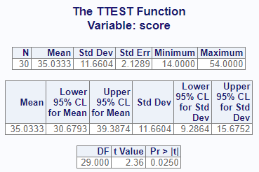

```{r}
#| label: setup
#| include: false
knitr::opts_chunk$set(echo = TRUE)
```

The One Sample t-test is used to compare a single sample against an expected hypothesis value. In the One Sample t-test, the mean of the sample is compared against the hypothesis value. In R, a One Sample t-test can be performed using the Base R `t.test()` from the **stats** package or the `proc_ttest()` function from the **procs** package.

### Data Used

The following data was used in this example.

```{r}
#| eval: true
#| echo: true
# Create sample data
read <- tibble::tribble(
  ~score, ~count,
  40, 2,   47, 2,   52, 2,   26, 1,   19, 2,
  25, 2,   35, 4,   39, 1,   26, 1,   48, 1,
  14, 2,   22, 1,   42, 1,   34, 2 ,  33, 2,
  18, 1,   15, 1,   29, 1,   41, 2,   44, 1,
  51, 1,   43, 1,   27, 2,   46, 2,   28, 1,
  49, 1,   31, 1,   28, 1,   54, 1,   45, 1
)
```

## Normal Data {#normal}

By default, the R one sample t-test functions assume normality in the data and use a classic Student's t-test.

### Base R

#### Code

The following code was used to test the comparison in Base R. Note that the baseline null hypothesis goes in the "mu" parameter.

```{r}
#| eval: true
#| echo: true

# Perform t-test
stats::t.test(read$score, mu = 30)
```

### Procs Package

#### Code

The following code from the **procs** package was used to perform a one sample t-test. Note that the null hypothesis value goes in the "options" parameter.

```{r}
#| eval: true
#| echo: true
#| message: false
#| warning: false
library(procs)

# Perform t-test
procs::proc_ttest(read, var = score, options = c("h0" = 30))
```

Viewer Output:

```{r}
#| echo: false
#| fig-align: center
#| out-width: 50%

```

## Lognormal Data {#lognormal}

The Base R `t.test()` function does not have an option for lognormal data. Likewise, the **procs** `proc_ttest()` function also does not have an option for lognormal data.

Although Base R `t.test()` does not include a lognormal option, lognormal data can be analyzed by applying a natural log transformation to the data, performing the t-test on the log-transformed data, and exponentiating the resulting mean and confidence limits. The back-transformed mean is interpreted as the geometric mean. The standard deviation is not back-transformed.

The following example applies a natural log transformation, performs the one sample t-test on the log-transformed data, and exponentiates the mean and confidence limits.

```{r}
#| eval: true
#| echo: true

# Apply natural log transformation to the sample data
log_score <- log(read$score)

# Perform one-sample t-test on the log-transformed data
tt <- stats::t.test(log_score, mu = log(30))

# Back-transform the geometric mean
exp(mean(log_score))

# Back-transform the confidence limits
exp(tt$conf.int)

# Display p-value
tt$p.value
```

::: {.callout-note collapse="true" title="Session Info"}
```{r}
#| echo: false
#| label: session info
sessioninfo::session_info(   
  pkgs = c("tibble","procs","stats", "knitr"),   
  dependencies = FALSE 
  ) 
```
:::
