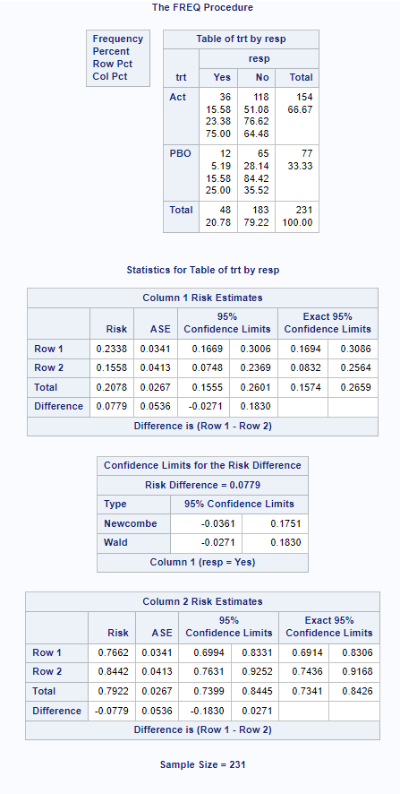
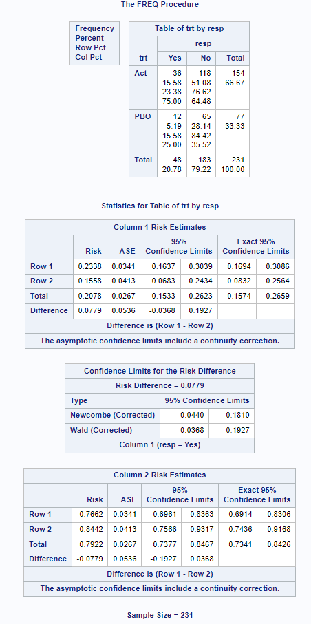

## Introduction

This page covers confidence intervals for comparisons of two independent proportions in SAS, including the contrast parameters for risk difference (RD) $\theta_{RD} = p_1 - p_2$, relative risk (RR) $\theta_{RR} = p_1 / p_2$, and odds ratio (OR) $\theta_{OR} = p_1(1-p_2) / (p_2(1-p_1))$.

See the [summary page](../method_summary/ci_for_prop_intro.html) for general introductory information on confidence intervals for proportions, including the principles underlying the most common methods.

Caution is required if there are no responders (or all responders) in both groups, which might happen in a subgroup analysis for example. PROC FREQ (as of v9.4) does not output any confidence intervals in this case, when valid CIs can (and should) be reported for the RD contrast, since the dataset provides an estimate of zero for RD (and the confidence in the estimate is proportional to the sample size). Similarly, if $\hat p_1 = \hat p_2 = 1$ then an estimate and confidence interval can be obtained for RR, but not from PROC FREQ.

## Data used

The adcibc data stored [here](../data/adcibc.csv) was used in this example, creating a binary treatment variable `trt` taking the values of `Act` or `PBO` and a binary response variable `resp` taking the values of `Yes` or `No`. For this example, a response is defined as a score greater than 4.

```{sas}
#| eval: false
proc import datafile = 'data/adcibc.csv'
    out = adcibc
    dbms = csv
    replace;
    getnames = yes;
    guessingrows = max;
run;

data adcibc2 (keep=trt resp) ;
    set adcibc;     
    if aval gt 4 then resp="Yes";
    else resp="No";     
    if trtp="Placebo" then trt="PBO";
    else trt="Act"; 
run;
 
* Sort to ensure that the outcome of interest ("Yes" in this example) is first;
* when using default COLUMN=1 option in the TABLES statement;
proc sort data=adcibc2; 
by trt descending resp; 
run;  
```

The below shows that for the Active Treatment, there are 36 responders out of 154 subjects, p1 = 0.2338 (23.38% responders), while for the placebo treatment p2 = 12/77 = 0.1558, giving a risk difference of 0.0779, relative risk 1.50, and odds ratio 1.6525.

```{sas}
#| eval: false 
proc freq data=adcibc2;
    table trt*resp/ nopct nocol;
run;
```

```{r}
#| echo: false
#| fig-align: center
#| out-width: 50%
knitr::include_graphics("../images/ci_for_prop/2by2crosstab.png")
```

## Methods for Calculating Confidence Intervals for Proportion Difference from 2 independent samples

This [paper](https://www.lexjansen.com/wuss/2016/127_Final_Paper_PDF.pdf) describes many methods for the calculation of confidence intervals for 2 independent proportions. The 2-sided and 1-sided performance of many of the same methods have been compared graphically[@laud2014]. According to a recent paper[@bai2021], the most commonly reported method in non-inferiority clinical trials for antibiotics is the Wald asymptotic normal approximation (despite its well-documented poor performance), followed by the Miettinen-Nurminen (asymptotic score) method. More recently, an improved variant of the Miettinen-Nurminen method (SCAS) was developed, by including a skewness correction designed to optimise the performance in terms of one-sided coverage for NI testing. SCAS corrects the slightly asymmetrical coverage of the Miettinen-Nurminen interval (note the skewness is more pronounced when analysing the RR contrast).

SAS PROC FREQ is able to calculate CIs using the following methods: Agresti/Caffo (AC), Miettinen and Nurminen (MN or SCORE), Mee (MN(Mee)), Newcombe Hybrid Score, and Wald. For conservative coverage, there is the 'Exact' method, or continuity-adjusted versions of the Wald and Newcombe methods, and also the Hauck-Anderson (HA) continuity-adjustment. Example code is shown below.

The SCAS method is not available in PROC FREQ, but can be produced using a SAS macro (%SCORECI) which can be downloaded from <https://github.com/petelaud/ratesci-sas>.

```{sas}
#| eval: false 
*** Wald, Wilson, Agresti/Caffo, Hauck-Anderson, and Miettinen and Nurminen methods; 
proc freq data=adcibc2 order=data;     
   table trt*resp /riskdiff(CL=(wald newcombe ac mn); 
run;  

*** Mee score method;
proc freq data=adcibc2 order=data;     
   table trt*resp /riskdiff(CL=(mn(mee)); 
run;  

*** exact (Chan-Zhang) and continuity-adjusted methods for conservative coverage; 
proc freq data=adcibc2 order=data;
   exact riskdiff (method=noscore);     
   table trt*resp/riskdiff(CL=(exact ha wald(correct) newcombe(correct)));  
run;

*** exact (Santner-Snell) method; 
proc freq data=adcibc2 order=data;
   exact riskdiff (method=noscore);     
   table trt*resp/riskdiff(CL=exact);  
run;

*** 2-sided exact (Agresti-Min) method; 
proc freq data=adcibc2 order=data;
   exact riskdiff (method=score2);     
   table trt*resp/riskdiff(CL=exact);  
run;

*** MN and SCAS methods from %SCORECI macro;
proc tabulate data=adcibc2 out=tab2;
 class trt resp;
 table (resp all),trt;
run;

data ds(keep = n1 n0 e1 e0);
 set tab2;
 by _page_;
 retain n1 n0 e1 e0;
 if trt = "ACT" then do;
  if _type_ = "11" then e1 = n;
  if _type_ = "10" then n1 = n;
 end;
 else if trt = "PBO" then do;
  if _type_ = "11" then e0 = n;
  if _type_ = "10" then n0 = n;
 end;
 if last._page_ then output;
run;

*** Miettinen-Nurminen CI;
%scoreci(ds, skew=FALSE);

*** SCAS CI;
%scoreci(ds);

```

### Normal Approximation Method (Also known as the Wald or asymptotic CI Method)

The difference between two independent sample proportions is calculated as: $\hat \theta_{RD} = \hat p_1 - \hat p_2 = x_1 / n_1 - x_2 / n_2$

The Wald CI for $\theta_{RD}$ is calculated using:

$\hat \theta_{RD} \pm z_{\alpha/2} \times SE(\hat \theta_{RD})$,

where $SE (\hat \theta_{RD}) = \sqrt{( \frac{\hat p_1 (1-\hat p_1)}{n_1} + \frac{\hat p_2 (1-\hat p_2)}{n_2})}$

With continuity correction, the equation becomes

$\hat \theta_{RD} \pm (CC + z_{\alpha/2} \times SE(\hat \theta_{RD}))$,

where $CC = \frac{1}{2} (\frac{1}{n_1} + \frac{1}{n_2})$

### Newcombe Method (Also known as the Hybrid Score method, Square-and-Add, or the Method of Variance Estimates Recovery (MOVER) )

Derive the confidence intervals for the separate proportions in each group, $p_1$ and $p_2$, using the Wilson Score Method equations as described [here](ci_for_prop.html).

Let $l_1$ = Lower CI for sample 1, and $u_1$ be the upper CI for sample 1.

Let $l_2$ = Lower CI for sample 2, and $u_2$ be the upper CI for sample 2.

Let D = $\hat p_1 - \hat p_2$ (the difference between the observed proportions)

The CI for $\theta_{RD}$ the difference between two proportions is: $$ D - sqrt((\hat p_1 - l_1)^2+(u_2 - \hat p_2)^2) \quad, \quad D + sqrt((\hat p_2 - l_2)^2 + (u_1 - \hat p_1)^2 )   $$

Note that earlier versions of SAS PROC FREQ (before implementation of the MN method) allowed the option CL=WILSON or CL=SCORE to produce this method, but it is not really a score method. As of SAS/STAT 15.4, the CL=WILSON option (undocumented) still gives the Newcombe interval, but CL=SCORE gives the Miettinen-Nurminen score method.

### Miettinen-Nurminen, Mee and other Asymptotic Score Methods

These truly are score methods, as they are based on an extension of the score methodology applied to two independent proportions, using the contrast function $S(\theta) = \hat p_1 - \hat p_2 - \theta$, which for any given value of $\theta$ has expectation zero, and variance $\{\tilde p_1 (1 - \tilde p_1)/n_1 + \tilde p_2 (1 - \tilde p_2)/n_2\} \times N/(N+1)$ where $N = n_1 + n_2$.

The Mee variant of the method omits the $N/(N-1)$ variance bias correction factor.

Gart and Nam derived a similar method, arrived at from a different underlying 'efficient score' methodology, so the formulae look different but are essentially equivalent to the Mee interval. They added a correction for skewness to improve one-sided coverage. The skewness correction was applied to the Miettinen-Nurminen formula for all contrast parameters by Laud, to give the SCAS method[@laud2017]. The SCAS method is available for SAS via the %SCORECI macro.

### Agresti-Caffo Method

Similar to the Agresti-Coull method for a single proportion, the Agresti-Caffo interval is designed to be an easily taught method to enable the CI to be calculated by hand. The formula involves simply adding one success and one failure to each sample, and then using the Wald formula.

### 'Exact' Methods

The current default 'exact' method produced by PROC FREQ is the Chan-Zhang variant. This is undoubtedly an improvement on the extremely over-conservative Santner-Snell method, but is more computationally intensive, and can result in a Warning in the SAS log about long computation times.

The third alternative 'exact' method by Agresti & Min is less conservative, but is only guaranteed to achieve strictly conservative two-sided coverage, so is not appropriate for use in one-sided hypothesis testing.

## Methods for Calculating Confidence Intervals for Relative Risk from 2 independent samples

SAS PROC FREQ is able to calculate CIs using the following methods: Miettinen-Nurminen (SCORE), Exact, Likelihood Ratio (LR), Wald, Haldane Modified Wald. The SCAS method (which addresses asymmetric one-sided coverage of the MN method which is particularly pronounced for RR) is not available in PROC FREQ, but is in the SAS macro %SCORECI.

## Methods for Calculating Confidence Intervals for Odds Ratio from 2 independent samples

SAS PROC FREQ is able to calculate CIs using the following methods: Miettinen-Nurminen (SCORE), Exact, Likelihood Ratio (LR), mid-P (MIDP), Wald, Haldane Modified Wald. The SCAS method is not available in PROC FREQ, but is in the SAS macro %SCORECI.

### 

## Continuity Adjusted Methods

SAS provides an option (CORRECT) to apply continuity adjustment to the Wald or Newcombe methods for more conservative coverage. The Hauck-Anderson (HA) method for RD is a slightly less conservative variation of a continuity adjustment. Note however that all of these methods fail to achieve strictly conservative coverage, although the adjusted Newcombe method comes close[@laud2014].

It is important to note that the CORRECT sub-option for the MN/Score method serves an entirely different purpose. The Miettinen-Nurminen method is **not** a 'continuity-corrected' version of the Mee interval. Rather, the CORRECT=NO option removes the variance bias correction factor N/(N-1) from the Miettinen-Nurminen formula in order to produce the Mee version of the score method for RD (and an equivalent un-corrected score method for RR and OR).

No continuity adjustment is currently available for the score methods in SAS. A 'sliding scale' adjustment has been described[@laud2014] and implemented in the ratesci package for R, but not yet added to the %SCORECI macro.

## Consistency with Hypothesis Tests

Within SAS PROC FREQ for the asymptotic methods for RD, consistency with a traditional Chi-squared test for superiority (Karl Pearson version as produced by PROC FREQ), and the Farrington-Manning test for non-inferiority, is provided by the Mee CI (CL=SCORE(CORRECT=MEE)), which is similar to MN but omitting the N/(N-1) correction factor. Note that the MN method (including the correction factor) is consistent with the Egon Pearson 'N-1' version of the chi-squared test. SAS PROC FREQ does not produce that, nor does it offer the option to include the 'N-1' adjustment when requesting a non-inferiority test with the NONINF option. Consequently, there is a risk of contradictory results if using PROC FREQ to obtain a MN CI with a corresponding non-inferiority test.

For example...

For the SCAS method, the macro provides the p-value for a specified NI margin, with guaranteed consistency with the CI.

If an EXACT statement is used...

## Example Code using PROC FREQ

It is important to check the output to ensure that you are modelling Active - Placebo, and response = Yes (not Response=No). By default SAS sorts alphabetically and calculates CI's for the first column. You can change this by using the `COLUMN= Option` on riskdiff or by sorting the dataset (here by trt, then descending resp), and then using `order=data` in the proc freq. This tells SAS to use the order you have sorted the data by. SAS confirms this by saying "Difference is (Row 1 - Row 2)" and "Column 1 (resp=Yes)". Note how in the SAS output, it calls the requested 'wilson' method 'Newcombe' in the output.

Options for riskdiff(CL=XXX) consist of AC: Agresti-Caffo, EXACT: exact, HA: Hauck-Anderson, MN or SCORE: Miettinen-Nurminen (another type of Score CI), SCORE(CORRECT=MEE): Mee (Score CI omitting variance bias correction), WILSON or NEWCOMBE: Newcombe hybrid score method described above, and WALD: normal approximation Wald method described above. Examples using Wald and Wilson are shown below with and without continuity correction.

```{sas}
#| eval: false 
proc sort data=adcibc2; 
by  trt descending resp; 
run;  

# without continuity correction 
proc freq data=adcibc2 order=data; 
table trt*resp/riskdiff(CL=(wald wilson)); 
run;  

# with continuity correction 
proc freq data=adcibc2 order=data;
table trt*resp/riskdiff(CORRECT CL=(wald wilson));
run;
```

```{r}
#| echo: false  
#| fig-align: center  
#| out-width: 50%  
 
```

```{r}
#| echo: false
#| fig-align: center 
#| out-width: 50% 

```

## References
