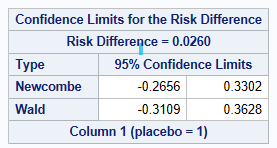

## Introduction

\[See separate page for general introductory information on confidence intervals for proportions.\]

## Data used

The adcibc data stored [here](../data/adcibc.csv) was used in this example, creating a binary treatment variable `trt` taking the values of `Act` or `PBO` and a binary response variable `resp` taking the values of `Yes` or `No`. For this example, a response is defined as a score greater than 4.

```{sas}
#| eval: false
data adcibc2 (keep=trt resp) ;
    set adcibc;     
    if aval gt 4 then resp="Yes";
    else resp="No";     
    if trtp="Placebo" then trt="PBO";
    else trt="Act"; 
run;
```

The below shows that for the Active Treatment, there are 36 responders out of 154 subjects = 0.2338 (23.38% responders).

```{sas}
#| eval: false 
proc freq data=adcibc2;
    table trt*resp/ nopct nocol;
run;
```

```{r}
#| echo: false
#| fig-align: center
#| out-width: 50%
knitr::include_graphics("../images/ci_for_prop/2by2crosstab.png")
```

## Methods for Calculating Confidence Intervals for Proportion Difference from matched pairs

You may experience paired data in any of the following types of situation:

-   Tumour assesssments classified as Progressive Disease or Not Progressive Disease performed by an Investigator and separately by an independent panel.

-   A paired case-control study (each subject taking active treatment is matched to a patient taking control)

-   A cross-over trial where the same subjects take both medications

In all these cases, the calculated proportions for the 2 groups are not independent.

Using a cross over study as our example, a 2 x 2 table can be formed as follows:

+-----------------------+---------------+---------------+--------------+
|                       | Placebo\      | Placebo\      | Total        |
|                       | Response= Yes | Response = No |              |
+=======================+===============+===============+==============+
| Active Response = Yes | r             | s             | r+s          |
+-----------------------+---------------+---------------+--------------+
| Active Response = No  | t             | u             | t+u          |
+-----------------------+---------------+---------------+--------------+
| Total                 | r+t           | s+u           | N = r+s+t+u  |
+-----------------------+---------------+---------------+--------------+

The proportions of subjects responding on each treatment are:

Active: $\hat p_1 = (r+s)/n$ and Placebo: $\hat p_2= (r+t)/n$

Difference between the proportions for each treatment are: $D=p1-p2=(s-t)/n$

Suppose :

+-----------------------+---------------+---------------+------------------+
|                       | Placebo\      | Placebo\      | Total            |
|                       | Response= Yes | Response = No |                  |
+=======================+===============+===============+==================+
| Active Response = Yes | r = 20        | s = 15        | r+s = 35         |
+-----------------------+---------------+---------------+------------------+
| Active Response = No  | t = 6         | u = 5         | t+u = 11         |
+-----------------------+---------------+---------------+------------------+
| Total                 | r+t = 26      | s+u = 20      | N = r+s+t+u = 46 |
+-----------------------+---------------+---------------+------------------+

### Normal Approximation Method (Also known as the Wald or asymptotic CI Method)

In large random samples from independent trials, the sampling distribution of the difference between two proportions approximately follows the normal distribution. Hence the SE for the difference and 95% confidence interval can be calculated using the following equations.

$SE(D)=\frac{1}{n} * sqrt(s+t-\frac{(s-t)^2}{n})$

$D-z_\alpha * SE(D)$ to $D+z_\alpha * SE(D)$

where $z_\alpha$ is the $1-\alpha/2$ quantile of a standard normal distribution corresponding to level $\alpha$,

D=(15-6) /46 = 0.196

SE(D) = 1/ 46 \* sqrt (15+6- (((15+6)\^2)/46) ) = 0.0956

Lower CI= 0.196 - 1.96 \*0.0956 = 0.009108

Upper CI = 0.196 + 1.96 \* 0.0956 = 0.382892

### Wilson Method (Also known as the Score method or the Altman, Newcombe method^7^ )

Derive the confidence intervals using the Wilson Method equations above for each of the individual single samples 1 and 2.

Let l1 = Lower CI for sample 1, and u1 be the upper CI for sample 1.

Let l2 = Lower CI for sample 2, and u2 be the upper CI for sample 2.

We then define $\phi$ which is used to correct for $\hat p_1$ and $\hat p_2$ not being independent. As the samples are related, $\phi$ is usually positive and thus makes the confidence interval smaller (narrower).

If any of r+s, t+u, r+t, s+u are zero, then set $\phi$ to be 0.

Otherwise we calculate A, B and C, and $\phi=C / sqrt A$

In the above: $A=(r+s)(t+u)(r+t)(s+u)$ and $B=(ru-st)$

To calculate C follow the table below. n=sample size.

| Condition of B            | Set C equal to |
|---------------------------|----------------|
| If B is greater than n/2  | B - n/2        |
| If B is between 0 and n/2 | 0              |
| If B is less than 0       | B              |

Let D = p1-p2 (the difference between the observed proportions of responders)

The Confidence interval for the difference between two population proportions is: $D - sqrt((p_1-l_1)^2-2\phi(p_1-l_1)(u_2-p_2)+(u_2-p_2)^2 )$ to

$D + sqrt((p_2-l_2)^2-2\phi(p_2-l_2)(u_1-p_1)+(u_1-p_1)^2 )$

First using the Wilson Method equations for each of the individual single samples 1 and 2.

|          | Active     | Placebo    |
|----------|------------|------------|
| a        | 73.842     | 55.842     |
| b        | 13.728     | 11.974     |
| c        | 99.683     | 99.683     |
| Lower CI | 0.603 = L1 | 0.440 = L2 |
| Upper CI | 0.878 = U1 | 0.680 = U2 |

$A=(r+s)(t+u)(r+t)(s+u)$ = 9450000

B=10

C= 0 (as B is between 0 and n/2)

$\phi$ = 0.

Hence the middle part of the equation simplies to 0, and becomes simply:

Lower CI = $D - sqrt((p_1-l_1)^2+(u_2-p_2)^2 )$ = 0.196 - sqrt \[ (0.761-0.603)\^2 + (0.680-0.565) \^2 \]

Upper CI = $D + sqrt((p_2-l_2)^2+(u_1-p_1)^2 )$ = 0.196 + sqrt \[ (0.565-0.440)\^2 + (0.878-0.761) \^2 \]

CI= 0.00032 to 0.367389

## Example Code using PROC FREQ

Unfortunately, SAS does not have a procedure which outputs the confidence intervals for matched proportions. A macro is available at \[\] which provides the asymptotic score method by Tango, and a skewness corrected version (paper under review).

Instead it calculates the risk difference = (r / (r+s) - t / (t+u) )

Which in the example above is: 20/ (20+15) - 6 / (6+5) = 0.0296

This is more applicable when you have exposed / non-exposed groups looking at who has experienced the outcome. SAS Proc Freq has 3 methods for analysis of paired data using a Common risk difference.

The default method is Mantel-Haenszel confidence limits. SAS can also Score (Miettinen-Nurminen) CIs and Stratified Newcombe CIs (constructed from stratified Wilson Score CIs). See [here](https://support.sas.com/documentation/cdl/en/procstat/67528/HTML/default/viewer.htm#procstat_freq_details63.htm) for equations.

As you can see below, this is not a CI for difference in proportions of 0.196, it is a CI for the risk difference of 0.0260. So must be interpreted with much consideration.

```{sas}
#| eval: false 
data dat_used;
    input ID$ PBO ACT @@;
    datalines;
  001 0 0   002 0 0   003 0 0   004 0 0   005 0 0
  006 1 0   007 1 0   008 1 0   009 1 0   010 1 0
  011 1 0   012 0 1   013 0 1   014 0 1   015 0 1
  016 0 1   017 0 1   018 0 1   019 0 1   020 0 1
  021 0 1   022 0 1   023 0 1   024 0 1   025 0 1
  026 0 1   027 1 1   028 1 1   029 1 1   030 1 1
  031 1 1   032 1 1   033 1 1   034 1 1   035 1 1
  036 1 1   037 1 1   038 1 1   039 1 1   040 1 1
  041 1 1   042 1 1   043 1 1   044 1 1   045 1 1
  046 1 1
    ;
run;

proc freq data=dat_used; 
    table ACT*PBO/commonriskdiff(cl=MH); 
run;
```

```{r}
#| echo: false
#| fig-align: center
#| out-width: 50%

```

## Reference

1.  [SAS PROC FREQ here](https://support.sas.com/documentation/cdl/en/procstat/63104/HTML/default/viewer.htm#procstat_freq_sect010.htm) and [here](https://support.sas.com/documentation/cdl/en/statug/63347/HTML/default/viewer.htm#statug_freq_sect028.htm)

2.  [Five Confidence Intervals for Proportions That You Should Know about](https://towardsdatascience.com/five-confidence-intervals-for-proportions-that-you-should-know-about-7ff5484c024f)

3.  [Confidence intervals for Binomial Proportion Using SAS](https://www.lexjansen.com/sesug/2015/103_Final_PDF.pdf)

4.  Brown LD, Cai TT, DasGupta A (2001). "Interval estimation for a binomial proportion", Statistical Science 16(2):101-133

5.  Newcombe RG (1998). "Two-sided confidence intervals for the single proportion: comparison of seven methods", Statistics in Medicine 17(8):857-872

6.  Clopper,C.J.,and Pearson,E.S.(1934),"The Use of Confidence or Fiducial Limits Illustrated in the Case of the Binomial", Biometrika 26, 404--413.

7.  D. Altman, D. Machin, T. Bryant, M. Gardner (eds). Statistics with Confidence: Confidence Intervals and Statistical Guidelines, 2nd edition. John Wiley and Sons 2000.

8.  Laud PJ (2017) Equal-tailed confidence intervals for comparison of rates. Pharmaceutical Statistics 16: 334-348

9.  Laud PJ (2018) Corrigendum: Equal-tailed confidence intervals for comparison of rates. Pharmaceutical Statistics 17: 290-293

10. Blaker, H. (2000). Confidence curves and improved exact confidence intervals for discrete distributions, Canadian Journal of Statistics 28 (4), 783--798

11. Klaschka, J. and Reiczigel, J. (2021). "On matching confidence intervals and tests for some discrete distributions: Methodological and computational aspects," Computational Statistics, 36, 1775--1790.

12. <https://www.lexjansen.com/wuss/2016/127_Final_Paper_PDF.pdf>
