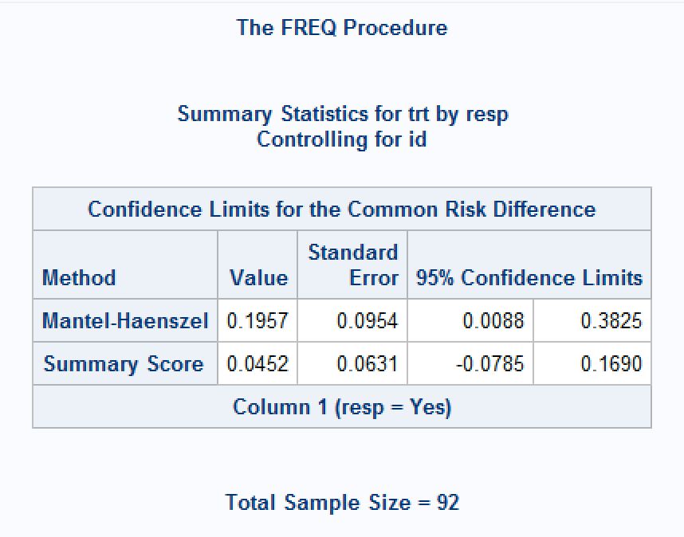

# Introduction

This page covers confidence intervals for comparisons of two paired proportions in SAS. Note that PROC FREQ will give a McNemar test for such an analysis (via the `AGREE` option), but with no corresponding confidence interval. Some methods are described below to facilitate computing them programmatically. A SAS macro (`%PAIRBINCI`) can be downloaded from <https://github.com/petelaud/ratesci-sas> to obtain the Asymptotic Score methods, which have superior coverage properties.

Analysis may be based on the risk difference (RD) contrast $\theta_{RD} = p_1 - p_2$ or relative risk (RR) $\theta_{RR} = p_1 / p_2$. In the context of paired data, and of particular interest for case-control studies, the odds ratio (OR) is estimated conditional on the number of discordant pairs, calculated as $\theta_{OR} = p_{12} / p_{21}$, resulting in confidence intervals that are simple transformations of a CI for a single proportion.

See the [summary page](../method_summary/ci_for_prop_intro.html) for general introductory information on confidence intervals for proportions, including the principles underlying the most common methods.

You may experience paired data in any of the following types of situation:

- Tumour assesssments classified as Progressive Disease or Not Progressive Disease performed by an Investigator and separately by an independent panel.

- A paired case-control study (each subject taking active treatment is matched to a patient taking control)

- A cross-over trial where the same subjects take both medications

In all these cases, the calculated proportions for the 2 groups are not independent.

Using a cross-over study as our example, a 2 x 2 table can be formed as follows:

+-----------------------+---------------+---------------+---------------+
|                       | Placebo\      | Placebo\      | Total         |
|                       | Response= Yes | Response = No |               |
+=======================+===============+===============+===============+
| Active Response = Yes | r             | s             | r+s           |
+-----------------------+---------------+---------------+---------------+
| Active Response = No  | t             | u             | t+u           |
+-----------------------+---------------+---------------+---------------+
| Total                 | r+t           | s+u           | N = r+s+t+u   |
+-----------------------+---------------+---------------+---------------+

The table below indicates the proportions that are estimated from the data (note the difference in structure compared to the usual 2x2 table for independent proportions).

+-----------------------+---------------+---------------+---------------+
|                       | Placebo\      | Placebo\      | Total         |
|                       | Response= Yes | Response = No |               |
+=======================+===============+===============+===============+
| Active Response = Yes | $p_{11}$      | $p_{12}$      | $p_1$         |
+-----------------------+---------------+---------------+---------------+
| Active Response = No  | $p_{21}$      | $p_{22}$      | $(1-p_1)$     |
+-----------------------+---------------+---------------+---------------+
| Total                 | $p_2$         | $(1-p_2)$     |               |
+-----------------------+---------------+---------------+---------------+

The proportions of subjects responding on each treatment are:

Active: $\hat p_1 = (r+s)/N$ and Placebo: $\hat p_2= (r+t)/N$

The estimated difference between the proportions for each treatment is: $D=\hat p_1 - \hat p_2 = (s-t)/N$

The estimated relative risk is $(r+s)/(r+t)$.

The estimated conditional odds ratio is $s/t$.

# Data used

Worked examples below use the following artificial dataset:

+-----------------------+---------------+---------------+---------------+
|                       | Placebo\      | Placebo\      | Total         |
|                       | Response= Yes | Response = No |               |
+=======================+===============+===============+===============+
| Active Response = Yes | r = 20        | s = 15        | r+s = 35      |
+-----------------------+---------------+---------------+---------------+
| Active Response = No  | t = 6         | u = 5         | t+u = 11      |
+-----------------------+---------------+---------------+---------------+
| Total                 | r+t = 26      | s+u = 20      | N = 46        |
+-----------------------+---------------+---------------+---------------+

# Methods for Calculating Confidence Intervals for Proportion Difference from matched pairs

## Normal Approximation Method (Also known as the Wald Method)

In large random samples from paired data, the sampling distribution of the difference between two proportions is assumed to follow the normal distribution. The estimated SE for the difference and 95% confidence interval can be calculated using the following equations.

$SE(D)=\frac{1}{N} \times \sqrt{(s+t-\frac{(s-t)^2}{N})} = \sqrt{\frac{1}{N}(\hat p_{12} + \hat p_{21} - (\hat p_{12} - \hat p_{21})^2)}$

$D-z_{\alpha/2} \times SE(D)$ to $D+z_{\alpha/2} \times SE(D)$

So, for the example dataset,

D = (15-6) /46 = 0.196

SE(D) = 1/ 46 \* sqrt (15+6- (((15-6)\^2)/46) ) = 0.09535

Lower CI= 0.196 - 1.96 \*0.0954 = 0.008764

Upper CI = 0.196 + 1.96 \* 0.0954 = 0.382541

Like other Wald methods, this approach has been found to perform poorly, failing to achieve the nominal confidence level[@newcombe1998][@fagerland2014]. An adjustment was suggested by Bonett & Price (2012), using $N'=N+2$ instead of $N$, and $\tilde p_{12} = (s+1)/N'$ and $\tilde p_{21} = (r+1)/N'$, instead of $\hat p_{12}$ and $\hat p_{21}$. This adjustment produces an interval of (-0.001006, 0.376006) for the example dataset. An alternative adjustment by Agrest & Min (2005) instead adds 0.5 to each cell (i.e. $\tilde p_{12} = (s+0.5)/N'$ and $\tilde p_{21} = (r+0.5)/N'$), giving the CI as (0.00347, 0.37153).

## Newcombe Method (Also known as the Hybrid Score method, Square-and-Add, or the Method of Variance Estimates Recovery (MOVER) )

Note that Newcombe described this as a 'Score' method in his 1998 paper, but his later work labelled it as 'Square-and-add' - it is not really a score method, but a hybrid method obtained by combining Wilson Score intervals calculated separately for the two proportions.

Derive the confidence intervals for each of the individual single samples 1 and 2, using the Wilson Method equations as described [here](ci_for_prop.html).

Let $l_1$ = Lower CI for sample 1, and $u_1$ be the upper CI for sample 1.

Let $l_2$ = Lower CI for sample 2, and $u_2$ be the upper CI for sample 2.

We then define $\phi$ which is an estimate of the correlation coefficient, used to correct for $\hat p_1$ and $\hat p_2$ not being independent. As the samples are related, $\phi$ is usually positive and thus makes the confidence interval smaller (narrower).

If any of r+s, t+u, r+t, s+u are zero, then set $\phi$ to be 0.

Otherwise we calculate $A=(r+s)(t+u)(r+t)(s+u)$ and $B=(ru-st)$

Then the correlation coefficient $\phi=C / \sqrt A$, where $C$ is adjusted (as proposed by Newcombe) as follows:

| Condition of B            | Set C equal to |
|---------------------------|----------------|
| If B is greater than N/2  | B - N/2        |
| If B is between 0 and N/2 | 0              |
| If B is less than 0       | B              |

Let $D = \hat p_1 - \hat p_2$ (the difference between the observed proportions of responders)

The CI for the paired difference between the proportions is: $D - \sqrt{((\hat p_1 - l_1)^2 - 2\phi(\hat p_1 - l_1)(u_2 - \hat p_2) + (u_2 - \hat p_2)^2 )}$ to

$D + \sqrt{((\hat p_2 - l_2)^2 - 2\phi(\hat p_2 - l_2)(u_1 - \hat p_1) + (u_1 - \hat p_1)^2 )}$

First using the Wilson Method equations for each of the individual single samples 1 and 2.

|          | Active        | Placebo       |
|----------|---------------|---------------|
| a        | 73.842        | 55.842        |
| b        | 11.974        | 13.728        |
| c        | 99.683        | 99.683        |
| Lower CI | 0.621 = $l_1$ | 0.422 = $l_2$ |
| Upper CI | 0.861 = $u_1$ | 0.698 = $u_2$ |

$A=(r+s)(t+u)(r+t)(s+u)$ = 9450000

B = 10

C = 0 (as B is between 0 and N/2)

$\phi$ = 0.

Hence the middle part of the equation simplifies to 0, and therefore in this case the interval is the same as the MOVER interval for independent proportions:

Lower CI = $D - \sqrt{((\hat p_1 - l_1)^2 + (u_2 - \hat p_2)^2 )}$ = 0.196 - sqrt \[ (0.761-0.621)\^2 + (0.698-0.565) \^2 \]

Upper CI = $D + \sqrt{((\hat p_2 - l_2)^2 + (u_1 - \hat p_1)^2 )}$ = 0.196 + sqrt \[ (0.565-0.422)\^2 + (0.861-0.761) \^2 \]

CI= 0.002602 to 0.369943

Other variants of the MOVER method are possible, and achieve improved coverage properties, by replacing the Wilson method with a more centrally-located interval for the single proportions. For example, using the Jeffreys method gives a CI of (0.003161, 0.373479). Some descriptions of the MOVER method omit Newcombe's adjustment to $\phi$ .

## Asymptotic Score Methods

A genuine score method for paired $\theta_{RD}$, analogous to the Miettinen-Nurminen method for the unpaired difference, was developed in 1998[@tango1998], using the contrast function $S(\theta) = \hat p_1 - \hat p_2 - \theta$, together with its variance (accounting for the correlation) estimated at the constrained maximum likelihood estimates of the cell probabilities for each given value of $\theta$. Generally this is not a method that would be hand-calculated - originally the approach involved an iterative process of evaluating the score function over the range of $\theta$, but closed-form expressions are now available.

A proposed skewness-corrected version (SCASu) and another with an added 'N-1' variance bias correction (SCAS) is currently under review for publication.

The Tango and SCAS methods are available for SAS via the `%PAIRBINCI` macro.

For the example dataset, the Tango CI is (0.000419, 0.377185), the SCASu version is (0.000423, 0.380312), and the SCAS CI is (-0.001869, 0.382194).

# Methods for Calculating Confidence Intervals for Relative Risk from matched pairs

## Normal Approximation Method (Also known as the Wald Method)

The normal approximation for $\theta_{RR}$ involves the logged estimate $ln(\hat \theta_{RR})$ and its SE which is estimated as: $\sqrt{\frac{(s + t)}{(r+s)(r+t)}}$, with the resulting confidence limits being back-transformed to the ratio scale.

$ln(\hat \theta_{RR})$ = ln(35/26) = 0.297

SE = sqrt( 21 / (35\*26) ) = 0.152

Lower CI= exp(0.297 - 1.96 \* 0.152) = 0.99908

Upper CI = exp(0.297 + 1.96 \* 0.152) = 1.81289

## MOVER-R Method (Also known as the Hybrid Score method or Square-and-Add)

Extending the methodology for the Newcombe method for RD, this hybrid method combines CIs for the two single proportions (using either the Wilson or Jeffreys method), together with an estimate of their correlation coefficient.

\[More details & example to be added - not available in SAS\]

MOVER-Wilson CI: (1.003963, 1.84443). MOVER-Jeffreys CI: (1.004783, 1.851871)

## Asymptotic Score Methods

Two score methods have also been developed for paired relative risk, which have been shown to be algebraically equivalent[@nam2002][@tang2003]. A proposed skewness-corrected version (SCASu) and another with an added 'N-1' variance bias correction (SCAS) is currently under review for publication.

These methods are available for SAS via the `%PAIRBINCI` macro. The Tang interval is (1.000639, 1.85982), the SCASu version is (1.00064, 1.867063) and the SCAS CI is (0.997176, 1.874279).

# Methods for Calculating Confidence Intervals for Odds Ratio from matched pairs

Most methods for the paired conditional odds ratio are based on calculating an interval $(L^*, U^*)$ for the single proportion $s/(s+t)$, using any of the methods described [here](ci_for_prop.html), and then transforming it as $(\frac{L^*}{1-L^*}, \frac{U^*}{1-U^*})$. Note that the conditional odds ratio $\theta_{OR} = p_{12} / p_{21} = (\frac{p_{12}/(p_{12} + p_{21})}{1 - p_{12}/(p_{12} + p_{21})})$. Generally, the CIs for $\theta_{OR}$ inherit the properties of the interval method selected for the single proportion.

# Continuity Adjusted Methods

Continuity adjustments can be incorporated into the formulae for most (if not all) of the above methods. These have been implemented for Tango/Tang, SCAS and MOVER methods in the ratesci package for R, but not yet added to the `%PAIRBINCI` macro.

# Consistency with Hypothesis Tests

The Asymptotic Score methods without 'N-1' correction (Tango and SCASu methods for RD, and Tang/Nam-Blackwelder and SCASu methods for RR) are guaranteed to be consistent with the result of the McNemar test. The SCAS method comes with a corresponding test (as yet unpublished), which is a modified version of the McNemar test.

# Example Code using PROC FREQ

As mentioned in the introduction, PROC FREQ does not currently have a procedure which outputs the above confidence intervals for matched proportions\*. A macro (`%PAIRBINCI`) is available [here](https://github.com/petelaud/ratesci-sas){.uri} which provides the asymptotic score method by Tango, and a skewness corrected version (paper under review).

\*Actually that's not strictly true. A SAS Support knowledge base article [here](https://support.sas.com/kb/46/997.html) describes an approach using stratified analysis to obtain a CI for the 'common risk difference', which appears to give the Wald CI. However, this requires data to be structured in a long format, with one row per condition per pair, whereas the corresponding McNemar test of marginal homogeneity requires data structured as one row per pair.

At least three options are given for the stratified common risk difference CI: Mantel-Haenszel (`CL=MH`), 'stratified' Newcombe (`CL=newcombe`) or 'summary score' (`CL=score`) intervals (See [here](https://support.sas.com/documentation/cdl/en/procstat/67528/HTML/default/viewer.htm#procstat_freq_details63.htm) for equations), but some options give unexpected results, or no result at all. For the example data above, the default output gives the MH interval as (0.008764, 0.382541), which matches the Wald method, but the 'summary score' CI is (-0.0785, 0.1690) around a point estimate of 0.0452. These methods would not guarantee agreement with the McNemar test of marginal homogeneity.

There is no equivalent option in PROC FREQ for common relative risks for paired data.

\[Example code to be added for `%PAIRBINCI`\]

``` sas
data dat_used;
    do id = 1 to 20;
      trt = 'ACT'; resp = 'Yes'; output;
      trt = 'PBO'; resp = 'Yes'; output;
  end;
    do id = 21 to 35;
      trt = 'ACT'; resp = 'Yes'; output;
      trt = 'PBO'; resp = 'No'; output;
  end;
    do id = 36 to 41;
      trt = 'ACT'; resp = 'No'; output;
      trt = 'PBO'; resp = 'Yes'; output;
  end;
    do id = 42 to 46;
      trt = 'ACT'; resp = 'No'; output;
      trt = 'PBO'; resp = 'No'; output;
  end;
run;

proc sort data=dat_used;
  by trt descending resp;
run;

proc freq data=dat_used order=data; 
  table id*trt*resp / commonriskdiff noprint; 
run;
```

```{r}
#| echo: false
#| fig-align: center
#| out-width: 50%
 
```

# References
