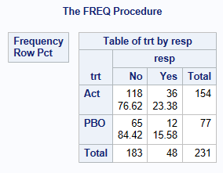
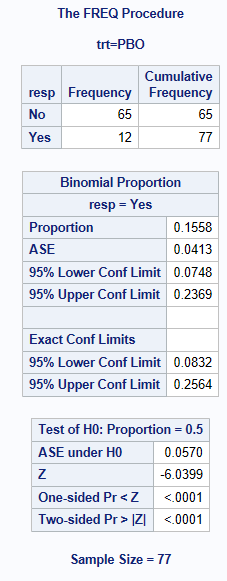
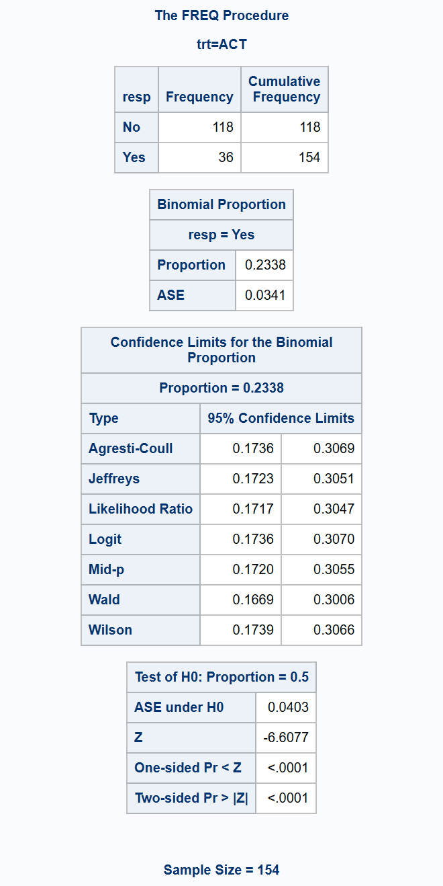
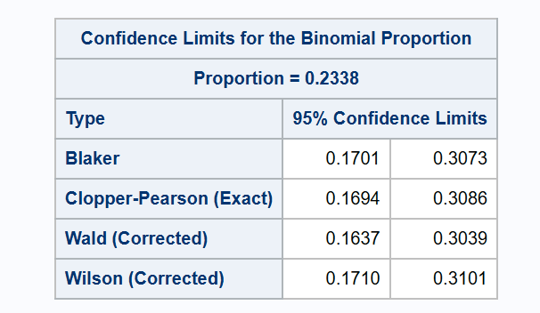

## Introduction

The methods to use for calculating a confidence interval (CI) for a proportion depend on the type of situation you have.

-   1 sample proportion (1 proportion calculated from 1 group of subjects)

-   2 sample proportions and you want a CI for the difference in the 2 proportions (or the ratio, or an odds ratio) e.g. for estimating the magnitude of a treatment effect.

    -   If the 2 samples come from 2 independent samples (different subjects in each of the 2 treatment groups)

    -   If the 2 samples are matched (i.e. the same subject has 2 results, one from each treatment \[paired data\]).

Some sources suggest selecting a different method depending on whether your proportion is close to 0 or 1 (or near to the 0.5 midpoint), and your sample size. Seemingly this advice stems from a preference to use the Wald method when the normal approximation assumptions are adequately satisfied. However, options are available for CI methods that have appropriate coverage properties across the whole parameter space, which with modern computing software are easily obtained, so there is no need for such a data-driven approach to method selection.

## Data used

The adcibc data stored [here](../data/adcibc.csv) was used in this example, creating a binary treatment variable `trt` taking the values of `Act` or `PBO` and a binary response variable `resp` taking the values of `Yes` or `No`. For this example, a response is defined as a score greater than 4.

```{sas}
#| eval: false
data adcibc2 (keep=trt resp) ;
    set adcibc;     
    if aval gt 4 then resp="Yes";
    else resp="No";     
    if trtp="Placebo" then trt="PBO";
    else trt="Act"; 
run;
```

The below shows that for the Actual Treatment, there are 36 responders out of 154 subjects = 0.2338 (23.38% responders).

```{sas}
#| eval: false 
proc freq data=adcibc2;
    table trt*resp/ nopct nocol;
run;
```

```{r}
#| echo: false
#| fig-align: center
#| out-width: 50%

```

## Methods for Calculating Confidence Intervals for a single proportion

Here we are calculating a 95% confidence interval for the proportion of responders in the active treatment group.

SAS PROC FREQ in Version 9.4 can compute 11 methods to calculate CIs for a single proportion, an explanation of most of these methods and the code is shown below. See [BINOMIAL](https://support.sas.com/documentation/cdl/en/procstat/63104/HTML/default/viewer.htm#procstat_freq_sect010.htm)^1^ for more information on SAS parameterization. It is recommended to always sort your data prior to doing a PROC FREQ.

For more information about some of these methods in R & SAS, including which performs better in different scenarios see [Five Confidence Intervals for Proportions That You Should Know about](https://towardsdatascience.com/five-confidence-intervals-for-proportions-that-you-should-know-about-7ff5484c024f)^2^ and [Confidence Intervals for Binomial Proportion Using SAS](https://www.lexjansen.com/sesug/2015/103_Final_PDF.pdf)^3^. Key literature on the subject includes papers by [Brown et al.](https://www.jstor.org/stable/2676784?seq=1)^4^ and [Newcombe](https://pubmed.ncbi.nlm.nih.gov/9595616/)^5^.

### Strictly conservative vs proximate coverage

Because of the discrete nature of binomial data, it is impossible for any CI to cover the true value of the estimated proportion precisely 95% of the time for all values of p. CI methods may be designed to achieve the nominal confidence level **as a minimum**, but many researchers find such a criterion to be excessive, producing CIs that are unnecessarily wide. The alternative position is to aim for coverage probability that is close to the nominal confidence level **on average.** These two opposing positions are described by Newcombe^5^ as "aiming to align either the minimum or the mean coverage with the nominal $(1-\alpha)$", or in other words aiming for coverage to be either "strictly conservative" or "proximate". Many alternative CI methods are designed to meet the latter criterion, but some include an optional adjustment ("continuity correction") to achieve the former.

### Consistency with hypothesis tests

Depending on the analysis plan, it may be desirable for a reported confidence interval to be consistent with the result of a hypothesis test, so that for example the 95% CI will exclude the null hypothesis value if and only if the test p-value is less than 0.05 (or 0.025 one-sided). Within SAS for the asymptotic methods, such consistency is provided by the Wilson CI, because the asymptotic test uses the standard error estimated under the null hypothesis (i.e. the value specified in the `BINOMIAL(P=...)` option of the `TABLES` statement. If an `EXACT BINOMIAL;` statement is used, the resulting test is consistent with the Clopper-Pearson CI. An exact hypothesis test with mid-P adjustment (consistent with the mid-P CI) is available via `EXACT BINOMIAL / MIDP;` but the output only gives the one-sided p-value, so if a 2-sided test is required it needs to be manually calculated by doubling the one-sided mid p-value.

### Clopper-Pearson (Exact or binomial CI) method

With binary endpoint data (response/non-response), we make the assumption that the proportion of responders has been derived from a series of Bernoulli trials. Trials (Subjects) are independent and we have a fixed number of repeated trials with an outcome of respond or not respond. This type of data follows the discrete binomial probability distribution, and the Clopper-Pearson^6^ (Exact) method uses this distribution to calculate the CIs.

This method guarantees strictly conservative coverage, but has been noted to be excessively conservative, as for any given proportion, the actual coverage probability can be much larger than $(1-\alpha)$.

The Clopper-Pearson method is output by SAS as one of the default methods (labelled as "Exact Conf Limits" in the "Proportion" ODS output object), but you can also specify it using `BINOMIAL(LEVEL="Yes" CL=CLOPPERPEARSON);` which creates a separate output object "ProportionCLs".

### Normal Approximation method (Also known as the Wald or asymptotic CI method)

The traditional alternative to the Clopper-Pearson (Exact) method is the asymptotic Normal Approximation (Wald) CI. The poor performance of this method is well documented - it can fail to achieve the nominal confidence level even with large sample sizes, and there is a consensus in the literature that it should be avoided^4, p128^. Nevertheless, it remains a default output component in SAS, so is included here for reference.

In large random samples from independent trials, the sampling distribution of proportions approximately follows the normal distribution. The expectation of a sample proportion is the corresponding population proportion. Therefore, based on a sample of size $n$, a $(1-\alpha)\%$ confidence interval for population proportion can be calculated using the normal approximation as follows:

$p\approx \hat p \pm z_{\alpha/2} \sqrt{\hat p(1-\hat p)/n}$, where $\hat p$ is the sample proportion, $z_{\alpha/2}$ is the $1-\alpha/2$ quantile of a standard normal distribution corresponding to the confidence level $(1-\alpha)$, and $\sqrt{\hat p(1-\hat p)/n}$ is the estimated standard error.

One should note that the approximation can become increasingly unreliable as the proportion of responders gets closer to 0 or 1 (e.g. 0 or 100% responding). In this scenario, common issues consist of:

-   it does not respect the 0 and 1 proportion boundary (so you can get a lower CI of -0.1 or an upper CI of 1.1!)

-   the derived 95% CI may cover the true proportion substantially less than 95% of the time

-   the left and right tail probabilities of the 95% CI are asymmetrical, such that there is generally more (and often substantially more) than 2.5% chance of the interval not covering the true proportion at one end (as observed in Newcombe^5^). Note that symmetrical or "equal-tailed" coverage (or what Newcombe calls "central interval location") has direct relevance to the type 1 error for non-inferiority hypothesis tests, but is also a generally desirable property.

Although these undesirable features become more severe for proportions close to 0 or 1, they also occur more generally for the Wald interval, and any of the alternative methods should be preferred instead.

The Wald method can be derived with or without a Yates "continuity correction". In principle, this correction is intended to approximate the conservative coverage of the Clopper-Pearson method, but it fails to achieve the minimum coverage criterion, and tail probabilities remain imbalanced. (Note that in general, there is some debate over the use of the term "correction" - particularly when applied to other methods, the adjustment produces coverage probabilities that are further away from the nominal confidence level to achieve strictly conservative coverage, which may or may not be more "correct", depending on your point of view.)

The Wald normal approximation method is output by SAS as a default method, but you can also specify it using `BINOMIAL(LEVEL="Yes" CL=WALD);`

The "continuity corrected" version is obtained using `BINOMIAL(LEVEL="Yes" CL=WALD(CORRECT));`

### Wilson method (Also known as the Score method)^7^

The Wilson (Score) method is also based on an asymptotic normal approximation, but uses a score statistic that replaces the estimated variance $\hat V(\hat p)=\hat p(1-\hat p)/n$ with the true variance $V(\hat p)=p(1-p)/n$. The resulting score is then rearranged to a quadratic equation and solved for p for a given $\alpha$. This method resolves many of the issues affecting the Wald method - it avoids boundary violations, and achieves coverage probabilities close to the nominal level (on average). However, it over-corrects the asymmetric coverage of Wald - the location of the Wilson interval is shifted too far towards 0.5.

The method can be derived with or without a Yates continuity correction. The corrected interval closely approximates the coverage of the Clopper-Pearson method, but only in terms of overall two-sided coverage - due to the asymmetric coverage, it does not guarantee that the non-coverage probability is less than $\alpha/2$.

Let p=r/n, where r= number of responses, and n=number of subjects, q=1-p, and z= the appropriate value from standard normal distribution:\
$$ z{_{1-\alpha/2}} $$For example, for 95% confidence intervals, $\alpha=0.05$, using standard normal tables, z in the equations below will take the value =1.96. Calculate 3 quantities

$$ A= 2r+z^2$$

$$ B=z\sqrt(z^2 + 4rq) $$ $$ C=2(n+z^2) $$The method calculates the confidence interval \[Lower, Upper\] as: \[(A-B)/C, (A+B)/C\]

A = 2 \* 36 + 1.96\^2 = 75.8416

B = 1.96 \* sqrt (1.96\^2 + 4 x 36 x 0.7662) = 20.9435

C = 2\* (154+1.96\^2) = 315.6832

Lower interval = A-B/C = 75.8416 - 20.9435 / 315.6832 = 0.17390

Upper interval = A+B/C = 75.8416 + 20.9435 / 315.6832 = 0.30659

CI = 0.17390 to 0.30659

The Wilson (score) method is output by SAS using `BINOMIAL(LEVEL="Yes" CL=Wilson);`

The continuity corrected Wilson method is specified using `BINOMIAL(LEVEL="Yes" CL=WILSON(CORRECT));`

The only differences in the equations to calculate the Wilson score with continuity correction is that the equations for A and B are changed as follows:

$$ A= 2r+z^2 -1$$

$$ B=z\sqrt(z^2 - 2 -\frac{1}{n} + 4rq) $$

### Agresti-Coull method

The Agresti-Coull method is a 'simple solution' designed to improve coverage compared to the Wald method and still perform better (i.e. less conservative) than Clopper-Pearson particularly when the probability isn't in the mid-range (0.5). It is less conservative whilst still having good coverage. The only difference compared to the Wald method is that it adds two successes and two failures to the original observations (increasing the sample by 4 observations). In practice it is not often used *\[Ed: what is the basis for this statement?\]*.

The Agresti-Coull method is output by SAS using `BINOMIAL(LEVEL="Yes" CL=AGRESTICOULL);`

### Jeffreys method

The Jeffreys method is a particular type of Bayesian Highest Probability Density (HPD) method. For binomial proportions, the beta distribution is generally used for the conjugate prior, which consists of two parameters $\alpha$ and $\beta$. Setting $\alpha=\beta=0.5$ is called the Jeffreys prior. This is considered as non-informative for a binomial proportion.

$$
(Beta (^k/_2 + ^1/_{2}, ^{(n-k)}/_2+^1/_2)_{\alpha}, Beta (^k/_2 + ^1/_{2}, ^{(n-k)}/_2+^1/_2)_{1-\alpha})
$$The coverage probabilities of the Jeffreys method are centred around the nominal confidence level on average, with symmetric "equal-tailed" 1-sided coverage^8 Appx S3.5^. This interval is output by SAS using `BINOMIAL(LEVEL="Yes" CL=Jeffreys);`

### Binomial based Mid-P method

The Mid-P method is similar to the Clopper-Pearson method, in the sense that it is based on exact calculations from the binomial probability distribution, but it aims to reduce the conservatism. It's quite a complex method to compute compared to the methods above and rarely used in practice *\[Ed: what source is there for this statement?\]*. However, like the Jeffreys interval, it has excellent 1-sided and 2-sided coverage properties for those seeking to align mean coverage with the nominal confidence level^9^.

The mid-P method is output by SAS using `BINOMIAL(LEVEL="Yes" CL=MIDP);`

### Blaker method^10^

The Blaker method is a less conservative alternative to the Clopper-Pearson exact CI. It derives the CI by inverting the p-value function of a 2-sided exact test, so it achieves strictly conservative 2-sided coverage, but as a result the 1-sided coverage is not strictly conservative.

The Clopper-Pearson CI's are always wider and contain the Blaker CI limits. It's adoption has been limited due to the numerical algorithm taking longer to compute compared to some of the other methods especially when the sample size is large. NOTE: Klaschka and Reiczigel^11^ is yet another adaptation of this method.

The Blaker method is output by SAS using `BINOMIAL(LEVEL="Yes" CL=BLAKER);`

## Example Code using PROC FREQ

By adding the option `BINOMIAL(LEVEL="Yes")` to your 'PROC FREQ', SAS outputs the Normal Approximation (Wald) and Clopper-Pearson (Exact) confidence intervals as two default methods, derived for the `Responders` = `Yes`. If you do not specify the `LEVEL` you want to model, then SAS assumes you want to model the first level that appears in the output (alphabetically).

**It is very important to ensure you are calculating the CI for the correct level! Check your output to confirm, you will see below it states `resp=Yes` !**

Caution is required if there are no responders in a group (aside from any issues with the choice of confidence interval method), as SAS FREQ (as of v9.4) does not output any confidence intervals in this case. If the `LEVEL` option has been specified, an error is produced, otherwise the procedure by default generates CIs for the proportion of non-responders. Note that valid CIs can be obtained for both p = 0/n and p = n/n. If needed, the interval for 0/n can be derived as 1 minus the transposed interval for n/n.

The output consists of the proportion of resp=Yes, the Asymptotic SE, 95% CIs using normal-approximation method, 95% CI using the Clopper-Pearson method (Exact), and then a Binomial test statistic and p-value for the null hypothesis of H0: Proportion = 0.5.

```{sas}
#| eval: false
proc sort data=adcibc2;
    by trt; 
run; 

proc freq data=adcibc2; 
    table resp/ nopct nocol BINOMIAL(LEVEL="Yes");
    by trt;
run;
```

```{r}
#| echo: false
#| fig-align: center
#| out-width: 50%

```

By adding the option `BINOMIAL(LEVEL="Yes" CL=<name of CI method>)`, the other CIs are output as shown below. You can list any number of the available methods within the BINOMIAL option CL=XXXX separated by a space. However, SAS will only calculate the WILSON and WALD or the WILSON(CORRECT) and WALD(CORRECT). SAS won't output them both from the same procedure.

-   `BINOMIAL(LEVEL="Yes" CL=CLOPPERPEARSON WALD WILSON AGRESTICOULL JEFFREYS MIDP LIKELIHOODRATIO LOGIT BLAKER)` will return Agresti-Coull, Blaker, Clopper-Pearson(Exact), Wald(without continuity correction) Wilson(without continuity correction), Jeffreys, Mid-P, Likelihood Ratio, and Logit

-   `BINOMIAL(LEVEL="Yes" CL=ALL);` will return Agresti-Coull, Clopper-Pearson (Exact), Jeffreys, Wald(without continuity correction), Wilson (without continuity correction). *\[If the developers of SAS are reading this, it would seem more natural for Mid-P to be included here instead of Clopper-Pearson!\]*

-   `BINOMIALc(LEVEL="Yes" CL=ALL);`will return Agresti-Coull, Clopper-Pearson (Exact), Jeffreys, Wald (with continuity correction), Wilson(with continuity correction)

-   `BINOMIALc(LEVEL="Yes" CL=WILSON(CORRECT)  WALD(CORRECT));`will return Wilson(with continuity correction) and Wald (with continuity correction)

```{sas}
#| eval: false
proc freq data=adcibc2;
    table resp/ nopct nocol 
    BINOMIAL(LEVEL="Yes" 
            CL= CLOPPERPEARSON WALD WILSON 
            AGRESTICOULL JEFFREYS MIDP 
            LIKELIHOODRATIO LOGIT BLAKER);
    by trt;
run;
```

```{r}
#| echo: false
#| fig-align: center
#| out-width: 50%

```

```{sas}
#| eval: false
proc freq data=adcibc2;
    table resp/ nopct nocol 
        BINOMIAL(LEVEL="Yes" 
        CL= WILSON(CORRECT)  WALD(CORRECT));
    by trt; 
run;

```

```{r}
#| echo: false
#| fig-align: center
#| out-width: 50%

```

SAS output often rounds to 3 or 4 decimal places in the output window, however the full values can be obtained using SAS ODS statements. `ods output binomialcls=bcl;` and then using the bcl dataset, in a data step to put the variable out to the number of decimal places we require.\
10 decimal places shown here ! `lowercl2=put(lowercl,12.10);`

## Reference

1.  [SAS PROC FREQ here](https://support.sas.com/documentation/cdl/en/procstat/63104/HTML/default/viewer.htm#procstat_freq_sect010.htm) and [here](https://support.sas.com/documentation/cdl/en/statug/63347/HTML/default/viewer.htm#statug_freq_sect028.htm)

2.  [Five Confidence Intervals for Proportions That You Should Know about](https://towardsdatascience.com/five-confidence-intervals-for-proportions-that-you-should-know-about-7ff5484c024f)

3.  [Confidence intervals for Binomial Proportion Using SAS](https://www.lexjansen.com/sesug/2015/103_Final_PDF.pdf)

4.  Brown LD, Cai TT, DasGupta A (2001). "Interval estimation for a binomial proportion", Statistical Science 16(2):101-133

5.  Newcombe RG (1998). "Two-sided confidence intervals for the single proportion: comparison of seven methods", Statistics in Medicine 17(8):857-872

6.  Clopper,C.J.,and Pearson,E.S.(1934),"The Use of Confidence or Fiducial Limits Illustrated in the Case of the Binomial", Biometrika 26, 404--413.

7.  D. Altman, D. Machin, T. Bryant, M. Gardner (eds). Statistics with Confidence: Confidence Intervals and Statistical Guidelines, 2nd edition. John Wiley and Sons 2000.

8.  Laud PJ (2017) Equal-tailed confidence intervals for comparison of rates. Pharmaceutical Statistics 16: 334-348

9.  Laud PJ (2018) Corrigendum: Equal-tailed confidence intervals for comparison of rates. Pharmaceutical Statistics 17: 290-293

10. Blaker, H. (2000). Confidence curves and improved exact confidence intervals for discrete distributions, Canadian Journal of Statistics 28 (4), 783--798

11. Klaschka, J. and Reiczigel, J. (2021). "On matching confidence intervals and tests for some discrete distributions: Methodological and computational aspects," Computational Statistics, 36, 1775--1790.

12. <https://www.lexjansen.com/wuss/2016/127_Final_Paper_PDF.pdf>
