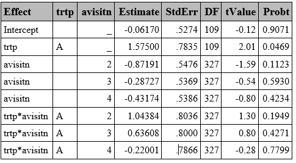
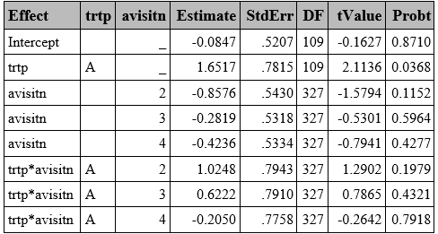
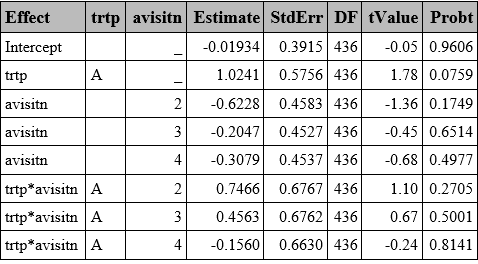
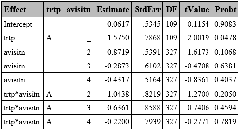
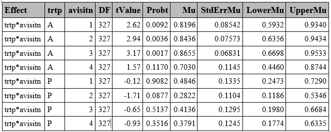
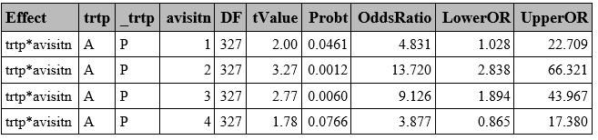
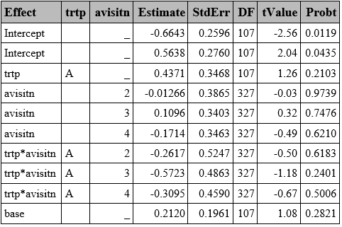
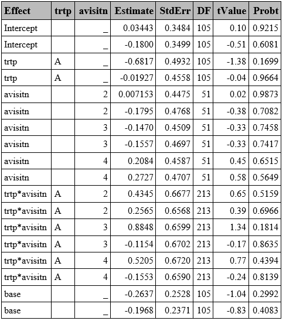
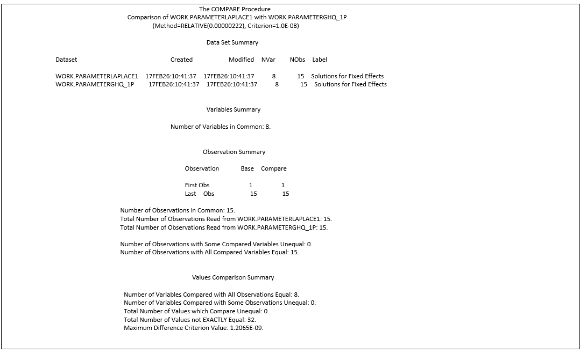

# INTRODUCTION

Generalized Linear Mixed Models (GLMM) method combines the characteristics of the Generalized Linear Model (GLM), with mixed models (such a repeated measures over time).  It extends the GLM framework using link functions that relate the predictors to transformed outcome variable.

$$
E(Y)=\mu
$$

$$
g(\mu) = X\beta + Zb, \qquad b \sim N(0, G)
$$

Where:

n: number of observations, p: number of fixed effects, q: number of random effects (subjects).

Y: vector of observed response variable (n x 1)

g: Link function that transforms Y to the linear scale (eg: logit)

X: matrix for fixed effects (n x p), Z: matrix of random effects, G: covariance matrix of the random effects.

B: vector of fixed effects coefficients (p x 1)., b: vector of random effects.

**Link Function:**

-   Dichotomous response variable: probit (in case of rare events complementary log-log may be preferable).

-   Outcomes with more than two categories:

    -   Ordinal variable: cumulative

    -   Nominal variable: generalized logit

**Random Effects**

GLMM are conditional models and estimate subject-average effects, and the intra-subject correlation is modelled via random effects. Unlike GEE models, GLMM models allow individual-level inference.

**Estimation Methods**

Maximum likelihood, based on approximations:

-   Gauss Hermite Quadrature (GHQ): Integral split in a given number of points.

-   Laplace: A specific case of GHQ, using 1 point.

Penalized Likelihood can be used too, but it is known that in binary data **it underestimates variance components and biased results.**

**Note:** The results shown in this section have been post‑processed to enhance visual comparability. Specifically, the outputs were extracted using the ODS OUTPUT statement and filtered to retain only the relevant values

# EXAMPLE DATA

A SAS data of clinical trial data comparing two treatments for a respiratory disorder available in ["Gee Model for Binary Data"](https://documentation.sas.com/doc/en/statug/15.2/statug_code_genmex5.htm) in the SAS/STAT Sample Program Library [1] is used to create these examples.

To uniquely identify subjects, a new variable USUBJID was created by concatenating SITE and ID. Variables TREATMENT, BASELINE, and VISIT were renamed to TRTP, BASE, and AVISITN.

Additionally, two variables were created using randomly generated values to simulate variables with more than two categories. One was an ordinal variable with values 1, 2, and 3; the other was a nominal variable with categories 'liver', 'lung', and 'bone'. The following SAS code was used:

```{r}
#| eval: false
proc format; 
  value respmulti 
  1='Liver' 
  2='Lung' 
  3='Bone'; 
run; 
 
data resp; 
  set resp1; 
    call streaminit(1234);   
    respord = rand("integer", 1, 3);     *Ordinal; 
    respnom = put(respord, respmulti.);  *Nominal;
run;
```

# GLMM WITH GHQ

GLMM with GHQ approximation can be fitted using `PROC GLIMMIX` by specifying `quad(qpoints=<n>)` . The random effects are specified with the `RANDOM` statement, while the `TYPE=` option statement can be used to specify the covariance structure of G (variance matrix of the random effects). Variance Components by default (type=VC) is the default option.

Unlike in GEE models, which computed the robust Sandwich S.E. by default, the GLIMMIX procedure displays the model-based S.E. (also called naïve S.E. in R) by default.

```{r}
#| eval: false
proc glimmix data=resp method=quad(qpoints=5);
class trtp(ref="P") avisitn(ref='1') usubjid;
model outcome=trtp avisitn trtp*avisitn/dist=bin link=logit solution ddfm=BW;/*1*/;
random intercept /subject=usubjid /*type=vc [2]*/;
run;

```

[1] Option to set up the ddff (BW=Between-Within, which is the default). Other options include: infinite (none), Kenwardroger, Residual, etc.

[2] Covariance structure of G (residuals covariance matrix). Variance components (VC) by default.

```{r}
#| echo: false
#| fig-align: center
#| out-width: 50%

```

# GLMM WITH LAPLACE

Laplace is a particular GHQ where only one point is used. In SAS, it can be obtained in the method statement using either `method=quad(qpoints=<n>)` or `method=Laplace`. Both approaches return similar results with slight differences in later decimal places (See Appendix 1).

```{r}
#| eval: false
proc glimmix data=resp method=laplace;
class trtp(ref="A") avisitn(ref='1') usubjid;
model outcome=trtp avisitn trtp*avisitn/dist=bin link=logit solution ddfm=BW;
random intercept /subject=usubjid /*type=vc*/;
run;

```

```{r}
#| echo: false
#| fig-align: center
#| out-width: 50%

```

# PENALIZED QUASI-LIKELIHOOD (PQL)

The PQL approach uses linear approximations instead of likelihood, making it **less accurate for binary outcomes compared to the GHQ or Laplace** methods described above.

In SAS, this is implemented by default using the Residual Pseudo-Likelihood method (`method=RSPL)`, which is a refinement of PQL which incorporates residual adjustments to better approximate the marginal likelihood, in the GLIMMIX procedure.

```{r}
#| eval: false
proc glimmix data=resp method=rspl;
class trtp(ref="A") avisitn(ref='1') usubjid;
model outcome=trtp avisitn trtp*avisitn/ dist=bin link=logit solution ddfm=residual;
random intercept /subject=usubjid;
run;

```

```{r}
#| echo: false
#| fig-align: center
#| out-width: 50%

```

# SANDWICH SE 

As exposed in the R section, the paper by Li. P. and Redden, D.T. (2015) [2], suggests using the Between-Within denominator degrees of freedom approximation method when using GLMMs in randomized trials with binary outcomes and small sample size, which is the default option in GLIMMIX.

Additionally, FDA advises "*sponsors to consider using of robust SE method such as the Huber-White "sandwich" SE, particularly when the model does not include treatment by covariate interaction*. [3]" The Sandwich S.E. is easily obtained by adding the `empirical` option in the procedure.

The example below is done using GHQ with n=5 points, but it also works for Laplace approximation.

```{r}
#| eval: false
proc glimmix data=resp method=quad(qpoints=5) empirical;
class trtp(ref="A") avisitn(ref='1') usubjid;
model outcome=trtp avisitn trtp*avisitn/dist=bin link=logit solution ddfm=BW;
random intercept /subject=usubjid;
run;


```

```{r}
#| echo: false
#| fig-align: center
#| out-width: 50%

```

# ODDS RATIO

Predicted probabilities and odds ratios (ORs) can be obtained in SAS using the `LSMEANS` statement:

-   The ILINK option provides back-transformed predicted probabilities.

-   The DIFF option, combined with either EXP or ODDSRATIO, computes ORs.

-    CL computes confidence intervals.

    The example below is done using GHQ with n=5 points, but it also works for Laplace approximation.

```{r}
#| eval: false
    proc glimmix data=resp method=quad(qpoints=5) empirical;
    class trtp(ref="P") avisitn(ref='1') usubjid; 
    model outcome=trtp avisitn trtp*avisitn  / dist=bin link=logit solution  ddfm=betwithin ;
    lsmeans  trtp*avisitn /cl  ilink oddsratio diff;
    random intercept /subject=usubjid ;
    ods output LSMeans = Lsmeans Diffs=Diffs1;
    run; 

```

    **Predicted Probabilities**

```{r}
#| echo: false
#| fig-align: center
#| out-width: 50%

```

    **Odds Ratio**

```{r}
#| echo: false
#| fig-align: center
#| out-width: 50%

```

# OUTCOMES WITH MORE THAN 2 CATEGORIES

Although less common than binary outcomes, endpoints with more than two categories may be the outcome of interest, which can be either ordinal or nominal. In SAS, similar syntax used for binary outcomes can be applied, by specifying a multinomial distribution and selecting the appropriate link function (cumulative for ordinal outcomes and generalized logit if the variable is nominal).

One notable limitation is that the `LSMEANS` statement does not work as expected in GLIMMIX with the multinomial distribution. However, ORs can still be obtained by using the `ODDSRATIO` option in the model statement

### Ordinal variable

```{r}
#| eval: false
proc glimmix data=resp method=quad(qpoints=5) empirical;
	class trtp(ref="P") avisitn(ref='1') usubjid; 
	model respord=trtp avisitn trtp*avisitn base / dist=multinomial link=cumlogit solution oddsratio ddfm=betwithin;
	random intercept /subject=usubjid;
	ods output ParameterEstimates=ParamMulti_ord;
run; 

```

```{r}
#| echo: false
#| fig-align: center
#| out-width: 50%

```

### Nominal variable

```{r}
#| eval: false
proc glimmix data=resp method=quad(qpoints=5) ;
	class trtp(ref="P") avisitn(ref='1') usubjid respnom; 
	model respnom(order=freq ref=first)=trtp avisitn trtp*avisitn base / dist=multinomial link=glogit  solution ddfm=betwithin ;
	random intercept /subject=usubjid group=respnom;
	*lsmeans trtp*avisitn/ diff=control ilink cl oddsratio;
	ods output ParameterEstimates=ParamMulti_nom;
run; 

```

```{r}
#| echo: false
#| fig-align: center
#| out-width: 50%

```

# APPENDIX 1

### Laplace: GLIMMIX with method=Laplace vs method=quad(qpoints=1)

```{r}
#| eval: false
proc glimmix data=resp method=laplace empirical; 
class trtp(ref="P") avisitn(ref='1') usubjid;  
model outcome=trtp avisitn trtp*avisitn/ dist=bin link=logit solution ddfm=BW; 
random intercept /subject=usubjid; 
ods output ParameterEstimates=ParameterLaplace; 
run;  
 
proc glimmix data=resp method=quad(qpoints=1) empirical; 
class trtp(ref="P") avisitn(ref='1') usubjid;  
model outcome=trtp avisitn trtp*avisitn  / dist=bin link=logit solution cl ddfm=BW; 
random intercept /subject=usubjid; 
ods output ParameterEstimates=ParameterGHQ_1p; 
run; 

proc compare base=ParameterLaplace compare=ParameterGHQ_1p criterion=0.00000001; 
run; 

```

```{r}
#| echo: false
#| fig-align: center
#| out-width: 50%

```

# REFERENCES

[1] [SAS Institute Inc.. SAS Help Center. The GEE procedure.](https://documentation.sas.com/doc/en/statug/15.2/statug_gee_examples01.htm)

[2] [Li, P., & Redden, D. T. (2015). Comparing denominator degrees of freedom approximations for the generalized linear mixed model in analyzing binary outcome in small sample cluster-randomized trials. BMC Medical Research Methodology, 15, 38.](https://bmcmedresmethodol.biomedcentral.com/articles/10.1186/s12874-015-0026-x)

[3] [U.S. Food and Drug Administration. (2023). Adjusting for Covariates in Randomized Clinical Trials for Drugs and Biological Products: Guidance for Industry. Center for Drug Evaluation and Research (CDER), Center for Biologics Evaluation and Research (CBER).](https://www.fda.gov/regulatory-information/search-fda-guidance-documents/adjusting-covariates-randomized-clinical-trials-drugs-and-biological-products)

[4] [SAS/STAT® 13.1 User’s Guide The GLIMMIX Procedure](https://support.sas.com/documentation/onlinedoc/stat/131/glimmix.pdf)
