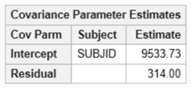

## Fitting Random Effects Models in SAS

In a classical regression model, coefficients in the model are fixed across all observations and observations are assumed to be independent. Mixed effects models introduce random coefficients to the model, called random effects, which vary randomly between different groups of observations. The introduction of random effects leads to observations within a group being correlated.

### Setting up the model

PROC MIXED can be used to used to implement random effects models. Random effects are added to the model through the random statement. 

As an example, suppose that we want the intercept in the model to vary randomly between participants, in other words, a random constant is included in the model which is different for each participant. 

This is achieved by random intercept / subject=USUBJID.

```{sas}
proc mixed data=data; 
class USUBJID TRTP; 
model AVAL = TRTP / ddfm = kenwardroger solution;
random intercept / subject = USUBJID;
run;
```

The estimated variance of the random effect(s) can be found in the model results.

```{r} 
#| echo: false 
#| fig-align: center 
#| out-width: 50% 

```

If you want the coefficient of TRTP to vary randomly by participant, include it in the random statement.

```{sas}
random intercept TRTP / subject = USUBJID type=vc;
```


The type option allows for the covariance structure between the random effects to be specified. The default is vc (variance components) which means that random effects are not correlated.

### Inference on a single coefficient

Degrees of freedom, p-values and confidence intervals for model coefficients are provided
when the solution option is used in the model statement. The degrees of freedom method
is specified using the ddfm option in the model statement.

### Inference on a contrast
The estimate statement can be used to construct contrasts. An alternative is to use
the lsmestimate statement, which allows for contrasts to be constructed in terms of 
least square means. Least square means can be calculated using the lsmeans statement.
For all of these methods, the output gives degrees of freedom, p-values and confidence intervals.
