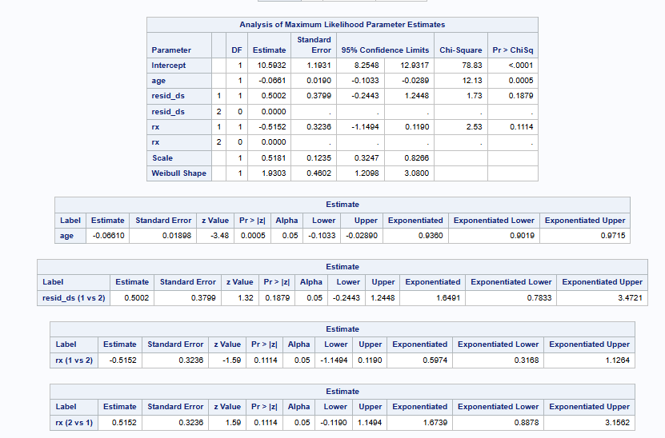
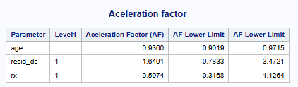
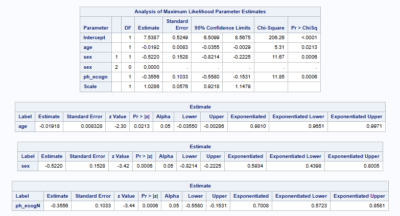
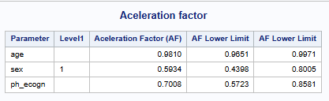
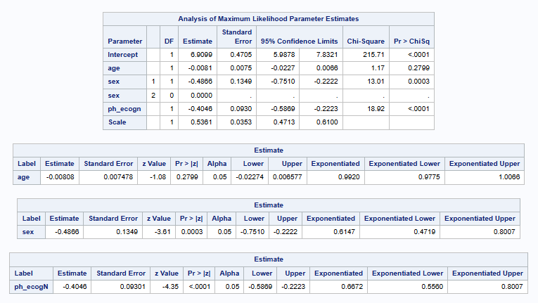
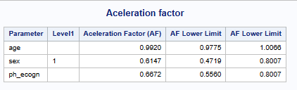

# INTRODUCTION

Accelerated Failure Time (AFT) models are parametric models, where the effect of an explanatory variable is to speed up or slow down the survival time.

Consider two groups: Group C (control group) and Group T (new treatment), under an AFT formulation, the survival functions of the two groups are related through a time-scaling factor ϕ, comparing T vs C:

-   ϕ \<1: the event happens earlier in group T a than in group C , an acceleration of time to event (survival time decreases in new treatment group).

-   ϕ =1: No effect on survival time.

-   ϕ \>1: the event happens later in group T a than in group C , a deceleration of time to event (survival time increases in new treatment group).

See further maths information in the R section: <https://psiaims.github.io/CAMIS/R/Accelerated_Failure_time_model.html>

In SAS, several distributions that can be fitted in PROC LIFEREG, the following sections explore the most commonly used ones: Log-Normal, Log-Logistic and Weibull (by default).

# AFT with"Weibull" (Default)

### Data

For consistency with the R example, the ovarian dataset from the R survival package \[1\] is used for the Weibull model example. This dataset contains survival data from a randomized trial comparing two treatments for ovarian cancer. It includes 26 observations and 6 variables describing patient characteristics, treatment assignment, and survival outcomes:

-   **futime:** survival or censoring time

-   **fustat:** censoring status (1=deceased, 0 = alive)

-   **age:** in years

-   **resid.ds:** residual disease present (1=no, 2=yes)

-   **rx:** treatment group (1 = standard treatment, 2 = experimental treatment)

-   **ecog.ps:** ECOG performance status

In this example, the variables time to event is analyzed including the variables age, residual disease present and treatment group.

### Code

The `MODEL` statement in `PROC LIFEREG` follows a syntax similar to that of `PROC LIFETEST`, where the time-to-event variable is specified together with the censoring indicator using the form `time*status(x)`, with `x`indicating the value corresponding to censored observations. In this example, a Weibull distribution is assumed (`DIST=weibull`), which is also the default.

The acceleration factor can be exponentiating the estimated regression coefficients. The exponentiation can be done by using the `estimate` statement with the `exp` option; or storing the coefficients in a dataset, and applying the exponential transformation in a data step. Additionally, with the `estimate` statement allows to obtain results for different comparisons. Also, survival time predicted by the model, can be stored in a dataset by using `output out.` The following example computes the AR using both approaches.

```{sas}
proc lifereg data=ovarian outest=estimates;

  * Define class variables;
  class rx resid_ds;
  
  *Define model and distribution;
  model futime*fustat(0)=age resid_ds rx/dist=weibull;
  
  * Get aceleration factor using estimate;
  estimate 'age'                    age 1   /exp cl;
  estimate 'resid_ds (1 vs 2)' resid_ds 1 -1/exp cl;
  estimate  'rx (1 vs 2)'           rx  1 -1/exp cl;  /* Comparing 1 vs 2*/
  estimate  'rx (2 vs 1)'           rx -1  1/exp cl;  /* Comparing 2 vs 1*/
  
  output out=pred_wei_SAS predicted=pred; /*Predicted time*/
  ods output ParameterEstimates = coeff;

 run;
```

```{r}
#| eval: true
#| echo: false
#| fig-align: center
#| out-width: 75%

```

```{sas}
 data acf;
   set coeff;
   
   label af='Aceleration Factor (AF)'
   		 lowercl='AF Lower Limit'
   		 uppercl='AF Lower Limit';
   		 
   af=exp(estimate);
   lowercl=exp(lowercl);
   uppercl=exp(uppercl);

    if (level1 ne '' and estimate=0) or parameter in ('Scale' 'Weibull Shape'   'Intercept') then delete;
 run;
 
 proc print data=acf noobs label; 
   title 'Aceleration factor';
   var parameter level1 af lowercl uppercl;
   format af lowercl uppercl 9.4;
 run;
 
```

```{r}
#| eval: true
#| echo: false
#| fig-align: center
#| out-width: 75%

```

### Interpretation

-   **For age,** an acceleration factor ϕ = 0.9360 indicates that events occur more quickly (accelerated failure) so for each 1-unit increase in age, the time to event is reduced by approximately **6.4%**.

-   **For residual disease status (1: No vs 2: Yes),** an acceleration factor of ϕ =1.6491 indicates that subjects without residual disease have longer survival times compared with those with residual disease. In other words, the time to event is approximately 64.9% longer for patients with no residual disease.

-   **For treatment**, The acceleration factor for treatment is assessed in two directions (1 vs 2 and 2 vs 1):

    -   **1: standard vs 2 experimental treatment:** An acceleration factor of ϕ=0.5974 indicates that the standard treatment is associated with shorter survival times, with the time to event being approximately 40.3% shorter compared to the experimental treatment.

    -   **2: experimental vs 1 standard treatment:** Conversely, when expressed in the reverse direction, an acceleration factor of ϕ=1.6739 indicates that the experimental treatment is associated with longer survival times, with the time to event being approximately **67.4% longer** compared to the standard treatment.

# AFT using Log-Normal Distribution

### Data

For consistency with the R example, the same *lung* dataset from the R **survival** package is used in this example. This dataset contains the following variables:

-   **inst:** Institution code

-   **time:** Survival time in days

-   **status:** censoring status (1=censored, 2=dead)

-   **age:** Age in years

-   **sex:** (1 = male, 2 = female)

-   **ph.ecog:** ECOG performance score as rated by the physician.

-   **ph.karno:** Karnofsky performance score (bad=0-good=100) rated by physician

-   **pat.karno**: Karnofsky performance score as rated by patient

-   **meal.cal:** Calories consumed at meals

-   **wt.loss:** Weight loss in last six months (pounds)

In this example, **age**, **sex**, and **ECOG** are included as covariates. Age and ECOG are modeled as **continuous variables**, while sex is treated as **categorical**. Since ECOG is not stored numerically, it is converted to a numeric variable in a data step for non-missing observations.

```{sas}
data lung1;
 set lung;
 if ph_ecog NE 'NA' then ph_ecogn=input(ph_ecog, 1.);
run;

```

### Code

In this example, a log-normal distribution is assumed (`DIST=LNORMAL`).

```{SAS}
proc lifereg data=lung1;
  class sex;
  
  model time*status(1)=age sex ph_ecogN/dist=lnormal;
  
  * Get aceleration factor using estimate;
  estimate 'age'        age 1/exp cl;
  estimate 'sex 2 vs 1' sex 1 -1 / exp cl;
  estimate 'ph_ecogN'  ph_ecogN 1/exp cl;
  
  output out=pred_wei_SAS predicted=pred; /*Predicted time*/
  ods output ParameterEstimates = coeff;
run;

```

```{r}
#| eval: true
#| echo: false
#| fig-align: center
#| out-width: 75%

```

```{sas}
 /* Get aceleration factor in a data step */
 data acf;
   set coeff;
   af=exp(estimate);
   lowercl=exp(estimate);
   uppercl=exp(estimate);
   format _all_ 8.4;
 run;
 
 proc print data=acf noobs;
  title 'Aceleration factor';
 run;

```

```{r}
#| eval: true
#| echo: false
#| fig-align: center
#| out-width: 75%

```

# AFT with log-logistic

### Data

In this example, the same dataset and set of covariates are retained as in the log-normal case, with the only modification being the assumption of a log-logistic distribution (`DIST=LLOGISTIC`).

### Code

```{sas}
proc lifereg data=lung1;
  class sex;
  
  model time*status(1)=age sex ph_ecogN/dist=llogistic;
  
  * Get aceleration factor using estimate;
  estimate 'age'        age 1/exp cl;
  estimate 'sex 2 vs 1' sex 1 -1 / exp cl;
  estimate 'ph_ecogN'  ph_ecogN 1/exp cl;
  
  * Store results in datasets;
  ods output ParameterEstimates = coeff estimates=estimate;
run;
 
```

```{r}
#| eval: true
#| echo: false
#| fig-align: center
#| out-width: 75%

```

```{sas}
 /* Get aceleration factor in a data step */
 data acf;
   set estimates;
   af=exp(estimate);
   lowercl=exp(estimate);
   uppercl=exp(estimate);
   format _all_ 8.4;
 run;
 
 proc print data=acf noobs;
  title 'Aceleration factor';
 run;

```

```{r}
#| eval: true
#| echo: false
#| fig-align: center
#| out-width: 75%

```

## RERERENCES

\[1\] [Therneau TM. A Package for Survival Analysis in R (survival vignette).](https://cran.r-project.org/web/packages/survival/vignettes/survival.pdf "Therneau TM. A Package for Survival Analysis in R (survival vignette). Available from: https://cran.r-project.org/web/packages/survival/vignettes/survival.pdf")

\[2\] [SAS Institute Inc. SAS/STAT® User’s Guide: The LIFEREG Procedure.](https://documentation.sas.com/doc/en/pgmsascdc/v_074/statug/statug_lifereg_syntax01.htm){.uri}
