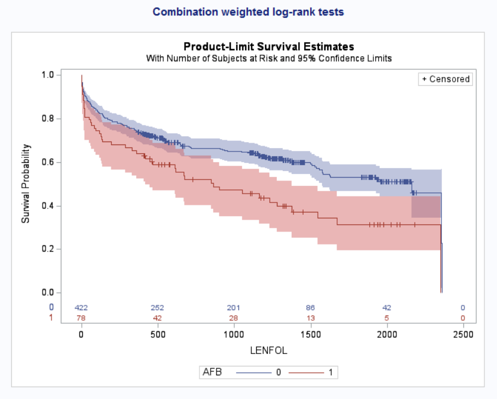

# Introduction

In clinical studies with time-to-event outcomes, it is commonly assumed that the hazard functions of two groups are proportional. The standard log-rank test is widely used to test the equivalence of survival functions. It assumes no relationship between the censoring indicator and the forecast, such that dropouts or individuals who are not fully observed are perceived to be the same in risks (sensitivity to proportional risk); the events are also weighted equally regardless of time of occurrence ( early/ later). However, several scenarios can lead to non-proportional hazards (NPH). For example, a delayed treatment effect may be observed in the treatment arm, which can lead to a departure from proportionality of the survival curves. Log-rank test loses power under the non-proportional hazard assumption. Thus, there are many tests available in the literature that can handle such scenarios. Most commonly used tests are as follows:

-   Weighted log-rank test.
-   Restricted Mean Survival Time (RMST).
-   Milestone survival.
-   Max-Combo test.
-   Modestly Weighted log-rank test.

This particular document focuses mainly on the weighted log-rank test, Max-combo test and Modestly Weighted log-rank.

# Data.

\
Data source: <https://stats.idre.ucla.edu/sas/seminars/sas-survival/>

The data include 500 subjects from the Worcester WHAS WHAS Study. This study examined several factors, such as age, gender and BMI, that may influence survival time after an WHAS. Follow-up time for all participants begins at the time of hospital admission after an WHAS and ends with death or loss to follow-up (censoring). The variables used here are:

-   lenfol: length of follow-up, terminated either by death or censoring - time variable

-   fstat: loss to followup = 0, death = 1 - censoring variable

-   afb: atrial fibrillation, no = 0, 1 = yes - Covariate

-   gender: males = 0, females = 1 - stratification factor

**Kaplan-Meier Survival Curve.**

Below is the Kaplan-Meier survival curve, with a p-value and chi-square test statistic for standard log-rank respectively: 0.001 and 10.9000 .

```{r}
#| eval: true
#| echo: false
#| fig-align: center
#| out-width: 75%

```

# Tests:

# 1. Weighted log-rank test.

The Weighted log-rank has been utilised in studies with non-proportional hazard, in order to maximise power. By pre-specifying the weights, type I error is preserved. The choice of weight can be based on initial information or anticipated study design.\
Suppose we have two groups (e.g. treatment and control, male and female, etc.) with survival functions $S_1$ & $S_2$, respectively. The null and alternative hypotheses are given as: $$H_0 : S_1(t)=S_2(t) \mbox{    }\forall t  \mbox{ v/s }  H_1 : S_1(t) \neq S_2(t) \mbox{ for some t. }$$ Since the alternative hypothesis is composite, it includes multiple scenarios. Hence, the power calculation is difficult to implement. One way to tackle this situation is to consider the Lehman alternative given by $H_L : S_1(t)=(S_2(t))^\psi$ for all $t$ where $0<\psi<1$. Alternatively, $$ H_0 : \psi=1  \ v/s \ H_1: \psi<1$$\
The test statistic for weighted log-rank test is given by, $$ Z = \frac{\sum_{j=1}^{D}w_j(o_{j} -e_j)}{\sqrt{\sum_{j=1}^{D}w_j^2 v_j}} \to N(0,1), \text{under} \ H_0$$ Equivalently, $$ Z^2 = \frac{\big[\sum_{j=1}^{D}w_j(o_j -e_j)\big]^2}{\sum_{j=1}^{D}w_j^2 v_j} \to \chi^2_1, \text{under} \ H_0.$$\
Here, $t_1<t_2<...<t_D$ be the distinct failure time points of both the groups together. $o_j$ is the number of deaths, $e_j$ is the expected number of deaths, and $v_j$ is the variance of the number of deaths in either of the two groups.\
Different weight functions are discussed in the literature, and a family of weight functions $G(\rho,\gamma)$ is proposed by Harrington and Fleming (1982), and it is implemented in SAS using `PROC LIFETEST`, specifying the `STRATA` statement with `test=FH`($\rho,\gamma$) option.\
Suppose $W_k$ is a positive weight function, $n_k$ is the size of the risk set and $S(t_k)$ for survival function. We can implement these tests by assigning different weights, such that:

\
- $W _k$= 1 \[Weight=1\] $\implies$ Log-rank test.\
- $W_k$= $n_k$ \[weights by risk set size\] $\implies$ Wilcoxon test.\
- $W_k$= $(n_k)^{1/2}$ \[square root of risk set size\] $\implies$ Tarone-Ware test.\
- $W_k$= $(S(t_k))$ \[weights by pooled survival function\] $\implies$ Peto-Peto Prentice test.\
- $W_k$= $(S(t_k))\frac{n_k}{n_k+1}$ \[survival weight adjusted by risk set size\] $\implies$ Modified Peto-Peto test.\
- $W_k$= $\{S(t_k)\}^{\rho}\{1 - S(t_k)\}^{\gamma}$ \[flexible survival-based weighting\] $\implies$ Fleming-Harrington($\rho,\gamma$) test.

### a). Peto-Peto.

This test assigns weights based on the pooled Kaplan–Meier survival estimate$(S(t_k))$. Larger weights are assigned to earlier failures, thereby enabling greater emphasis on group differences at earlier times. This test can be implemented in SAS using `PROC LIFETEST`, with group comparisons specified in the `STRATA` statement and the test selected via the `TEST=peto` option.

```{sas}
proc lifetest data=WHAS; 
time LENFOL*FSTAT(0); 
strata AFB / test=peto; 
run;
```

```{r}
#| eval: false
#| echo: false
#| fig-align: center
#| out-width: 40%
knitr::include_graphics("../images/weightedlogrank/peto peto.png")
```

### b). Modified Peto Peto

This is an extension of the Peto-Peto Prentice test, which incorporates a risk set correction factor $\frac{n_k}{n_k+1}$, enhancing stability under heavy censoring and small risk sets. The test enables greater emphasis on group differences at earlier times. This test can be implemented in SAS using `PROC LIFETEST`, with group comparisons specified in the `STRATA` statement and the test selected via the `TEST=modpeto` option.

```{sas}
proc lifetest data=WHAS; 
time LENFOL*FSTAT(0); 
strata AFB / test=modpeto; 
run;
```

```{r}
#| eval: false
#| echo: false
#| fig-align: center
#| out-width: 40%
knitr::include_graphics("../images/weightedlogrank/Modified Peto Peto.png")
```

### c). Tarone-Ware.

The test uses the square root of the number of individuals at risk as weight $wj=\sqrt n_k$. It balances sensitivity between early and late differences. This test can be implemented in SAS using `PROC LIFETEST`, with group comparisons specified in the `STRATA` statement and the test selected via the `TEST=taroneware` option.

```{sas}
proc lifetest data=WHAS; 
time LENFOL*FSTAT(0); 
strata AFB / test=taroneware; 
run;
```

```{r}
#| eval: false
#| echo: false
#| fig-align: center
#| out-width: 40%
knitr::include_graphics("../images/weightedlogrank/tarone-ware.png")
```

### d). Wilcoxon.

The test is also referred to as the Gehan test or the Breslow test. It weights each event by the size of the risk set $n_k$, giving greater emphasis to early differences in survival. This test can be implemented in SAS using `PROC LIFETEST`, with group comparisons specified in the `STRATA` statement and the test selected via the `TEST=wilcoxon` option.

```{sas}
proc lifetest data=wlr; 
time LENFOL*FSTAT(0); 
strata AFB / test= wilcoxon; 
run;
```

```{r}
#| eval: false
#| echo: false
#| fig-align: center
#| out-width: 40%
knitr::include_graphics("../images/weightedlogrank/gehan wilcoxon.png")
```

### e). Fleming-Harrington

This test uses weight $W_k$= $\{S(t_k)\}^{\rho}\{1 - S(t_k)\}^{\gamma}$; $\rho,\gamma \geq 0$ , where $\hat{S}(t)$ is the Kaplan-Meier estimate of the survival function at time $t$. It is useful when early treatment effects are of interest or when there is heavy late-stage censoring. When $\rho=1, \gamma=0$, this test can be used to detect early differences in the survival curves. This test can be implemented in SAS using `PROC LIFETEST`, with group comparisons specified in the `STRATA` statement and the test selected via the `test=FH`($\rho,\gamma$) option.

#### i). Fleming-Harrington (0.5,0.5)

Places weight on hazards in the middle of the study.

```{sas}
proc lifetest data=WHAS; 
time LENFOL*FSTAT(0); 
strata AFB / test=FH(0.5,0.5); 
run;
```

```{r}
#| eval: false
#| echo: false
#| fig-align: center
#| out-width: 40%
knitr::include_graphics("../images/weightedlogrank/FH0.50.5.png")
```

#### ii). Fleming-Harrington (1,1)

Places weight on hazards in the middle of the study.

```{sas}
proc lifetest data=WHAS; 
time LENFOL*FSTAT(0); 
strata AFB / test=FH(1,1); 
run;
```

```{r}
#| eval: false
#| echo: false
#| fig-align: center
#| out-width: 40%
knitr::include_graphics("../images/weightedlogrank/FH11.png")
```

#### iii). Fleming-Harrington (0,1)

Places weight on hazards at the end of the study.

```{sas}
proc lifetest data=WHAS; 
time LENFOL*FSTAT(0); 
strata AFB / test=FH(0,1); 
run;
```

```{r}
#| eval: false
#| echo: false
#| fig-align: center
#| out-width: 40%
knitr::include_graphics("../images/weightedlogrank/FH01.png")
```

#### iv). Fleming-Harrington (0.5,2)

Places weight on hazards at the end of the study.

```{sas}
proc lifetest data=WHAS; 
time LENFOL*FSTAT(0); 
strata AFB / test=FH(0.5,2); 
run;
```

```{r}
#| eval: false
#| echo: false
#| fig-align: center
#| out-width: 40%
knitr::include_graphics("../images/weightedlogrank/FH0.5,2.png")
```

#### v). Fleming-Harrington (1,0)

Places weight on hazards at the beginning of the study.

```{sas}
proc lifetest data=WHAS; 
time LENFOL*FSTAT(0); 
strata AFB / test=FH(1,0); 
run;
```

```{r}
#| eval: false
#| echo: false
#| fig-align: center
#| out-width: 40%
knitr::include_graphics("../images/weightedlogrank/FH10.png")
```

# 2. Max-Combo test.

This is a universal criterion for examining the proximity of the survival functions, especially when no initial information about the trial is available. It combines multiple weighted log-rank criteria to enable sensitivity for equally, early, middle and late differences concurrently, such that it defines the maximum of the $G^{0,1}$ and $G^{1,0}$ criteria. It is also suitable when there is a violation of the proportional hazard assumption and uncertainty about the distribution of survival time.\
The combination test aims for strong power to realise the survival curves difference over a range of possible alternative hypotheses. Based on the Z statistic obtained using the $G(\rho,\gamma)$ family, the maximum test statistic of several weighted log-rank statistics (Z max) is obtained. Despite the LIFETEST procedure allowing for testing weighted log-rank statistics, SAS do not have a built-in functionality to perform a combination of weighted tests.

### i). Max-Combo(Unstratified)

This test is implemented through a [SAS macro](https://github.com/dreaknezevic/combo-wlr) that also estimates the variance-covariance matrix of the joint distribution of the Z-statistic and p-value for Zmax.\
Note: Do not edit the SAS macro. Run this code below the SAS macro:

```{sas}
%combo_wlr(
   data  = WHAS,
   group = AFB,
   time  = LENFOL,
   event = FSTAT
);
```

```{r}
#| eval: false
#| echo: false
#| fig-align: center
#| out-width: 75%
knitr::include_graphics("../images/weightedlogrank/Max-comb plot.png")
```

```{r}
#| eval: false
#| echo: false
#| fig-align: center
#| out-width: 60%
knitr::include_graphics("../images/weightedlogrank/MaxC test stat.png")
```

### ii). Stratified Max-Combo.

This [SAS macro](https://github.com/dreaknezevic/combo-wlr) was developed to perform an unstratified combination weighted log-rank (Max-Combo) test for two groups. The code can be modified so that the `PROC LIFETEST` step includes a separate STRATA statement. For this case, `GENDER` was used as the stratifying variable. It is possible to have more than one stratifying variable. The group variable should be a character, not a numeric. The following are the modifications:

```{sas}
%macro combo_wlr(data=,group=,time=,event=,weights=, strata=);

data one; 
 set &data;
 keep &group &time &event &strata; 
run;


proc lifetest data=one;
  time &time*&event(0);
  strata &strata/ group= &group test=FH(&r,&g);
 run;


%combo_wlr(
   data  = new,
   group = AFB_new,
   time  = LENFOL,
   event = FSTAT,
   strata= GENDER
);
```

```{r}
#| eval: false
#| echo: false
#| fig-align: center
#| out-width: 75%
knitr::include_graphics("../images/weightedlogrank/stratified Max Combo.png")
```

```{r}
#| eval: false
#| echo: false
#| fig-align: center
#| out-width: 30%
knitr::include_graphics("../images/weightedlogrank/stratifed MaxC test stat.png")
```

To change the choice of weight, modify the `weight =` list in the macro to any desired ($\rho,\gamma$) pairs. The macro supports combined multiple weights `weights = %str(0,0 1,0 0,1 1,1)` by default. These correspond to the Fleming–Harrington class $G(\rho,\gamma)$, where:

-   $G(0,0)$: standard log-rank test (equal weighting over time)
-   $G(1,0)$: emphasises early differences
-   $G(0,1)$: emphasises late differences
-   $G(1,1)$: emphasises middle-time differences

```{sas}
%combo_wlr(
  data = new,
  group = AFB_new,
  time = LENFOL,
  event = FSTAT,
  strata= GENDER,
  weights = %str(1,0)
);
```

```{r}
#| eval: false
#| echo: false
#| fig-align: center
#| out-width: 30%
knitr::include_graphics("../images/weightedlogrank/weight choice.png")
```

# 3. Modestly Weighted Log-rank test.

This test is suitable for a delayed effect scenario since it gives more weight to later event times; regardless, weighting is controlled, such that the worse effect of treatment is not rewarded at an early time point. However, in a scenario where there is an early treatment effect which diminishes over time, modestly weighted Log-Rank losses sizeable power compared to the log-rank test. To the knowledge of CAMIS contributors, there is no direct implementation of this test in `PROC LIFETEST` for SAS.

# References

1.  `LIFETEST procedure` documentation: <https://documentation.sas.com/doc/en/statug/15.2/statug_lifetest_syntax01.htm>

2.  `Combination weighted log-rank tests` documentation: <https://support.sas.com/resources/papers/proceedings20/5062-2020.pdf>

3.  `LIFETEST procedure` documentation: <https://support.sas.com/documentation//cdl/en/statug/68162/HTML/default/viewer.htm#statug_lifetest_details16.htm>

4.  `SAS macro file in github`documentation: <https://github.com/dreaknezevic/combo-wlr/blob/master/combo_wlr.sas>
