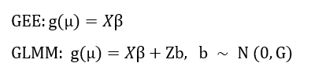
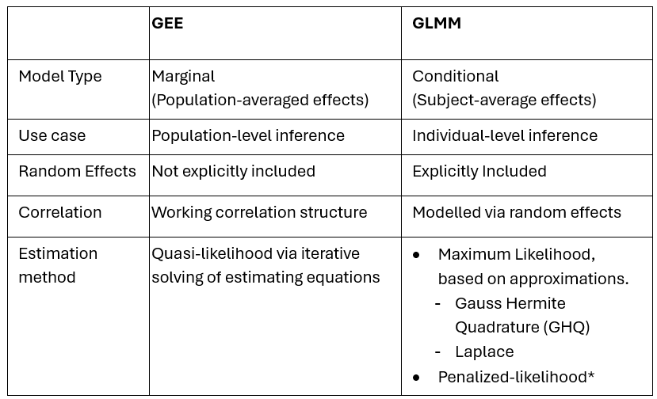
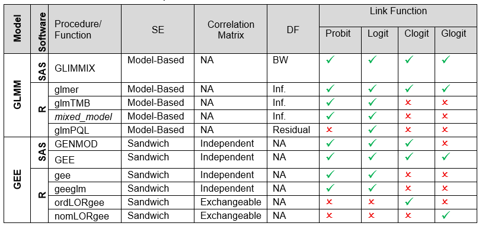

A recent PHUSE CAMIS contribution (in collaboration with PSI AIMS SIG) explored the implementation of Generalised Linear Mixed Models (GLMM) and Generalised Estimating Equations (GEE) in R and SAS, and a comparison between software for each method.

While Mixed Models for Repeated Measures (MMRM) are widely known for continuous outcomes, categorical outcomes require alternative approaches such as GLMM and GEE.

Both GLMM and GEE extend the Generalised Linear Model (GLM) framework by introducing link functions that relate predictors to a transformed outcome. For dichotomous response variables, the logit or probit link is commonly used, while the complementary log--log link may be preferable for rare events. For outcomes with more than two categories, a cumulative link function is typically applied for ordinal responses and a generalised logit link for nominal responses.

Despite this common framework, the modelling approaches differ. GEE models provide population‑averaged (marginal) estimates and account for within‑subject correlation through a working correlation structure, similar to MMRM. In contrast, GLMMs yield subject‑specific (conditional) estimates by explicitly analysing the subjects as random effects.

The models can be expressed as:

{width="330"}

Here, Y denotes the response variable; μ = E(Y); g(·) is the link function; X is the fixed‑effects design matrix; β is the vector of fixed‑effects coefficients; Z is the random‑effects design matrix; and G is the covariance matrix of the random effects.

Therefore, the interpretation of model estimates and associated inference differs between GEE and GLMM. Table 1 provides a comparative overview of the two modelling frameworks.

**Table 1.** Comparison of GEE and GLMM

\*Linear approximations instead of likelihood, making it less accurate for binary outcomes.

In practice, implementations vary across software. SAS provides procedures such as PROC GEE, PROC GENMOD and PROC GLIMMIX, while R offers a range of functions including *geepack::geeglm*, *gee::gee*, *lme4::glmer*, *glmmTMB::glmmTMB*, *GLMMadaptive::mixed_model* and *glmmPQL*. These procedures and functions do not necessarily share identical defaults or assumptions.

Differences across implementations may arise from choices of denominator degrees of freedom, standard error estimation (model‑based or naïve versus robust sandwich estimators), and the underlying computational or optimisation methods used to fit the models. Table 2 summarizes some of the key differences between SAS and R.

**Table 2.** GEE and GLMM: SAS procedures and R functions

DF: Degrees of Freedom. BW: Between-Within. LR: Likelihood-ratio test. Clogit: Cumulative Logit. Glogit: General Logit. NA: Not applicable.

In this setting, methodological and regulatory guidance provides important context for appropriate inference:

-   For linear models, FDA guidance advises the use of robust standard errors, such as the Huber--White sandwich estimator, particularly when treatment‑by‑covariate interactions are not included \[1\].:

    -   Although the guidance does not explicitly reference GEE, the same robustness principle applies: GEE analyses rely on the robust (sandwich) variance estimator to ensure valid inference under possible misspecification of the working correlation structure.

    -   For GLMMs, optional robust variance estimators may similarly be used to mitigate sensitivity to variance or random‑effects structure misspecification, consistent with the FDA\'s emphasis on robust inference under model uncertainty.

-   For GLMMs with binary outcomes, Li and Redden (2015) recommend the Between‑Within degrees of freedom approximation in cluster‑randomised trials with a small number of heterogeneous clusters \[2\].

While SAS typically provides direct procedure options to address these aspects, achieving comparable results in R often requires the use of additional packages or post‑estimation steps.

The full contribution on the CAMIS website documents these considerations and illustrates, using a common example dataset, how GLMM([R vs SAS: Generalised Linear Mixed Models (GLMM)](https://psiaims.github.io/CAMIS/Comp/r-sas_glmm.html)) and GEE ([R vs SAS: Generalised Estimating Equations (GEE) methods](https://psiaims.github.io/CAMIS/Comp/r-sas_gee.html)) results (including odds ratios and predicted probabilities), can be aligned across SAS and R. Where exact agreement is not achieved, remaining differences are explained in terms of specific implementation or optimisation methods.

The CAMIS open-source repository aims to provide vital information about the application of statistical methodology in various software (including SAS, R and Python). By documenting found differences in a repository, we aim to reduce time-consuming efforts within the community, where multiple people are investigating the same issues. As a group effort, the repository will continue to grow in content and be a vital source for medical statisticians and programmers. See [CAMIS - A PHUSE DVOST Working Group](https://psiaims.github.io/CAMIS/) for the repository or how to [Get Involved](https://psiaims.github.io/CAMIS/contribution/contribution.html).

[References:]{.underline}

\[1\] [U.S. Food and Drug Administration. (2023). Adjusting for Covariates in Randomized Clinical Trials for Drugs and Biological Products: Guidance for Industry. Center for Drug Evaluation and Research (CDER), Center for Biologics Evaluation and Research (CBER). ](https://www.fda.gov/regulatory-information/search-fda-guidance-documents/adjusting-covariates-randomized-clinical-trials-drugs-and-biological-products)

\[2\] [Li, P., & Redden, D. T. (2015). Comparing denominator degrees of freedom approximations for the generalized linear mixed model in analyzing binary outcome in small sample cluster-randomized trials. BMC Medical Research Methodology, 15, 38. ](https://bmcmedresmethodol.biomedcentral.com/articles/10.1186/s12874-015-0026-x)
