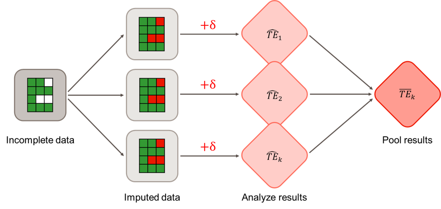
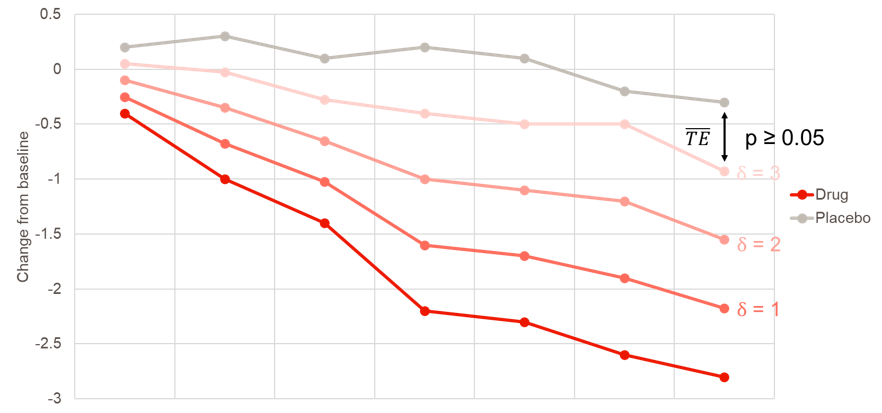
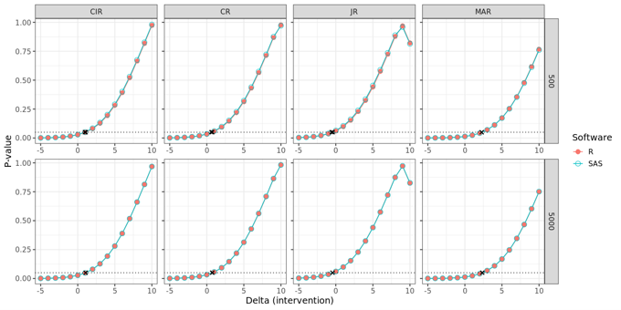
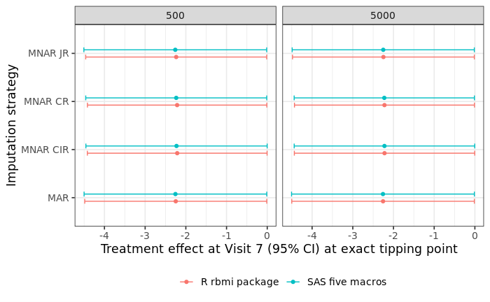

Building on an earlier topic of reference-based multiple imputation for continuous longitudinal endpoints ([Reference-Based Multiple Imputation](https://psiaims.github.io/CAMIS/blogs/posts/2025-11-25_ref-based-multiple-imputation/)), a recent PHUSE CAMIS contribution explored the implementation of tipping point analysis with delta adjustments in R and SAS.

Tipping point analysis is a sensitivity analysis that assesses the robustness of clinical trial results when they are based on imputed missing data. Since reference-based multiple imputation typically happens under missing-at-random (MAR) or missing-not-at-random (MNAR) assumptions, deviations from these assumption may influence the final estimate for a treatment effect.

To investigate how influential imputed values are for the outcome, delta-based tipping point analysis progressively shifts the imputed missing values for the treatment group towards the reference group by adding a delta value (Cro et al. 2020). The goal is to find the tipping point: the minimum delta value needed to render a statistically significant treatment effect non-significant. If the required shift established by the delta value at the tipping point is clinically implausible, greater confidence can be placed in the clinical trial results.

In R, tipping point analysis was explored using the rbmi package by Gower-Page et al. (2022), the same package as used in the PHUSE CAMIS contribution on reference-based multiple imputation. The package can be used to make *marginal* delta adjustments, where deltas are added directly to the imputed datasets without having to refit the computationally heavy imputation model (see figure above). The workflow for tipping analysis consists of defining a sequential series of delta values, and using those in a custom-made function to perform tipping point analysis.

Making delta adjustments in R can be done with great flexibility, as the delta_template() function offers several possibilities to precisely target which imputed values you want to shift. One can, for example, choose to only adjust post-intercurrent event (ICE) missing values in the treatment group and leave the missing values in the reference group untouched. In addition, delta values can be fixed at one value or made flexible by using of the delta and dlag arguments.

In SAS, the five macros developed by James Roger, available via the London School of Hygiene & Tropical Medicine, were used ([SAS macros for multiple imputation](https://baselbiometrics.github.io/home/docs/talks/20221208/5_JamesRoger%2020121118.pdf)). These are the same macros as the PHUSE CAMIS contribution on reference-based multiple imputation. To conduct a tipping point analysis, one simply wraps the third macro in this series of five in a do loop and iteratively adjusts the value for its delta argument in an incremental manner. Additional arguments such as dlag and dgroups can be considered for making flexible delta adjustments, where the general workflow is similar as described for R.

In the figures below, it can be observed that R and SAS match, except for a negligible simulation error. The first figure shows the corresponding p-values (y-axis) for each increasing delta in the intervention group for the analysis example on the CAMIS website. The second figure shows the contrast estimates and their associated 95% confidence intervals. In both figures, 500 and 5000 imputed datasets are used.

CIR = Copy increments in reference; CR = Copy reference; JR = Jump to reference; MAR = Missing at random; MNAR = Missing not at random.

In terms of practical use, we find that the R rbmi package offers greater flexibility and allows users to apply delta adjustments to all types of missing data, including intermittent missing values. In contrast, the SAS five macros only apply delta adjustments to missing observations after withdrawal, with no easy way to alter this behaviour. While less flexible, the five macros yields faster computation times than R. See full details of the comparison between R and SAS on the CAMIS website here: [R vs SAS Tipping Point (Delta Adjustment): Continuous Data](https://psiaims.github.io/CAMIS/Comp/r-sas_tipping_point.html).

The CAMIS open-source repository aims to provide vital information about the application of statistical methodology in various software (including SAS, R and Python). By documenting found differences in a repository, we aim to reduce time-consuming efforts within the community, where multiple people are investigating the same issues. As a group effort, the repository will continue to grow in content and be a vital source for medical statisticians and programmers. See [CAMIS - A PHUSE DVOST Working Group](https://psiaims.github.io/CAMIS/) for the repository or how to [Get Involved](https://psiaims.github.io/CAMIS/contribution/contribution.html).

[References:]{.underline}

[Cro et al. 2020](https://pubmed.ncbi.nlm.nih.gov/32419182/). Sensitivity analysis for clinical trials with missing continuous outcome data using controlled multiple imputation: A practical guide. *Statistics in Medicine*. 2020;39(21):2815-2842.

[Gower-Page et al. 2022](https://joss.theoj.org/papers/10.21105/joss.04251). rbmi: A R package for standard and reference-based multiple imputation methods. *Journal of Open Source Software* 7(74):4251.

[Roger 2017](https://www.lshtm.ac.uk/research/centres-projects-groups/missing-data#dia-missing-data). Fitting reference-based models for missing data to longitudinal repeated-measures Normal data. User guide five macros.
